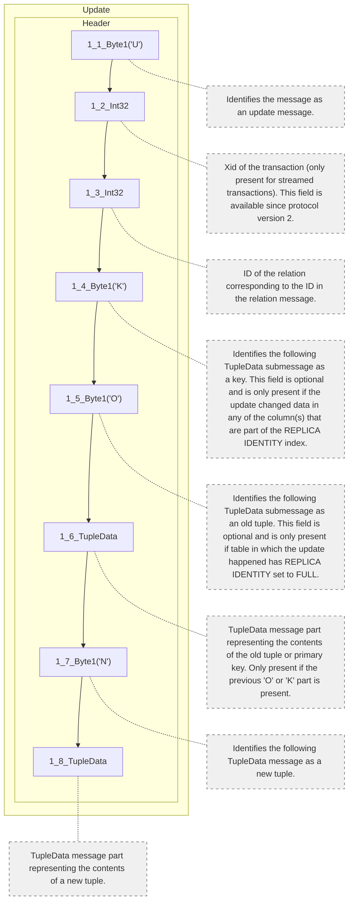
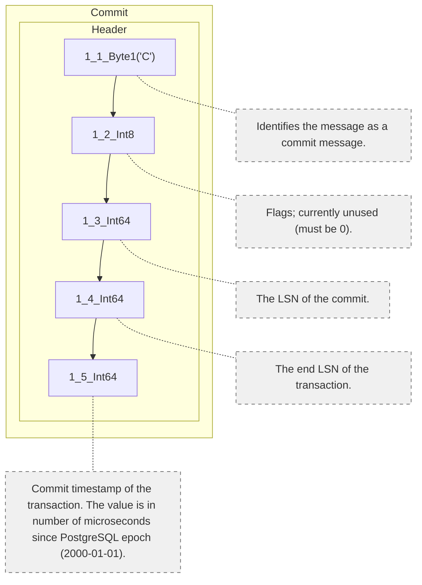
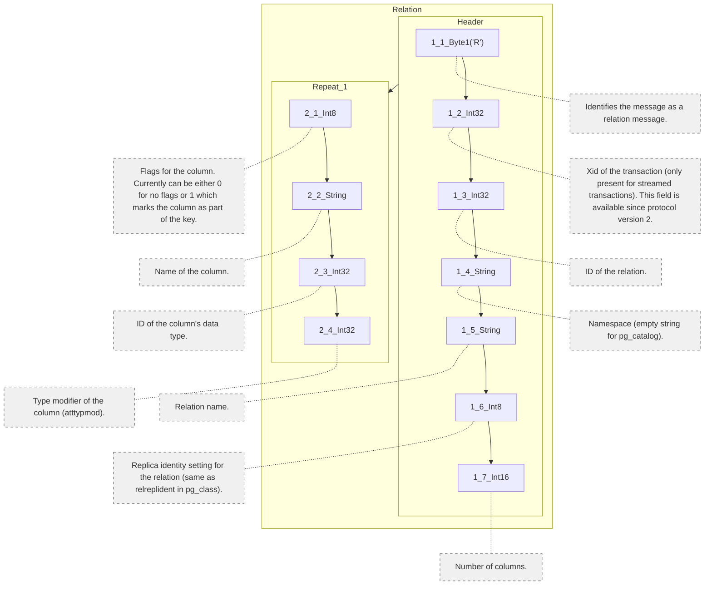
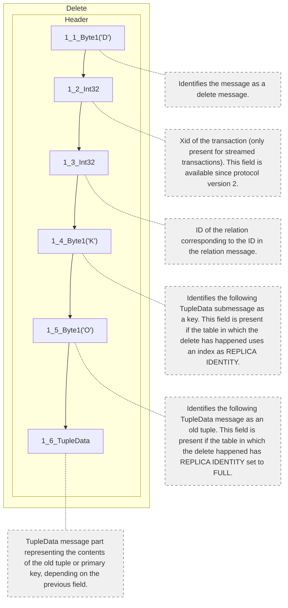
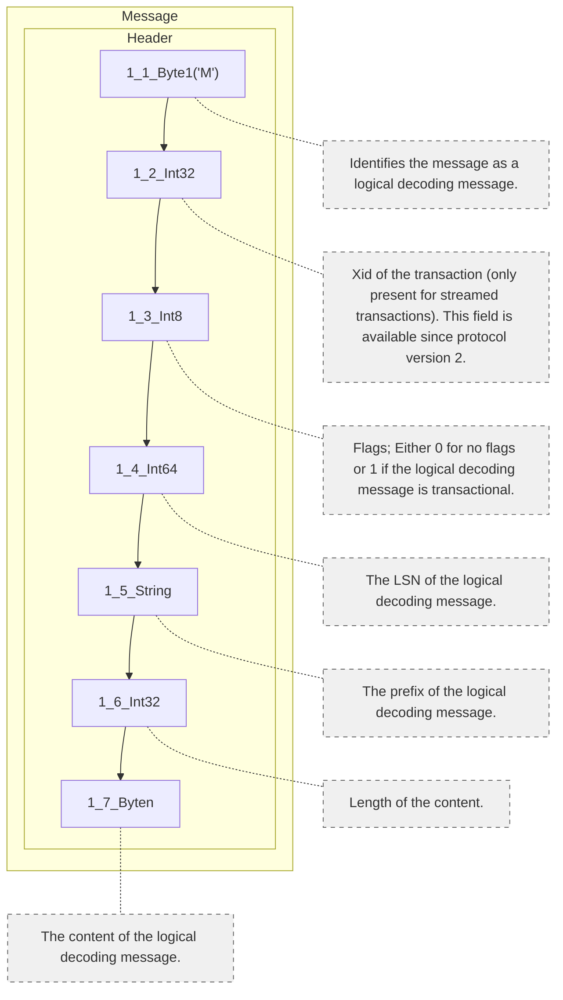
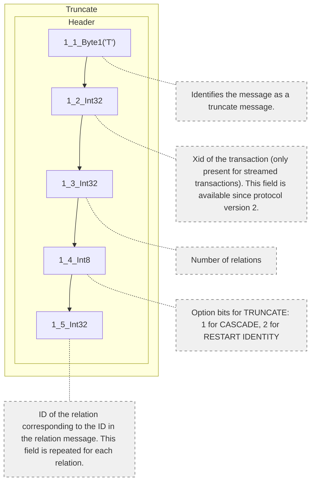
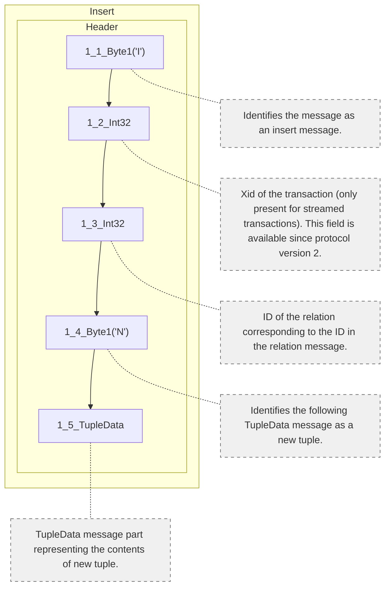
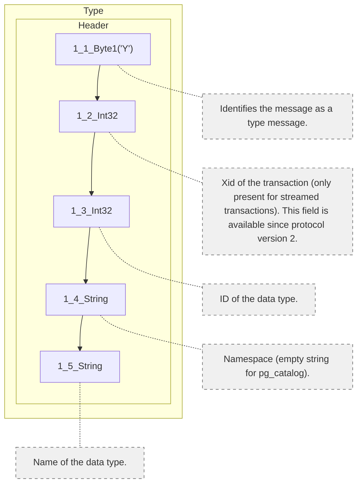
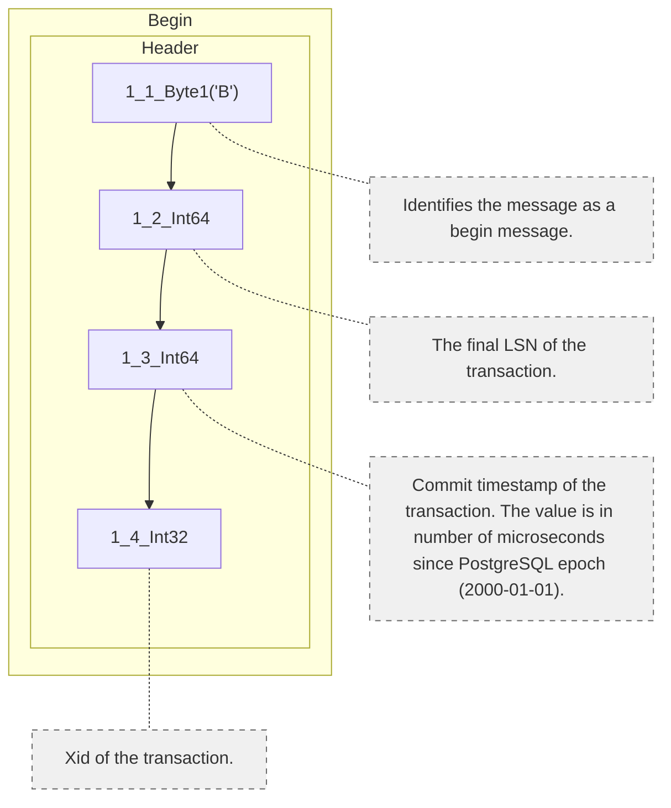
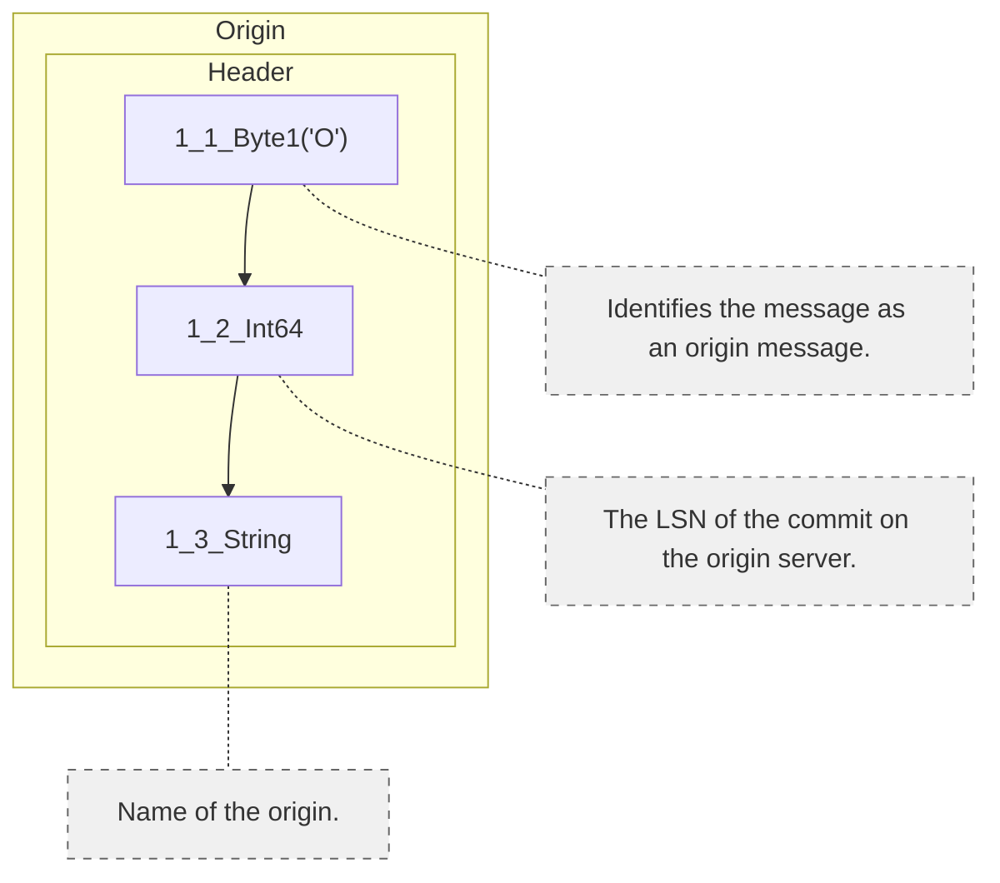

https://www.postgresql.org/docs/14/protocol-logicalrep-message-formats.html
### graph by mermaid

--- Update ---


--- Commit ---


--- Relation ---


--- Delete ---


--- Message ---


--- Truncate ---


--- Insert ---


--- Type ---


--- Begin ---


--- Origin ---


### yaml
```yamlurl: https://www.postgresql.org/docs/14/protocol-logicalrep-message-formats.html
messages:
- name: Begin
  blocks:
  - type: header
    fields:
    - field: 1_1_Byte1('B')
      description: Identifies the message as a begin message.
    - field: 1_2_Int64
      description: The final LSN of the transaction.
    - field: 1_3_Int64
      description: Commit timestamp of the transaction. The value is in number of
        microseconds since PostgreSQL epoch (2000-01-01).
    - field: 1_4_Int32
      description: Xid of the transaction.
- name: Message
  blocks:
  - type: header
    fields:
    - field: 1_1_Byte1('M')
      description: Identifies the message as a logical decoding message.
    - field: 1_2_Int32
      description: Xid of the transaction (only present for streamed transactions).
        This field is available since protocol version 2.
    - field: 1_3_Int8
      description: Flags; Either 0 for no flags or 1 if the logical decoding message
        is transactional.
    - field: 1_4_Int64
      description: The LSN of the logical decoding message.
    - field: 1_5_String
      description: The prefix of the logical decoding message.
    - field: 1_6_Int32
      description: Length of the content.
    - field: 1_7_Byten
      description: The content of the logical decoding message.
- name: Commit
  blocks:
  - type: header
    fields:
    - field: 1_1_Byte1('C')
      description: Identifies the message as a commit message.
    - field: 1_2_Int8
      description: Flags; currently unused (must be 0).
    - field: 1_3_Int64
      description: The LSN of the commit.
    - field: 1_4_Int64
      description: The end LSN of the transaction.
    - field: 1_5_Int64
      description: Commit timestamp of the transaction. The value is in number of
        microseconds since PostgreSQL epoch (2000-01-01).
- name: Origin
  blocks:
  - type: header
    fields:
    - field: 1_1_Byte1('O')
      description: Identifies the message as an origin message.
    - field: 1_2_Int64
      description: The LSN of the commit on the origin server.
    - field: 1_3_String
      description: Name of the origin.
- name: Relation
  blocks:
  - type: header
    fields:
    - field: 1_1_Byte1('R')
      description: Identifies the message as a relation message.
    - field: 1_2_Int32
      description: Xid of the transaction (only present for streamed transactions).
        This field is available since protocol version 2.
    - field: 1_3_Int32
      description: ID of the relation.
    - field: 1_4_String
      description: Namespace (empty string for pg_catalog).
    - field: 1_5_String
      description: Relation name.
    - field: 1_6_Int8
      description: Replica identity setting for the relation (same as relreplident
        in pg_class).
    - field: 1_7_Int16
      description: Number of columns.
  - type: repeat_1
    fields:
    - field: 2_1_Int8
      description: Flags for the column. Currently can be either 0 for no flags or
        1 which marks the column as part of the key.
    - field: 2_2_String
      description: Name of the column.
    - field: 2_3_Int32
      description: ID of the column's data type.
    - field: 2_4_Int32
      description: Type modifier of the column (atttypmod).
- name: Type
  blocks:
  - type: header
    fields:
    - field: 1_1_Byte1('Y')
      description: Identifies the message as a type message.
    - field: 1_2_Int32
      description: Xid of the transaction (only present for streamed transactions).
        This field is available since protocol version 2.
    - field: 1_3_Int32
      description: ID of the data type.
    - field: 1_4_String
      description: Namespace (empty string for pg_catalog).
    - field: 1_5_String
      description: Name of the data type.
- name: Insert
  blocks:
  - type: header
    fields:
    - field: 1_1_Byte1('I')
      description: Identifies the message as an insert message.
    - field: 1_2_Int32
      description: Xid of the transaction (only present for streamed transactions).
        This field is available since protocol version 2.
    - field: 1_3_Int32
      description: ID of the relation corresponding to the ID in the relation message.
    - field: 1_4_Byte1('N')
      description: Identifies the following TupleData message as a new tuple.
    - field: 1_5_TupleData
      description: TupleData message part representing the contents of new tuple.
- name: Update
  blocks:
  - type: header
    fields:
    - field: 1_1_Byte1('U')
      description: Identifies the message as an update message.
    - field: 1_2_Int32
      description: Xid of the transaction (only present for streamed transactions).
        This field is available since protocol version 2.
    - field: 1_3_Int32
      description: ID of the relation corresponding to the ID in the relation message.
    - field: 1_4_Byte1('K')
      description: Identifies the following TupleData submessage as a key. This field
        is optional and is only present if the update changed data in any of the column(s)
        that are part of the REPLICA IDENTITY index.
    - field: 1_5_Byte1('O')
      description: Identifies the following TupleData submessage as an old tuple.
        This field is optional and is only present if table in which the update happened
        has REPLICA IDENTITY set to FULL.
    - field: 1_6_TupleData
      description: TupleData message part representing the contents of the old tuple
        or primary key. Only present if the previous 'O' or 'K' part is present.
    - field: 1_7_Byte1('N')
      description: Identifies the following TupleData message as a new tuple.
    - field: 1_8_TupleData
      description: TupleData message part representing the contents of a new tuple.
- name: Delete
  blocks:
  - type: header
    fields:
    - field: 1_1_Byte1('D')
      description: Identifies the message as a delete message.
    - field: 1_2_Int32
      description: Xid of the transaction (only present for streamed transactions).
        This field is available since protocol version 2.
    - field: 1_3_Int32
      description: ID of the relation corresponding to the ID in the relation message.
    - field: 1_4_Byte1('K')
      description: Identifies the following TupleData submessage as a key. This field
        is present if the table in which the delete has happened uses an index as
        REPLICA IDENTITY.
    - field: 1_5_Byte1('O')
      description: Identifies the following TupleData message as an old tuple. This
        field is present if the table in which the delete happened has REPLICA IDENTITY
        set to FULL.
    - field: 1_6_TupleData
      description: TupleData message part representing the contents of the old tuple
        or primary key, depending on the previous field.
- name: Truncate
  blocks:
  - type: header
    fields:
    - field: 1_1_Byte1('T')
      description: Identifies the message as a truncate message.
    - field: 1_2_Int32
      description: Xid of the transaction (only present for streamed transactions).
        This field is available since protocol version 2.
    - field: 1_3_Int32
      description: Number of relations
    - field: 1_4_Int8
      description: 'Option bits for TRUNCATE: 1 for CASCADE, 2 for RESTART IDENTITY'
    - field: 1_5_Int32
      description: ID of the relation corresponding to the ID in the relation message.
        This field is repeated for each relation.

```
