## desc

** code :: postgresql url. scraping.
* url의 문서를 확인할 것. 완전하지 않은 코드임 ( not-fully verified )
    
```
      "https://www.postgresql.org/docs/11/protocol-message-formats.html",
      "https://www.postgresql.org/docs/14/protocol-message-formats.html",
      "https://www.postgresql.org/docs/18/protocol-message-formats.html",
      "https://www.postgresql.org/docs/11/protocol-logicalrep-message-formats.html",
      "https://www.postgresql.org/docs/14/protocol-logicalrep-message-formats.html",
      "https://www.postgresql.org/docs/18/protocol-logicalrep-message-formats.html",
```


```scala
package io.flux

import org.jsoup.Jsoup
import org.jsoup.nodes.{Document, Element}
import io.circe.Json
import io.circe.yaml.syntax.AsYaml

import scala.jdk.CollectionConverters._

object ProtocolMessageExtractor {

  def scrape(url: String) = {
    val doc = Jsoup.connect(url).get()
    val es = doc.select("div.variablelist").asScala
    val ms = es.flatMap(e => formatScrape(e))

    Json.obj(
      "url" -> Json.fromString(url),
      "messages" -> Json.fromValues(ms)
    )
  }

  def formatScrape(e: Element) = {
    val topLevel = e.select("> dl").first()
    val dts = topLevel.select("> dt").asScala
    val dds = topLevel.select("> dd").asScala

    dts.zip(dds).flatMap { case (dt, dd) =>
      val name = dt.select("span.term").text()
      val variableLists = dd.select("div.variablelist").asScala

      // 하위 variablelist가 없으면 메시지 생성하지 않음
      if (variableLists.nonEmpty) {
        val blocks = variableLists.zipWithIndex.map { case (inner, blockIdx) =>
          val fields = inner.select("dt").asScala.zip(inner.select("dd").asScala).zipWithIndex.map {
            case ((fdt, fdd), fieldIdx) =>
              val raw = fdt.select("span.term").text()
              Json.obj(
                "field" -> Json.fromString(s"${blockIdx + 1}_${fieldIdx + 1}_$raw"),
                "description" -> Json.fromString(fdd.text())
              )
          }
          val blockType = if (blockIdx == 0) "header" else s"group_${blockIdx}"
          Json.obj(
            "type" -> Json.fromString(blockType),
            "fields" -> Json.fromValues(fields)
          )
        }

        Some(Json.obj(
          "name" -> Json.fromString(name),
          "blocks" -> Json.fromValues(blocks)
        ))
      } else {
        None
      }
    }
  }

  // Mermaid-safe ID : mermaid_ID does not allow 특수문자
  def safeId(name: String): String = name.replaceAll("[^A-Za-z0-9]", "_")
  def escape(str: String): String = str.replaceAll("\"", "")

  def jsonToMermaidByFormat(json: Json): Map[String, String] = {
    val messages = json.hcursor.downField("messages").focus.flatMap(_.asArray).getOrElse(Vector.empty)

    messages.map { msg =>
      val name = msg.hcursor.get[String]("name").getOrElse("Unknown")
      val safeMsgId = safeId(name)

      val blocks = msg.hcursor.downField("blocks").focus.flatMap(_.asArray).getOrElse(Vector.empty)

      val sb = new StringBuilder
      sb.append("```mermaid\n")
      sb.append("graph TD\n")
      sb.append(s"  subgraph $safeMsgId [\"$name\"]\n")

      val descNodes = scala.collection.mutable.ArrayBuffer[(String,String,String)]()
      var prevBlockId: Option[String] = None

      blocks.zipWithIndex.foreach { case (blockJson, bIdx) =>
        val blockType = blockJson.hcursor.get[String]("type").getOrElse("block")
        val fields = blockJson.hcursor.downField("fields").focus.flatMap(_.asArray).getOrElse(Vector.empty)

        val blockId = safeId(s"${blockType}_$bIdx")
        sb.append(s"    subgraph $blockId [\"${blockType.capitalize}\"]\n")

        fields.zipWithIndex.foreach { case (fieldJson, fIdx) =>
          val fieldName = fieldJson.hcursor.get[String]("field").getOrElse("Unknown")
          val safeFieldId = safeId(fieldName)
          sb.append(s"      $safeFieldId[\"$fieldName\"]\n")

          if (fIdx > 0) {
            val prevFieldName = fields(fIdx - 1).hcursor.get[String]("field").getOrElse("Unknown")
            val safePrevId = safeId(prevFieldName)
            sb.append(s"      $safePrevId --> $safeFieldId\n")
          }

          val desc = fieldJson.hcursor.get[String]("description").getOrElse("")
          if (desc.nonEmpty) {
            val descId = safeId(s"desc_$fieldName")
            descNodes += ((safeFieldId, descId, desc))
          }
        }

        sb.append("    end\n")

        // 블록 간 연결
        prevBlockId.foreach(p => sb.append(s"    $p --> $blockId\n"))
        prevBlockId = Some(blockId)
      }

      sb.append("  end\n\n")

      // 설명 노드 연결 (subgraph 밖)
      descNodes.foreach { case (fieldId, descId, text) =>
        sb.append(s"    $fieldId -.- $descId[\"${escape(text)}\"]\n")
      }

      // 스타일 정의
      sb.append("  classDef comment fill:#f0f0f0,stroke:#666,stroke-dasharray: 5 5;\n")
      if (descNodes.nonEmpty) {
        sb.append(s"  class ${descNodes.map(_._2).mkString(",")} comment;\n")
      }

      sb.append("```\n")

      name -> sb.toString
    }.toMap
  }

  def json2Mermaid(json: Json): String = {
    val fs = jsonToMermaidByFormat(json)
    fs.map{ case (name, str) => s"\n--- $name ---\n" + str}.mkString
  }

  def show(url : String)  = {

    val json = scrape(url)

//    val jsonString = json.spaces2
    val yamlString = json.asYaml.spaces2
    val mermaidString = json2Mermaid(json)


    // mermaid
    val mermaid = "### graph by mermaid\n" + mermaidString
    val yaml = "### yaml\n```yaml" + yamlString + "\n```"

    println( "--- start ---\n")
    println(s"below is made by scraping. must check url document.")
    println(url)
    println()
    println(mermaid)
    println(yaml)
    println( "--- end ---\n")
  }

  def main(args: Array[String]): Unit = {

    val urls = List(
      "https://www.postgresql.org/docs/11/protocol-message-formats.html",
      "https://www.postgresql.org/docs/14/protocol-message-formats.html",
      "https://www.postgresql.org/docs/18/protocol-message-formats.html",
      "https://www.postgresql.org/docs/11/protocol-logicalrep-message-formats.html",
      "https://www.postgresql.org/docs/14/protocol-logicalrep-message-formats.html",
      "https://www.postgresql.org/docs/18/protocol-logicalrep-message-formats.html",
    )

    urls.foreach(show)
  }
}
```

```sbt
//sbt
libraryDependencies ++= Seq(
  "org.jsoup" % "jsoup" % "1.17.2",
  "io.circe" %% "circe-core" % "0.14.6",
  "io.circe" %% "circe-generic" % "0.14.6",
  "io.circe" %% "circe-parser" % "0.14.6",
  "io.circe" %% "circe-yaml" % "0.14.2"
)
```

## output

--- start ---

below is made by scraping. must check url document.
https://www.postgresql.org/docs/11/protocol-message-formats.html

### graph by mermaid

--- Terminate (F) ---
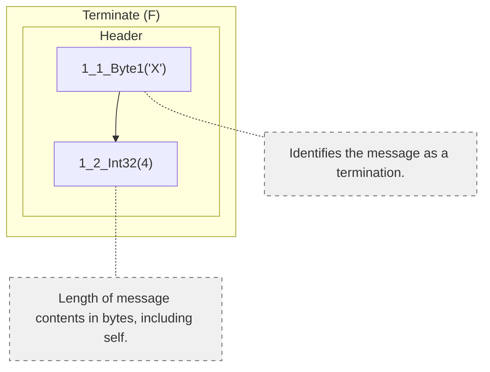
```mermaid
graph TD
  subgraph Terminate__F_ ["Terminate (F)"]
    subgraph header_0 ["Header"]
      1_1_Byte1__X__["1_1_Byte1('X')"]
      1_2_Int32_4_["1_2_Int32(4)"]
      1_1_Byte1__X__ --> 1_2_Int32_4_
    end
  end

    1_1_Byte1__X__ -.- desc_1_1_Byte1__X__["Identifies the message as a termination."]
    1_2_Int32_4_ -.- desc_1_2_Int32_4_["Length of message contents in bytes, including self."]
  classDef comment fill:#f0f0f0,stroke:#666,stroke-dasharray: 5 5;
  class desc_1_1_Byte1__X__,desc_1_2_Int32_4_ comment;
```

--- Execute (F) ---
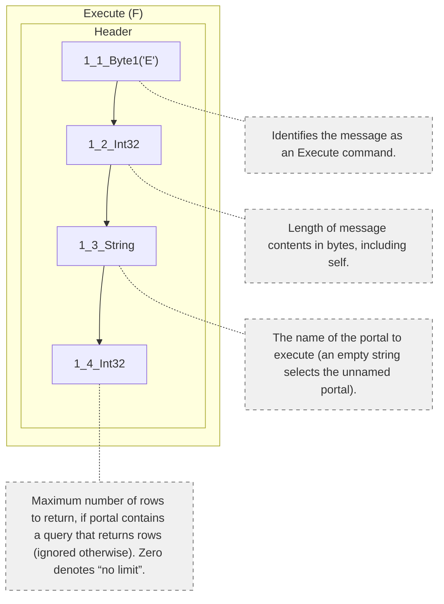
```mermaid
graph TD
  subgraph Execute__F_ ["Execute (F)"]
    subgraph header_0 ["Header"]
      1_1_Byte1__E__["1_1_Byte1('E')"]
      1_2_Int32["1_2_Int32"]
      1_1_Byte1__E__ --> 1_2_Int32
      1_3_String["1_3_String"]
      1_2_Int32 --> 1_3_String
      1_4_Int32["1_4_Int32"]
      1_3_String --> 1_4_Int32
    end
  end

    1_1_Byte1__E__ -.- desc_1_1_Byte1__E__["Identifies the message as an Execute command."]
    1_2_Int32 -.- desc_1_2_Int32["Length of message contents in bytes, including self."]
    1_3_String -.- desc_1_3_String["The name of the portal to execute (an empty string selects the unnamed portal)."]
    1_4_Int32 -.- desc_1_4_Int32["Maximum number of rows to return, if portal contains a query that returns rows (ignored otherwise). Zero denotes “no limit”."]
  classDef comment fill:#f0f0f0,stroke:#666,stroke-dasharray: 5 5;
  class desc_1_1_Byte1__E__,desc_1_2_Int32,desc_1_3_String,desc_1_4_Int32 comment;
```

--- RowDescription (B) ---
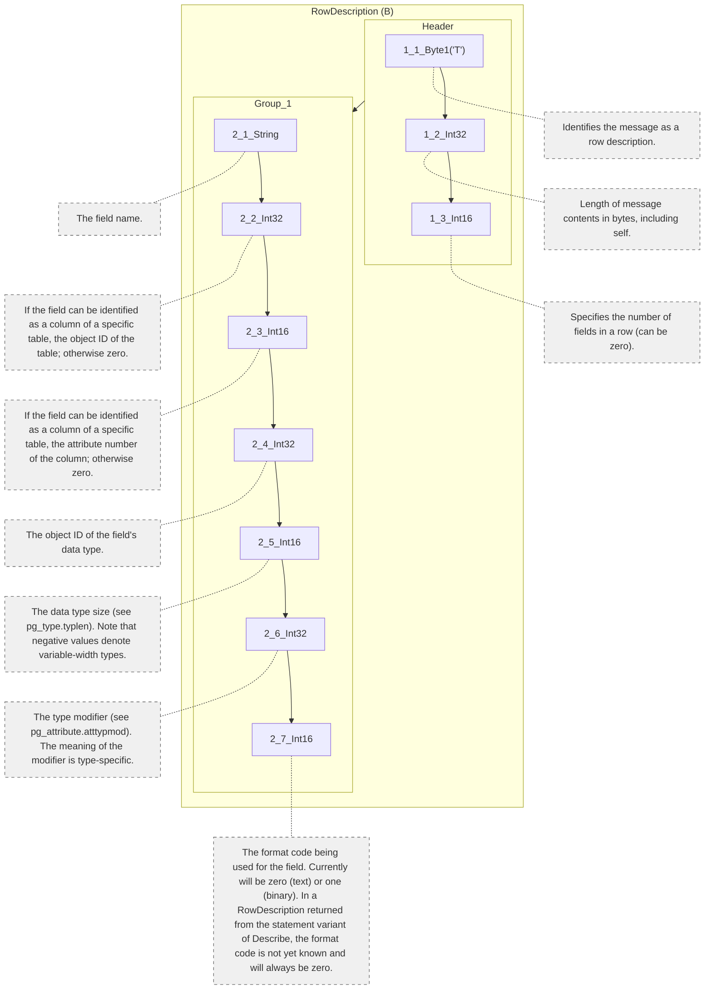
```mermaid
graph TD
  subgraph RowDescription__B_ ["RowDescription (B)"]
    subgraph header_0 ["Header"]
      1_1_Byte1__T__["1_1_Byte1('T')"]
      1_2_Int32["1_2_Int32"]
      1_1_Byte1__T__ --> 1_2_Int32
      1_3_Int16["1_3_Int16"]
      1_2_Int32 --> 1_3_Int16
    end
    subgraph group_1_1 ["Group_1"]
      2_1_String["2_1_String"]
      2_2_Int32["2_2_Int32"]
      2_1_String --> 2_2_Int32
      2_3_Int16["2_3_Int16"]
      2_2_Int32 --> 2_3_Int16
      2_4_Int32["2_4_Int32"]
      2_3_Int16 --> 2_4_Int32
      2_5_Int16["2_5_Int16"]
      2_4_Int32 --> 2_5_Int16
      2_6_Int32["2_6_Int32"]
      2_5_Int16 --> 2_6_Int32
      2_7_Int16["2_7_Int16"]
      2_6_Int32 --> 2_7_Int16
    end
    header_0 --> group_1_1
  end

    1_1_Byte1__T__ -.- desc_1_1_Byte1__T__["Identifies the message as a row description."]
    1_2_Int32 -.- desc_1_2_Int32["Length of message contents in bytes, including self."]
    1_3_Int16 -.- desc_1_3_Int16["Specifies the number of fields in a row (can be zero)."]
    2_1_String -.- desc_2_1_String["The field name."]
    2_2_Int32 -.- desc_2_2_Int32["If the field can be identified as a column of a specific table, the object ID of the table; otherwise zero."]
    2_3_Int16 -.- desc_2_3_Int16["If the field can be identified as a column of a specific table, the attribute number of the column; otherwise zero."]
    2_4_Int32 -.- desc_2_4_Int32["The object ID of the field's data type."]
    2_5_Int16 -.- desc_2_5_Int16["The data type size (see pg_type.typlen). Note that negative values denote variable-width types."]
    2_6_Int32 -.- desc_2_6_Int32["The type modifier (see pg_attribute.atttypmod). The meaning of the modifier is type-specific."]
    2_7_Int16 -.- desc_2_7_Int16["The format code being used for the field. Currently will be zero (text) or one (binary). In a RowDescription returned from the statement variant of Describe, the format code is not yet known and will always be zero."]
  classDef comment fill:#f0f0f0,stroke:#666,stroke-dasharray: 5 5;
  class desc_1_1_Byte1__T__,desc_1_2_Int32,desc_1_3_Int16,desc_2_1_String,desc_2_2_Int32,desc_2_3_Int16,desc_2_4_Int32,desc_2_5_Int16,desc_2_6_Int32,desc_2_7_Int16 comment;
```

--- NotificationResponse (B) ---
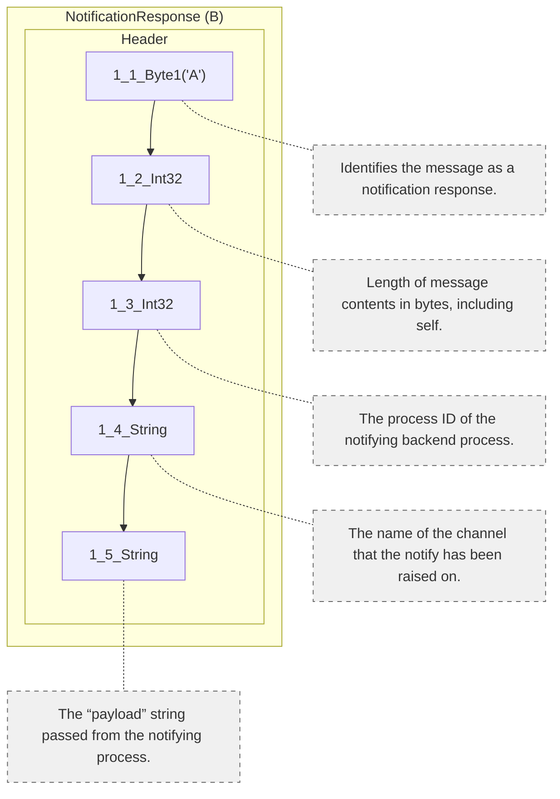
```mermaid
graph TD
  subgraph NotificationResponse__B_ ["NotificationResponse (B)"]
    subgraph header_0 ["Header"]
      1_1_Byte1__A__["1_1_Byte1('A')"]
      1_2_Int32["1_2_Int32"]
      1_1_Byte1__A__ --> 1_2_Int32
      1_3_Int32["1_3_Int32"]
      1_2_Int32 --> 1_3_Int32
      1_4_String["1_4_String"]
      1_3_Int32 --> 1_4_String
      1_5_String["1_5_String"]
      1_4_String --> 1_5_String
    end
  end

    1_1_Byte1__A__ -.- desc_1_1_Byte1__A__["Identifies the message as a notification response."]
    1_2_Int32 -.- desc_1_2_Int32["Length of message contents in bytes, including self."]
    1_3_Int32 -.- desc_1_3_Int32["The process ID of the notifying backend process."]
    1_4_String -.- desc_1_4_String["The name of the channel that the notify has been raised on."]
    1_5_String -.- desc_1_5_String["The “payload” string passed from the notifying process."]
  classDef comment fill:#f0f0f0,stroke:#666,stroke-dasharray: 5 5;
  class desc_1_1_Byte1__A__,desc_1_2_Int32,desc_1_3_Int32,desc_1_4_String,desc_1_5_String comment;
```

--- FunctionCallResponse (B) ---
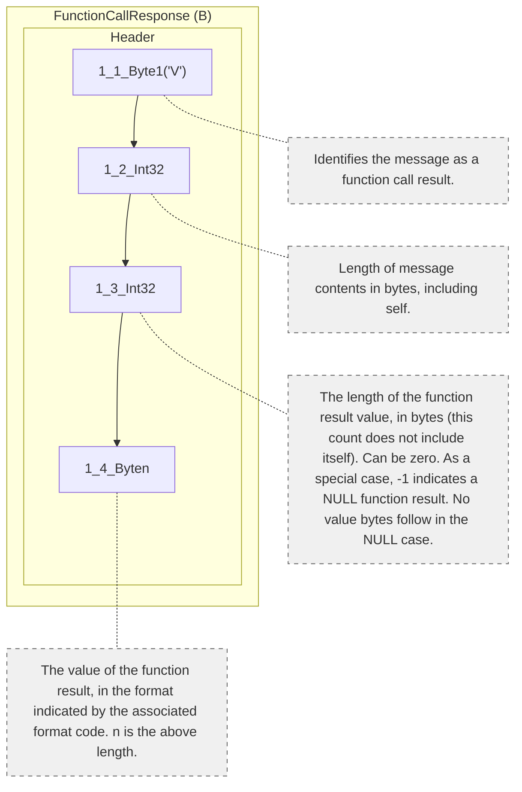
```mermaid
graph TD
  subgraph FunctionCallResponse__B_ ["FunctionCallResponse (B)"]
    subgraph header_0 ["Header"]
      1_1_Byte1__V__["1_1_Byte1('V')"]
      1_2_Int32["1_2_Int32"]
      1_1_Byte1__V__ --> 1_2_Int32
      1_3_Int32["1_3_Int32"]
      1_2_Int32 --> 1_3_Int32
      1_4_Byten["1_4_Byten"]
      1_3_Int32 --> 1_4_Byten
    end
  end

    1_1_Byte1__V__ -.- desc_1_1_Byte1__V__["Identifies the message as a function call result."]
    1_2_Int32 -.- desc_1_2_Int32["Length of message contents in bytes, including self."]
    1_3_Int32 -.- desc_1_3_Int32["The length of the function result value, in bytes (this count does not include itself). Can be zero. As a special case, -1 indicates a NULL function result. No value bytes follow in the NULL case."]
    1_4_Byten -.- desc_1_4_Byten["The value of the function result, in the format indicated by the associated format code. n is the above length."]
  classDef comment fill:#f0f0f0,stroke:#666,stroke-dasharray: 5 5;
  class desc_1_1_Byte1__V__,desc_1_2_Int32,desc_1_3_Int32,desc_1_4_Byten comment;
```

--- ParseComplete (B) ---
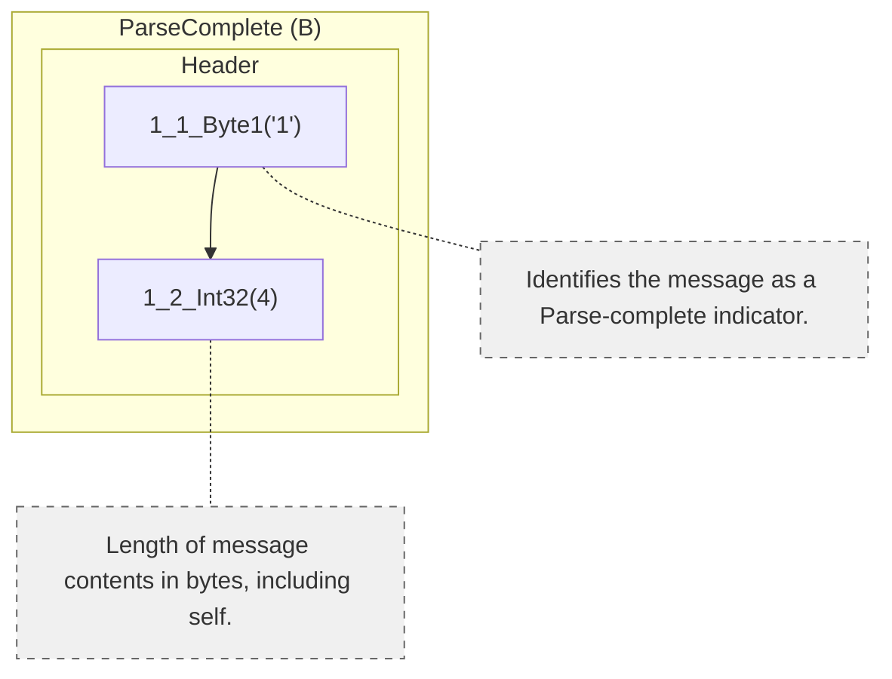
```mermaid
graph TD
  subgraph ParseComplete__B_ ["ParseComplete (B)"]
    subgraph header_0 ["Header"]
      1_1_Byte1__1__["1_1_Byte1('1')"]
      1_2_Int32_4_["1_2_Int32(4)"]
      1_1_Byte1__1__ --> 1_2_Int32_4_
    end
  end

    1_1_Byte1__1__ -.- desc_1_1_Byte1__1__["Identifies the message as a Parse-complete indicator."]
    1_2_Int32_4_ -.- desc_1_2_Int32_4_["Length of message contents in bytes, including self."]
  classDef comment fill:#f0f0f0,stroke:#666,stroke-dasharray: 5 5;
  class desc_1_1_Byte1__1__,desc_1_2_Int32_4_ comment;
```

--- GSSResponse (F) ---
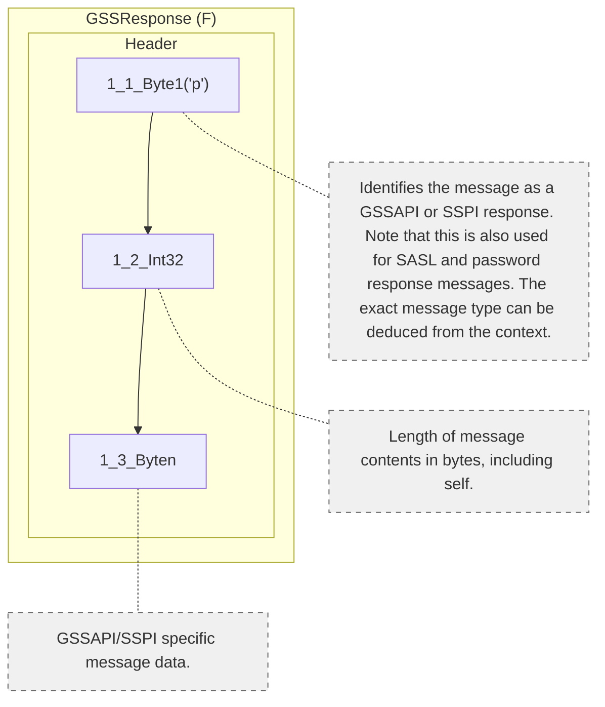
```mermaid
graph TD
  subgraph GSSResponse__F_ ["GSSResponse (F)"]
    subgraph header_0 ["Header"]
      1_1_Byte1__p__["1_1_Byte1('p')"]
      1_2_Int32["1_2_Int32"]
      1_1_Byte1__p__ --> 1_2_Int32
      1_3_Byten["1_3_Byten"]
      1_2_Int32 --> 1_3_Byten
    end
  end

    1_1_Byte1__p__ -.- desc_1_1_Byte1__p__["Identifies the message as a GSSAPI or SSPI response. Note that this is also used for SASL and password response messages. The exact message type can be deduced from the context."]
    1_2_Int32 -.- desc_1_2_Int32["Length of message contents in bytes, including self."]
    1_3_Byten -.- desc_1_3_Byten["GSSAPI/SSPI specific message data."]
  classDef comment fill:#f0f0f0,stroke:#666,stroke-dasharray: 5 5;
  class desc_1_1_Byte1__p__,desc_1_2_Int32,desc_1_3_Byten comment;
```

--- BackendKeyData (B) ---
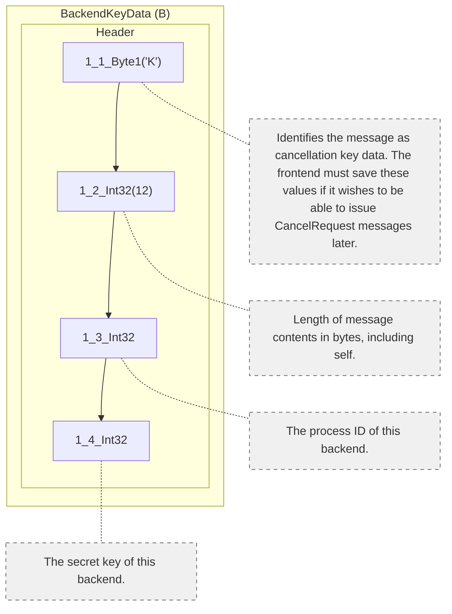
```mermaid
graph TD
  subgraph BackendKeyData__B_ ["BackendKeyData (B)"]
    subgraph header_0 ["Header"]
      1_1_Byte1__K__["1_1_Byte1('K')"]
      1_2_Int32_12_["1_2_Int32(12)"]
      1_1_Byte1__K__ --> 1_2_Int32_12_
      1_3_Int32["1_3_Int32"]
      1_2_Int32_12_ --> 1_3_Int32
      1_4_Int32["1_4_Int32"]
      1_3_Int32 --> 1_4_Int32
    end
  end

    1_1_Byte1__K__ -.- desc_1_1_Byte1__K__["Identifies the message as cancellation key data. The frontend must save these values if it wishes to be able to issue CancelRequest messages later."]
    1_2_Int32_12_ -.- desc_1_2_Int32_12_["Length of message contents in bytes, including self."]
    1_3_Int32 -.- desc_1_3_Int32["The process ID of this backend."]
    1_4_Int32 -.- desc_1_4_Int32["The secret key of this backend."]
  classDef comment fill:#f0f0f0,stroke:#666,stroke-dasharray: 5 5;
  class desc_1_1_Byte1__K__,desc_1_2_Int32_12_,desc_1_3_Int32,desc_1_4_Int32 comment;
```

--- EmptyQueryResponse (B) ---
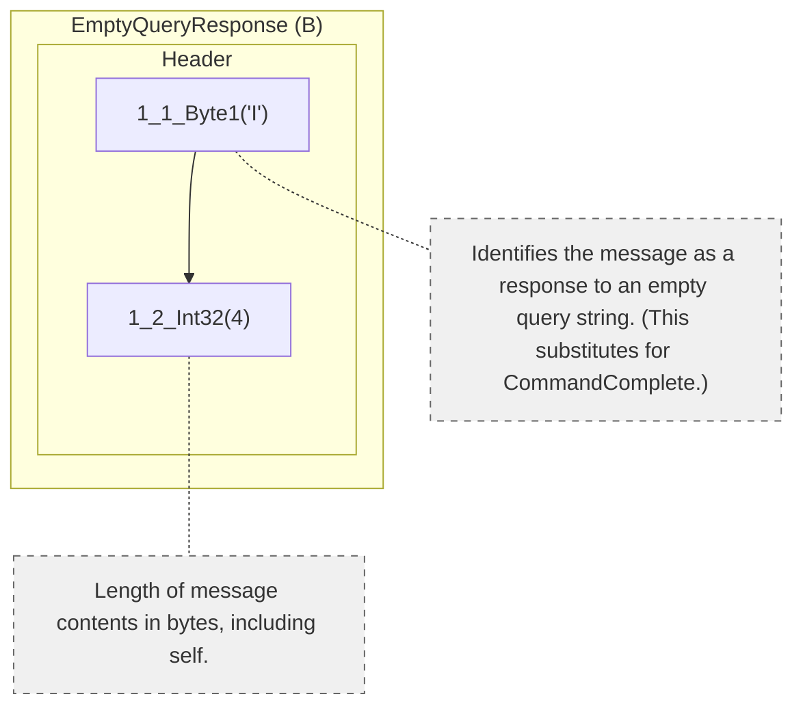
```mermaid
graph TD
  subgraph EmptyQueryResponse__B_ ["EmptyQueryResponse (B)"]
    subgraph header_0 ["Header"]
      1_1_Byte1__I__["1_1_Byte1('I')"]
      1_2_Int32_4_["1_2_Int32(4)"]
      1_1_Byte1__I__ --> 1_2_Int32_4_
    end
  end

    1_1_Byte1__I__ -.- desc_1_1_Byte1__I__["Identifies the message as a response to an empty query string. (This substitutes for CommandComplete.)"]
    1_2_Int32_4_ -.- desc_1_2_Int32_4_["Length of message contents in bytes, including self."]
  classDef comment fill:#f0f0f0,stroke:#666,stroke-dasharray: 5 5;
  class desc_1_1_Byte1__I__,desc_1_2_Int32_4_ comment;
```

--- CommandComplete (B) ---
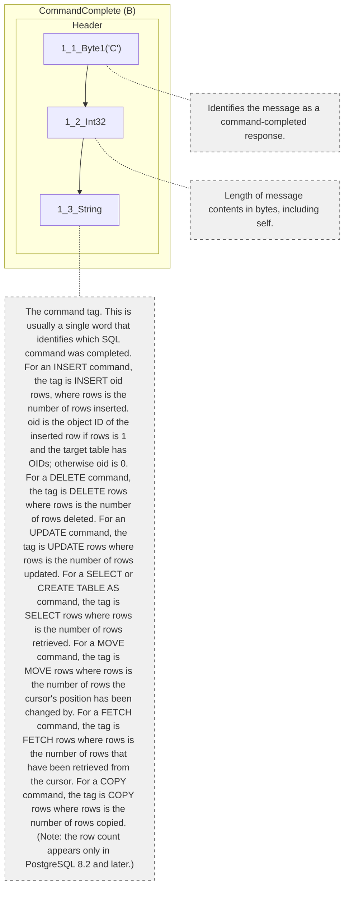
```mermaid
graph TD
  subgraph CommandComplete__B_ ["CommandComplete (B)"]
    subgraph header_0 ["Header"]
      1_1_Byte1__C__["1_1_Byte1('C')"]
      1_2_Int32["1_2_Int32"]
      1_1_Byte1__C__ --> 1_2_Int32
      1_3_String["1_3_String"]
      1_2_Int32 --> 1_3_String
    end
  end

    1_1_Byte1__C__ -.- desc_1_1_Byte1__C__["Identifies the message as a command-completed response."]
    1_2_Int32 -.- desc_1_2_Int32["Length of message contents in bytes, including self."]
    1_3_String -.- desc_1_3_String["The command tag. This is usually a single word that identifies which SQL command was completed. For an INSERT command, the tag is INSERT oid rows, where rows is the number of rows inserted. oid is the object ID of the inserted row if rows is 1 and the target table has OIDs; otherwise oid is 0. For a DELETE command, the tag is DELETE rows where rows is the number of rows deleted. For an UPDATE command, the tag is UPDATE rows where rows is the number of rows updated. For a SELECT or CREATE TABLE AS command, the tag is SELECT rows where rows is the number of rows retrieved. For a MOVE command, the tag is MOVE rows where rows is the number of rows the cursor's position has been changed by. For a FETCH command, the tag is FETCH rows where rows is the number of rows that have been retrieved from the cursor. For a COPY command, the tag is COPY rows where rows is the number of rows copied. (Note: the row count appears only in PostgreSQL 8.2 and later.)"]
  classDef comment fill:#f0f0f0,stroke:#666,stroke-dasharray: 5 5;
  class desc_1_1_Byte1__C__,desc_1_2_Int32,desc_1_3_String comment;
```

--- BindComplete (B) ---
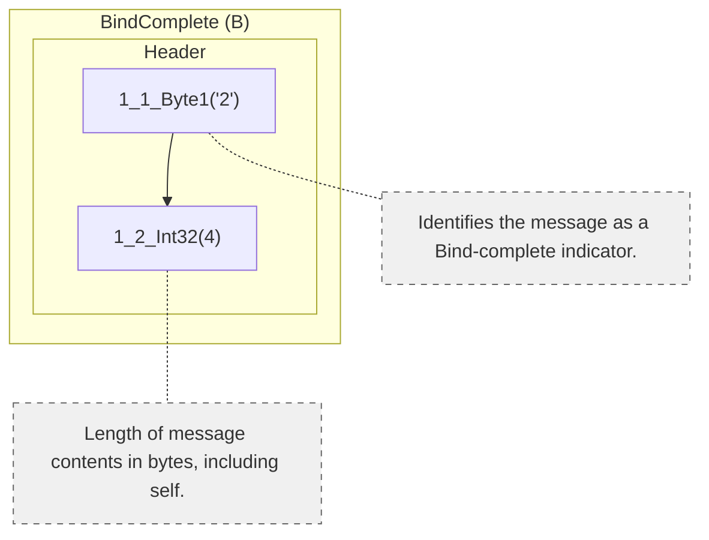
```mermaid
graph TD
  subgraph BindComplete__B_ ["BindComplete (B)"]
    subgraph header_0 ["Header"]
      1_1_Byte1__2__["1_1_Byte1('2')"]
      1_2_Int32_4_["1_2_Int32(4)"]
      1_1_Byte1__2__ --> 1_2_Int32_4_
    end
  end

    1_1_Byte1__2__ -.- desc_1_1_Byte1__2__["Identifies the message as a Bind-complete indicator."]
    1_2_Int32_4_ -.- desc_1_2_Int32_4_["Length of message contents in bytes, including self."]
  classDef comment fill:#f0f0f0,stroke:#666,stroke-dasharray: 5 5;
  class desc_1_1_Byte1__2__,desc_1_2_Int32_4_ comment;
```

--- AuthenticationKerberosV5 (B) ---
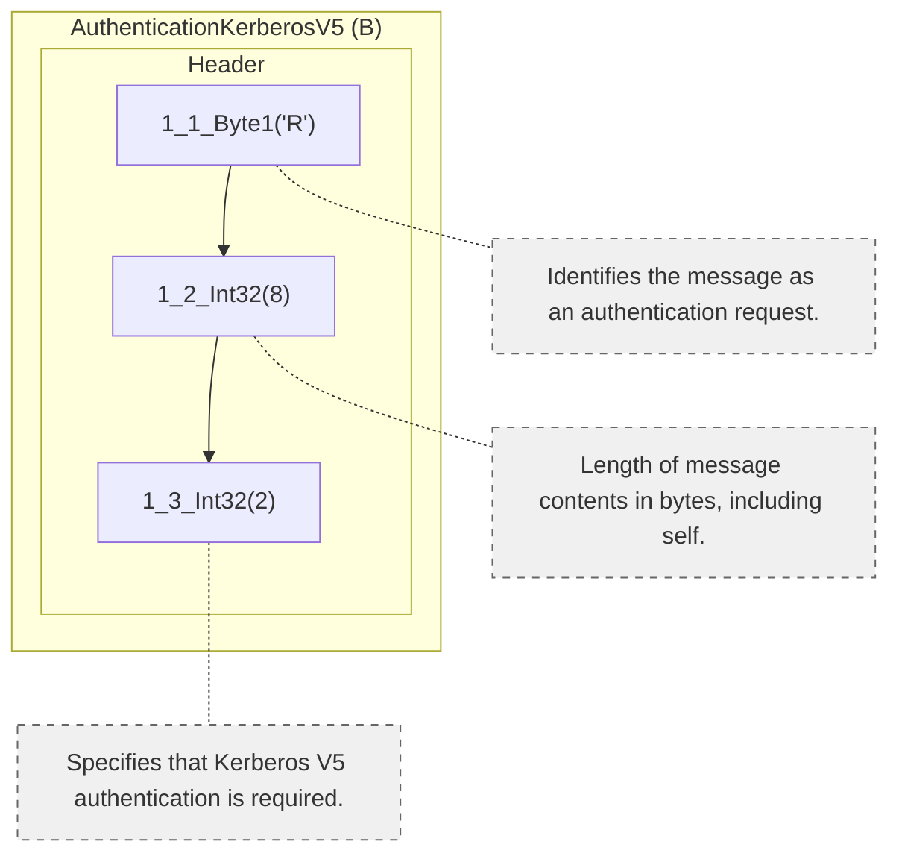
```mermaid
graph TD
  subgraph AuthenticationKerberosV5__B_ ["AuthenticationKerberosV5 (B)"]
    subgraph header_0 ["Header"]
      1_1_Byte1__R__["1_1_Byte1('R')"]
      1_2_Int32_8_["1_2_Int32(8)"]
      1_1_Byte1__R__ --> 1_2_Int32_8_
      1_3_Int32_2_["1_3_Int32(2)"]
      1_2_Int32_8_ --> 1_3_Int32_2_
    end
  end

    1_1_Byte1__R__ -.- desc_1_1_Byte1__R__["Identifies the message as an authentication request."]
    1_2_Int32_8_ -.- desc_1_2_Int32_8_["Length of message contents in bytes, including self."]
    1_3_Int32_2_ -.- desc_1_3_Int32_2_["Specifies that Kerberos V5 authentication is required."]
  classDef comment fill:#f0f0f0,stroke:#666,stroke-dasharray: 5 5;
  class desc_1_1_Byte1__R__,desc_1_2_Int32_8_,desc_1_3_Int32_2_ comment;
```

--- Bind (F) ---
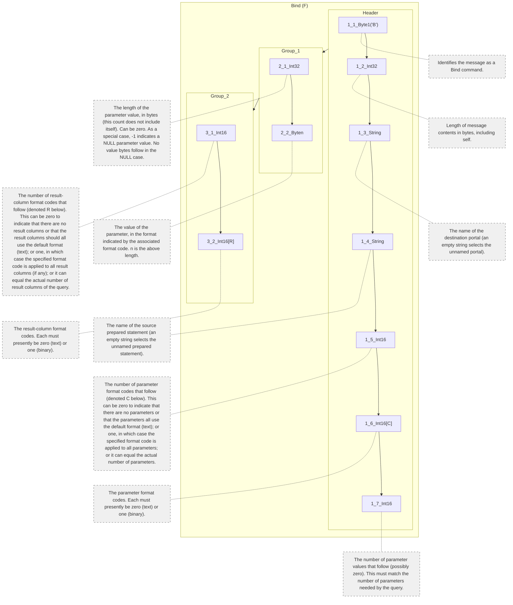
```mermaid
graph TD
  subgraph Bind__F_ ["Bind (F)"]
    subgraph header_0 ["Header"]
      1_1_Byte1__B__["1_1_Byte1('B')"]
      1_2_Int32["1_2_Int32"]
      1_1_Byte1__B__ --> 1_2_Int32
      1_3_String["1_3_String"]
      1_2_Int32 --> 1_3_String
      1_4_String["1_4_String"]
      1_3_String --> 1_4_String
      1_5_Int16["1_5_Int16"]
      1_4_String --> 1_5_Int16
      1_6_Int16_C_["1_6_Int16[C]"]
      1_5_Int16 --> 1_6_Int16_C_
      1_7_Int16["1_7_Int16"]
      1_6_Int16_C_ --> 1_7_Int16
    end
    subgraph group_1_1 ["Group_1"]
      2_1_Int32["2_1_Int32"]
      2_2_Byten["2_2_Byten"]
      2_1_Int32 --> 2_2_Byten
    end
    header_0 --> group_1_1
    subgraph group_2_2 ["Group_2"]
      3_1_Int16["3_1_Int16"]
      3_2_Int16_R_["3_2_Int16[R]"]
      3_1_Int16 --> 3_2_Int16_R_
    end
    group_1_1 --> group_2_2
  end

    1_1_Byte1__B__ -.- desc_1_1_Byte1__B__["Identifies the message as a Bind command."]
    1_2_Int32 -.- desc_1_2_Int32["Length of message contents in bytes, including self."]
    1_3_String -.- desc_1_3_String["The name of the destination portal (an empty string selects the unnamed portal)."]
    1_4_String -.- desc_1_4_String["The name of the source prepared statement (an empty string selects the unnamed prepared statement)."]
    1_5_Int16 -.- desc_1_5_Int16["The number of parameter format codes that follow (denoted C below). This can be zero to indicate that there are no parameters or that the parameters all use the default format (text); or one, in which case the specified format code is applied to all parameters; or it can equal the actual number of parameters."]
    1_6_Int16_C_ -.- desc_1_6_Int16_C_["The parameter format codes. Each must presently be zero (text) or one (binary)."]
    1_7_Int16 -.- desc_1_7_Int16["The number of parameter values that follow (possibly zero). This must match the number of parameters needed by the query."]
    2_1_Int32 -.- desc_2_1_Int32["The length of the parameter value, in bytes (this count does not include itself). Can be zero. As a special case, -1 indicates a NULL parameter value. No value bytes follow in the NULL case."]
    2_2_Byten -.- desc_2_2_Byten["The value of the parameter, in the format indicated by the associated format code. n is the above length."]
    3_1_Int16 -.- desc_3_1_Int16["The number of result-column format codes that follow (denoted R below). This can be zero to indicate that there are no result columns or that the result columns should all use the default format (text); or one, in which case the specified format code is applied to all result columns (if any); or it can equal the actual number of result columns of the query."]
    3_2_Int16_R_ -.- desc_3_2_Int16_R_["The result-column format codes. Each must presently be zero (text) or one (binary)."]
  classDef comment fill:#f0f0f0,stroke:#666,stroke-dasharray: 5 5;
  class desc_1_1_Byte1__B__,desc_1_2_Int32,desc_1_3_String,desc_1_4_String,desc_1_5_Int16,desc_1_6_Int16_C_,desc_1_7_Int16,desc_2_1_Int32,desc_2_2_Byten,desc_3_1_Int16,desc_3_2_Int16_R_ comment;
```

--- Parse (F) ---
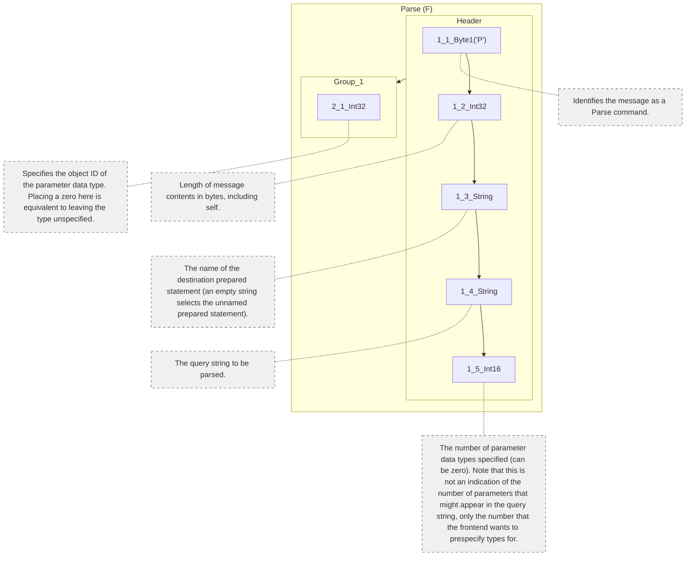
```mermaid
graph TD
  subgraph Parse__F_ ["Parse (F)"]
    subgraph header_0 ["Header"]
      1_1_Byte1__P__["1_1_Byte1('P')"]
      1_2_Int32["1_2_Int32"]
      1_1_Byte1__P__ --> 1_2_Int32
      1_3_String["1_3_String"]
      1_2_Int32 --> 1_3_String
      1_4_String["1_4_String"]
      1_3_String --> 1_4_String
      1_5_Int16["1_5_Int16"]
      1_4_String --> 1_5_Int16
    end
    subgraph group_1_1 ["Group_1"]
      2_1_Int32["2_1_Int32"]
    end
    header_0 --> group_1_1
  end

    1_1_Byte1__P__ -.- desc_1_1_Byte1__P__["Identifies the message as a Parse command."]
    1_2_Int32 -.- desc_1_2_Int32["Length of message contents in bytes, including self."]
    1_3_String -.- desc_1_3_String["The name of the destination prepared statement (an empty string selects the unnamed prepared statement)."]
    1_4_String -.- desc_1_4_String["The query string to be parsed."]
    1_5_Int16 -.- desc_1_5_Int16["The number of parameter data types specified (can be zero). Note that this is not an indication of the number of parameters that might appear in the query string, only the number that the frontend wants to prespecify types for."]
    2_1_Int32 -.- desc_2_1_Int32["Specifies the object ID of the parameter data type. Placing a zero here is equivalent to leaving the type unspecified."]
  classDef comment fill:#f0f0f0,stroke:#666,stroke-dasharray: 5 5;
  class desc_1_1_Byte1__P__,desc_1_2_Int32,desc_1_3_String,desc_1_4_String,desc_1_5_Int16,desc_2_1_Int32 comment;
```

--- SSLRequest (F) ---
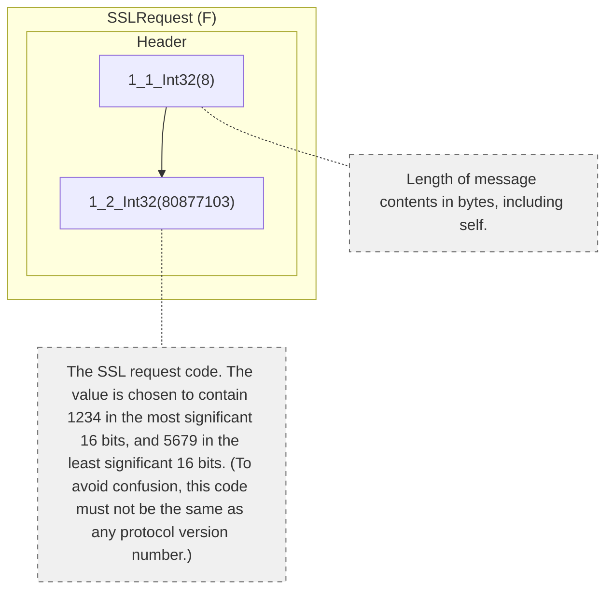
```mermaid
graph TD
  subgraph SSLRequest__F_ ["SSLRequest (F)"]
    subgraph header_0 ["Header"]
      1_1_Int32_8_["1_1_Int32(8)"]
      1_2_Int32_80877103_["1_2_Int32(80877103)"]
      1_1_Int32_8_ --> 1_2_Int32_80877103_
    end
  end

    1_1_Int32_8_ -.- desc_1_1_Int32_8_["Length of message contents in bytes, including self."]
    1_2_Int32_80877103_ -.- desc_1_2_Int32_80877103_["The SSL request code. The value is chosen to contain 1234 in the most significant 16 bits, and 5679 in the least significant 16 bits. (To avoid confusion, this code must not be the same as any protocol version number.)"]
  classDef comment fill:#f0f0f0,stroke:#666,stroke-dasharray: 5 5;
  class desc_1_1_Int32_8_,desc_1_2_Int32_80877103_ comment;
```

--- AuthenticationSASLFinal (B) ---
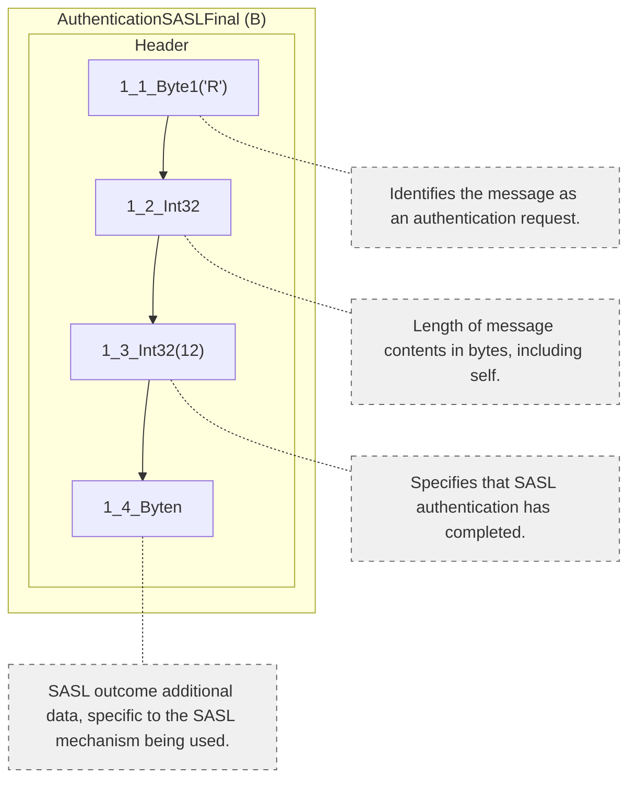
```mermaid
graph TD
  subgraph AuthenticationSASLFinal__B_ ["AuthenticationSASLFinal (B)"]
    subgraph header_0 ["Header"]
      1_1_Byte1__R__["1_1_Byte1('R')"]
      1_2_Int32["1_2_Int32"]
      1_1_Byte1__R__ --> 1_2_Int32
      1_3_Int32_12_["1_3_Int32(12)"]
      1_2_Int32 --> 1_3_Int32_12_
      1_4_Byten["1_4_Byten"]
      1_3_Int32_12_ --> 1_4_Byten
    end
  end

    1_1_Byte1__R__ -.- desc_1_1_Byte1__R__["Identifies the message as an authentication request."]
    1_2_Int32 -.- desc_1_2_Int32["Length of message contents in bytes, including self."]
    1_3_Int32_12_ -.- desc_1_3_Int32_12_["Specifies that SASL authentication has completed."]
    1_4_Byten -.- desc_1_4_Byten["SASL outcome additional data, specific to the SASL mechanism being used."]
  classDef comment fill:#f0f0f0,stroke:#666,stroke-dasharray: 5 5;
  class desc_1_1_Byte1__R__,desc_1_2_Int32,desc_1_3_Int32_12_,desc_1_4_Byten comment;
```

--- PortalSuspended (B) ---
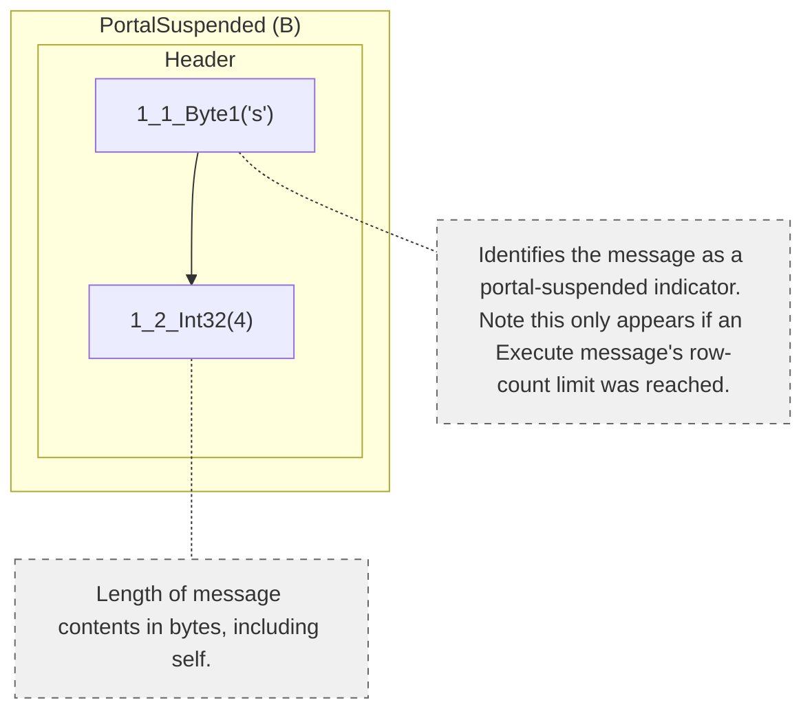
```mermaid
graph TD
  subgraph PortalSuspended__B_ ["PortalSuspended (B)"]
    subgraph header_0 ["Header"]
      1_1_Byte1__s__["1_1_Byte1('s')"]
      1_2_Int32_4_["1_2_Int32(4)"]
      1_1_Byte1__s__ --> 1_2_Int32_4_
    end
  end

    1_1_Byte1__s__ -.- desc_1_1_Byte1__s__["Identifies the message as a portal-suspended indicator. Note this only appears if an Execute message's row-count limit was reached."]
    1_2_Int32_4_ -.- desc_1_2_Int32_4_["Length of message contents in bytes, including self."]
  classDef comment fill:#f0f0f0,stroke:#666,stroke-dasharray: 5 5;
  class desc_1_1_Byte1__s__,desc_1_2_Int32_4_ comment;
```

--- CopyOutResponse (B) ---
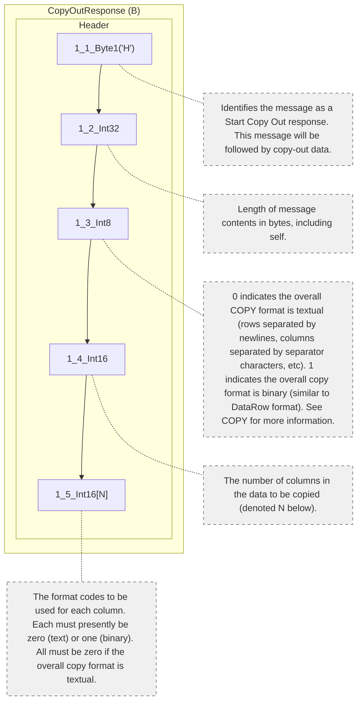
```mermaid
graph TD
  subgraph CopyOutResponse__B_ ["CopyOutResponse (B)"]
    subgraph header_0 ["Header"]
      1_1_Byte1__H__["1_1_Byte1('H')"]
      1_2_Int32["1_2_Int32"]
      1_1_Byte1__H__ --> 1_2_Int32
      1_3_Int8["1_3_Int8"]
      1_2_Int32 --> 1_3_Int8
      1_4_Int16["1_4_Int16"]
      1_3_Int8 --> 1_4_Int16
      1_5_Int16_N_["1_5_Int16[N]"]
      1_4_Int16 --> 1_5_Int16_N_
    end
  end

    1_1_Byte1__H__ -.- desc_1_1_Byte1__H__["Identifies the message as a Start Copy Out response. This message will be followed by copy-out data."]
    1_2_Int32 -.- desc_1_2_Int32["Length of message contents in bytes, including self."]
    1_3_Int8 -.- desc_1_3_Int8["0 indicates the overall COPY format is textual (rows separated by newlines, columns separated by separator characters, etc). 1 indicates the overall copy format is binary (similar to DataRow format). See COPY for more information."]
    1_4_Int16 -.- desc_1_4_Int16["The number of columns in the data to be copied (denoted N below)."]
    1_5_Int16_N_ -.- desc_1_5_Int16_N_["The format codes to be used for each column. Each must presently be zero (text) or one (binary). All must be zero if the overall copy format is textual."]
  classDef comment fill:#f0f0f0,stroke:#666,stroke-dasharray: 5 5;
  class desc_1_1_Byte1__H__,desc_1_2_Int32,desc_1_3_Int8,desc_1_4_Int16,desc_1_5_Int16_N_ comment;
```

--- ParameterDescription (B) ---
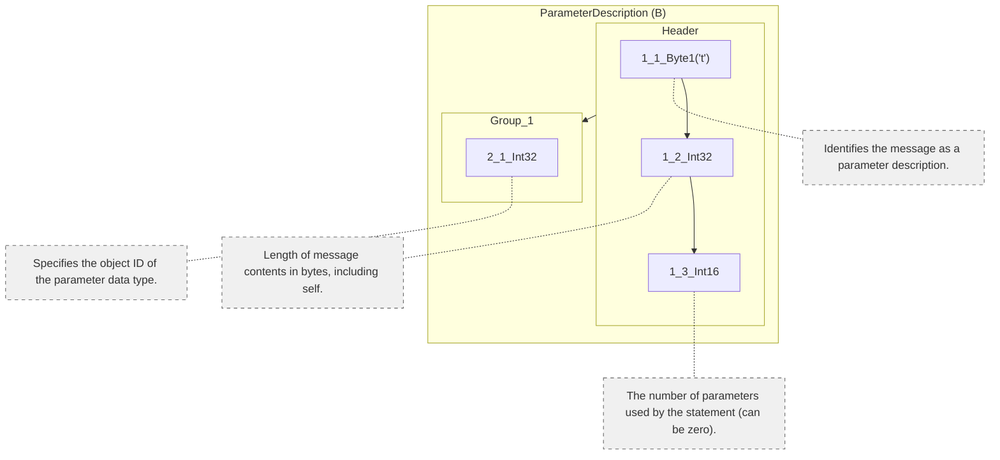
```mermaid
graph TD
  subgraph ParameterDescription__B_ ["ParameterDescription (B)"]
    subgraph header_0 ["Header"]
      1_1_Byte1__t__["1_1_Byte1('t')"]
      1_2_Int32["1_2_Int32"]
      1_1_Byte1__t__ --> 1_2_Int32
      1_3_Int16["1_3_Int16"]
      1_2_Int32 --> 1_3_Int16
    end
    subgraph group_1_1 ["Group_1"]
      2_1_Int32["2_1_Int32"]
    end
    header_0 --> group_1_1
  end

    1_1_Byte1__t__ -.- desc_1_1_Byte1__t__["Identifies the message as a parameter description."]
    1_2_Int32 -.- desc_1_2_Int32["Length of message contents in bytes, including self."]
    1_3_Int16 -.- desc_1_3_Int16["The number of parameters used by the statement (can be zero)."]
    2_1_Int32 -.- desc_2_1_Int32["Specifies the object ID of the parameter data type."]
  classDef comment fill:#f0f0f0,stroke:#666,stroke-dasharray: 5 5;
  class desc_1_1_Byte1__t__,desc_1_2_Int32,desc_1_3_Int16,desc_2_1_Int32 comment;
```

--- FunctionCall (F) ---
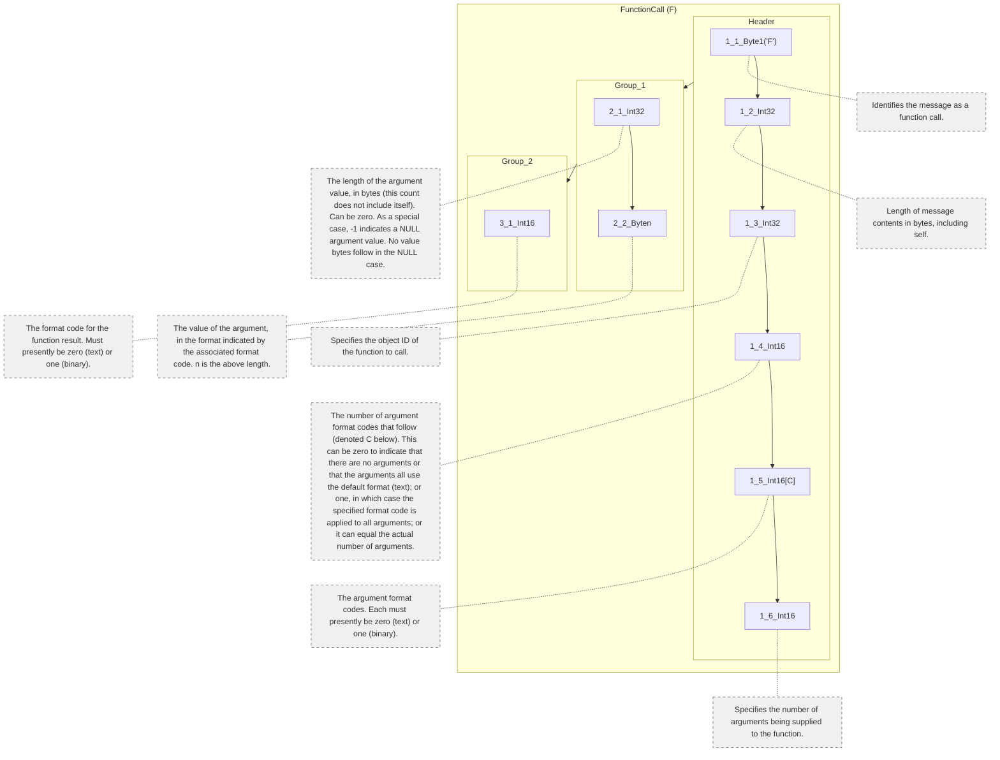
```mermaid
graph TD
  subgraph FunctionCall__F_ ["FunctionCall (F)"]
    subgraph header_0 ["Header"]
      1_1_Byte1__F__["1_1_Byte1('F')"]
      1_2_Int32["1_2_Int32"]
      1_1_Byte1__F__ --> 1_2_Int32
      1_3_Int32["1_3_Int32"]
      1_2_Int32 --> 1_3_Int32
      1_4_Int16["1_4_Int16"]
      1_3_Int32 --> 1_4_Int16
      1_5_Int16_C_["1_5_Int16[C]"]
      1_4_Int16 --> 1_5_Int16_C_
      1_6_Int16["1_6_Int16"]
      1_5_Int16_C_ --> 1_6_Int16
    end
    subgraph group_1_1 ["Group_1"]
      2_1_Int32["2_1_Int32"]
      2_2_Byten["2_2_Byten"]
      2_1_Int32 --> 2_2_Byten
    end
    header_0 --> group_1_1
    subgraph group_2_2 ["Group_2"]
      3_1_Int16["3_1_Int16"]
    end
    group_1_1 --> group_2_2
  end

    1_1_Byte1__F__ -.- desc_1_1_Byte1__F__["Identifies the message as a function call."]
    1_2_Int32 -.- desc_1_2_Int32["Length of message contents in bytes, including self."]
    1_3_Int32 -.- desc_1_3_Int32["Specifies the object ID of the function to call."]
    1_4_Int16 -.- desc_1_4_Int16["The number of argument format codes that follow (denoted C below). This can be zero to indicate that there are no arguments or that the arguments all use the default format (text); or one, in which case the specified format code is applied to all arguments; or it can equal the actual number of arguments."]
    1_5_Int16_C_ -.- desc_1_5_Int16_C_["The argument format codes. Each must presently be zero (text) or one (binary)."]
    1_6_Int16 -.- desc_1_6_Int16["Specifies the number of arguments being supplied to the function."]
    2_1_Int32 -.- desc_2_1_Int32["The length of the argument value, in bytes (this count does not include itself). Can be zero. As a special case, -1 indicates a NULL argument value. No value bytes follow in the NULL case."]
    2_2_Byten -.- desc_2_2_Byten["The value of the argument, in the format indicated by the associated format code. n is the above length."]
    3_1_Int16 -.- desc_3_1_Int16["The format code for the function result. Must presently be zero (text) or one (binary)."]
  classDef comment fill:#f0f0f0,stroke:#666,stroke-dasharray: 5 5;
  class desc_1_1_Byte1__F__,desc_1_2_Int32,desc_1_3_Int32,desc_1_4_Int16,desc_1_5_Int16_C_,desc_1_6_Int16,desc_2_1_Int32,desc_2_2_Byten,desc_3_1_Int16 comment;
```

--- Sync (F) ---
```mermaid
graph TD
  subgraph Sync__F_ ["Sync (F)"]
    subgraph header_0 ["Header"]
      1_1_Byte1__S__["1_1_Byte1('S')"]
      1_2_Int32_4_["1_2_Int32(4)"]
      1_1_Byte1__S__ --> 1_2_Int32_4_
    end
  end

    1_1_Byte1__S__ -.- desc_1_1_Byte1__S__["Identifies the message as a Sync command."]
    1_2_Int32_4_ -.- desc_1_2_Int32_4_["Length of message contents in bytes, including self."]
  classDef comment fill:#f0f0f0,stroke:#666,stroke-dasharray: 5 5;
  class desc_1_1_Byte1__S__,desc_1_2_Int32_4_ comment;
```

--- AuthenticationSCMCredential (B) ---
```mermaid
graph TD
  subgraph AuthenticationSCMCredential__B_ ["AuthenticationSCMCredential (B)"]
    subgraph header_0 ["Header"]
      1_1_Byte1__R__["1_1_Byte1('R')"]
      1_2_Int32_8_["1_2_Int32(8)"]
      1_1_Byte1__R__ --> 1_2_Int32_8_
      1_3_Int32_6_["1_3_Int32(6)"]
      1_2_Int32_8_ --> 1_3_Int32_6_
    end
  end

    1_1_Byte1__R__ -.- desc_1_1_Byte1__R__["Identifies the message as an authentication request."]
    1_2_Int32_8_ -.- desc_1_2_Int32_8_["Length of message contents in bytes, including self."]
    1_3_Int32_6_ -.- desc_1_3_Int32_6_["Specifies that an SCM credentials message is required."]
  classDef comment fill:#f0f0f0,stroke:#666,stroke-dasharray: 5 5;
  class desc_1_1_Byte1__R__,desc_1_2_Int32_8_,desc_1_3_Int32_6_ comment;
```

--- CopyData (F & B) ---
```mermaid
graph TD
  subgraph CopyData__F___B_ ["CopyData (F & B)"]
    subgraph header_0 ["Header"]
      1_1_Byte1__d__["1_1_Byte1('d')"]
      1_2_Int32["1_2_Int32"]
      1_1_Byte1__d__ --> 1_2_Int32
      1_3_Byten["1_3_Byten"]
      1_2_Int32 --> 1_3_Byten
    end
  end

    1_1_Byte1__d__ -.- desc_1_1_Byte1__d__["Identifies the message as COPY data."]
    1_2_Int32 -.- desc_1_2_Int32["Length of message contents in bytes, including self."]
    1_3_Byten -.- desc_1_3_Byten["Data that forms part of a COPY data stream. Messages sent from the backend will always correspond to single data rows, but messages sent by frontends might divide the data stream arbitrarily."]
  classDef comment fill:#f0f0f0,stroke:#666,stroke-dasharray: 5 5;
  class desc_1_1_Byte1__d__,desc_1_2_Int32,desc_1_3_Byten comment;
```

--- ReadyForQuery (B) ---
```mermaid
graph TD
  subgraph ReadyForQuery__B_ ["ReadyForQuery (B)"]
    subgraph header_0 ["Header"]
      1_1_Byte1__Z__["1_1_Byte1('Z')"]
      1_2_Int32_5_["1_2_Int32(5)"]
      1_1_Byte1__Z__ --> 1_2_Int32_5_
      1_3_Byte1["1_3_Byte1"]
      1_2_Int32_5_ --> 1_3_Byte1
    end
  end

    1_1_Byte1__Z__ -.- desc_1_1_Byte1__Z__["Identifies the message type. ReadyForQuery is sent whenever the backend is ready for a new query cycle."]
    1_2_Int32_5_ -.- desc_1_2_Int32_5_["Length of message contents in bytes, including self."]
    1_3_Byte1 -.- desc_1_3_Byte1["Current backend transaction status indicator. Possible values are 'I' if idle (not in a transaction block); 'T' if in a transaction block; or 'E' if in a failed transaction block (queries will be rejected until block is ended)."]
  classDef comment fill:#f0f0f0,stroke:#666,stroke-dasharray: 5 5;
  class desc_1_1_Byte1__Z__,desc_1_2_Int32_5_,desc_1_3_Byte1 comment;
```

--- NoticeResponse (B) ---
```mermaid
graph TD
  subgraph NoticeResponse__B_ ["NoticeResponse (B)"]
    subgraph header_0 ["Header"]
      1_1_Byte1__N__["1_1_Byte1('N')"]
      1_2_Int32["1_2_Int32"]
      1_1_Byte1__N__ --> 1_2_Int32
    end
    subgraph group_1_1 ["Group_1"]
      2_1_Byte1["2_1_Byte1"]
      2_2_String["2_2_String"]
      2_1_Byte1 --> 2_2_String
    end
    header_0 --> group_1_1
  end

    1_1_Byte1__N__ -.- desc_1_1_Byte1__N__["Identifies the message as a notice."]
    1_2_Int32 -.- desc_1_2_Int32["Length of message contents in bytes, including self."]
    2_1_Byte1 -.- desc_2_1_Byte1["A code identifying the field type; if zero, this is the message terminator and no string follows. The presently defined field types are listed in Section 53.8. Since more field types might be added in future, frontends should silently ignore fields of unrecognized type."]
    2_2_String -.- desc_2_2_String["The field value."]
  classDef comment fill:#f0f0f0,stroke:#666,stroke-dasharray: 5 5;
  class desc_1_1_Byte1__N__,desc_1_2_Int32,desc_2_1_Byte1,desc_2_2_String comment;
```

--- CopyInResponse (B) ---
```mermaid
graph TD
  subgraph CopyInResponse__B_ ["CopyInResponse (B)"]
    subgraph header_0 ["Header"]
      1_1_Byte1__G__["1_1_Byte1('G')"]
      1_2_Int32["1_2_Int32"]
      1_1_Byte1__G__ --> 1_2_Int32
      1_3_Int8["1_3_Int8"]
      1_2_Int32 --> 1_3_Int8
      1_4_Int16["1_4_Int16"]
      1_3_Int8 --> 1_4_Int16
      1_5_Int16_N_["1_5_Int16[N]"]
      1_4_Int16 --> 1_5_Int16_N_
    end
  end

    1_1_Byte1__G__ -.- desc_1_1_Byte1__G__["Identifies the message as a Start Copy In response. The frontend must now send copy-in data (if not prepared to do so, send a CopyFail message)."]
    1_2_Int32 -.- desc_1_2_Int32["Length of message contents in bytes, including self."]
    1_3_Int8 -.- desc_1_3_Int8["0 indicates the overall COPY format is textual (rows separated by newlines, columns separated by separator characters, etc). 1 indicates the overall copy format is binary (similar to DataRow format). See COPY for more information."]
    1_4_Int16 -.- desc_1_4_Int16["The number of columns in the data to be copied (denoted N below)."]
    1_5_Int16_N_ -.- desc_1_5_Int16_N_["The format codes to be used for each column. Each must presently be zero (text) or one (binary). All must be zero if the overall copy format is textual."]
  classDef comment fill:#f0f0f0,stroke:#666,stroke-dasharray: 5 5;
  class desc_1_1_Byte1__G__,desc_1_2_Int32,desc_1_3_Int8,desc_1_4_Int16,desc_1_5_Int16_N_ comment;
```

--- PasswordMessage (F) ---
```mermaid
graph TD
  subgraph PasswordMessage__F_ ["PasswordMessage (F)"]
    subgraph header_0 ["Header"]
      1_1_Byte1__p__["1_1_Byte1('p')"]
      1_2_Int32["1_2_Int32"]
      1_1_Byte1__p__ --> 1_2_Int32
      1_3_String["1_3_String"]
      1_2_Int32 --> 1_3_String
    end
  end

    1_1_Byte1__p__ -.- desc_1_1_Byte1__p__["Identifies the message as a password response. Note that this is also used for GSSAPI, SSPI and SASL response messages. The exact message type can be deduced from the context."]
    1_2_Int32 -.- desc_1_2_Int32["Length of message contents in bytes, including self."]
    1_3_String -.- desc_1_3_String["The password (encrypted, if requested)."]
  classDef comment fill:#f0f0f0,stroke:#666,stroke-dasharray: 5 5;
  class desc_1_1_Byte1__p__,desc_1_2_Int32,desc_1_3_String comment;
```

--- CancelRequest (F) ---
```mermaid
graph TD
  subgraph CancelRequest__F_ ["CancelRequest (F)"]
    subgraph header_0 ["Header"]
      1_1_Int32_16_["1_1_Int32(16)"]
      1_2_Int32_80877102_["1_2_Int32(80877102)"]
      1_1_Int32_16_ --> 1_2_Int32_80877102_
      1_3_Int32["1_3_Int32"]
      1_2_Int32_80877102_ --> 1_3_Int32
      1_4_Int32["1_4_Int32"]
      1_3_Int32 --> 1_4_Int32
    end
  end

    1_1_Int32_16_ -.- desc_1_1_Int32_16_["Length of message contents in bytes, including self."]
    1_2_Int32_80877102_ -.- desc_1_2_Int32_80877102_["The cancel request code. The value is chosen to contain 1234 in the most significant 16 bits, and 5678 in the least significant 16 bits. (To avoid confusion, this code must not be the same as any protocol version number.)"]
    1_3_Int32 -.- desc_1_3_Int32["The process ID of the target backend."]
    1_4_Int32 -.- desc_1_4_Int32["The secret key for the target backend."]
  classDef comment fill:#f0f0f0,stroke:#666,stroke-dasharray: 5 5;
  class desc_1_1_Int32_16_,desc_1_2_Int32_80877102_,desc_1_3_Int32,desc_1_4_Int32 comment;
```

--- CopyDone (F & B) ---
```mermaid
graph TD
  subgraph CopyDone__F___B_ ["CopyDone (F & B)"]
    subgraph header_0 ["Header"]
      1_1_Byte1__c__["1_1_Byte1('c')"]
      1_2_Int32_4_["1_2_Int32(4)"]
      1_1_Byte1__c__ --> 1_2_Int32_4_
    end
  end

    1_1_Byte1__c__ -.- desc_1_1_Byte1__c__["Identifies the message as a COPY-complete indicator."]
    1_2_Int32_4_ -.- desc_1_2_Int32_4_["Length of message contents in bytes, including self."]
  classDef comment fill:#f0f0f0,stroke:#666,stroke-dasharray: 5 5;
  class desc_1_1_Byte1__c__,desc_1_2_Int32_4_ comment;
```

--- Query (F) ---
```mermaid
graph TD
  subgraph Query__F_ ["Query (F)"]
    subgraph header_0 ["Header"]
      1_1_Byte1__Q__["1_1_Byte1('Q')"]
      1_2_Int32["1_2_Int32"]
      1_1_Byte1__Q__ --> 1_2_Int32
      1_3_String["1_3_String"]
      1_2_Int32 --> 1_3_String
    end
  end

    1_1_Byte1__Q__ -.- desc_1_1_Byte1__Q__["Identifies the message as a simple query."]
    1_2_Int32 -.- desc_1_2_Int32["Length of message contents in bytes, including self."]
    1_3_String -.- desc_1_3_String["The query string itself."]
  classDef comment fill:#f0f0f0,stroke:#666,stroke-dasharray: 5 5;
  class desc_1_1_Byte1__Q__,desc_1_2_Int32,desc_1_3_String comment;
```

--- DataRow (B) ---
```mermaid
graph TD
  subgraph DataRow__B_ ["DataRow (B)"]
    subgraph header_0 ["Header"]
      1_1_Byte1__D__["1_1_Byte1('D')"]
      1_2_Int32["1_2_Int32"]
      1_1_Byte1__D__ --> 1_2_Int32
      1_3_Int16["1_3_Int16"]
      1_2_Int32 --> 1_3_Int16
    end
    subgraph group_1_1 ["Group_1"]
      2_1_Int32["2_1_Int32"]
      2_2_Byten["2_2_Byten"]
      2_1_Int32 --> 2_2_Byten
    end
    header_0 --> group_1_1
  end

    1_1_Byte1__D__ -.- desc_1_1_Byte1__D__["Identifies the message as a data row."]
    1_2_Int32 -.- desc_1_2_Int32["Length of message contents in bytes, including self."]
    1_3_Int16 -.- desc_1_3_Int16["The number of column values that follow (possibly zero)."]
    2_1_Int32 -.- desc_2_1_Int32["The length of the column value, in bytes (this count does not include itself). Can be zero. As a special case, -1 indicates a NULL column value. No value bytes follow in the NULL case."]
    2_2_Byten -.- desc_2_2_Byten["The value of the column, in the format indicated by the associated format code. n is the above length."]
  classDef comment fill:#f0f0f0,stroke:#666,stroke-dasharray: 5 5;
  class desc_1_1_Byte1__D__,desc_1_2_Int32,desc_1_3_Int16,desc_2_1_Int32,desc_2_2_Byten comment;
```

--- StartupMessage (F) ---
```mermaid
graph TD
  subgraph StartupMessage__F_ ["StartupMessage (F)"]
    subgraph header_0 ["Header"]
      1_1_Int32["1_1_Int32"]
      1_2_Int32_196608_["1_2_Int32(196608)"]
      1_1_Int32 --> 1_2_Int32_196608_
    end
    subgraph group_1_1 ["Group_1"]
      2_1_String["2_1_String"]
      2_2_user["2_2_user"]
      2_1_String --> 2_2_user
      2_3_database["2_3_database"]
      2_2_user --> 2_3_database
      2_4_options["2_4_options"]
      2_3_database --> 2_4_options
      2_5_replication["2_5_replication"]
      2_4_options --> 2_5_replication
      2_6_String["2_6_String"]
      2_5_replication --> 2_6_String
    end
    header_0 --> group_1_1
    subgraph group_2_2 ["Group_2"]
      3_1_user["3_1_user"]
      3_2_database["3_2_database"]
      3_1_user --> 3_2_database
      3_3_options["3_3_options"]
      3_2_database --> 3_3_options
      3_4_replication["3_4_replication"]
      3_3_options --> 3_4_replication
    end
    group_1_1 --> group_2_2
  end

    1_1_Int32 -.- desc_1_1_Int32["Length of message contents in bytes, including self."]
    1_2_Int32_196608_ -.- desc_1_2_Int32_196608_["The protocol version number. The most significant 16 bits are the major version number (3 for the protocol described here). The least significant 16 bits are the minor version number (0 for the protocol described here)."]
    2_1_String -.- desc_2_1_String["The parameter name. Currently recognized names are: user The database user name to connect as. Required; there is no default. database The database to connect to. Defaults to the user name. options Command-line arguments for the backend. (This is deprecated in favor of setting individual run-time parameters.) Spaces within this string are considered to separate arguments, unless escaped with a backslash (\); write \\ to represent a literal backslash. replication Used to connect in streaming replication mode, where a small set of replication commands can be issued instead of SQL statements. Value can be true, false, or database, and the default is false. See Section 53.4 for details. In addition to the above, other parameters may be listed. Parameter names beginning with _pq_. are reserved for use as protocol extensions, while others are treated as run-time parameters to be set at backend start time. Such settings will be applied during backend start (after parsing the command-line arguments if any) and will act as session defaults."]
    2_2_user -.- desc_2_2_user["The database user name to connect as. Required; there is no default."]
    2_3_database -.- desc_2_3_database["The database to connect to. Defaults to the user name."]
    2_4_options -.- desc_2_4_options["Command-line arguments for the backend. (This is deprecated in favor of setting individual run-time parameters.) Spaces within this string are considered to separate arguments, unless escaped with a backslash (\); write \\ to represent a literal backslash."]
    2_5_replication -.- desc_2_5_replication["Used to connect in streaming replication mode, where a small set of replication commands can be issued instead of SQL statements. Value can be true, false, or database, and the default is false. See Section 53.4 for details."]
    2_6_String -.- desc_2_6_String["The parameter value."]
    3_1_user -.- desc_3_1_user["The database user name to connect as. Required; there is no default."]
    3_2_database -.- desc_3_2_database["The database to connect to. Defaults to the user name."]
    3_3_options -.- desc_3_3_options["Command-line arguments for the backend. (This is deprecated in favor of setting individual run-time parameters.) Spaces within this string are considered to separate arguments, unless escaped with a backslash (\); write \\ to represent a literal backslash."]
    3_4_replication -.- desc_3_4_replication["Used to connect in streaming replication mode, where a small set of replication commands can be issued instead of SQL statements. Value can be true, false, or database, and the default is false. See Section 53.4 for details."]
  classDef comment fill:#f0f0f0,stroke:#666,stroke-dasharray: 5 5;
  class desc_1_1_Int32,desc_1_2_Int32_196608_,desc_2_1_String,desc_2_2_user,desc_2_3_database,desc_2_4_options,desc_2_5_replication,desc_2_6_String,desc_3_1_user,desc_3_2_database,desc_3_3_options,desc_3_4_replication comment;
```

--- SASLResponse (F) ---
```mermaid
graph TD
  subgraph SASLResponse__F_ ["SASLResponse (F)"]
    subgraph header_0 ["Header"]
      1_1_Byte1__p__["1_1_Byte1('p')"]
      1_2_Int32["1_2_Int32"]
      1_1_Byte1__p__ --> 1_2_Int32
      1_3_Byten["1_3_Byten"]
      1_2_Int32 --> 1_3_Byten
    end
  end

    1_1_Byte1__p__ -.- desc_1_1_Byte1__p__["Identifies the message as a SASL response. Note that this is also used for GSSAPI, SSPI and password response messages. The exact message type can be deduced from the context."]
    1_2_Int32 -.- desc_1_2_Int32["Length of message contents in bytes, including self."]
    1_3_Byten -.- desc_1_3_Byten["SASL mechanism specific message data."]
  classDef comment fill:#f0f0f0,stroke:#666,stroke-dasharray: 5 5;
  class desc_1_1_Byte1__p__,desc_1_2_Int32,desc_1_3_Byten comment;
```

--- AuthenticationGSSContinue (B) ---
```mermaid
graph TD
  subgraph AuthenticationGSSContinue__B_ ["AuthenticationGSSContinue (B)"]
    subgraph header_0 ["Header"]
      1_1_Byte1__R__["1_1_Byte1('R')"]
      1_2_Int32["1_2_Int32"]
      1_1_Byte1__R__ --> 1_2_Int32
      1_3_Int32_8_["1_3_Int32(8)"]
      1_2_Int32 --> 1_3_Int32_8_
      1_4_Byten["1_4_Byten"]
      1_3_Int32_8_ --> 1_4_Byten
    end
  end

    1_1_Byte1__R__ -.- desc_1_1_Byte1__R__["Identifies the message as an authentication request."]
    1_2_Int32 -.- desc_1_2_Int32["Length of message contents in bytes, including self."]
    1_3_Int32_8_ -.- desc_1_3_Int32_8_["Specifies that this message contains GSSAPI or SSPI data."]
    1_4_Byten -.- desc_1_4_Byten["GSSAPI or SSPI authentication data."]
  classDef comment fill:#f0f0f0,stroke:#666,stroke-dasharray: 5 5;
  class desc_1_1_Byte1__R__,desc_1_2_Int32,desc_1_3_Int32_8_,desc_1_4_Byten comment;
```

--- ErrorResponse (B) ---
```mermaid
graph TD
  subgraph ErrorResponse__B_ ["ErrorResponse (B)"]
    subgraph header_0 ["Header"]
      1_1_Byte1__E__["1_1_Byte1('E')"]
      1_2_Int32["1_2_Int32"]
      1_1_Byte1__E__ --> 1_2_Int32
    end
    subgraph group_1_1 ["Group_1"]
      2_1_Byte1["2_1_Byte1"]
      2_2_String["2_2_String"]
      2_1_Byte1 --> 2_2_String
    end
    header_0 --> group_1_1
  end

    1_1_Byte1__E__ -.- desc_1_1_Byte1__E__["Identifies the message as an error."]
    1_2_Int32 -.- desc_1_2_Int32["Length of message contents in bytes, including self."]
    2_1_Byte1 -.- desc_2_1_Byte1["A code identifying the field type; if zero, this is the message terminator and no string follows. The presently defined field types are listed in Section 53.8. Since more field types might be added in future, frontends should silently ignore fields of unrecognized type."]
    2_2_String -.- desc_2_2_String["The field value."]
  classDef comment fill:#f0f0f0,stroke:#666,stroke-dasharray: 5 5;
  class desc_1_1_Byte1__E__,desc_1_2_Int32,desc_2_1_Byte1,desc_2_2_String comment;
```

--- CloseComplete (B) ---
```mermaid
graph TD
  subgraph CloseComplete__B_ ["CloseComplete (B)"]
    subgraph header_0 ["Header"]
      1_1_Byte1__3__["1_1_Byte1('3')"]
      1_2_Int32_4_["1_2_Int32(4)"]
      1_1_Byte1__3__ --> 1_2_Int32_4_
    end
  end

    1_1_Byte1__3__ -.- desc_1_1_Byte1__3__["Identifies the message as a Close-complete indicator."]
    1_2_Int32_4_ -.- desc_1_2_Int32_4_["Length of message contents in bytes, including self."]
  classDef comment fill:#f0f0f0,stroke:#666,stroke-dasharray: 5 5;
  class desc_1_1_Byte1__3__,desc_1_2_Int32_4_ comment;
```

--- AuthenticationSSPI (B) ---
```mermaid
graph TD
  subgraph AuthenticationSSPI__B_ ["AuthenticationSSPI (B)"]
    subgraph header_0 ["Header"]
      1_1_Byte1__R__["1_1_Byte1('R')"]
      1_2_Int32_8_["1_2_Int32(8)"]
      1_1_Byte1__R__ --> 1_2_Int32_8_
      1_3_Int32_9_["1_3_Int32(9)"]
      1_2_Int32_8_ --> 1_3_Int32_9_
    end
  end

    1_1_Byte1__R__ -.- desc_1_1_Byte1__R__["Identifies the message as an authentication request."]
    1_2_Int32_8_ -.- desc_1_2_Int32_8_["Length of message contents in bytes, including self."]
    1_3_Int32_9_ -.- desc_1_3_Int32_9_["Specifies that SSPI authentication is required."]
  classDef comment fill:#f0f0f0,stroke:#666,stroke-dasharray: 5 5;
  class desc_1_1_Byte1__R__,desc_1_2_Int32_8_,desc_1_3_Int32_9_ comment;
```

--- CopyBothResponse (B) ---
```mermaid
graph TD
  subgraph CopyBothResponse__B_ ["CopyBothResponse (B)"]
    subgraph header_0 ["Header"]
      1_1_Byte1__W__["1_1_Byte1('W')"]
      1_2_Int32["1_2_Int32"]
      1_1_Byte1__W__ --> 1_2_Int32
      1_3_Int8["1_3_Int8"]
      1_2_Int32 --> 1_3_Int8
      1_4_Int16["1_4_Int16"]
      1_3_Int8 --> 1_4_Int16
      1_5_Int16_N_["1_5_Int16[N]"]
      1_4_Int16 --> 1_5_Int16_N_
    end
  end

    1_1_Byte1__W__ -.- desc_1_1_Byte1__W__["Identifies the message as a Start Copy Both response. This message is used only for Streaming Replication."]
    1_2_Int32 -.- desc_1_2_Int32["Length of message contents in bytes, including self."]
    1_3_Int8 -.- desc_1_3_Int8["0 indicates the overall COPY format is textual (rows separated by newlines, columns separated by separator characters, etc). 1 indicates the overall copy format is binary (similar to DataRow format). See COPY for more information."]
    1_4_Int16 -.- desc_1_4_Int16["The number of columns in the data to be copied (denoted N below)."]
    1_5_Int16_N_ -.- desc_1_5_Int16_N_["The format codes to be used for each column. Each must presently be zero (text) or one (binary). All must be zero if the overall copy format is textual."]
  classDef comment fill:#f0f0f0,stroke:#666,stroke-dasharray: 5 5;
  class desc_1_1_Byte1__W__,desc_1_2_Int32,desc_1_3_Int8,desc_1_4_Int16,desc_1_5_Int16_N_ comment;
```

--- AuthenticationOk (B) ---
```mermaid
graph TD
  subgraph AuthenticationOk__B_ ["AuthenticationOk (B)"]
    subgraph header_0 ["Header"]
      1_1_Byte1__R__["1_1_Byte1('R')"]
      1_2_Int32_8_["1_2_Int32(8)"]
      1_1_Byte1__R__ --> 1_2_Int32_8_
      1_3_Int32_0_["1_3_Int32(0)"]
      1_2_Int32_8_ --> 1_3_Int32_0_
    end
  end

    1_1_Byte1__R__ -.- desc_1_1_Byte1__R__["Identifies the message as an authentication request."]
    1_2_Int32_8_ -.- desc_1_2_Int32_8_["Length of message contents in bytes, including self."]
    1_3_Int32_0_ -.- desc_1_3_Int32_0_["Specifies that the authentication was successful."]
  classDef comment fill:#f0f0f0,stroke:#666,stroke-dasharray: 5 5;
  class desc_1_1_Byte1__R__,desc_1_2_Int32_8_,desc_1_3_Int32_0_ comment;
```

--- AuthenticationMD5Password (B) ---
```mermaid
graph TD
  subgraph AuthenticationMD5Password__B_ ["AuthenticationMD5Password (B)"]
    subgraph header_0 ["Header"]
      1_1_Byte1__R__["1_1_Byte1('R')"]
      1_2_Int32_12_["1_2_Int32(12)"]
      1_1_Byte1__R__ --> 1_2_Int32_12_
      1_3_Int32_5_["1_3_Int32(5)"]
      1_2_Int32_12_ --> 1_3_Int32_5_
      1_4_Byte4["1_4_Byte4"]
      1_3_Int32_5_ --> 1_4_Byte4
    end
  end

    1_1_Byte1__R__ -.- desc_1_1_Byte1__R__["Identifies the message as an authentication request."]
    1_2_Int32_12_ -.- desc_1_2_Int32_12_["Length of message contents in bytes, including self."]
    1_3_Int32_5_ -.- desc_1_3_Int32_5_["Specifies that an MD5-encrypted password is required."]
    1_4_Byte4 -.- desc_1_4_Byte4["The salt to use when encrypting the password."]
  classDef comment fill:#f0f0f0,stroke:#666,stroke-dasharray: 5 5;
  class desc_1_1_Byte1__R__,desc_1_2_Int32_12_,desc_1_3_Int32_5_,desc_1_4_Byte4 comment;
```

--- NegotiateProtocolVersion (B) ---
```mermaid
graph TD
  subgraph NegotiateProtocolVersion__B_ ["NegotiateProtocolVersion (B)"]
    subgraph header_0 ["Header"]
      1_1_Byte1__v__["1_1_Byte1('v')"]
      1_2_Int32["1_2_Int32"]
      1_1_Byte1__v__ --> 1_2_Int32
      1_3_Int32["1_3_Int32"]
      1_2_Int32 --> 1_3_Int32
      1_4_Int32["1_4_Int32"]
      1_3_Int32 --> 1_4_Int32
    end
    subgraph group_1_1 ["Group_1"]
      2_1_String["2_1_String"]
    end
    header_0 --> group_1_1
  end

    1_1_Byte1__v__ -.- desc_1_1_Byte1__v__["Identifies the message as a protocol version negotiation message."]
    1_2_Int32 -.- desc_1_2_Int32["Length of message contents in bytes, including self."]
    1_3_Int32 -.- desc_1_3_Int32["Newest minor protocol version supported by the server for the major protocol version requested by the client."]
    1_4_Int32 -.- desc_1_4_Int32["Number of protocol options not recognized by the server."]
    2_1_String -.- desc_2_1_String["The option name."]
  classDef comment fill:#f0f0f0,stroke:#666,stroke-dasharray: 5 5;
  class desc_1_1_Byte1__v__,desc_1_2_Int32,desc_1_3_Int32,desc_1_4_Int32,desc_2_1_String comment;
```

--- ParameterStatus (B) ---
```mermaid
graph TD
  subgraph ParameterStatus__B_ ["ParameterStatus (B)"]
    subgraph header_0 ["Header"]
      1_1_Byte1__S__["1_1_Byte1('S')"]
      1_2_Int32["1_2_Int32"]
      1_1_Byte1__S__ --> 1_2_Int32
      1_3_String["1_3_String"]
      1_2_Int32 --> 1_3_String
      1_4_String["1_4_String"]
      1_3_String --> 1_4_String
    end
  end

    1_1_Byte1__S__ -.- desc_1_1_Byte1__S__["Identifies the message as a run-time parameter status report."]
    1_2_Int32 -.- desc_1_2_Int32["Length of message contents in bytes, including self."]
    1_3_String -.- desc_1_3_String["The name of the run-time parameter being reported."]
    1_4_String -.- desc_1_4_String["The current value of the parameter."]
  classDef comment fill:#f0f0f0,stroke:#666,stroke-dasharray: 5 5;
  class desc_1_1_Byte1__S__,desc_1_2_Int32,desc_1_3_String,desc_1_4_String comment;
```

--- AuthenticationSASLContinue (B) ---
```mermaid
graph TD
  subgraph AuthenticationSASLContinue__B_ ["AuthenticationSASLContinue (B)"]
    subgraph header_0 ["Header"]
      1_1_Byte1__R__["1_1_Byte1('R')"]
      1_2_Int32["1_2_Int32"]
      1_1_Byte1__R__ --> 1_2_Int32
      1_3_Int32_11_["1_3_Int32(11)"]
      1_2_Int32 --> 1_3_Int32_11_
      1_4_Byten["1_4_Byten"]
      1_3_Int32_11_ --> 1_4_Byten
    end
  end

    1_1_Byte1__R__ -.- desc_1_1_Byte1__R__["Identifies the message as an authentication request."]
    1_2_Int32 -.- desc_1_2_Int32["Length of message contents in bytes, including self."]
    1_3_Int32_11_ -.- desc_1_3_Int32_11_["Specifies that this message contains a SASL challenge."]
    1_4_Byten -.- desc_1_4_Byten["SASL data, specific to the SASL mechanism being used."]
  classDef comment fill:#f0f0f0,stroke:#666,stroke-dasharray: 5 5;
  class desc_1_1_Byte1__R__,desc_1_2_Int32,desc_1_3_Int32_11_,desc_1_4_Byten comment;
```

--- AuthenticationSASL (B) ---
```mermaid
graph TD
  subgraph AuthenticationSASL__B_ ["AuthenticationSASL (B)"]
    subgraph header_0 ["Header"]
      1_1_Byte1__R__["1_1_Byte1('R')"]
      1_2_Int32["1_2_Int32"]
      1_1_Byte1__R__ --> 1_2_Int32
      1_3_Int32_10_["1_3_Int32(10)"]
      1_2_Int32 --> 1_3_Int32_10_
    end
    subgraph group_1_1 ["Group_1"]
      2_1_String["2_1_String"]
    end
    header_0 --> group_1_1
  end

    1_1_Byte1__R__ -.- desc_1_1_Byte1__R__["Identifies the message as an authentication request."]
    1_2_Int32 -.- desc_1_2_Int32["Length of message contents in bytes, including self."]
    1_3_Int32_10_ -.- desc_1_3_Int32_10_["Specifies that SASL authentication is required."]
    2_1_String -.- desc_2_1_String["Name of a SASL authentication mechanism."]
  classDef comment fill:#f0f0f0,stroke:#666,stroke-dasharray: 5 5;
  class desc_1_1_Byte1__R__,desc_1_2_Int32,desc_1_3_Int32_10_,desc_2_1_String comment;
```

--- Flush (F) ---
```mermaid
graph TD
  subgraph Flush__F_ ["Flush (F)"]
    subgraph header_0 ["Header"]
      1_1_Byte1__H__["1_1_Byte1('H')"]
      1_2_Int32_4_["1_2_Int32(4)"]
      1_1_Byte1__H__ --> 1_2_Int32_4_
    end
  end

    1_1_Byte1__H__ -.- desc_1_1_Byte1__H__["Identifies the message as a Flush command."]
    1_2_Int32_4_ -.- desc_1_2_Int32_4_["Length of message contents in bytes, including self."]
  classDef comment fill:#f0f0f0,stroke:#666,stroke-dasharray: 5 5;
  class desc_1_1_Byte1__H__,desc_1_2_Int32_4_ comment;
```

--- CopyFail (F) ---
```mermaid
graph TD
  subgraph CopyFail__F_ ["CopyFail (F)"]
    subgraph header_0 ["Header"]
      1_1_Byte1__f__["1_1_Byte1('f')"]
      1_2_Int32["1_2_Int32"]
      1_1_Byte1__f__ --> 1_2_Int32
      1_3_String["1_3_String"]
      1_2_Int32 --> 1_3_String
    end
  end

    1_1_Byte1__f__ -.- desc_1_1_Byte1__f__["Identifies the message as a COPY-failure indicator."]
    1_2_Int32 -.- desc_1_2_Int32["Length of message contents in bytes, including self."]
    1_3_String -.- desc_1_3_String["An error message to report as the cause of failure."]
  classDef comment fill:#f0f0f0,stroke:#666,stroke-dasharray: 5 5;
  class desc_1_1_Byte1__f__,desc_1_2_Int32,desc_1_3_String comment;
```

--- Describe (F) ---
```mermaid
graph TD
  subgraph Describe__F_ ["Describe (F)"]
    subgraph header_0 ["Header"]
      1_1_Byte1__D__["1_1_Byte1('D')"]
      1_2_Int32["1_2_Int32"]
      1_1_Byte1__D__ --> 1_2_Int32
      1_3_Byte1["1_3_Byte1"]
      1_2_Int32 --> 1_3_Byte1
      1_4_String["1_4_String"]
      1_3_Byte1 --> 1_4_String
    end
  end

    1_1_Byte1__D__ -.- desc_1_1_Byte1__D__["Identifies the message as a Describe command."]
    1_2_Int32 -.- desc_1_2_Int32["Length of message contents in bytes, including self."]
    1_3_Byte1 -.- desc_1_3_Byte1["'S' to describe a prepared statement; or 'P' to describe a portal."]
    1_4_String -.- desc_1_4_String["The name of the prepared statement or portal to describe (an empty string selects the unnamed prepared statement or portal)."]
  classDef comment fill:#f0f0f0,stroke:#666,stroke-dasharray: 5 5;
  class desc_1_1_Byte1__D__,desc_1_2_Int32,desc_1_3_Byte1,desc_1_4_String comment;
```

--- AuthenticationGSS (B) ---
```mermaid
graph TD
  subgraph AuthenticationGSS__B_ ["AuthenticationGSS (B)"]
    subgraph header_0 ["Header"]
      1_1_Byte1__R__["1_1_Byte1('R')"]
      1_2_Int32_8_["1_2_Int32(8)"]
      1_1_Byte1__R__ --> 1_2_Int32_8_
      1_3_Int32_7_["1_3_Int32(7)"]
      1_2_Int32_8_ --> 1_3_Int32_7_
    end
  end

    1_1_Byte1__R__ -.- desc_1_1_Byte1__R__["Identifies the message as an authentication request."]
    1_2_Int32_8_ -.- desc_1_2_Int32_8_["Length of message contents in bytes, including self."]
    1_3_Int32_7_ -.- desc_1_3_Int32_7_["Specifies that GSSAPI authentication is required."]
  classDef comment fill:#f0f0f0,stroke:#666,stroke-dasharray: 5 5;
  class desc_1_1_Byte1__R__,desc_1_2_Int32_8_,desc_1_3_Int32_7_ comment;
```

--- SASLInitialResponse (F) ---
```mermaid
graph TD
  subgraph SASLInitialResponse__F_ ["SASLInitialResponse (F)"]
    subgraph header_0 ["Header"]
      1_1_Byte1__p__["1_1_Byte1('p')"]
      1_2_Int32["1_2_Int32"]
      1_1_Byte1__p__ --> 1_2_Int32
      1_3_String["1_3_String"]
      1_2_Int32 --> 1_3_String
      1_4_Int32["1_4_Int32"]
      1_3_String --> 1_4_Int32
      1_5_Byten["1_5_Byten"]
      1_4_Int32 --> 1_5_Byten
    end
  end

    1_1_Byte1__p__ -.- desc_1_1_Byte1__p__["Identifies the message as an initial SASL response. Note that this is also used for GSSAPI, SSPI and password response messages. The exact message type is deduced from the context."]
    1_2_Int32 -.- desc_1_2_Int32["Length of message contents in bytes, including self."]
    1_3_String -.- desc_1_3_String["Name of the SASL authentication mechanism that the client selected."]
    1_4_Int32 -.- desc_1_4_Int32["Length of SASL mechanism specific Initial Client Response that follows, or -1 if there is no Initial Response."]
    1_5_Byten -.- desc_1_5_Byten["SASL mechanism specific Initial Response."]
  classDef comment fill:#f0f0f0,stroke:#666,stroke-dasharray: 5 5;
  class desc_1_1_Byte1__p__,desc_1_2_Int32,desc_1_3_String,desc_1_4_Int32,desc_1_5_Byten comment;
```

--- NoData (B) ---
```mermaid
graph TD
  subgraph NoData__B_ ["NoData (B)"]
    subgraph header_0 ["Header"]
      1_1_Byte1__n__["1_1_Byte1('n')"]
      1_2_Int32_4_["1_2_Int32(4)"]
      1_1_Byte1__n__ --> 1_2_Int32_4_
    end
  end

    1_1_Byte1__n__ -.- desc_1_1_Byte1__n__["Identifies the message as a no-data indicator."]
    1_2_Int32_4_ -.- desc_1_2_Int32_4_["Length of message contents in bytes, including self."]
  classDef comment fill:#f0f0f0,stroke:#666,stroke-dasharray: 5 5;
  class desc_1_1_Byte1__n__,desc_1_2_Int32_4_ comment;
```

--- AuthenticationCleartextPassword (B) ---
```mermaid
graph TD
  subgraph AuthenticationCleartextPassword__B_ ["AuthenticationCleartextPassword (B)"]
    subgraph header_0 ["Header"]
      1_1_Byte1__R__["1_1_Byte1('R')"]
      1_2_Int32_8_["1_2_Int32(8)"]
      1_1_Byte1__R__ --> 1_2_Int32_8_
      1_3_Int32_3_["1_3_Int32(3)"]
      1_2_Int32_8_ --> 1_3_Int32_3_
    end
  end

    1_1_Byte1__R__ -.- desc_1_1_Byte1__R__["Identifies the message as an authentication request."]
    1_2_Int32_8_ -.- desc_1_2_Int32_8_["Length of message contents in bytes, including self."]
    1_3_Int32_3_ -.- desc_1_3_Int32_3_["Specifies that a clear-text password is required."]
  classDef comment fill:#f0f0f0,stroke:#666,stroke-dasharray: 5 5;
  class desc_1_1_Byte1__R__,desc_1_2_Int32_8_,desc_1_3_Int32_3_ comment;
```

--- String ---
```mermaid
graph TD
  subgraph String ["String"]
    subgraph header_0 ["Header"]
      1_1_user["1_1_user"]
      1_2_database["1_2_database"]
      1_1_user --> 1_2_database
      1_3_options["1_3_options"]
      1_2_database --> 1_3_options
      1_4_replication["1_4_replication"]
      1_3_options --> 1_4_replication
    end
  end

    1_1_user -.- desc_1_1_user["The database user name to connect as. Required; there is no default."]
    1_2_database -.- desc_1_2_database["The database to connect to. Defaults to the user name."]
    1_3_options -.- desc_1_3_options["Command-line arguments for the backend. (This is deprecated in favor of setting individual run-time parameters.) Spaces within this string are considered to separate arguments, unless escaped with a backslash (\); write \\ to represent a literal backslash."]
    1_4_replication -.- desc_1_4_replication["Used to connect in streaming replication mode, where a small set of replication commands can be issued instead of SQL statements. Value can be true, false, or database, and the default is false. See Section 53.4 for details."]
  classDef comment fill:#f0f0f0,stroke:#666,stroke-dasharray: 5 5;
  class desc_1_1_user,desc_1_2_database,desc_1_3_options,desc_1_4_replication comment;
```

--- Close (F) ---
```mermaid
graph TD
  subgraph Close__F_ ["Close (F)"]
    subgraph header_0 ["Header"]
      1_1_Byte1__C__["1_1_Byte1('C')"]
      1_2_Int32["1_2_Int32"]
      1_1_Byte1__C__ --> 1_2_Int32
      1_3_Byte1["1_3_Byte1"]
      1_2_Int32 --> 1_3_Byte1
      1_4_String["1_4_String"]
      1_3_Byte1 --> 1_4_String
    end
  end

    1_1_Byte1__C__ -.- desc_1_1_Byte1__C__["Identifies the message as a Close command."]
    1_2_Int32 -.- desc_1_2_Int32["Length of message contents in bytes, including self."]
    1_3_Byte1 -.- desc_1_3_Byte1["'S' to close a prepared statement; or 'P' to close a portal."]
    1_4_String -.- desc_1_4_String["The name of the prepared statement or portal to close (an empty string selects the unnamed prepared statement or portal)."]
  classDef comment fill:#f0f0f0,stroke:#666,stroke-dasharray: 5 5;
  class desc_1_1_Byte1__C__,desc_1_2_Int32,desc_1_3_Byte1,desc_1_4_String comment;
```

### yaml
```yamlurl: https://www.postgresql.org/docs/11/protocol-message-formats.html
messages:
- name: AuthenticationOk (B)
  blocks:
  - type: header
    fields:
    - field: 1_1_Byte1('R')
      description: Identifies the message as an authentication request.
    - field: 1_2_Int32(8)
      description: Length of message contents in bytes, including self.
    - field: 1_3_Int32(0)
      description: Specifies that the authentication was successful.
- name: AuthenticationKerberosV5 (B)
  blocks:
  - type: header
    fields:
    - field: 1_1_Byte1('R')
      description: Identifies the message as an authentication request.
    - field: 1_2_Int32(8)
      description: Length of message contents in bytes, including self.
    - field: 1_3_Int32(2)
      description: Specifies that Kerberos V5 authentication is required.
- name: AuthenticationCleartextPassword (B)
  blocks:
  - type: header
    fields:
    - field: 1_1_Byte1('R')
      description: Identifies the message as an authentication request.
    - field: 1_2_Int32(8)
      description: Length of message contents in bytes, including self.
    - field: 1_3_Int32(3)
      description: Specifies that a clear-text password is required.
- name: AuthenticationMD5Password (B)
  blocks:
  - type: header
    fields:
    - field: 1_1_Byte1('R')
      description: Identifies the message as an authentication request.
    - field: 1_2_Int32(12)
      description: Length of message contents in bytes, including self.
    - field: 1_3_Int32(5)
      description: Specifies that an MD5-encrypted password is required.
    - field: 1_4_Byte4
      description: The salt to use when encrypting the password.
- name: AuthenticationSCMCredential (B)
  blocks:
  - type: header
    fields:
    - field: 1_1_Byte1('R')
      description: Identifies the message as an authentication request.
    - field: 1_2_Int32(8)
      description: Length of message contents in bytes, including self.
    - field: 1_3_Int32(6)
      description: Specifies that an SCM credentials message is required.
- name: AuthenticationGSS (B)
  blocks:
  - type: header
    fields:
    - field: 1_1_Byte1('R')
      description: Identifies the message as an authentication request.
    - field: 1_2_Int32(8)
      description: Length of message contents in bytes, including self.
    - field: 1_3_Int32(7)
      description: Specifies that GSSAPI authentication is required.
- name: AuthenticationSSPI (B)
  blocks:
  - type: header
    fields:
    - field: 1_1_Byte1('R')
      description: Identifies the message as an authentication request.
    - field: 1_2_Int32(8)
      description: Length of message contents in bytes, including self.
    - field: 1_3_Int32(9)
      description: Specifies that SSPI authentication is required.
- name: AuthenticationGSSContinue (B)
  blocks:
  - type: header
    fields:
    - field: 1_1_Byte1('R')
      description: Identifies the message as an authentication request.
    - field: 1_2_Int32
      description: Length of message contents in bytes, including self.
    - field: 1_3_Int32(8)
      description: Specifies that this message contains GSSAPI or SSPI data.
    - field: 1_4_Byten
      description: GSSAPI or SSPI authentication data.
- name: AuthenticationSASL (B)
  blocks:
  - type: header
    fields:
    - field: 1_1_Byte1('R')
      description: Identifies the message as an authentication request.
    - field: 1_2_Int32
      description: Length of message contents in bytes, including self.
    - field: 1_3_Int32(10)
      description: Specifies that SASL authentication is required.
  - type: group_1
    fields:
    - field: 2_1_String
      description: Name of a SASL authentication mechanism.
- name: AuthenticationSASLContinue (B)
  blocks:
  - type: header
    fields:
    - field: 1_1_Byte1('R')
      description: Identifies the message as an authentication request.
    - field: 1_2_Int32
      description: Length of message contents in bytes, including self.
    - field: 1_3_Int32(11)
      description: Specifies that this message contains a SASL challenge.
    - field: 1_4_Byten
      description: SASL data, specific to the SASL mechanism being used.
- name: AuthenticationSASLFinal (B)
  blocks:
  - type: header
    fields:
    - field: 1_1_Byte1('R')
      description: Identifies the message as an authentication request.
    - field: 1_2_Int32
      description: Length of message contents in bytes, including self.
    - field: 1_3_Int32(12)
      description: Specifies that SASL authentication has completed.
    - field: 1_4_Byten
      description: SASL outcome "additional data", specific to the SASL mechanism
        being used.
- name: BackendKeyData (B)
  blocks:
  - type: header
    fields:
    - field: 1_1_Byte1('K')
      description: Identifies the message as cancellation key data. The frontend must
        save these values if it wishes to be able to issue CancelRequest messages
        later.
    - field: 1_2_Int32(12)
      description: Length of message contents in bytes, including self.
    - field: 1_3_Int32
      description: The process ID of this backend.
    - field: 1_4_Int32
      description: The secret key of this backend.
- name: Bind (F)
  blocks:
  - type: header
    fields:
    - field: 1_1_Byte1('B')
      description: Identifies the message as a Bind command.
    - field: 1_2_Int32
      description: Length of message contents in bytes, including self.
    - field: 1_3_String
      description: The name of the destination portal (an empty string selects the
        unnamed portal).
    - field: 1_4_String
      description: The name of the source prepared statement (an empty string selects
        the unnamed prepared statement).
    - field: 1_5_Int16
      description: The number of parameter format codes that follow (denoted C below).
        This can be zero to indicate that there are no parameters or that the parameters
        all use the default format (text); or one, in which case the specified format
        code is applied to all parameters; or it can equal the actual number of parameters.
    - field: 1_6_Int16[C]
      description: The parameter format codes. Each must presently be zero (text)
        or one (binary).
    - field: 1_7_Int16
      description: The number of parameter values that follow (possibly zero). This
        must match the number of parameters needed by the query.
  - type: group_1
    fields:
    - field: 2_1_Int32
      description: The length of the parameter value, in bytes (this count does not
        include itself). Can be zero. As a special case, -1 indicates a NULL parameter
        value. No value bytes follow in the NULL case.
    - field: 2_2_Byten
      description: The value of the parameter, in the format indicated by the associated
        format code. n is the above length.
  - type: group_2
    fields:
    - field: 3_1_Int16
      description: The number of result-column format codes that follow (denoted R
        below). This can be zero to indicate that there are no result columns or that
        the result columns should all use the default format (text); or one, in which
        case the specified format code is applied to all result columns (if any);
        or it can equal the actual number of result columns of the query.
    - field: 3_2_Int16[R]
      description: The result-column format codes. Each must presently be zero (text)
        or one (binary).
- name: BindComplete (B)
  blocks:
  - type: header
    fields:
    - field: 1_1_Byte1('2')
      description: Identifies the message as a Bind-complete indicator.
    - field: 1_2_Int32(4)
      description: Length of message contents in bytes, including self.
- name: CancelRequest (F)
  blocks:
  - type: header
    fields:
    - field: 1_1_Int32(16)
      description: Length of message contents in bytes, including self.
    - field: 1_2_Int32(80877102)
      description: The cancel request code. The value is chosen to contain 1234 in
        the most significant 16 bits, and 5678 in the least significant 16 bits. (To
        avoid confusion, this code must not be the same as any protocol version number.)
    - field: 1_3_Int32
      description: The process ID of the target backend.
    - field: 1_4_Int32
      description: The secret key for the target backend.
- name: Close (F)
  blocks:
  - type: header
    fields:
    - field: 1_1_Byte1('C')
      description: Identifies the message as a Close command.
    - field: 1_2_Int32
      description: Length of message contents in bytes, including self.
    - field: 1_3_Byte1
      description: '''S'' to close a prepared statement; or ''P'' to close a portal.'
    - field: 1_4_String
      description: The name of the prepared statement or portal to close (an empty
        string selects the unnamed prepared statement or portal).
- name: CloseComplete (B)
  blocks:
  - type: header
    fields:
    - field: 1_1_Byte1('3')
      description: Identifies the message as a Close-complete indicator.
    - field: 1_2_Int32(4)
      description: Length of message contents in bytes, including self.
- name: CommandComplete (B)
  blocks:
  - type: header
    fields:
    - field: 1_1_Byte1('C')
      description: Identifies the message as a command-completed response.
    - field: 1_2_Int32
      description: Length of message contents in bytes, including self.
    - field: 1_3_String
      description: 'The command tag. This is usually a single word that identifies
        which SQL command was completed. For an INSERT command, the tag is INSERT
        oid rows, where rows is the number of rows inserted. oid is the object ID
        of the inserted row if rows is 1 and the target table has OIDs; otherwise
        oid is 0. For a DELETE command, the tag is DELETE rows where rows is the number
        of rows deleted. For an UPDATE command, the tag is UPDATE rows where rows
        is the number of rows updated. For a SELECT or CREATE TABLE AS command, the
        tag is SELECT rows where rows is the number of rows retrieved. For a MOVE
        command, the tag is MOVE rows where rows is the number of rows the cursor''s
        position has been changed by. For a FETCH command, the tag is FETCH rows where
        rows is the number of rows that have been retrieved from the cursor. For a
        COPY command, the tag is COPY rows where rows is the number of rows copied.
        (Note: the row count appears only in PostgreSQL 8.2 and later.)'
- name: CopyData (F & B)
  blocks:
  - type: header
    fields:
    - field: 1_1_Byte1('d')
      description: Identifies the message as COPY data.
    - field: 1_2_Int32
      description: Length of message contents in bytes, including self.
    - field: 1_3_Byten
      description: Data that forms part of a COPY data stream. Messages sent from
        the backend will always correspond to single data rows, but messages sent
        by frontends might divide the data stream arbitrarily.
- name: CopyDone (F & B)
  blocks:
  - type: header
    fields:
    - field: 1_1_Byte1('c')
      description: Identifies the message as a COPY-complete indicator.
    - field: 1_2_Int32(4)
      description: Length of message contents in bytes, including self.
- name: CopyFail (F)
  blocks:
  - type: header
    fields:
    - field: 1_1_Byte1('f')
      description: Identifies the message as a COPY-failure indicator.
    - field: 1_2_Int32
      description: Length of message contents in bytes, including self.
    - field: 1_3_String
      description: An error message to report as the cause of failure.
- name: CopyInResponse (B)
  blocks:
  - type: header
    fields:
    - field: 1_1_Byte1('G')
      description: Identifies the message as a Start Copy In response. The frontend
        must now send copy-in data (if not prepared to do so, send a CopyFail message).
    - field: 1_2_Int32
      description: Length of message contents in bytes, including self.
    - field: 1_3_Int8
      description: 0 indicates the overall COPY format is textual (rows separated
        by newlines, columns separated by separator characters, etc). 1 indicates
        the overall copy format is binary (similar to DataRow format). See COPY for
        more information.
    - field: 1_4_Int16
      description: The number of columns in the data to be copied (denoted N below).
    - field: 1_5_Int16[N]
      description: The format codes to be used for each column. Each must presently
        be zero (text) or one (binary). All must be zero if the overall copy format
        is textual.
- name: CopyOutResponse (B)
  blocks:
  - type: header
    fields:
    - field: 1_1_Byte1('H')
      description: Identifies the message as a Start Copy Out response. This message
        will be followed by copy-out data.
    - field: 1_2_Int32
      description: Length of message contents in bytes, including self.
    - field: 1_3_Int8
      description: 0 indicates the overall COPY format is textual (rows separated
        by newlines, columns separated by separator characters, etc). 1 indicates
        the overall copy format is binary (similar to DataRow format). See COPY for
        more information.
    - field: 1_4_Int16
      description: The number of columns in the data to be copied (denoted N below).
    - field: 1_5_Int16[N]
      description: The format codes to be used for each column. Each must presently
        be zero (text) or one (binary). All must be zero if the overall copy format
        is textual.
- name: CopyBothResponse (B)
  blocks:
  - type: header
    fields:
    - field: 1_1_Byte1('W')
      description: Identifies the message as a Start Copy Both response. This message
        is used only for Streaming Replication.
    - field: 1_2_Int32
      description: Length of message contents in bytes, including self.
    - field: 1_3_Int8
      description: 0 indicates the overall COPY format is textual (rows separated
        by newlines, columns separated by separator characters, etc). 1 indicates
        the overall copy format is binary (similar to DataRow format). See COPY for
        more information.
    - field: 1_4_Int16
      description: The number of columns in the data to be copied (denoted N below).
    - field: 1_5_Int16[N]
      description: The format codes to be used for each column. Each must presently
        be zero (text) or one (binary). All must be zero if the overall copy format
        is textual.
- name: DataRow (B)
  blocks:
  - type: header
    fields:
    - field: 1_1_Byte1('D')
      description: Identifies the message as a data row.
    - field: 1_2_Int32
      description: Length of message contents in bytes, including self.
    - field: 1_3_Int16
      description: The number of column values that follow (possibly zero).
  - type: group_1
    fields:
    - field: 2_1_Int32
      description: The length of the column value, in bytes (this count does not include
        itself). Can be zero. As a special case, -1 indicates a NULL column value.
        No value bytes follow in the NULL case.
    - field: 2_2_Byten
      description: The value of the column, in the format indicated by the associated
        format code. n is the above length.
- name: Describe (F)
  blocks:
  - type: header
    fields:
    - field: 1_1_Byte1('D')
      description: Identifies the message as a Describe command.
    - field: 1_2_Int32
      description: Length of message contents in bytes, including self.
    - field: 1_3_Byte1
      description: '''S'' to describe a prepared statement; or ''P'' to describe a
        portal.'
    - field: 1_4_String
      description: The name of the prepared statement or portal to describe (an empty
        string selects the unnamed prepared statement or portal).
- name: EmptyQueryResponse (B)
  blocks:
  - type: header
    fields:
    - field: 1_1_Byte1('I')
      description: Identifies the message as a response to an empty query string.
        (This substitutes for CommandComplete.)
    - field: 1_2_Int32(4)
      description: Length of message contents in bytes, including self.
- name: ErrorResponse (B)
  blocks:
  - type: header
    fields:
    - field: 1_1_Byte1('E')
      description: Identifies the message as an error.
    - field: 1_2_Int32
      description: Length of message contents in bytes, including self.
  - type: group_1
    fields:
    - field: 2_1_Byte1
      description: A code identifying the field type; if zero, this is the message
        terminator and no string follows. The presently defined field types are listed
        in Section 53.8. Since more field types might be added in future, frontends
        should silently ignore fields of unrecognized type.
    - field: 2_2_String
      description: The field value.
- name: Execute (F)
  blocks:
  - type: header
    fields:
    - field: 1_1_Byte1('E')
      description: Identifies the message as an Execute command.
    - field: 1_2_Int32
      description: Length of message contents in bytes, including self.
    - field: 1_3_String
      description: The name of the portal to execute (an empty string selects the
        unnamed portal).
    - field: 1_4_Int32
      description: Maximum number of rows to return, if portal contains a query that
        returns rows (ignored otherwise). Zero denotes “no limit”.
- name: Flush (F)
  blocks:
  - type: header
    fields:
    - field: 1_1_Byte1('H')
      description: Identifies the message as a Flush command.
    - field: 1_2_Int32(4)
      description: Length of message contents in bytes, including self.
- name: FunctionCall (F)
  blocks:
  - type: header
    fields:
    - field: 1_1_Byte1('F')
      description: Identifies the message as a function call.
    - field: 1_2_Int32
      description: Length of message contents in bytes, including self.
    - field: 1_3_Int32
      description: Specifies the object ID of the function to call.
    - field: 1_4_Int16
      description: The number of argument format codes that follow (denoted C below).
        This can be zero to indicate that there are no arguments or that the arguments
        all use the default format (text); or one, in which case the specified format
        code is applied to all arguments; or it can equal the actual number of arguments.
    - field: 1_5_Int16[C]
      description: The argument format codes. Each must presently be zero (text) or
        one (binary).
    - field: 1_6_Int16
      description: Specifies the number of arguments being supplied to the function.
  - type: group_1
    fields:
    - field: 2_1_Int32
      description: The length of the argument value, in bytes (this count does not
        include itself). Can be zero. As a special case, -1 indicates a NULL argument
        value. No value bytes follow in the NULL case.
    - field: 2_2_Byten
      description: The value of the argument, in the format indicated by the associated
        format code. n is the above length.
  - type: group_2
    fields:
    - field: 3_1_Int16
      description: The format code for the function result. Must presently be zero
        (text) or one (binary).
- name: FunctionCallResponse (B)
  blocks:
  - type: header
    fields:
    - field: 1_1_Byte1('V')
      description: Identifies the message as a function call result.
    - field: 1_2_Int32
      description: Length of message contents in bytes, including self.
    - field: 1_3_Int32
      description: The length of the function result value, in bytes (this count does
        not include itself). Can be zero. As a special case, -1 indicates a NULL function
        result. No value bytes follow in the NULL case.
    - field: 1_4_Byten
      description: The value of the function result, in the format indicated by the
        associated format code. n is the above length.
- name: GSSResponse (F)
  blocks:
  - type: header
    fields:
    - field: 1_1_Byte1('p')
      description: Identifies the message as a GSSAPI or SSPI response. Note that
        this is also used for SASL and password response messages. The exact message
        type can be deduced from the context.
    - field: 1_2_Int32
      description: Length of message contents in bytes, including self.
    - field: 1_3_Byten
      description: GSSAPI/SSPI specific message data.
- name: NegotiateProtocolVersion (B)
  blocks:
  - type: header
    fields:
    - field: 1_1_Byte1('v')
      description: Identifies the message as a protocol version negotiation message.
    - field: 1_2_Int32
      description: Length of message contents in bytes, including self.
    - field: 1_3_Int32
      description: Newest minor protocol version supported by the server for the major
        protocol version requested by the client.
    - field: 1_4_Int32
      description: Number of protocol options not recognized by the server.
  - type: group_1
    fields:
    - field: 2_1_String
      description: The option name.
- name: NoData (B)
  blocks:
  - type: header
    fields:
    - field: 1_1_Byte1('n')
      description: Identifies the message as a no-data indicator.
    - field: 1_2_Int32(4)
      description: Length of message contents in bytes, including self.
- name: NoticeResponse (B)
  blocks:
  - type: header
    fields:
    - field: 1_1_Byte1('N')
      description: Identifies the message as a notice.
    - field: 1_2_Int32
      description: Length of message contents in bytes, including self.
  - type: group_1
    fields:
    - field: 2_1_Byte1
      description: A code identifying the field type; if zero, this is the message
        terminator and no string follows. The presently defined field types are listed
        in Section 53.8. Since more field types might be added in future, frontends
        should silently ignore fields of unrecognized type.
    - field: 2_2_String
      description: The field value.
- name: NotificationResponse (B)
  blocks:
  - type: header
    fields:
    - field: 1_1_Byte1('A')
      description: Identifies the message as a notification response.
    - field: 1_2_Int32
      description: Length of message contents in bytes, including self.
    - field: 1_3_Int32
      description: The process ID of the notifying backend process.
    - field: 1_4_String
      description: The name of the channel that the notify has been raised on.
    - field: 1_5_String
      description: The “payload” string passed from the notifying process.
- name: ParameterDescription (B)
  blocks:
  - type: header
    fields:
    - field: 1_1_Byte1('t')
      description: Identifies the message as a parameter description.
    - field: 1_2_Int32
      description: Length of message contents in bytes, including self.
    - field: 1_3_Int16
      description: The number of parameters used by the statement (can be zero).
  - type: group_1
    fields:
    - field: 2_1_Int32
      description: Specifies the object ID of the parameter data type.
- name: ParameterStatus (B)
  blocks:
  - type: header
    fields:
    - field: 1_1_Byte1('S')
      description: Identifies the message as a run-time parameter status report.
    - field: 1_2_Int32
      description: Length of message contents in bytes, including self.
    - field: 1_3_String
      description: The name of the run-time parameter being reported.
    - field: 1_4_String
      description: The current value of the parameter.
- name: Parse (F)
  blocks:
  - type: header
    fields:
    - field: 1_1_Byte1('P')
      description: Identifies the message as a Parse command.
    - field: 1_2_Int32
      description: Length of message contents in bytes, including self.
    - field: 1_3_String
      description: The name of the destination prepared statement (an empty string
        selects the unnamed prepared statement).
    - field: 1_4_String
      description: The query string to be parsed.
    - field: 1_5_Int16
      description: The number of parameter data types specified (can be zero). Note
        that this is not an indication of the number of parameters that might appear
        in the query string, only the number that the frontend wants to prespecify
        types for.
  - type: group_1
    fields:
    - field: 2_1_Int32
      description: Specifies the object ID of the parameter data type. Placing a zero
        here is equivalent to leaving the type unspecified.
- name: ParseComplete (B)
  blocks:
  - type: header
    fields:
    - field: 1_1_Byte1('1')
      description: Identifies the message as a Parse-complete indicator.
    - field: 1_2_Int32(4)
      description: Length of message contents in bytes, including self.
- name: PasswordMessage (F)
  blocks:
  - type: header
    fields:
    - field: 1_1_Byte1('p')
      description: Identifies the message as a password response. Note that this is
        also used for GSSAPI, SSPI and SASL response messages. The exact message type
        can be deduced from the context.
    - field: 1_2_Int32
      description: Length of message contents in bytes, including self.
    - field: 1_3_String
      description: The password (encrypted, if requested).
- name: PortalSuspended (B)
  blocks:
  - type: header
    fields:
    - field: 1_1_Byte1('s')
      description: Identifies the message as a portal-suspended indicator. Note this
        only appears if an Execute message's row-count limit was reached.
    - field: 1_2_Int32(4)
      description: Length of message contents in bytes, including self.
- name: Query (F)
  blocks:
  - type: header
    fields:
    - field: 1_1_Byte1('Q')
      description: Identifies the message as a simple query.
    - field: 1_2_Int32
      description: Length of message contents in bytes, including self.
    - field: 1_3_String
      description: The query string itself.
- name: ReadyForQuery (B)
  blocks:
  - type: header
    fields:
    - field: 1_1_Byte1('Z')
      description: Identifies the message type. ReadyForQuery is sent whenever the
        backend is ready for a new query cycle.
    - field: 1_2_Int32(5)
      description: Length of message contents in bytes, including self.
    - field: 1_3_Byte1
      description: Current backend transaction status indicator. Possible values are
        'I' if idle (not in a transaction block); 'T' if in a transaction block; or
        'E' if in a failed transaction block (queries will be rejected until block
        is ended).
- name: RowDescription (B)
  blocks:
  - type: header
    fields:
    - field: 1_1_Byte1('T')
      description: Identifies the message as a row description.
    - field: 1_2_Int32
      description: Length of message contents in bytes, including self.
    - field: 1_3_Int16
      description: Specifies the number of fields in a row (can be zero).
  - type: group_1
    fields:
    - field: 2_1_String
      description: The field name.
    - field: 2_2_Int32
      description: If the field can be identified as a column of a specific table,
        the object ID of the table; otherwise zero.
    - field: 2_3_Int16
      description: If the field can be identified as a column of a specific table,
        the attribute number of the column; otherwise zero.
    - field: 2_4_Int32
      description: The object ID of the field's data type.
    - field: 2_5_Int16
      description: The data type size (see pg_type.typlen). Note that negative values
        denote variable-width types.
    - field: 2_6_Int32
      description: The type modifier (see pg_attribute.atttypmod). The meaning of
        the modifier is type-specific.
    - field: 2_7_Int16
      description: The format code being used for the field. Currently will be zero
        (text) or one (binary). In a RowDescription returned from the statement variant
        of Describe, the format code is not yet known and will always be zero.
- name: SASLInitialResponse (F)
  blocks:
  - type: header
    fields:
    - field: 1_1_Byte1('p')
      description: Identifies the message as an initial SASL response. Note that this
        is also used for GSSAPI, SSPI and password response messages. The exact message
        type is deduced from the context.
    - field: 1_2_Int32
      description: Length of message contents in bytes, including self.
    - field: 1_3_String
      description: Name of the SASL authentication mechanism that the client selected.
    - field: 1_4_Int32
      description: Length of SASL mechanism specific "Initial Client Response" that
        follows, or -1 if there is no Initial Response.
    - field: 1_5_Byten
      description: SASL mechanism specific "Initial Response".
- name: SASLResponse (F)
  blocks:
  - type: header
    fields:
    - field: 1_1_Byte1('p')
      description: Identifies the message as a SASL response. Note that this is also
        used for GSSAPI, SSPI and password response messages. The exact message type
        can be deduced from the context.
    - field: 1_2_Int32
      description: Length of message contents in bytes, including self.
    - field: 1_3_Byten
      description: SASL mechanism specific message data.
- name: SSLRequest (F)
  blocks:
  - type: header
    fields:
    - field: 1_1_Int32(8)
      description: Length of message contents in bytes, including self.
    - field: 1_2_Int32(80877103)
      description: The SSL request code. The value is chosen to contain 1234 in the
        most significant 16 bits, and 5679 in the least significant 16 bits. (To avoid
        confusion, this code must not be the same as any protocol version number.)
- name: StartupMessage (F)
  blocks:
  - type: header
    fields:
    - field: 1_1_Int32
      description: Length of message contents in bytes, including self.
    - field: 1_2_Int32(196608)
      description: The protocol version number. The most significant 16 bits are the
        major version number (3 for the protocol described here). The least significant
        16 bits are the minor version number (0 for the protocol described here).
  - type: group_1
    fields:
    - field: 2_1_String
      description: 'The parameter name. Currently recognized names are: user The database
        user name to connect as. Required; there is no default. database The database
        to connect to. Defaults to the user name. options Command-line arguments for
        the backend. (This is deprecated in favor of setting individual run-time parameters.)
        Spaces within this string are considered to separate arguments, unless escaped
        with a backslash (\); write \\ to represent a literal backslash. replication
        Used to connect in streaming replication mode, where a small set of replication
        commands can be issued instead of SQL statements. Value can be true, false,
        or database, and the default is false. See Section 53.4 for details. In addition
        to the above, other parameters may be listed. Parameter names beginning with
        _pq_. are reserved for use as protocol extensions, while others are treated
        as run-time parameters to be set at backend start time. Such settings will
        be applied during backend start (after parsing the command-line arguments
        if any) and will act as session defaults.'
    - field: 2_2_user
      description: The database user name to connect as. Required; there is no default.
    - field: 2_3_database
      description: The database to connect to. Defaults to the user name.
    - field: 2_4_options
      description: Command-line arguments for the backend. (This is deprecated in
        favor of setting individual run-time parameters.) Spaces within this string
        are considered to separate arguments, unless escaped with a backslash (\);
        write \\ to represent a literal backslash.
    - field: 2_5_replication
      description: Used to connect in streaming replication mode, where a small set
        of replication commands can be issued instead of SQL statements. Value can
        be true, false, or database, and the default is false. See Section 53.4 for
        details.
    - field: 2_6_String
      description: The parameter value.
  - type: group_2
    fields:
    - field: 3_1_user
      description: The database user name to connect as. Required; there is no default.
    - field: 3_2_database
      description: The database to connect to. Defaults to the user name.
    - field: 3_3_options
      description: Command-line arguments for the backend. (This is deprecated in
        favor of setting individual run-time parameters.) Spaces within this string
        are considered to separate arguments, unless escaped with a backslash (\);
        write \\ to represent a literal backslash.
    - field: 3_4_replication
      description: Used to connect in streaming replication mode, where a small set
        of replication commands can be issued instead of SQL statements. Value can
        be true, false, or database, and the default is false. See Section 53.4 for
        details.
- name: Sync (F)
  blocks:
  - type: header
    fields:
    - field: 1_1_Byte1('S')
      description: Identifies the message as a Sync command.
    - field: 1_2_Int32(4)
      description: Length of message contents in bytes, including self.
- name: Terminate (F)
  blocks:
  - type: header
    fields:
    - field: 1_1_Byte1('X')
      description: Identifies the message as a termination.
    - field: 1_2_Int32(4)
      description: Length of message contents in bytes, including self.
- name: String
  blocks:
  - type: header
    fields:
    - field: 1_1_user
      description: The database user name to connect as. Required; there is no default.
    - field: 1_2_database
      description: The database to connect to. Defaults to the user name.
    - field: 1_3_options
      description: Command-line arguments for the backend. (This is deprecated in
        favor of setting individual run-time parameters.) Spaces within this string
        are considered to separate arguments, unless escaped with a backslash (\);
        write \\ to represent a literal backslash.
    - field: 1_4_replication
      description: Used to connect in streaming replication mode, where a small set
        of replication commands can be issued instead of SQL statements. Value can
        be true, false, or database, and the default is false. See Section 53.4 for
        details.

```
--- end ---

--- start ---

below is made by scraping. must check url document.
https://www.postgresql.org/docs/14/protocol-message-formats.html

### graph by mermaid

--- Terminate (F) ---
```mermaid
graph TD
  subgraph Terminate__F_ ["Terminate (F)"]
    subgraph header_0 ["Header"]
      1_1_Byte1__X__["1_1_Byte1('X')"]
      1_2_Int32_4_["1_2_Int32(4)"]
      1_1_Byte1__X__ --> 1_2_Int32_4_
    end
  end

    1_1_Byte1__X__ -.- desc_1_1_Byte1__X__["Identifies the message as a termination."]
    1_2_Int32_4_ -.- desc_1_2_Int32_4_["Length of message contents in bytes, including self."]
  classDef comment fill:#f0f0f0,stroke:#666,stroke-dasharray: 5 5;
  class desc_1_1_Byte1__X__,desc_1_2_Int32_4_ comment;
```

--- Execute (F) ---
```mermaid
graph TD
  subgraph Execute__F_ ["Execute (F)"]
    subgraph header_0 ["Header"]
      1_1_Byte1__E__["1_1_Byte1('E')"]
      1_2_Int32["1_2_Int32"]
      1_1_Byte1__E__ --> 1_2_Int32
      1_3_String["1_3_String"]
      1_2_Int32 --> 1_3_String
      1_4_Int32["1_4_Int32"]
      1_3_String --> 1_4_Int32
    end
  end

    1_1_Byte1__E__ -.- desc_1_1_Byte1__E__["Identifies the message as an Execute command."]
    1_2_Int32 -.- desc_1_2_Int32["Length of message contents in bytes, including self."]
    1_3_String -.- desc_1_3_String["The name of the portal to execute (an empty string selects the unnamed portal)."]
    1_4_Int32 -.- desc_1_4_Int32["Maximum number of rows to return, if portal contains a query that returns rows (ignored otherwise). Zero denotes “no limit”."]
  classDef comment fill:#f0f0f0,stroke:#666,stroke-dasharray: 5 5;
  class desc_1_1_Byte1__E__,desc_1_2_Int32,desc_1_3_String,desc_1_4_Int32 comment;
```

--- RowDescription (B) ---
```mermaid
graph TD
  subgraph RowDescription__B_ ["RowDescription (B)"]
    subgraph header_0 ["Header"]
      1_1_Byte1__T__["1_1_Byte1('T')"]
      1_2_Int32["1_2_Int32"]
      1_1_Byte1__T__ --> 1_2_Int32
      1_3_Int16["1_3_Int16"]
      1_2_Int32 --> 1_3_Int16
    end
    subgraph group_1_1 ["Group_1"]
      2_1_String["2_1_String"]
      2_2_Int32["2_2_Int32"]
      2_1_String --> 2_2_Int32
      2_3_Int16["2_3_Int16"]
      2_2_Int32 --> 2_3_Int16
      2_4_Int32["2_4_Int32"]
      2_3_Int16 --> 2_4_Int32
      2_5_Int16["2_5_Int16"]
      2_4_Int32 --> 2_5_Int16
      2_6_Int32["2_6_Int32"]
      2_5_Int16 --> 2_6_Int32
      2_7_Int16["2_7_Int16"]
      2_6_Int32 --> 2_7_Int16
    end
    header_0 --> group_1_1
  end

    1_1_Byte1__T__ -.- desc_1_1_Byte1__T__["Identifies the message as a row description."]
    1_2_Int32 -.- desc_1_2_Int32["Length of message contents in bytes, including self."]
    1_3_Int16 -.- desc_1_3_Int16["Specifies the number of fields in a row (can be zero)."]
    2_1_String -.- desc_2_1_String["The field name."]
    2_2_Int32 -.- desc_2_2_Int32["If the field can be identified as a column of a specific table, the object ID of the table; otherwise zero."]
    2_3_Int16 -.- desc_2_3_Int16["If the field can be identified as a column of a specific table, the attribute number of the column; otherwise zero."]
    2_4_Int32 -.- desc_2_4_Int32["The object ID of the field's data type."]
    2_5_Int16 -.- desc_2_5_Int16["The data type size (see pg_type.typlen). Note that negative values denote variable-width types."]
    2_6_Int32 -.- desc_2_6_Int32["The type modifier (see pg_attribute.atttypmod). The meaning of the modifier is type-specific."]
    2_7_Int16 -.- desc_2_7_Int16["The format code being used for the field. Currently will be zero (text) or one (binary). In a RowDescription returned from the statement variant of Describe, the format code is not yet known and will always be zero."]
  classDef comment fill:#f0f0f0,stroke:#666,stroke-dasharray: 5 5;
  class desc_1_1_Byte1__T__,desc_1_2_Int32,desc_1_3_Int16,desc_2_1_String,desc_2_2_Int32,desc_2_3_Int16,desc_2_4_Int32,desc_2_5_Int16,desc_2_6_Int32,desc_2_7_Int16 comment;
```

--- NotificationResponse (B) ---
```mermaid
graph TD
  subgraph NotificationResponse__B_ ["NotificationResponse (B)"]
    subgraph header_0 ["Header"]
      1_1_Byte1__A__["1_1_Byte1('A')"]
      1_2_Int32["1_2_Int32"]
      1_1_Byte1__A__ --> 1_2_Int32
      1_3_Int32["1_3_Int32"]
      1_2_Int32 --> 1_3_Int32
      1_4_String["1_4_String"]
      1_3_Int32 --> 1_4_String
      1_5_String["1_5_String"]
      1_4_String --> 1_5_String
    end
  end

    1_1_Byte1__A__ -.- desc_1_1_Byte1__A__["Identifies the message as a notification response."]
    1_2_Int32 -.- desc_1_2_Int32["Length of message contents in bytes, including self."]
    1_3_Int32 -.- desc_1_3_Int32["The process ID of the notifying backend process."]
    1_4_String -.- desc_1_4_String["The name of the channel that the notify has been raised on."]
    1_5_String -.- desc_1_5_String["The “payload” string passed from the notifying process."]
  classDef comment fill:#f0f0f0,stroke:#666,stroke-dasharray: 5 5;
  class desc_1_1_Byte1__A__,desc_1_2_Int32,desc_1_3_Int32,desc_1_4_String,desc_1_5_String comment;
```

--- FunctionCallResponse (B) ---
```mermaid
graph TD
  subgraph FunctionCallResponse__B_ ["FunctionCallResponse (B)"]
    subgraph header_0 ["Header"]
      1_1_Byte1__V__["1_1_Byte1('V')"]
      1_2_Int32["1_2_Int32"]
      1_1_Byte1__V__ --> 1_2_Int32
      1_3_Int32["1_3_Int32"]
      1_2_Int32 --> 1_3_Int32
      1_4_Byten["1_4_Byten"]
      1_3_Int32 --> 1_4_Byten
    end
  end

    1_1_Byte1__V__ -.- desc_1_1_Byte1__V__["Identifies the message as a function call result."]
    1_2_Int32 -.- desc_1_2_Int32["Length of message contents in bytes, including self."]
    1_3_Int32 -.- desc_1_3_Int32["The length of the function result value, in bytes (this count does not include itself). Can be zero. As a special case, -1 indicates a NULL function result. No value bytes follow in the NULL case."]
    1_4_Byten -.- desc_1_4_Byten["The value of the function result, in the format indicated by the associated format code. n is the above length."]
  classDef comment fill:#f0f0f0,stroke:#666,stroke-dasharray: 5 5;
  class desc_1_1_Byte1__V__,desc_1_2_Int32,desc_1_3_Int32,desc_1_4_Byten comment;
```

--- ParseComplete (B) ---
```mermaid
graph TD
  subgraph ParseComplete__B_ ["ParseComplete (B)"]
    subgraph header_0 ["Header"]
      1_1_Byte1__1__["1_1_Byte1('1')"]
      1_2_Int32_4_["1_2_Int32(4)"]
      1_1_Byte1__1__ --> 1_2_Int32_4_
    end
  end

    1_1_Byte1__1__ -.- desc_1_1_Byte1__1__["Identifies the message as a Parse-complete indicator."]
    1_2_Int32_4_ -.- desc_1_2_Int32_4_["Length of message contents in bytes, including self."]
  classDef comment fill:#f0f0f0,stroke:#666,stroke-dasharray: 5 5;
  class desc_1_1_Byte1__1__,desc_1_2_Int32_4_ comment;
```

--- GSSResponse (F) ---
```mermaid
graph TD
  subgraph GSSResponse__F_ ["GSSResponse (F)"]
    subgraph header_0 ["Header"]
      1_1_Byte1__p__["1_1_Byte1('p')"]
      1_2_Int32["1_2_Int32"]
      1_1_Byte1__p__ --> 1_2_Int32
      1_3_Byten["1_3_Byten"]
      1_2_Int32 --> 1_3_Byten
    end
  end

    1_1_Byte1__p__ -.- desc_1_1_Byte1__p__["Identifies the message as a GSSAPI or SSPI response. Note that this is also used for SASL and password response messages. The exact message type can be deduced from the context."]
    1_2_Int32 -.- desc_1_2_Int32["Length of message contents in bytes, including self."]
    1_3_Byten -.- desc_1_3_Byten["GSSAPI/SSPI specific message data."]
  classDef comment fill:#f0f0f0,stroke:#666,stroke-dasharray: 5 5;
  class desc_1_1_Byte1__p__,desc_1_2_Int32,desc_1_3_Byten comment;
```

--- BackendKeyData (B) ---
```mermaid
graph TD
  subgraph BackendKeyData__B_ ["BackendKeyData (B)"]
    subgraph header_0 ["Header"]
      1_1_Byte1__K__["1_1_Byte1('K')"]
      1_2_Int32_12_["1_2_Int32(12)"]
      1_1_Byte1__K__ --> 1_2_Int32_12_
      1_3_Int32["1_3_Int32"]
      1_2_Int32_12_ --> 1_3_Int32
      1_4_Int32["1_4_Int32"]
      1_3_Int32 --> 1_4_Int32
    end
  end

    1_1_Byte1__K__ -.- desc_1_1_Byte1__K__["Identifies the message as cancellation key data. The frontend must save these values if it wishes to be able to issue CancelRequest messages later."]
    1_2_Int32_12_ -.- desc_1_2_Int32_12_["Length of message contents in bytes, including self."]
    1_3_Int32 -.- desc_1_3_Int32["The process ID of this backend."]
    1_4_Int32 -.- desc_1_4_Int32["The secret key of this backend."]
  classDef comment fill:#f0f0f0,stroke:#666,stroke-dasharray: 5 5;
  class desc_1_1_Byte1__K__,desc_1_2_Int32_12_,desc_1_3_Int32,desc_1_4_Int32 comment;
```

--- EmptyQueryResponse (B) ---
```mermaid
graph TD
  subgraph EmptyQueryResponse__B_ ["EmptyQueryResponse (B)"]
    subgraph header_0 ["Header"]
      1_1_Byte1__I__["1_1_Byte1('I')"]
      1_2_Int32_4_["1_2_Int32(4)"]
      1_1_Byte1__I__ --> 1_2_Int32_4_
    end
  end

    1_1_Byte1__I__ -.- desc_1_1_Byte1__I__["Identifies the message as a response to an empty query string. (This substitutes for CommandComplete.)"]
    1_2_Int32_4_ -.- desc_1_2_Int32_4_["Length of message contents in bytes, including self."]
  classDef comment fill:#f0f0f0,stroke:#666,stroke-dasharray: 5 5;
  class desc_1_1_Byte1__I__,desc_1_2_Int32_4_ comment;
```

--- CommandComplete (B) ---
```mermaid
graph TD
  subgraph CommandComplete__B_ ["CommandComplete (B)"]
    subgraph header_0 ["Header"]
      1_1_Byte1__C__["1_1_Byte1('C')"]
      1_2_Int32["1_2_Int32"]
      1_1_Byte1__C__ --> 1_2_Int32
      1_3_String["1_3_String"]
      1_2_Int32 --> 1_3_String
    end
  end

    1_1_Byte1__C__ -.- desc_1_1_Byte1__C__["Identifies the message as a command-completed response."]
    1_2_Int32 -.- desc_1_2_Int32["Length of message contents in bytes, including self."]
    1_3_String -.- desc_1_3_String["The command tag. This is usually a single word that identifies which SQL command was completed. For an INSERT command, the tag is INSERT oid rows, where rows is the number of rows inserted. oid used to be the object ID of the inserted row if rows was 1 and the target table had OIDs, but OIDs system columns are not supported anymore; therefore oid is always 0. For a DELETE command, the tag is DELETE rows where rows is the number of rows deleted. For an UPDATE command, the tag is UPDATE rows where rows is the number of rows updated. For a SELECT or CREATE TABLE AS command, the tag is SELECT rows where rows is the number of rows retrieved. For a MOVE command, the tag is MOVE rows where rows is the number of rows the cursor's position has been changed by. For a FETCH command, the tag is FETCH rows where rows is the number of rows that have been retrieved from the cursor. For a COPY command, the tag is COPY rows where rows is the number of rows copied. (Note: the row count appears only in PostgreSQL 8.2 and later.)"]
  classDef comment fill:#f0f0f0,stroke:#666,stroke-dasharray: 5 5;
  class desc_1_1_Byte1__C__,desc_1_2_Int32,desc_1_3_String comment;
```

--- BindComplete (B) ---
```mermaid
graph TD
  subgraph BindComplete__B_ ["BindComplete (B)"]
    subgraph header_0 ["Header"]
      1_1_Byte1__2__["1_1_Byte1('2')"]
      1_2_Int32_4_["1_2_Int32(4)"]
      1_1_Byte1__2__ --> 1_2_Int32_4_
    end
  end

    1_1_Byte1__2__ -.- desc_1_1_Byte1__2__["Identifies the message as a Bind-complete indicator."]
    1_2_Int32_4_ -.- desc_1_2_Int32_4_["Length of message contents in bytes, including self."]
  classDef comment fill:#f0f0f0,stroke:#666,stroke-dasharray: 5 5;
  class desc_1_1_Byte1__2__,desc_1_2_Int32_4_ comment;
```

--- Bind (F) ---
```mermaid
graph TD
  subgraph Bind__F_ ["Bind (F)"]
    subgraph header_0 ["Header"]
      1_1_Byte1__B__["1_1_Byte1('B')"]
      1_2_Int32["1_2_Int32"]
      1_1_Byte1__B__ --> 1_2_Int32
      1_3_String["1_3_String"]
      1_2_Int32 --> 1_3_String
      1_4_String["1_4_String"]
      1_3_String --> 1_4_String
      1_5_Int16["1_5_Int16"]
      1_4_String --> 1_5_Int16
      1_6_Int16_C_["1_6_Int16[C]"]
      1_5_Int16 --> 1_6_Int16_C_
      1_7_Int16["1_7_Int16"]
      1_6_Int16_C_ --> 1_7_Int16
    end
    subgraph group_1_1 ["Group_1"]
      2_1_Int32["2_1_Int32"]
      2_2_Byten["2_2_Byten"]
      2_1_Int32 --> 2_2_Byten
    end
    header_0 --> group_1_1
    subgraph group_2_2 ["Group_2"]
      3_1_Int16["3_1_Int16"]
      3_2_Int16_R_["3_2_Int16[R]"]
      3_1_Int16 --> 3_2_Int16_R_
    end
    group_1_1 --> group_2_2
  end

    1_1_Byte1__B__ -.- desc_1_1_Byte1__B__["Identifies the message as a Bind command."]
    1_2_Int32 -.- desc_1_2_Int32["Length of message contents in bytes, including self."]
    1_3_String -.- desc_1_3_String["The name of the destination portal (an empty string selects the unnamed portal)."]
    1_4_String -.- desc_1_4_String["The name of the source prepared statement (an empty string selects the unnamed prepared statement)."]
    1_5_Int16 -.- desc_1_5_Int16["The number of parameter format codes that follow (denoted C below). This can be zero to indicate that there are no parameters or that the parameters all use the default format (text); or one, in which case the specified format code is applied to all parameters; or it can equal the actual number of parameters."]
    1_6_Int16_C_ -.- desc_1_6_Int16_C_["The parameter format codes. Each must presently be zero (text) or one (binary)."]
    1_7_Int16 -.- desc_1_7_Int16["The number of parameter values that follow (possibly zero). This must match the number of parameters needed by the query."]
    2_1_Int32 -.- desc_2_1_Int32["The length of the parameter value, in bytes (this count does not include itself). Can be zero. As a special case, -1 indicates a NULL parameter value. No value bytes follow in the NULL case."]
    2_2_Byten -.- desc_2_2_Byten["The value of the parameter, in the format indicated by the associated format code. n is the above length."]
    3_1_Int16 -.- desc_3_1_Int16["The number of result-column format codes that follow (denoted R below). This can be zero to indicate that there are no result columns or that the result columns should all use the default format (text); or one, in which case the specified format code is applied to all result columns (if any); or it can equal the actual number of result columns of the query."]
    3_2_Int16_R_ -.- desc_3_2_Int16_R_["The result-column format codes. Each must presently be zero (text) or one (binary)."]
  classDef comment fill:#f0f0f0,stroke:#666,stroke-dasharray: 5 5;
  class desc_1_1_Byte1__B__,desc_1_2_Int32,desc_1_3_String,desc_1_4_String,desc_1_5_Int16,desc_1_6_Int16_C_,desc_1_7_Int16,desc_2_1_Int32,desc_2_2_Byten,desc_3_1_Int16,desc_3_2_Int16_R_ comment;
```

--- Parse (F) ---
```mermaid
graph TD
  subgraph Parse__F_ ["Parse (F)"]
    subgraph header_0 ["Header"]
      1_1_Byte1__P__["1_1_Byte1('P')"]
      1_2_Int32["1_2_Int32"]
      1_1_Byte1__P__ --> 1_2_Int32
      1_3_String["1_3_String"]
      1_2_Int32 --> 1_3_String
      1_4_String["1_4_String"]
      1_3_String --> 1_4_String
      1_5_Int16["1_5_Int16"]
      1_4_String --> 1_5_Int16
    end
    subgraph group_1_1 ["Group_1"]
      2_1_Int32["2_1_Int32"]
    end
    header_0 --> group_1_1
  end

    1_1_Byte1__P__ -.- desc_1_1_Byte1__P__["Identifies the message as a Parse command."]
    1_2_Int32 -.- desc_1_2_Int32["Length of message contents in bytes, including self."]
    1_3_String -.- desc_1_3_String["The name of the destination prepared statement (an empty string selects the unnamed prepared statement)."]
    1_4_String -.- desc_1_4_String["The query string to be parsed."]
    1_5_Int16 -.- desc_1_5_Int16["The number of parameter data types specified (can be zero). Note that this is not an indication of the number of parameters that might appear in the query string, only the number that the frontend wants to prespecify types for."]
    2_1_Int32 -.- desc_2_1_Int32["Specifies the object ID of the parameter data type. Placing a zero here is equivalent to leaving the type unspecified."]
  classDef comment fill:#f0f0f0,stroke:#666,stroke-dasharray: 5 5;
  class desc_1_1_Byte1__P__,desc_1_2_Int32,desc_1_3_String,desc_1_4_String,desc_1_5_Int16,desc_2_1_Int32 comment;
```

--- SSLRequest (F) ---
```mermaid
graph TD
  subgraph SSLRequest__F_ ["SSLRequest (F)"]
    subgraph header_0 ["Header"]
      1_1_Int32_8_["1_1_Int32(8)"]
      1_2_Int32_80877103_["1_2_Int32(80877103)"]
      1_1_Int32_8_ --> 1_2_Int32_80877103_
    end
  end

    1_1_Int32_8_ -.- desc_1_1_Int32_8_["Length of message contents in bytes, including self."]
    1_2_Int32_80877103_ -.- desc_1_2_Int32_80877103_["The SSL request code. The value is chosen to contain 1234 in the most significant 16 bits, and 5679 in the least significant 16 bits. (To avoid confusion, this code must not be the same as any protocol version number.)"]
  classDef comment fill:#f0f0f0,stroke:#666,stroke-dasharray: 5 5;
  class desc_1_1_Int32_8_,desc_1_2_Int32_80877103_ comment;
```

--- AuthenticationSASLFinal (B) ---
```mermaid
graph TD
  subgraph AuthenticationSASLFinal__B_ ["AuthenticationSASLFinal (B)"]
    subgraph header_0 ["Header"]
      1_1_Byte1__R__["1_1_Byte1('R')"]
      1_2_Int32["1_2_Int32"]
      1_1_Byte1__R__ --> 1_2_Int32
      1_3_Int32_12_["1_3_Int32(12)"]
      1_2_Int32 --> 1_3_Int32_12_
      1_4_Byten["1_4_Byten"]
      1_3_Int32_12_ --> 1_4_Byten
    end
  end

    1_1_Byte1__R__ -.- desc_1_1_Byte1__R__["Identifies the message as an authentication request."]
    1_2_Int32 -.- desc_1_2_Int32["Length of message contents in bytes, including self."]
    1_3_Int32_12_ -.- desc_1_3_Int32_12_["Specifies that SASL authentication has completed."]
    1_4_Byten -.- desc_1_4_Byten["SASL outcome additional data, specific to the SASL mechanism being used."]
  classDef comment fill:#f0f0f0,stroke:#666,stroke-dasharray: 5 5;
  class desc_1_1_Byte1__R__,desc_1_2_Int32,desc_1_3_Int32_12_,desc_1_4_Byten comment;
```

--- PortalSuspended (B) ---
```mermaid
graph TD
  subgraph PortalSuspended__B_ ["PortalSuspended (B)"]
    subgraph header_0 ["Header"]
      1_1_Byte1__s__["1_1_Byte1('s')"]
      1_2_Int32_4_["1_2_Int32(4)"]
      1_1_Byte1__s__ --> 1_2_Int32_4_
    end
  end

    1_1_Byte1__s__ -.- desc_1_1_Byte1__s__["Identifies the message as a portal-suspended indicator. Note this only appears if an Execute message's row-count limit was reached."]
    1_2_Int32_4_ -.- desc_1_2_Int32_4_["Length of message contents in bytes, including self."]
  classDef comment fill:#f0f0f0,stroke:#666,stroke-dasharray: 5 5;
  class desc_1_1_Byte1__s__,desc_1_2_Int32_4_ comment;
```

--- CopyOutResponse (B) ---
```mermaid
graph TD
  subgraph CopyOutResponse__B_ ["CopyOutResponse (B)"]
    subgraph header_0 ["Header"]
      1_1_Byte1__H__["1_1_Byte1('H')"]
      1_2_Int32["1_2_Int32"]
      1_1_Byte1__H__ --> 1_2_Int32
      1_3_Int8["1_3_Int8"]
      1_2_Int32 --> 1_3_Int8
      1_4_Int16["1_4_Int16"]
      1_3_Int8 --> 1_4_Int16
      1_5_Int16_N_["1_5_Int16[N]"]
      1_4_Int16 --> 1_5_Int16_N_
    end
  end

    1_1_Byte1__H__ -.- desc_1_1_Byte1__H__["Identifies the message as a Start Copy Out response. This message will be followed by copy-out data."]
    1_2_Int32 -.- desc_1_2_Int32["Length of message contents in bytes, including self."]
    1_3_Int8 -.- desc_1_3_Int8["0 indicates the overall COPY format is textual (rows separated by newlines, columns separated by separator characters, etc). 1 indicates the overall copy format is binary (similar to DataRow format). See COPY for more information."]
    1_4_Int16 -.- desc_1_4_Int16["The number of columns in the data to be copied (denoted N below)."]
    1_5_Int16_N_ -.- desc_1_5_Int16_N_["The format codes to be used for each column. Each must presently be zero (text) or one (binary). All must be zero if the overall copy format is textual."]
  classDef comment fill:#f0f0f0,stroke:#666,stroke-dasharray: 5 5;
  class desc_1_1_Byte1__H__,desc_1_2_Int32,desc_1_3_Int8,desc_1_4_Int16,desc_1_5_Int16_N_ comment;
```

--- ParameterDescription (B) ---
```mermaid
graph TD
  subgraph ParameterDescription__B_ ["ParameterDescription (B)"]
    subgraph header_0 ["Header"]
      1_1_Byte1__t__["1_1_Byte1('t')"]
      1_2_Int32["1_2_Int32"]
      1_1_Byte1__t__ --> 1_2_Int32
      1_3_Int16["1_3_Int16"]
      1_2_Int32 --> 1_3_Int16
    end
    subgraph group_1_1 ["Group_1"]
      2_1_Int32["2_1_Int32"]
    end
    header_0 --> group_1_1
  end

    1_1_Byte1__t__ -.- desc_1_1_Byte1__t__["Identifies the message as a parameter description."]
    1_2_Int32 -.- desc_1_2_Int32["Length of message contents in bytes, including self."]
    1_3_Int16 -.- desc_1_3_Int16["The number of parameters used by the statement (can be zero)."]
    2_1_Int32 -.- desc_2_1_Int32["Specifies the object ID of the parameter data type."]
  classDef comment fill:#f0f0f0,stroke:#666,stroke-dasharray: 5 5;
  class desc_1_1_Byte1__t__,desc_1_2_Int32,desc_1_3_Int16,desc_2_1_Int32 comment;
```

--- FunctionCall (F) ---
```mermaid
graph TD
  subgraph FunctionCall__F_ ["FunctionCall (F)"]
    subgraph header_0 ["Header"]
      1_1_Byte1__F__["1_1_Byte1('F')"]
      1_2_Int32["1_2_Int32"]
      1_1_Byte1__F__ --> 1_2_Int32
      1_3_Int32["1_3_Int32"]
      1_2_Int32 --> 1_3_Int32
      1_4_Int16["1_4_Int16"]
      1_3_Int32 --> 1_4_Int16
      1_5_Int16_C_["1_5_Int16[C]"]
      1_4_Int16 --> 1_5_Int16_C_
      1_6_Int16["1_6_Int16"]
      1_5_Int16_C_ --> 1_6_Int16
    end
    subgraph group_1_1 ["Group_1"]
      2_1_Int32["2_1_Int32"]
      2_2_Byten["2_2_Byten"]
      2_1_Int32 --> 2_2_Byten
    end
    header_0 --> group_1_1
    subgraph group_2_2 ["Group_2"]
      3_1_Int16["3_1_Int16"]
    end
    group_1_1 --> group_2_2
  end

    1_1_Byte1__F__ -.- desc_1_1_Byte1__F__["Identifies the message as a function call."]
    1_2_Int32 -.- desc_1_2_Int32["Length of message contents in bytes, including self."]
    1_3_Int32 -.- desc_1_3_Int32["Specifies the object ID of the function to call."]
    1_4_Int16 -.- desc_1_4_Int16["The number of argument format codes that follow (denoted C below). This can be zero to indicate that there are no arguments or that the arguments all use the default format (text); or one, in which case the specified format code is applied to all arguments; or it can equal the actual number of arguments."]
    1_5_Int16_C_ -.- desc_1_5_Int16_C_["The argument format codes. Each must presently be zero (text) or one (binary)."]
    1_6_Int16 -.- desc_1_6_Int16["Specifies the number of arguments being supplied to the function."]
    2_1_Int32 -.- desc_2_1_Int32["The length of the argument value, in bytes (this count does not include itself). Can be zero. As a special case, -1 indicates a NULL argument value. No value bytes follow in the NULL case."]
    2_2_Byten -.- desc_2_2_Byten["The value of the argument, in the format indicated by the associated format code. n is the above length."]
    3_1_Int16 -.- desc_3_1_Int16["The format code for the function result. Must presently be zero (text) or one (binary)."]
  classDef comment fill:#f0f0f0,stroke:#666,stroke-dasharray: 5 5;
  class desc_1_1_Byte1__F__,desc_1_2_Int32,desc_1_3_Int32,desc_1_4_Int16,desc_1_5_Int16_C_,desc_1_6_Int16,desc_2_1_Int32,desc_2_2_Byten,desc_3_1_Int16 comment;
```

--- Sync (F) ---
```mermaid
graph TD
  subgraph Sync__F_ ["Sync (F)"]
    subgraph header_0 ["Header"]
      1_1_Byte1__S__["1_1_Byte1('S')"]
      1_2_Int32_4_["1_2_Int32(4)"]
      1_1_Byte1__S__ --> 1_2_Int32_4_
    end
  end

    1_1_Byte1__S__ -.- desc_1_1_Byte1__S__["Identifies the message as a Sync command."]
    1_2_Int32_4_ -.- desc_1_2_Int32_4_["Length of message contents in bytes, including self."]
  classDef comment fill:#f0f0f0,stroke:#666,stroke-dasharray: 5 5;
  class desc_1_1_Byte1__S__,desc_1_2_Int32_4_ comment;
```

--- AuthenticationSCMCredential (B) ---
```mermaid
graph TD
  subgraph AuthenticationSCMCredential__B_ ["AuthenticationSCMCredential (B)"]
    subgraph header_0 ["Header"]
      1_1_Byte1__R__["1_1_Byte1('R')"]
      1_2_Int32_8_["1_2_Int32(8)"]
      1_1_Byte1__R__ --> 1_2_Int32_8_
      1_3_Int32_6_["1_3_Int32(6)"]
      1_2_Int32_8_ --> 1_3_Int32_6_
    end
  end

    1_1_Byte1__R__ -.- desc_1_1_Byte1__R__["Identifies the message as an authentication request."]
    1_2_Int32_8_ -.- desc_1_2_Int32_8_["Length of message contents in bytes, including self."]
    1_3_Int32_6_ -.- desc_1_3_Int32_6_["Specifies that an SCM credentials message is required."]
  classDef comment fill:#f0f0f0,stroke:#666,stroke-dasharray: 5 5;
  class desc_1_1_Byte1__R__,desc_1_2_Int32_8_,desc_1_3_Int32_6_ comment;
```

--- CopyData (F & B) ---
```mermaid
graph TD
  subgraph CopyData__F___B_ ["CopyData (F & B)"]
    subgraph header_0 ["Header"]
      1_1_Byte1__d__["1_1_Byte1('d')"]
      1_2_Int32["1_2_Int32"]
      1_1_Byte1__d__ --> 1_2_Int32
      1_3_Byten["1_3_Byten"]
      1_2_Int32 --> 1_3_Byten
    end
  end

    1_1_Byte1__d__ -.- desc_1_1_Byte1__d__["Identifies the message as COPY data."]
    1_2_Int32 -.- desc_1_2_Int32["Length of message contents in bytes, including self."]
    1_3_Byten -.- desc_1_3_Byten["Data that forms part of a COPY data stream. Messages sent from the backend will always correspond to single data rows, but messages sent by frontends might divide the data stream arbitrarily."]
  classDef comment fill:#f0f0f0,stroke:#666,stroke-dasharray: 5 5;
  class desc_1_1_Byte1__d__,desc_1_2_Int32,desc_1_3_Byten comment;
```

--- ReadyForQuery (B) ---
```mermaid
graph TD
  subgraph ReadyForQuery__B_ ["ReadyForQuery (B)"]
    subgraph header_0 ["Header"]
      1_1_Byte1__Z__["1_1_Byte1('Z')"]
      1_2_Int32_5_["1_2_Int32(5)"]
      1_1_Byte1__Z__ --> 1_2_Int32_5_
      1_3_Byte1["1_3_Byte1"]
      1_2_Int32_5_ --> 1_3_Byte1
    end
  end

    1_1_Byte1__Z__ -.- desc_1_1_Byte1__Z__["Identifies the message type. ReadyForQuery is sent whenever the backend is ready for a new query cycle."]
    1_2_Int32_5_ -.- desc_1_2_Int32_5_["Length of message contents in bytes, including self."]
    1_3_Byte1 -.- desc_1_3_Byte1["Current backend transaction status indicator. Possible values are 'I' if idle (not in a transaction block); 'T' if in a transaction block; or 'E' if in a failed transaction block (queries will be rejected until block is ended)."]
  classDef comment fill:#f0f0f0,stroke:#666,stroke-dasharray: 5 5;
  class desc_1_1_Byte1__Z__,desc_1_2_Int32_5_,desc_1_3_Byte1 comment;
```

--- NoticeResponse (B) ---
```mermaid
graph TD
  subgraph NoticeResponse__B_ ["NoticeResponse (B)"]
    subgraph header_0 ["Header"]
      1_1_Byte1__N__["1_1_Byte1('N')"]
      1_2_Int32["1_2_Int32"]
      1_1_Byte1__N__ --> 1_2_Int32
    end
    subgraph group_1_1 ["Group_1"]
      2_1_Byte1["2_1_Byte1"]
      2_2_String["2_2_String"]
      2_1_Byte1 --> 2_2_String
    end
    header_0 --> group_1_1
  end

    1_1_Byte1__N__ -.- desc_1_1_Byte1__N__["Identifies the message as a notice."]
    1_2_Int32 -.- desc_1_2_Int32["Length of message contents in bytes, including self."]
    2_1_Byte1 -.- desc_2_1_Byte1["A code identifying the field type; if zero, this is the message terminator and no string follows. The presently defined field types are listed in Section 53.8. Since more field types might be added in future, frontends should silently ignore fields of unrecognized type."]
    2_2_String -.- desc_2_2_String["The field value."]
  classDef comment fill:#f0f0f0,stroke:#666,stroke-dasharray: 5 5;
  class desc_1_1_Byte1__N__,desc_1_2_Int32,desc_2_1_Byte1,desc_2_2_String comment;
```

--- CopyInResponse (B) ---
```mermaid
graph TD
  subgraph CopyInResponse__B_ ["CopyInResponse (B)"]
    subgraph header_0 ["Header"]
      1_1_Byte1__G__["1_1_Byte1('G')"]
      1_2_Int32["1_2_Int32"]
      1_1_Byte1__G__ --> 1_2_Int32
      1_3_Int8["1_3_Int8"]
      1_2_Int32 --> 1_3_Int8
      1_4_Int16["1_4_Int16"]
      1_3_Int8 --> 1_4_Int16
      1_5_Int16_N_["1_5_Int16[N]"]
      1_4_Int16 --> 1_5_Int16_N_
    end
  end

    1_1_Byte1__G__ -.- desc_1_1_Byte1__G__["Identifies the message as a Start Copy In response. The frontend must now send copy-in data (if not prepared to do so, send a CopyFail message)."]
    1_2_Int32 -.- desc_1_2_Int32["Length of message contents in bytes, including self."]
    1_3_Int8 -.- desc_1_3_Int8["0 indicates the overall COPY format is textual (rows separated by newlines, columns separated by separator characters, etc). 1 indicates the overall copy format is binary (similar to DataRow format). See COPY for more information."]
    1_4_Int16 -.- desc_1_4_Int16["The number of columns in the data to be copied (denoted N below)."]
    1_5_Int16_N_ -.- desc_1_5_Int16_N_["The format codes to be used for each column. Each must presently be zero (text) or one (binary). All must be zero if the overall copy format is textual."]
  classDef comment fill:#f0f0f0,stroke:#666,stroke-dasharray: 5 5;
  class desc_1_1_Byte1__G__,desc_1_2_Int32,desc_1_3_Int8,desc_1_4_Int16,desc_1_5_Int16_N_ comment;
```

--- PasswordMessage (F) ---
```mermaid
graph TD
  subgraph PasswordMessage__F_ ["PasswordMessage (F)"]
    subgraph header_0 ["Header"]
      1_1_Byte1__p__["1_1_Byte1('p')"]
      1_2_Int32["1_2_Int32"]
      1_1_Byte1__p__ --> 1_2_Int32
      1_3_String["1_3_String"]
      1_2_Int32 --> 1_3_String
    end
  end

    1_1_Byte1__p__ -.- desc_1_1_Byte1__p__["Identifies the message as a password response. Note that this is also used for GSSAPI, SSPI and SASL response messages. The exact message type can be deduced from the context."]
    1_2_Int32 -.- desc_1_2_Int32["Length of message contents in bytes, including self."]
    1_3_String -.- desc_1_3_String["The password (encrypted, if requested)."]
  classDef comment fill:#f0f0f0,stroke:#666,stroke-dasharray: 5 5;
  class desc_1_1_Byte1__p__,desc_1_2_Int32,desc_1_3_String comment;
```

--- CancelRequest (F) ---
```mermaid
graph TD
  subgraph CancelRequest__F_ ["CancelRequest (F)"]
    subgraph header_0 ["Header"]
      1_1_Int32_16_["1_1_Int32(16)"]
      1_2_Int32_80877102_["1_2_Int32(80877102)"]
      1_1_Int32_16_ --> 1_2_Int32_80877102_
      1_3_Int32["1_3_Int32"]
      1_2_Int32_80877102_ --> 1_3_Int32
      1_4_Int32["1_4_Int32"]
      1_3_Int32 --> 1_4_Int32
    end
  end

    1_1_Int32_16_ -.- desc_1_1_Int32_16_["Length of message contents in bytes, including self."]
    1_2_Int32_80877102_ -.- desc_1_2_Int32_80877102_["The cancel request code. The value is chosen to contain 1234 in the most significant 16 bits, and 5678 in the least significant 16 bits. (To avoid confusion, this code must not be the same as any protocol version number.)"]
    1_3_Int32 -.- desc_1_3_Int32["The process ID of the target backend."]
    1_4_Int32 -.- desc_1_4_Int32["The secret key for the target backend."]
  classDef comment fill:#f0f0f0,stroke:#666,stroke-dasharray: 5 5;
  class desc_1_1_Int32_16_,desc_1_2_Int32_80877102_,desc_1_3_Int32,desc_1_4_Int32 comment;
```

--- CopyDone (F & B) ---
```mermaid
graph TD
  subgraph CopyDone__F___B_ ["CopyDone (F & B)"]
    subgraph header_0 ["Header"]
      1_1_Byte1__c__["1_1_Byte1('c')"]
      1_2_Int32_4_["1_2_Int32(4)"]
      1_1_Byte1__c__ --> 1_2_Int32_4_
    end
  end

    1_1_Byte1__c__ -.- desc_1_1_Byte1__c__["Identifies the message as a COPY-complete indicator."]
    1_2_Int32_4_ -.- desc_1_2_Int32_4_["Length of message contents in bytes, including self."]
  classDef comment fill:#f0f0f0,stroke:#666,stroke-dasharray: 5 5;
  class desc_1_1_Byte1__c__,desc_1_2_Int32_4_ comment;
```

--- Query (F) ---
```mermaid
graph TD
  subgraph Query__F_ ["Query (F)"]
    subgraph header_0 ["Header"]
      1_1_Byte1__Q__["1_1_Byte1('Q')"]
      1_2_Int32["1_2_Int32"]
      1_1_Byte1__Q__ --> 1_2_Int32
      1_3_String["1_3_String"]
      1_2_Int32 --> 1_3_String
    end
  end

    1_1_Byte1__Q__ -.- desc_1_1_Byte1__Q__["Identifies the message as a simple query."]
    1_2_Int32 -.- desc_1_2_Int32["Length of message contents in bytes, including self."]
    1_3_String -.- desc_1_3_String["The query string itself."]
  classDef comment fill:#f0f0f0,stroke:#666,stroke-dasharray: 5 5;
  class desc_1_1_Byte1__Q__,desc_1_2_Int32,desc_1_3_String comment;
```

--- DataRow (B) ---
```mermaid
graph TD
  subgraph DataRow__B_ ["DataRow (B)"]
    subgraph header_0 ["Header"]
      1_1_Byte1__D__["1_1_Byte1('D')"]
      1_2_Int32["1_2_Int32"]
      1_1_Byte1__D__ --> 1_2_Int32
      1_3_Int16["1_3_Int16"]
      1_2_Int32 --> 1_3_Int16
    end
    subgraph group_1_1 ["Group_1"]
      2_1_Int32["2_1_Int32"]
      2_2_Byten["2_2_Byten"]
      2_1_Int32 --> 2_2_Byten
    end
    header_0 --> group_1_1
  end

    1_1_Byte1__D__ -.- desc_1_1_Byte1__D__["Identifies the message as a data row."]
    1_2_Int32 -.- desc_1_2_Int32["Length of message contents in bytes, including self."]
    1_3_Int16 -.- desc_1_3_Int16["The number of column values that follow (possibly zero)."]
    2_1_Int32 -.- desc_2_1_Int32["The length of the column value, in bytes (this count does not include itself). Can be zero. As a special case, -1 indicates a NULL column value. No value bytes follow in the NULL case."]
    2_2_Byten -.- desc_2_2_Byten["The value of the column, in the format indicated by the associated format code. n is the above length."]
  classDef comment fill:#f0f0f0,stroke:#666,stroke-dasharray: 5 5;
  class desc_1_1_Byte1__D__,desc_1_2_Int32,desc_1_3_Int16,desc_2_1_Int32,desc_2_2_Byten comment;
```

--- StartupMessage (F) ---
```mermaid
graph TD
  subgraph StartupMessage__F_ ["StartupMessage (F)"]
    subgraph header_0 ["Header"]
      1_1_Int32["1_1_Int32"]
      1_2_Int32_196608_["1_2_Int32(196608)"]
      1_1_Int32 --> 1_2_Int32_196608_
    end
    subgraph group_1_1 ["Group_1"]
      2_1_String["2_1_String"]
      2_2_user["2_2_user"]
      2_1_String --> 2_2_user
      2_3_database["2_3_database"]
      2_2_user --> 2_3_database
      2_4_options["2_4_options"]
      2_3_database --> 2_4_options
      2_5_replication["2_5_replication"]
      2_4_options --> 2_5_replication
      2_6_String["2_6_String"]
      2_5_replication --> 2_6_String
    end
    header_0 --> group_1_1
    subgraph group_2_2 ["Group_2"]
      3_1_user["3_1_user"]
      3_2_database["3_2_database"]
      3_1_user --> 3_2_database
      3_3_options["3_3_options"]
      3_2_database --> 3_3_options
      3_4_replication["3_4_replication"]
      3_3_options --> 3_4_replication
    end
    group_1_1 --> group_2_2
  end

    1_1_Int32 -.- desc_1_1_Int32["Length of message contents in bytes, including self."]
    1_2_Int32_196608_ -.- desc_1_2_Int32_196608_["The protocol version number. The most significant 16 bits are the major version number (3 for the protocol described here). The least significant 16 bits are the minor version number (0 for the protocol described here)."]
    2_1_String -.- desc_2_1_String["The parameter name. Currently recognized names are: user The database user name to connect as. Required; there is no default. database The database to connect to. Defaults to the user name. options Command-line arguments for the backend. (This is deprecated in favor of setting individual run-time parameters.) Spaces within this string are considered to separate arguments, unless escaped with a backslash (\); write \\ to represent a literal backslash. replication Used to connect in streaming replication mode, where a small set of replication commands can be issued instead of SQL statements. Value can be true, false, or database, and the default is false. See Section 53.4 for details. In addition to the above, other parameters may be listed. Parameter names beginning with _pq_. are reserved for use as protocol extensions, while others are treated as run-time parameters to be set at backend start time. Such settings will be applied during backend start (after parsing the command-line arguments if any) and will act as session defaults."]
    2_2_user -.- desc_2_2_user["The database user name to connect as. Required; there is no default."]
    2_3_database -.- desc_2_3_database["The database to connect to. Defaults to the user name."]
    2_4_options -.- desc_2_4_options["Command-line arguments for the backend. (This is deprecated in favor of setting individual run-time parameters.) Spaces within this string are considered to separate arguments, unless escaped with a backslash (\); write \\ to represent a literal backslash."]
    2_5_replication -.- desc_2_5_replication["Used to connect in streaming replication mode, where a small set of replication commands can be issued instead of SQL statements. Value can be true, false, or database, and the default is false. See Section 53.4 for details."]
    2_6_String -.- desc_2_6_String["The parameter value."]
    3_1_user -.- desc_3_1_user["The database user name to connect as. Required; there is no default."]
    3_2_database -.- desc_3_2_database["The database to connect to. Defaults to the user name."]
    3_3_options -.- desc_3_3_options["Command-line arguments for the backend. (This is deprecated in favor of setting individual run-time parameters.) Spaces within this string are considered to separate arguments, unless escaped with a backslash (\); write \\ to represent a literal backslash."]
    3_4_replication -.- desc_3_4_replication["Used to connect in streaming replication mode, where a small set of replication commands can be issued instead of SQL statements. Value can be true, false, or database, and the default is false. See Section 53.4 for details."]
  classDef comment fill:#f0f0f0,stroke:#666,stroke-dasharray: 5 5;
  class desc_1_1_Int32,desc_1_2_Int32_196608_,desc_2_1_String,desc_2_2_user,desc_2_3_database,desc_2_4_options,desc_2_5_replication,desc_2_6_String,desc_3_1_user,desc_3_2_database,desc_3_3_options,desc_3_4_replication comment;
```

--- SASLResponse (F) ---
```mermaid
graph TD
  subgraph SASLResponse__F_ ["SASLResponse (F)"]
    subgraph header_0 ["Header"]
      1_1_Byte1__p__["1_1_Byte1('p')"]
      1_2_Int32["1_2_Int32"]
      1_1_Byte1__p__ --> 1_2_Int32
      1_3_Byten["1_3_Byten"]
      1_2_Int32 --> 1_3_Byten
    end
  end

    1_1_Byte1__p__ -.- desc_1_1_Byte1__p__["Identifies the message as a SASL response. Note that this is also used for GSSAPI, SSPI and password response messages. The exact message type can be deduced from the context."]
    1_2_Int32 -.- desc_1_2_Int32["Length of message contents in bytes, including self."]
    1_3_Byten -.- desc_1_3_Byten["SASL mechanism specific message data."]
  classDef comment fill:#f0f0f0,stroke:#666,stroke-dasharray: 5 5;
  class desc_1_1_Byte1__p__,desc_1_2_Int32,desc_1_3_Byten comment;
```

--- AuthenticationGSSContinue (B) ---
```mermaid
graph TD
  subgraph AuthenticationGSSContinue__B_ ["AuthenticationGSSContinue (B)"]
    subgraph header_0 ["Header"]
      1_1_Byte1__R__["1_1_Byte1('R')"]
      1_2_Int32["1_2_Int32"]
      1_1_Byte1__R__ --> 1_2_Int32
      1_3_Int32_8_["1_3_Int32(8)"]
      1_2_Int32 --> 1_3_Int32_8_
      1_4_Byten["1_4_Byten"]
      1_3_Int32_8_ --> 1_4_Byten
    end
  end

    1_1_Byte1__R__ -.- desc_1_1_Byte1__R__["Identifies the message as an authentication request."]
    1_2_Int32 -.- desc_1_2_Int32["Length of message contents in bytes, including self."]
    1_3_Int32_8_ -.- desc_1_3_Int32_8_["Specifies that this message contains GSSAPI or SSPI data."]
    1_4_Byten -.- desc_1_4_Byten["GSSAPI or SSPI authentication data."]
  classDef comment fill:#f0f0f0,stroke:#666,stroke-dasharray: 5 5;
  class desc_1_1_Byte1__R__,desc_1_2_Int32,desc_1_3_Int32_8_,desc_1_4_Byten comment;
```

--- ErrorResponse (B) ---
```mermaid
graph TD
  subgraph ErrorResponse__B_ ["ErrorResponse (B)"]
    subgraph header_0 ["Header"]
      1_1_Byte1__E__["1_1_Byte1('E')"]
      1_2_Int32["1_2_Int32"]
      1_1_Byte1__E__ --> 1_2_Int32
    end
    subgraph group_1_1 ["Group_1"]
      2_1_Byte1["2_1_Byte1"]
      2_2_String["2_2_String"]
      2_1_Byte1 --> 2_2_String
    end
    header_0 --> group_1_1
  end

    1_1_Byte1__E__ -.- desc_1_1_Byte1__E__["Identifies the message as an error."]
    1_2_Int32 -.- desc_1_2_Int32["Length of message contents in bytes, including self."]
    2_1_Byte1 -.- desc_2_1_Byte1["A code identifying the field type; if zero, this is the message terminator and no string follows. The presently defined field types are listed in Section 53.8. Since more field types might be added in future, frontends should silently ignore fields of unrecognized type."]
    2_2_String -.- desc_2_2_String["The field value."]
  classDef comment fill:#f0f0f0,stroke:#666,stroke-dasharray: 5 5;
  class desc_1_1_Byte1__E__,desc_1_2_Int32,desc_2_1_Byte1,desc_2_2_String comment;
```

--- CloseComplete (B) ---
```mermaid
graph TD
  subgraph CloseComplete__B_ ["CloseComplete (B)"]
    subgraph header_0 ["Header"]
      1_1_Byte1__3__["1_1_Byte1('3')"]
      1_2_Int32_4_["1_2_Int32(4)"]
      1_1_Byte1__3__ --> 1_2_Int32_4_
    end
  end

    1_1_Byte1__3__ -.- desc_1_1_Byte1__3__["Identifies the message as a Close-complete indicator."]
    1_2_Int32_4_ -.- desc_1_2_Int32_4_["Length of message contents in bytes, including self."]
  classDef comment fill:#f0f0f0,stroke:#666,stroke-dasharray: 5 5;
  class desc_1_1_Byte1__3__,desc_1_2_Int32_4_ comment;
```

--- AuthenticationSSPI (B) ---
```mermaid
graph TD
  subgraph AuthenticationSSPI__B_ ["AuthenticationSSPI (B)"]
    subgraph header_0 ["Header"]
      1_1_Byte1__R__["1_1_Byte1('R')"]
      1_2_Int32_8_["1_2_Int32(8)"]
      1_1_Byte1__R__ --> 1_2_Int32_8_
      1_3_Int32_9_["1_3_Int32(9)"]
      1_2_Int32_8_ --> 1_3_Int32_9_
    end
  end

    1_1_Byte1__R__ -.- desc_1_1_Byte1__R__["Identifies the message as an authentication request."]
    1_2_Int32_8_ -.- desc_1_2_Int32_8_["Length of message contents in bytes, including self."]
    1_3_Int32_9_ -.- desc_1_3_Int32_9_["Specifies that SSPI authentication is required."]
  classDef comment fill:#f0f0f0,stroke:#666,stroke-dasharray: 5 5;
  class desc_1_1_Byte1__R__,desc_1_2_Int32_8_,desc_1_3_Int32_9_ comment;
```

--- CopyBothResponse (B) ---
```mermaid
graph TD
  subgraph CopyBothResponse__B_ ["CopyBothResponse (B)"]
    subgraph header_0 ["Header"]
      1_1_Byte1__W__["1_1_Byte1('W')"]
      1_2_Int32["1_2_Int32"]
      1_1_Byte1__W__ --> 1_2_Int32
      1_3_Int8["1_3_Int8"]
      1_2_Int32 --> 1_3_Int8
      1_4_Int16["1_4_Int16"]
      1_3_Int8 --> 1_4_Int16
      1_5_Int16_N_["1_5_Int16[N]"]
      1_4_Int16 --> 1_5_Int16_N_
    end
  end

    1_1_Byte1__W__ -.- desc_1_1_Byte1__W__["Identifies the message as a Start Copy Both response. This message is used only for Streaming Replication."]
    1_2_Int32 -.- desc_1_2_Int32["Length of message contents in bytes, including self."]
    1_3_Int8 -.- desc_1_3_Int8["0 indicates the overall COPY format is textual (rows separated by newlines, columns separated by separator characters, etc). 1 indicates the overall copy format is binary (similar to DataRow format). See COPY for more information."]
    1_4_Int16 -.- desc_1_4_Int16["The number of columns in the data to be copied (denoted N below)."]
    1_5_Int16_N_ -.- desc_1_5_Int16_N_["The format codes to be used for each column. Each must presently be zero (text) or one (binary). All must be zero if the overall copy format is textual."]
  classDef comment fill:#f0f0f0,stroke:#666,stroke-dasharray: 5 5;
  class desc_1_1_Byte1__W__,desc_1_2_Int32,desc_1_3_Int8,desc_1_4_Int16,desc_1_5_Int16_N_ comment;
```

--- AuthenticationOk (B) ---
```mermaid
graph TD
  subgraph AuthenticationOk__B_ ["AuthenticationOk (B)"]
    subgraph header_0 ["Header"]
      1_1_Byte1__R__["1_1_Byte1('R')"]
      1_2_Int32_8_["1_2_Int32(8)"]
      1_1_Byte1__R__ --> 1_2_Int32_8_
      1_3_Int32_0_["1_3_Int32(0)"]
      1_2_Int32_8_ --> 1_3_Int32_0_
    end
  end

    1_1_Byte1__R__ -.- desc_1_1_Byte1__R__["Identifies the message as an authentication request."]
    1_2_Int32_8_ -.- desc_1_2_Int32_8_["Length of message contents in bytes, including self."]
    1_3_Int32_0_ -.- desc_1_3_Int32_0_["Specifies that the authentication was successful."]
  classDef comment fill:#f0f0f0,stroke:#666,stroke-dasharray: 5 5;
  class desc_1_1_Byte1__R__,desc_1_2_Int32_8_,desc_1_3_Int32_0_ comment;
```

--- AuthenticationMD5Password (B) ---
```mermaid
graph TD
  subgraph AuthenticationMD5Password__B_ ["AuthenticationMD5Password (B)"]
    subgraph header_0 ["Header"]
      1_1_Byte1__R__["1_1_Byte1('R')"]
      1_2_Int32_12_["1_2_Int32(12)"]
      1_1_Byte1__R__ --> 1_2_Int32_12_
      1_3_Int32_5_["1_3_Int32(5)"]
      1_2_Int32_12_ --> 1_3_Int32_5_
      1_4_Byte4["1_4_Byte4"]
      1_3_Int32_5_ --> 1_4_Byte4
    end
  end

    1_1_Byte1__R__ -.- desc_1_1_Byte1__R__["Identifies the message as an authentication request."]
    1_2_Int32_12_ -.- desc_1_2_Int32_12_["Length of message contents in bytes, including self."]
    1_3_Int32_5_ -.- desc_1_3_Int32_5_["Specifies that an MD5-encrypted password is required."]
    1_4_Byte4 -.- desc_1_4_Byte4["The salt to use when encrypting the password."]
  classDef comment fill:#f0f0f0,stroke:#666,stroke-dasharray: 5 5;
  class desc_1_1_Byte1__R__,desc_1_2_Int32_12_,desc_1_3_Int32_5_,desc_1_4_Byte4 comment;
```

--- NegotiateProtocolVersion (B) ---
```mermaid
graph TD
  subgraph NegotiateProtocolVersion__B_ ["NegotiateProtocolVersion (B)"]
    subgraph header_0 ["Header"]
      1_1_Byte1__v__["1_1_Byte1('v')"]
      1_2_Int32["1_2_Int32"]
      1_1_Byte1__v__ --> 1_2_Int32
      1_3_Int32["1_3_Int32"]
      1_2_Int32 --> 1_3_Int32
      1_4_Int32["1_4_Int32"]
      1_3_Int32 --> 1_4_Int32
    end
    subgraph group_1_1 ["Group_1"]
      2_1_String["2_1_String"]
    end
    header_0 --> group_1_1
  end

    1_1_Byte1__v__ -.- desc_1_1_Byte1__v__["Identifies the message as a protocol version negotiation message."]
    1_2_Int32 -.- desc_1_2_Int32["Length of message contents in bytes, including self."]
    1_3_Int32 -.- desc_1_3_Int32["Newest minor protocol version supported by the server for the major protocol version requested by the client."]
    1_4_Int32 -.- desc_1_4_Int32["Number of protocol options not recognized by the server."]
    2_1_String -.- desc_2_1_String["The option name."]
  classDef comment fill:#f0f0f0,stroke:#666,stroke-dasharray: 5 5;
  class desc_1_1_Byte1__v__,desc_1_2_Int32,desc_1_3_Int32,desc_1_4_Int32,desc_2_1_String comment;
```

--- ParameterStatus (B) ---
```mermaid
graph TD
  subgraph ParameterStatus__B_ ["ParameterStatus (B)"]
    subgraph header_0 ["Header"]
      1_1_Byte1__S__["1_1_Byte1('S')"]
      1_2_Int32["1_2_Int32"]
      1_1_Byte1__S__ --> 1_2_Int32
      1_3_String["1_3_String"]
      1_2_Int32 --> 1_3_String
      1_4_String["1_4_String"]
      1_3_String --> 1_4_String
    end
  end

    1_1_Byte1__S__ -.- desc_1_1_Byte1__S__["Identifies the message as a run-time parameter status report."]
    1_2_Int32 -.- desc_1_2_Int32["Length of message contents in bytes, including self."]
    1_3_String -.- desc_1_3_String["The name of the run-time parameter being reported."]
    1_4_String -.- desc_1_4_String["The current value of the parameter."]
  classDef comment fill:#f0f0f0,stroke:#666,stroke-dasharray: 5 5;
  class desc_1_1_Byte1__S__,desc_1_2_Int32,desc_1_3_String,desc_1_4_String comment;
```

--- AuthenticationSASLContinue (B) ---
```mermaid
graph TD
  subgraph AuthenticationSASLContinue__B_ ["AuthenticationSASLContinue (B)"]
    subgraph header_0 ["Header"]
      1_1_Byte1__R__["1_1_Byte1('R')"]
      1_2_Int32["1_2_Int32"]
      1_1_Byte1__R__ --> 1_2_Int32
      1_3_Int32_11_["1_3_Int32(11)"]
      1_2_Int32 --> 1_3_Int32_11_
      1_4_Byten["1_4_Byten"]
      1_3_Int32_11_ --> 1_4_Byten
    end
  end

    1_1_Byte1__R__ -.- desc_1_1_Byte1__R__["Identifies the message as an authentication request."]
    1_2_Int32 -.- desc_1_2_Int32["Length of message contents in bytes, including self."]
    1_3_Int32_11_ -.- desc_1_3_Int32_11_["Specifies that this message contains a SASL challenge."]
    1_4_Byten -.- desc_1_4_Byten["SASL data, specific to the SASL mechanism being used."]
  classDef comment fill:#f0f0f0,stroke:#666,stroke-dasharray: 5 5;
  class desc_1_1_Byte1__R__,desc_1_2_Int32,desc_1_3_Int32_11_,desc_1_4_Byten comment;
```

--- AuthenticationSASL (B) ---
```mermaid
graph TD
  subgraph AuthenticationSASL__B_ ["AuthenticationSASL (B)"]
    subgraph header_0 ["Header"]
      1_1_Byte1__R__["1_1_Byte1('R')"]
      1_2_Int32["1_2_Int32"]
      1_1_Byte1__R__ --> 1_2_Int32
      1_3_Int32_10_["1_3_Int32(10)"]
      1_2_Int32 --> 1_3_Int32_10_
    end
    subgraph group_1_1 ["Group_1"]
      2_1_String["2_1_String"]
    end
    header_0 --> group_1_1
  end

    1_1_Byte1__R__ -.- desc_1_1_Byte1__R__["Identifies the message as an authentication request."]
    1_2_Int32 -.- desc_1_2_Int32["Length of message contents in bytes, including self."]
    1_3_Int32_10_ -.- desc_1_3_Int32_10_["Specifies that SASL authentication is required."]
    2_1_String -.- desc_2_1_String["Name of a SASL authentication mechanism."]
  classDef comment fill:#f0f0f0,stroke:#666,stroke-dasharray: 5 5;
  class desc_1_1_Byte1__R__,desc_1_2_Int32,desc_1_3_Int32_10_,desc_2_1_String comment;
```

--- Flush (F) ---
```mermaid
graph TD
  subgraph Flush__F_ ["Flush (F)"]
    subgraph header_0 ["Header"]
      1_1_Byte1__H__["1_1_Byte1('H')"]
      1_2_Int32_4_["1_2_Int32(4)"]
      1_1_Byte1__H__ --> 1_2_Int32_4_
    end
  end

    1_1_Byte1__H__ -.- desc_1_1_Byte1__H__["Identifies the message as a Flush command."]
    1_2_Int32_4_ -.- desc_1_2_Int32_4_["Length of message contents in bytes, including self."]
  classDef comment fill:#f0f0f0,stroke:#666,stroke-dasharray: 5 5;
  class desc_1_1_Byte1__H__,desc_1_2_Int32_4_ comment;
```

--- CopyFail (F) ---
```mermaid
graph TD
  subgraph CopyFail__F_ ["CopyFail (F)"]
    subgraph header_0 ["Header"]
      1_1_Byte1__f__["1_1_Byte1('f')"]
      1_2_Int32["1_2_Int32"]
      1_1_Byte1__f__ --> 1_2_Int32
      1_3_String["1_3_String"]
      1_2_Int32 --> 1_3_String
    end
  end

    1_1_Byte1__f__ -.- desc_1_1_Byte1__f__["Identifies the message as a COPY-failure indicator."]
    1_2_Int32 -.- desc_1_2_Int32["Length of message contents in bytes, including self."]
    1_3_String -.- desc_1_3_String["An error message to report as the cause of failure."]
  classDef comment fill:#f0f0f0,stroke:#666,stroke-dasharray: 5 5;
  class desc_1_1_Byte1__f__,desc_1_2_Int32,desc_1_3_String comment;
```

--- Describe (F) ---
```mermaid
graph TD
  subgraph Describe__F_ ["Describe (F)"]
    subgraph header_0 ["Header"]
      1_1_Byte1__D__["1_1_Byte1('D')"]
      1_2_Int32["1_2_Int32"]
      1_1_Byte1__D__ --> 1_2_Int32
      1_3_Byte1["1_3_Byte1"]
      1_2_Int32 --> 1_3_Byte1
      1_4_String["1_4_String"]
      1_3_Byte1 --> 1_4_String
    end
  end

    1_1_Byte1__D__ -.- desc_1_1_Byte1__D__["Identifies the message as a Describe command."]
    1_2_Int32 -.- desc_1_2_Int32["Length of message contents in bytes, including self."]
    1_3_Byte1 -.- desc_1_3_Byte1["'S' to describe a prepared statement; or 'P' to describe a portal."]
    1_4_String -.- desc_1_4_String["The name of the prepared statement or portal to describe (an empty string selects the unnamed prepared statement or portal)."]
  classDef comment fill:#f0f0f0,stroke:#666,stroke-dasharray: 5 5;
  class desc_1_1_Byte1__D__,desc_1_2_Int32,desc_1_3_Byte1,desc_1_4_String comment;
```

--- AuthenticationGSS (B) ---
```mermaid
graph TD
  subgraph AuthenticationGSS__B_ ["AuthenticationGSS (B)"]
    subgraph header_0 ["Header"]
      1_1_Byte1__R__["1_1_Byte1('R')"]
      1_2_Int32_8_["1_2_Int32(8)"]
      1_1_Byte1__R__ --> 1_2_Int32_8_
      1_3_Int32_7_["1_3_Int32(7)"]
      1_2_Int32_8_ --> 1_3_Int32_7_
    end
  end

    1_1_Byte1__R__ -.- desc_1_1_Byte1__R__["Identifies the message as an authentication request."]
    1_2_Int32_8_ -.- desc_1_2_Int32_8_["Length of message contents in bytes, including self."]
    1_3_Int32_7_ -.- desc_1_3_Int32_7_["Specifies that GSSAPI authentication is required."]
  classDef comment fill:#f0f0f0,stroke:#666,stroke-dasharray: 5 5;
  class desc_1_1_Byte1__R__,desc_1_2_Int32_8_,desc_1_3_Int32_7_ comment;
```

--- SASLInitialResponse (F) ---
```mermaid
graph TD
  subgraph SASLInitialResponse__F_ ["SASLInitialResponse (F)"]
    subgraph header_0 ["Header"]
      1_1_Byte1__p__["1_1_Byte1('p')"]
      1_2_Int32["1_2_Int32"]
      1_1_Byte1__p__ --> 1_2_Int32
      1_3_String["1_3_String"]
      1_2_Int32 --> 1_3_String
      1_4_Int32["1_4_Int32"]
      1_3_String --> 1_4_Int32
      1_5_Byten["1_5_Byten"]
      1_4_Int32 --> 1_5_Byten
    end
  end

    1_1_Byte1__p__ -.- desc_1_1_Byte1__p__["Identifies the message as an initial SASL response. Note that this is also used for GSSAPI, SSPI and password response messages. The exact message type is deduced from the context."]
    1_2_Int32 -.- desc_1_2_Int32["Length of message contents in bytes, including self."]
    1_3_String -.- desc_1_3_String["Name of the SASL authentication mechanism that the client selected."]
    1_4_Int32 -.- desc_1_4_Int32["Length of SASL mechanism specific Initial Client Response that follows, or -1 if there is no Initial Response."]
    1_5_Byten -.- desc_1_5_Byten["SASL mechanism specific Initial Response."]
  classDef comment fill:#f0f0f0,stroke:#666,stroke-dasharray: 5 5;
  class desc_1_1_Byte1__p__,desc_1_2_Int32,desc_1_3_String,desc_1_4_Int32,desc_1_5_Byten comment;
```

--- GSSENCRequest (F) ---
```mermaid
graph TD
  subgraph GSSENCRequest__F_ ["GSSENCRequest (F)"]
    subgraph header_0 ["Header"]
      1_1_Int32_8_["1_1_Int32(8)"]
      1_2_Int32_80877104_["1_2_Int32(80877104)"]
      1_1_Int32_8_ --> 1_2_Int32_80877104_
    end
  end

    1_1_Int32_8_ -.- desc_1_1_Int32_8_["Length of message contents in bytes, including self."]
    1_2_Int32_80877104_ -.- desc_1_2_Int32_80877104_["The GSSAPI Encryption request code. The value is chosen to contain 1234 in the most significant 16 bits, and 5680 in the least significant 16 bits. (To avoid confusion, this code must not be the same as any protocol version number.)"]
  classDef comment fill:#f0f0f0,stroke:#666,stroke-dasharray: 5 5;
  class desc_1_1_Int32_8_,desc_1_2_Int32_80877104_ comment;
```

--- AuthenticationKerberosV5 (B) ---
```mermaid
graph TD
  subgraph AuthenticationKerberosV5__B_ ["AuthenticationKerberosV5 (B)"]
    subgraph header_0 ["Header"]
      1_1_Byte1__R__["1_1_Byte1('R')"]
      1_2_Int32_8_["1_2_Int32(8)"]
      1_1_Byte1__R__ --> 1_2_Int32_8_
      1_3_Int32_2_["1_3_Int32(2)"]
      1_2_Int32_8_ --> 1_3_Int32_2_
    end
  end

    1_1_Byte1__R__ -.- desc_1_1_Byte1__R__["Identifies the message as an authentication request."]
    1_2_Int32_8_ -.- desc_1_2_Int32_8_["Length of message contents in bytes, including self."]
    1_3_Int32_2_ -.- desc_1_3_Int32_2_["Specifies that Kerberos V5 authentication is required."]
  classDef comment fill:#f0f0f0,stroke:#666,stroke-dasharray: 5 5;
  class desc_1_1_Byte1__R__,desc_1_2_Int32_8_,desc_1_3_Int32_2_ comment;
```

--- NoData (B) ---
```mermaid
graph TD
  subgraph NoData__B_ ["NoData (B)"]
    subgraph header_0 ["Header"]
      1_1_Byte1__n__["1_1_Byte1('n')"]
      1_2_Int32_4_["1_2_Int32(4)"]
      1_1_Byte1__n__ --> 1_2_Int32_4_
    end
  end

    1_1_Byte1__n__ -.- desc_1_1_Byte1__n__["Identifies the message as a no-data indicator."]
    1_2_Int32_4_ -.- desc_1_2_Int32_4_["Length of message contents in bytes, including self."]
  classDef comment fill:#f0f0f0,stroke:#666,stroke-dasharray: 5 5;
  class desc_1_1_Byte1__n__,desc_1_2_Int32_4_ comment;
```

--- AuthenticationCleartextPassword (B) ---
```mermaid
graph TD
  subgraph AuthenticationCleartextPassword__B_ ["AuthenticationCleartextPassword (B)"]
    subgraph header_0 ["Header"]
      1_1_Byte1__R__["1_1_Byte1('R')"]
      1_2_Int32_8_["1_2_Int32(8)"]
      1_1_Byte1__R__ --> 1_2_Int32_8_
      1_3_Int32_3_["1_3_Int32(3)"]
      1_2_Int32_8_ --> 1_3_Int32_3_
    end
  end

    1_1_Byte1__R__ -.- desc_1_1_Byte1__R__["Identifies the message as an authentication request."]
    1_2_Int32_8_ -.- desc_1_2_Int32_8_["Length of message contents in bytes, including self."]
    1_3_Int32_3_ -.- desc_1_3_Int32_3_["Specifies that a clear-text password is required."]
  classDef comment fill:#f0f0f0,stroke:#666,stroke-dasharray: 5 5;
  class desc_1_1_Byte1__R__,desc_1_2_Int32_8_,desc_1_3_Int32_3_ comment;
```

--- String ---
```mermaid
graph TD
  subgraph String ["String"]
    subgraph header_0 ["Header"]
      1_1_user["1_1_user"]
      1_2_database["1_2_database"]
      1_1_user --> 1_2_database
      1_3_options["1_3_options"]
      1_2_database --> 1_3_options
      1_4_replication["1_4_replication"]
      1_3_options --> 1_4_replication
    end
  end

    1_1_user -.- desc_1_1_user["The database user name to connect as. Required; there is no default."]
    1_2_database -.- desc_1_2_database["The database to connect to. Defaults to the user name."]
    1_3_options -.- desc_1_3_options["Command-line arguments for the backend. (This is deprecated in favor of setting individual run-time parameters.) Spaces within this string are considered to separate arguments, unless escaped with a backslash (\); write \\ to represent a literal backslash."]
    1_4_replication -.- desc_1_4_replication["Used to connect in streaming replication mode, where a small set of replication commands can be issued instead of SQL statements. Value can be true, false, or database, and the default is false. See Section 53.4 for details."]
  classDef comment fill:#f0f0f0,stroke:#666,stroke-dasharray: 5 5;
  class desc_1_1_user,desc_1_2_database,desc_1_3_options,desc_1_4_replication comment;
```

--- Close (F) ---
```mermaid
graph TD
  subgraph Close__F_ ["Close (F)"]
    subgraph header_0 ["Header"]
      1_1_Byte1__C__["1_1_Byte1('C')"]
      1_2_Int32["1_2_Int32"]
      1_1_Byte1__C__ --> 1_2_Int32
      1_3_Byte1["1_3_Byte1"]
      1_2_Int32 --> 1_3_Byte1
      1_4_String["1_4_String"]
      1_3_Byte1 --> 1_4_String
    end
  end

    1_1_Byte1__C__ -.- desc_1_1_Byte1__C__["Identifies the message as a Close command."]
    1_2_Int32 -.- desc_1_2_Int32["Length of message contents in bytes, including self."]
    1_3_Byte1 -.- desc_1_3_Byte1["'S' to close a prepared statement; or 'P' to close a portal."]
    1_4_String -.- desc_1_4_String["The name of the prepared statement or portal to close (an empty string selects the unnamed prepared statement or portal)."]
  classDef comment fill:#f0f0f0,stroke:#666,stroke-dasharray: 5 5;
  class desc_1_1_Byte1__C__,desc_1_2_Int32,desc_1_3_Byte1,desc_1_4_String comment;
```

### yaml
```yamlurl: https://www.postgresql.org/docs/14/protocol-message-formats.html
messages:
- name: AuthenticationOk (B)
  blocks:
  - type: header
    fields:
    - field: 1_1_Byte1('R')
      description: Identifies the message as an authentication request.
    - field: 1_2_Int32(8)
      description: Length of message contents in bytes, including self.
    - field: 1_3_Int32(0)
      description: Specifies that the authentication was successful.
- name: AuthenticationKerberosV5 (B)
  blocks:
  - type: header
    fields:
    - field: 1_1_Byte1('R')
      description: Identifies the message as an authentication request.
    - field: 1_2_Int32(8)
      description: Length of message contents in bytes, including self.
    - field: 1_3_Int32(2)
      description: Specifies that Kerberos V5 authentication is required.
- name: AuthenticationCleartextPassword (B)
  blocks:
  - type: header
    fields:
    - field: 1_1_Byte1('R')
      description: Identifies the message as an authentication request.
    - field: 1_2_Int32(8)
      description: Length of message contents in bytes, including self.
    - field: 1_3_Int32(3)
      description: Specifies that a clear-text password is required.
- name: AuthenticationMD5Password (B)
  blocks:
  - type: header
    fields:
    - field: 1_1_Byte1('R')
      description: Identifies the message as an authentication request.
    - field: 1_2_Int32(12)
      description: Length of message contents in bytes, including self.
    - field: 1_3_Int32(5)
      description: Specifies that an MD5-encrypted password is required.
    - field: 1_4_Byte4
      description: The salt to use when encrypting the password.
- name: AuthenticationSCMCredential (B)
  blocks:
  - type: header
    fields:
    - field: 1_1_Byte1('R')
      description: Identifies the message as an authentication request.
    - field: 1_2_Int32(8)
      description: Length of message contents in bytes, including self.
    - field: 1_3_Int32(6)
      description: Specifies that an SCM credentials message is required.
- name: AuthenticationGSS (B)
  blocks:
  - type: header
    fields:
    - field: 1_1_Byte1('R')
      description: Identifies the message as an authentication request.
    - field: 1_2_Int32(8)
      description: Length of message contents in bytes, including self.
    - field: 1_3_Int32(7)
      description: Specifies that GSSAPI authentication is required.
- name: AuthenticationGSSContinue (B)
  blocks:
  - type: header
    fields:
    - field: 1_1_Byte1('R')
      description: Identifies the message as an authentication request.
    - field: 1_2_Int32
      description: Length of message contents in bytes, including self.
    - field: 1_3_Int32(8)
      description: Specifies that this message contains GSSAPI or SSPI data.
    - field: 1_4_Byten
      description: GSSAPI or SSPI authentication data.
- name: AuthenticationSSPI (B)
  blocks:
  - type: header
    fields:
    - field: 1_1_Byte1('R')
      description: Identifies the message as an authentication request.
    - field: 1_2_Int32(8)
      description: Length of message contents in bytes, including self.
    - field: 1_3_Int32(9)
      description: Specifies that SSPI authentication is required.
- name: AuthenticationSASL (B)
  blocks:
  - type: header
    fields:
    - field: 1_1_Byte1('R')
      description: Identifies the message as an authentication request.
    - field: 1_2_Int32
      description: Length of message contents in bytes, including self.
    - field: 1_3_Int32(10)
      description: Specifies that SASL authentication is required.
  - type: group_1
    fields:
    - field: 2_1_String
      description: Name of a SASL authentication mechanism.
- name: AuthenticationSASLContinue (B)
  blocks:
  - type: header
    fields:
    - field: 1_1_Byte1('R')
      description: Identifies the message as an authentication request.
    - field: 1_2_Int32
      description: Length of message contents in bytes, including self.
    - field: 1_3_Int32(11)
      description: Specifies that this message contains a SASL challenge.
    - field: 1_4_Byten
      description: SASL data, specific to the SASL mechanism being used.
- name: AuthenticationSASLFinal (B)
  blocks:
  - type: header
    fields:
    - field: 1_1_Byte1('R')
      description: Identifies the message as an authentication request.
    - field: 1_2_Int32
      description: Length of message contents in bytes, including self.
    - field: 1_3_Int32(12)
      description: Specifies that SASL authentication has completed.
    - field: 1_4_Byten
      description: SASL outcome "additional data", specific to the SASL mechanism
        being used.
- name: BackendKeyData (B)
  blocks:
  - type: header
    fields:
    - field: 1_1_Byte1('K')
      description: Identifies the message as cancellation key data. The frontend must
        save these values if it wishes to be able to issue CancelRequest messages
        later.
    - field: 1_2_Int32(12)
      description: Length of message contents in bytes, including self.
    - field: 1_3_Int32
      description: The process ID of this backend.
    - field: 1_4_Int32
      description: The secret key of this backend.
- name: Bind (F)
  blocks:
  - type: header
    fields:
    - field: 1_1_Byte1('B')
      description: Identifies the message as a Bind command.
    - field: 1_2_Int32
      description: Length of message contents in bytes, including self.
    - field: 1_3_String
      description: The name of the destination portal (an empty string selects the
        unnamed portal).
    - field: 1_4_String
      description: The name of the source prepared statement (an empty string selects
        the unnamed prepared statement).
    - field: 1_5_Int16
      description: The number of parameter format codes that follow (denoted C below).
        This can be zero to indicate that there are no parameters or that the parameters
        all use the default format (text); or one, in which case the specified format
        code is applied to all parameters; or it can equal the actual number of parameters.
    - field: 1_6_Int16[C]
      description: The parameter format codes. Each must presently be zero (text)
        or one (binary).
    - field: 1_7_Int16
      description: The number of parameter values that follow (possibly zero). This
        must match the number of parameters needed by the query.
  - type: group_1
    fields:
    - field: 2_1_Int32
      description: The length of the parameter value, in bytes (this count does not
        include itself). Can be zero. As a special case, -1 indicates a NULL parameter
        value. No value bytes follow in the NULL case.
    - field: 2_2_Byten
      description: The value of the parameter, in the format indicated by the associated
        format code. n is the above length.
  - type: group_2
    fields:
    - field: 3_1_Int16
      description: The number of result-column format codes that follow (denoted R
        below). This can be zero to indicate that there are no result columns or that
        the result columns should all use the default format (text); or one, in which
        case the specified format code is applied to all result columns (if any);
        or it can equal the actual number of result columns of the query.
    - field: 3_2_Int16[R]
      description: The result-column format codes. Each must presently be zero (text)
        or one (binary).
- name: BindComplete (B)
  blocks:
  - type: header
    fields:
    - field: 1_1_Byte1('2')
      description: Identifies the message as a Bind-complete indicator.
    - field: 1_2_Int32(4)
      description: Length of message contents in bytes, including self.
- name: CancelRequest (F)
  blocks:
  - type: header
    fields:
    - field: 1_1_Int32(16)
      description: Length of message contents in bytes, including self.
    - field: 1_2_Int32(80877102)
      description: The cancel request code. The value is chosen to contain 1234 in
        the most significant 16 bits, and 5678 in the least significant 16 bits. (To
        avoid confusion, this code must not be the same as any protocol version number.)
    - field: 1_3_Int32
      description: The process ID of the target backend.
    - field: 1_4_Int32
      description: The secret key for the target backend.
- name: Close (F)
  blocks:
  - type: header
    fields:
    - field: 1_1_Byte1('C')
      description: Identifies the message as a Close command.
    - field: 1_2_Int32
      description: Length of message contents in bytes, including self.
    - field: 1_3_Byte1
      description: '''S'' to close a prepared statement; or ''P'' to close a portal.'
    - field: 1_4_String
      description: The name of the prepared statement or portal to close (an empty
        string selects the unnamed prepared statement or portal).
- name: CloseComplete (B)
  blocks:
  - type: header
    fields:
    - field: 1_1_Byte1('3')
      description: Identifies the message as a Close-complete indicator.
    - field: 1_2_Int32(4)
      description: Length of message contents in bytes, including self.
- name: CommandComplete (B)
  blocks:
  - type: header
    fields:
    - field: 1_1_Byte1('C')
      description: Identifies the message as a command-completed response.
    - field: 1_2_Int32
      description: Length of message contents in bytes, including self.
    - field: 1_3_String
      description: 'The command tag. This is usually a single word that identifies
        which SQL command was completed. For an INSERT command, the tag is INSERT
        oid rows, where rows is the number of rows inserted. oid used to be the object
        ID of the inserted row if rows was 1 and the target table had OIDs, but OIDs
        system columns are not supported anymore; therefore oid is always 0. For a
        DELETE command, the tag is DELETE rows where rows is the number of rows deleted.
        For an UPDATE command, the tag is UPDATE rows where rows is the number of
        rows updated. For a SELECT or CREATE TABLE AS command, the tag is SELECT rows
        where rows is the number of rows retrieved. For a MOVE command, the tag is
        MOVE rows where rows is the number of rows the cursor''s position has been
        changed by. For a FETCH command, the tag is FETCH rows where rows is the number
        of rows that have been retrieved from the cursor. For a COPY command, the
        tag is COPY rows where rows is the number of rows copied. (Note: the row count
        appears only in PostgreSQL 8.2 and later.)'
- name: CopyData (F & B)
  blocks:
  - type: header
    fields:
    - field: 1_1_Byte1('d')
      description: Identifies the message as COPY data.
    - field: 1_2_Int32
      description: Length of message contents in bytes, including self.
    - field: 1_3_Byten
      description: Data that forms part of a COPY data stream. Messages sent from
        the backend will always correspond to single data rows, but messages sent
        by frontends might divide the data stream arbitrarily.
- name: CopyDone (F & B)
  blocks:
  - type: header
    fields:
    - field: 1_1_Byte1('c')
      description: Identifies the message as a COPY-complete indicator.
    - field: 1_2_Int32(4)
      description: Length of message contents in bytes, including self.
- name: CopyFail (F)
  blocks:
  - type: header
    fields:
    - field: 1_1_Byte1('f')
      description: Identifies the message as a COPY-failure indicator.
    - field: 1_2_Int32
      description: Length of message contents in bytes, including self.
    - field: 1_3_String
      description: An error message to report as the cause of failure.
- name: CopyInResponse (B)
  blocks:
  - type: header
    fields:
    - field: 1_1_Byte1('G')
      description: Identifies the message as a Start Copy In response. The frontend
        must now send copy-in data (if not prepared to do so, send a CopyFail message).
    - field: 1_2_Int32
      description: Length of message contents in bytes, including self.
    - field: 1_3_Int8
      description: 0 indicates the overall COPY format is textual (rows separated
        by newlines, columns separated by separator characters, etc). 1 indicates
        the overall copy format is binary (similar to DataRow format). See COPY for
        more information.
    - field: 1_4_Int16
      description: The number of columns in the data to be copied (denoted N below).
    - field: 1_5_Int16[N]
      description: The format codes to be used for each column. Each must presently
        be zero (text) or one (binary). All must be zero if the overall copy format
        is textual.
- name: CopyOutResponse (B)
  blocks:
  - type: header
    fields:
    - field: 1_1_Byte1('H')
      description: Identifies the message as a Start Copy Out response. This message
        will be followed by copy-out data.
    - field: 1_2_Int32
      description: Length of message contents in bytes, including self.
    - field: 1_3_Int8
      description: 0 indicates the overall COPY format is textual (rows separated
        by newlines, columns separated by separator characters, etc). 1 indicates
        the overall copy format is binary (similar to DataRow format). See COPY for
        more information.
    - field: 1_4_Int16
      description: The number of columns in the data to be copied (denoted N below).
    - field: 1_5_Int16[N]
      description: The format codes to be used for each column. Each must presently
        be zero (text) or one (binary). All must be zero if the overall copy format
        is textual.
- name: CopyBothResponse (B)
  blocks:
  - type: header
    fields:
    - field: 1_1_Byte1('W')
      description: Identifies the message as a Start Copy Both response. This message
        is used only for Streaming Replication.
    - field: 1_2_Int32
      description: Length of message contents in bytes, including self.
    - field: 1_3_Int8
      description: 0 indicates the overall COPY format is textual (rows separated
        by newlines, columns separated by separator characters, etc). 1 indicates
        the overall copy format is binary (similar to DataRow format). See COPY for
        more information.
    - field: 1_4_Int16
      description: The number of columns in the data to be copied (denoted N below).
    - field: 1_5_Int16[N]
      description: The format codes to be used for each column. Each must presently
        be zero (text) or one (binary). All must be zero if the overall copy format
        is textual.
- name: DataRow (B)
  blocks:
  - type: header
    fields:
    - field: 1_1_Byte1('D')
      description: Identifies the message as a data row.
    - field: 1_2_Int32
      description: Length of message contents in bytes, including self.
    - field: 1_3_Int16
      description: The number of column values that follow (possibly zero).
  - type: group_1
    fields:
    - field: 2_1_Int32
      description: The length of the column value, in bytes (this count does not include
        itself). Can be zero. As a special case, -1 indicates a NULL column value.
        No value bytes follow in the NULL case.
    - field: 2_2_Byten
      description: The value of the column, in the format indicated by the associated
        format code. n is the above length.
- name: Describe (F)
  blocks:
  - type: header
    fields:
    - field: 1_1_Byte1('D')
      description: Identifies the message as a Describe command.
    - field: 1_2_Int32
      description: Length of message contents in bytes, including self.
    - field: 1_3_Byte1
      description: '''S'' to describe a prepared statement; or ''P'' to describe a
        portal.'
    - field: 1_4_String
      description: The name of the prepared statement or portal to describe (an empty
        string selects the unnamed prepared statement or portal).
- name: EmptyQueryResponse (B)
  blocks:
  - type: header
    fields:
    - field: 1_1_Byte1('I')
      description: Identifies the message as a response to an empty query string.
        (This substitutes for CommandComplete.)
    - field: 1_2_Int32(4)
      description: Length of message contents in bytes, including self.
- name: ErrorResponse (B)
  blocks:
  - type: header
    fields:
    - field: 1_1_Byte1('E')
      description: Identifies the message as an error.
    - field: 1_2_Int32
      description: Length of message contents in bytes, including self.
  - type: group_1
    fields:
    - field: 2_1_Byte1
      description: A code identifying the field type; if zero, this is the message
        terminator and no string follows. The presently defined field types are listed
        in Section 53.8. Since more field types might be added in future, frontends
        should silently ignore fields of unrecognized type.
    - field: 2_2_String
      description: The field value.
- name: Execute (F)
  blocks:
  - type: header
    fields:
    - field: 1_1_Byte1('E')
      description: Identifies the message as an Execute command.
    - field: 1_2_Int32
      description: Length of message contents in bytes, including self.
    - field: 1_3_String
      description: The name of the portal to execute (an empty string selects the
        unnamed portal).
    - field: 1_4_Int32
      description: Maximum number of rows to return, if portal contains a query that
        returns rows (ignored otherwise). Zero denotes “no limit”.
- name: Flush (F)
  blocks:
  - type: header
    fields:
    - field: 1_1_Byte1('H')
      description: Identifies the message as a Flush command.
    - field: 1_2_Int32(4)
      description: Length of message contents in bytes, including self.
- name: FunctionCall (F)
  blocks:
  - type: header
    fields:
    - field: 1_1_Byte1('F')
      description: Identifies the message as a function call.
    - field: 1_2_Int32
      description: Length of message contents in bytes, including self.
    - field: 1_3_Int32
      description: Specifies the object ID of the function to call.
    - field: 1_4_Int16
      description: The number of argument format codes that follow (denoted C below).
        This can be zero to indicate that there are no arguments or that the arguments
        all use the default format (text); or one, in which case the specified format
        code is applied to all arguments; or it can equal the actual number of arguments.
    - field: 1_5_Int16[C]
      description: The argument format codes. Each must presently be zero (text) or
        one (binary).
    - field: 1_6_Int16
      description: Specifies the number of arguments being supplied to the function.
  - type: group_1
    fields:
    - field: 2_1_Int32
      description: The length of the argument value, in bytes (this count does not
        include itself). Can be zero. As a special case, -1 indicates a NULL argument
        value. No value bytes follow in the NULL case.
    - field: 2_2_Byten
      description: The value of the argument, in the format indicated by the associated
        format code. n is the above length.
  - type: group_2
    fields:
    - field: 3_1_Int16
      description: The format code for the function result. Must presently be zero
        (text) or one (binary).
- name: FunctionCallResponse (B)
  blocks:
  - type: header
    fields:
    - field: 1_1_Byte1('V')
      description: Identifies the message as a function call result.
    - field: 1_2_Int32
      description: Length of message contents in bytes, including self.
    - field: 1_3_Int32
      description: The length of the function result value, in bytes (this count does
        not include itself). Can be zero. As a special case, -1 indicates a NULL function
        result. No value bytes follow in the NULL case.
    - field: 1_4_Byten
      description: The value of the function result, in the format indicated by the
        associated format code. n is the above length.
- name: GSSENCRequest (F)
  blocks:
  - type: header
    fields:
    - field: 1_1_Int32(8)
      description: Length of message contents in bytes, including self.
    - field: 1_2_Int32(80877104)
      description: The GSSAPI Encryption request code. The value is chosen to contain
        1234 in the most significant 16 bits, and 5680 in the least significant 16
        bits. (To avoid confusion, this code must not be the same as any protocol
        version number.)
- name: GSSResponse (F)
  blocks:
  - type: header
    fields:
    - field: 1_1_Byte1('p')
      description: Identifies the message as a GSSAPI or SSPI response. Note that
        this is also used for SASL and password response messages. The exact message
        type can be deduced from the context.
    - field: 1_2_Int32
      description: Length of message contents in bytes, including self.
    - field: 1_3_Byten
      description: GSSAPI/SSPI specific message data.
- name: NegotiateProtocolVersion (B)
  blocks:
  - type: header
    fields:
    - field: 1_1_Byte1('v')
      description: Identifies the message as a protocol version negotiation message.
    - field: 1_2_Int32
      description: Length of message contents in bytes, including self.
    - field: 1_3_Int32
      description: Newest minor protocol version supported by the server for the major
        protocol version requested by the client.
    - field: 1_4_Int32
      description: Number of protocol options not recognized by the server.
  - type: group_1
    fields:
    - field: 2_1_String
      description: The option name.
- name: NoData (B)
  blocks:
  - type: header
    fields:
    - field: 1_1_Byte1('n')
      description: Identifies the message as a no-data indicator.
    - field: 1_2_Int32(4)
      description: Length of message contents in bytes, including self.
- name: NoticeResponse (B)
  blocks:
  - type: header
    fields:
    - field: 1_1_Byte1('N')
      description: Identifies the message as a notice.
    - field: 1_2_Int32
      description: Length of message contents in bytes, including self.
  - type: group_1
    fields:
    - field: 2_1_Byte1
      description: A code identifying the field type; if zero, this is the message
        terminator and no string follows. The presently defined field types are listed
        in Section 53.8. Since more field types might be added in future, frontends
        should silently ignore fields of unrecognized type.
    - field: 2_2_String
      description: The field value.
- name: NotificationResponse (B)
  blocks:
  - type: header
    fields:
    - field: 1_1_Byte1('A')
      description: Identifies the message as a notification response.
    - field: 1_2_Int32
      description: Length of message contents in bytes, including self.
    - field: 1_3_Int32
      description: The process ID of the notifying backend process.
    - field: 1_4_String
      description: The name of the channel that the notify has been raised on.
    - field: 1_5_String
      description: The “payload” string passed from the notifying process.
- name: ParameterDescription (B)
  blocks:
  - type: header
    fields:
    - field: 1_1_Byte1('t')
      description: Identifies the message as a parameter description.
    - field: 1_2_Int32
      description: Length of message contents in bytes, including self.
    - field: 1_3_Int16
      description: The number of parameters used by the statement (can be zero).
  - type: group_1
    fields:
    - field: 2_1_Int32
      description: Specifies the object ID of the parameter data type.
- name: ParameterStatus (B)
  blocks:
  - type: header
    fields:
    - field: 1_1_Byte1('S')
      description: Identifies the message as a run-time parameter status report.
    - field: 1_2_Int32
      description: Length of message contents in bytes, including self.
    - field: 1_3_String
      description: The name of the run-time parameter being reported.
    - field: 1_4_String
      description: The current value of the parameter.
- name: Parse (F)
  blocks:
  - type: header
    fields:
    - field: 1_1_Byte1('P')
      description: Identifies the message as a Parse command.
    - field: 1_2_Int32
      description: Length of message contents in bytes, including self.
    - field: 1_3_String
      description: The name of the destination prepared statement (an empty string
        selects the unnamed prepared statement).
    - field: 1_4_String
      description: The query string to be parsed.
    - field: 1_5_Int16
      description: The number of parameter data types specified (can be zero). Note
        that this is not an indication of the number of parameters that might appear
        in the query string, only the number that the frontend wants to prespecify
        types for.
  - type: group_1
    fields:
    - field: 2_1_Int32
      description: Specifies the object ID of the parameter data type. Placing a zero
        here is equivalent to leaving the type unspecified.
- name: ParseComplete (B)
  blocks:
  - type: header
    fields:
    - field: 1_1_Byte1('1')
      description: Identifies the message as a Parse-complete indicator.
    - field: 1_2_Int32(4)
      description: Length of message contents in bytes, including self.
- name: PasswordMessage (F)
  blocks:
  - type: header
    fields:
    - field: 1_1_Byte1('p')
      description: Identifies the message as a password response. Note that this is
        also used for GSSAPI, SSPI and SASL response messages. The exact message type
        can be deduced from the context.
    - field: 1_2_Int32
      description: Length of message contents in bytes, including self.
    - field: 1_3_String
      description: The password (encrypted, if requested).
- name: PortalSuspended (B)
  blocks:
  - type: header
    fields:
    - field: 1_1_Byte1('s')
      description: Identifies the message as a portal-suspended indicator. Note this
        only appears if an Execute message's row-count limit was reached.
    - field: 1_2_Int32(4)
      description: Length of message contents in bytes, including self.
- name: Query (F)
  blocks:
  - type: header
    fields:
    - field: 1_1_Byte1('Q')
      description: Identifies the message as a simple query.
    - field: 1_2_Int32
      description: Length of message contents in bytes, including self.
    - field: 1_3_String
      description: The query string itself.
- name: ReadyForQuery (B)
  blocks:
  - type: header
    fields:
    - field: 1_1_Byte1('Z')
      description: Identifies the message type. ReadyForQuery is sent whenever the
        backend is ready for a new query cycle.
    - field: 1_2_Int32(5)
      description: Length of message contents in bytes, including self.
    - field: 1_3_Byte1
      description: Current backend transaction status indicator. Possible values are
        'I' if idle (not in a transaction block); 'T' if in a transaction block; or
        'E' if in a failed transaction block (queries will be rejected until block
        is ended).
- name: RowDescription (B)
  blocks:
  - type: header
    fields:
    - field: 1_1_Byte1('T')
      description: Identifies the message as a row description.
    - field: 1_2_Int32
      description: Length of message contents in bytes, including self.
    - field: 1_3_Int16
      description: Specifies the number of fields in a row (can be zero).
  - type: group_1
    fields:
    - field: 2_1_String
      description: The field name.
    - field: 2_2_Int32
      description: If the field can be identified as a column of a specific table,
        the object ID of the table; otherwise zero.
    - field: 2_3_Int16
      description: If the field can be identified as a column of a specific table,
        the attribute number of the column; otherwise zero.
    - field: 2_4_Int32
      description: The object ID of the field's data type.
    - field: 2_5_Int16
      description: The data type size (see pg_type.typlen). Note that negative values
        denote variable-width types.
    - field: 2_6_Int32
      description: The type modifier (see pg_attribute.atttypmod). The meaning of
        the modifier is type-specific.
    - field: 2_7_Int16
      description: The format code being used for the field. Currently will be zero
        (text) or one (binary). In a RowDescription returned from the statement variant
        of Describe, the format code is not yet known and will always be zero.
- name: SASLInitialResponse (F)
  blocks:
  - type: header
    fields:
    - field: 1_1_Byte1('p')
      description: Identifies the message as an initial SASL response. Note that this
        is also used for GSSAPI, SSPI and password response messages. The exact message
        type is deduced from the context.
    - field: 1_2_Int32
      description: Length of message contents in bytes, including self.
    - field: 1_3_String
      description: Name of the SASL authentication mechanism that the client selected.
    - field: 1_4_Int32
      description: Length of SASL mechanism specific "Initial Client Response" that
        follows, or -1 if there is no Initial Response.
    - field: 1_5_Byten
      description: SASL mechanism specific "Initial Response".
- name: SASLResponse (F)
  blocks:
  - type: header
    fields:
    - field: 1_1_Byte1('p')
      description: Identifies the message as a SASL response. Note that this is also
        used for GSSAPI, SSPI and password response messages. The exact message type
        can be deduced from the context.
    - field: 1_2_Int32
      description: Length of message contents in bytes, including self.
    - field: 1_3_Byten
      description: SASL mechanism specific message data.
- name: SSLRequest (F)
  blocks:
  - type: header
    fields:
    - field: 1_1_Int32(8)
      description: Length of message contents in bytes, including self.
    - field: 1_2_Int32(80877103)
      description: The SSL request code. The value is chosen to contain 1234 in the
        most significant 16 bits, and 5679 in the least significant 16 bits. (To avoid
        confusion, this code must not be the same as any protocol version number.)
- name: StartupMessage (F)
  blocks:
  - type: header
    fields:
    - field: 1_1_Int32
      description: Length of message contents in bytes, including self.
    - field: 1_2_Int32(196608)
      description: The protocol version number. The most significant 16 bits are the
        major version number (3 for the protocol described here). The least significant
        16 bits are the minor version number (0 for the protocol described here).
  - type: group_1
    fields:
    - field: 2_1_String
      description: 'The parameter name. Currently recognized names are: user The database
        user name to connect as. Required; there is no default. database The database
        to connect to. Defaults to the user name. options Command-line arguments for
        the backend. (This is deprecated in favor of setting individual run-time parameters.)
        Spaces within this string are considered to separate arguments, unless escaped
        with a backslash (\); write \\ to represent a literal backslash. replication
        Used to connect in streaming replication mode, where a small set of replication
        commands can be issued instead of SQL statements. Value can be true, false,
        or database, and the default is false. See Section 53.4 for details. In addition
        to the above, other parameters may be listed. Parameter names beginning with
        _pq_. are reserved for use as protocol extensions, while others are treated
        as run-time parameters to be set at backend start time. Such settings will
        be applied during backend start (after parsing the command-line arguments
        if any) and will act as session defaults.'
    - field: 2_2_user
      description: The database user name to connect as. Required; there is no default.
    - field: 2_3_database
      description: The database to connect to. Defaults to the user name.
    - field: 2_4_options
      description: Command-line arguments for the backend. (This is deprecated in
        favor of setting individual run-time parameters.) Spaces within this string
        are considered to separate arguments, unless escaped with a backslash (\);
        write \\ to represent a literal backslash.
    - field: 2_5_replication
      description: Used to connect in streaming replication mode, where a small set
        of replication commands can be issued instead of SQL statements. Value can
        be true, false, or database, and the default is false. See Section 53.4 for
        details.
    - field: 2_6_String
      description: The parameter value.
  - type: group_2
    fields:
    - field: 3_1_user
      description: The database user name to connect as. Required; there is no default.
    - field: 3_2_database
      description: The database to connect to. Defaults to the user name.
    - field: 3_3_options
      description: Command-line arguments for the backend. (This is deprecated in
        favor of setting individual run-time parameters.) Spaces within this string
        are considered to separate arguments, unless escaped with a backslash (\);
        write \\ to represent a literal backslash.
    - field: 3_4_replication
      description: Used to connect in streaming replication mode, where a small set
        of replication commands can be issued instead of SQL statements. Value can
        be true, false, or database, and the default is false. See Section 53.4 for
        details.
- name: Sync (F)
  blocks:
  - type: header
    fields:
    - field: 1_1_Byte1('S')
      description: Identifies the message as a Sync command.
    - field: 1_2_Int32(4)
      description: Length of message contents in bytes, including self.
- name: Terminate (F)
  blocks:
  - type: header
    fields:
    - field: 1_1_Byte1('X')
      description: Identifies the message as a termination.
    - field: 1_2_Int32(4)
      description: Length of message contents in bytes, including self.
- name: String
  blocks:
  - type: header
    fields:
    - field: 1_1_user
      description: The database user name to connect as. Required; there is no default.
    - field: 1_2_database
      description: The database to connect to. Defaults to the user name.
    - field: 1_3_options
      description: Command-line arguments for the backend. (This is deprecated in
        favor of setting individual run-time parameters.) Spaces within this string
        are considered to separate arguments, unless escaped with a backslash (\);
        write \\ to represent a literal backslash.
    - field: 1_4_replication
      description: Used to connect in streaming replication mode, where a small set
        of replication commands can be issued instead of SQL statements. Value can
        be true, false, or database, and the default is false. See Section 53.4 for
        details.

```
--- end ---

--- start ---

below is made by scraping. must check url document.
https://www.postgresql.org/docs/18/protocol-message-formats.html

### graph by mermaid

--- Terminate (F) ---
```mermaid
graph TD
  subgraph Terminate__F_ ["Terminate (F)"]
    subgraph header_0 ["Header"]
      1_1_Byte1__X__["1_1_Byte1('X')"]
      1_2_Int32_4_["1_2_Int32(4)"]
      1_1_Byte1__X__ --> 1_2_Int32_4_
    end
  end

    1_1_Byte1__X__ -.- desc_1_1_Byte1__X__["Identifies the message as a termination."]
    1_2_Int32_4_ -.- desc_1_2_Int32_4_["Length of message contents in bytes, including self."]
  classDef comment fill:#f0f0f0,stroke:#666,stroke-dasharray: 5 5;
  class desc_1_1_Byte1__X__,desc_1_2_Int32_4_ comment;
```

--- Execute (F) ---
```mermaid
graph TD
  subgraph Execute__F_ ["Execute (F)"]
    subgraph header_0 ["Header"]
      1_1_Byte1__E__["1_1_Byte1('E')"]
      1_2_Int32["1_2_Int32"]
      1_1_Byte1__E__ --> 1_2_Int32
      1_3_String["1_3_String"]
      1_2_Int32 --> 1_3_String
      1_4_Int32["1_4_Int32"]
      1_3_String --> 1_4_Int32
    end
  end

    1_1_Byte1__E__ -.- desc_1_1_Byte1__E__["Identifies the message as an Execute command."]
    1_2_Int32 -.- desc_1_2_Int32["Length of message contents in bytes, including self."]
    1_3_String -.- desc_1_3_String["The name of the portal to execute (an empty string selects the unnamed portal)."]
    1_4_Int32 -.- desc_1_4_Int32["Maximum number of rows to return, if portal contains a query that returns rows (ignored otherwise). Zero denotes “no limit”."]
  classDef comment fill:#f0f0f0,stroke:#666,stroke-dasharray: 5 5;
  class desc_1_1_Byte1__E__,desc_1_2_Int32,desc_1_3_String,desc_1_4_Int32 comment;
```

--- RowDescription (B) ---
```mermaid
graph TD
  subgraph RowDescription__B_ ["RowDescription (B)"]
    subgraph header_0 ["Header"]
      1_1_Byte1__T__["1_1_Byte1('T')"]
      1_2_Int32["1_2_Int32"]
      1_1_Byte1__T__ --> 1_2_Int32
      1_3_Int16["1_3_Int16"]
      1_2_Int32 --> 1_3_Int16
    end
    subgraph group_1_1 ["Group_1"]
      2_1_String["2_1_String"]
      2_2_Int32["2_2_Int32"]
      2_1_String --> 2_2_Int32
      2_3_Int16["2_3_Int16"]
      2_2_Int32 --> 2_3_Int16
      2_4_Int32["2_4_Int32"]
      2_3_Int16 --> 2_4_Int32
      2_5_Int16["2_5_Int16"]
      2_4_Int32 --> 2_5_Int16
      2_6_Int32["2_6_Int32"]
      2_5_Int16 --> 2_6_Int32
      2_7_Int16["2_7_Int16"]
      2_6_Int32 --> 2_7_Int16
    end
    header_0 --> group_1_1
  end

    1_1_Byte1__T__ -.- desc_1_1_Byte1__T__["Identifies the message as a row description."]
    1_2_Int32 -.- desc_1_2_Int32["Length of message contents in bytes, including self."]
    1_3_Int16 -.- desc_1_3_Int16["Specifies the number of fields in a row (can be zero)."]
    2_1_String -.- desc_2_1_String["The field name."]
    2_2_Int32 -.- desc_2_2_Int32["If the field can be identified as a column of a specific table, the object ID of the table; otherwise zero."]
    2_3_Int16 -.- desc_2_3_Int16["If the field can be identified as a column of a specific table, the attribute number of the column; otherwise zero."]
    2_4_Int32 -.- desc_2_4_Int32["The object ID of the field's data type."]
    2_5_Int16 -.- desc_2_5_Int16["The data type size (see pg_type.typlen). Note that negative values denote variable-width types."]
    2_6_Int32 -.- desc_2_6_Int32["The type modifier (see pg_attribute.atttypmod). The meaning of the modifier is type-specific."]
    2_7_Int16 -.- desc_2_7_Int16["The format code being used for the field. Currently will be zero (text) or one (binary). In a RowDescription returned from the statement variant of Describe, the format code is not yet known and will always be zero."]
  classDef comment fill:#f0f0f0,stroke:#666,stroke-dasharray: 5 5;
  class desc_1_1_Byte1__T__,desc_1_2_Int32,desc_1_3_Int16,desc_2_1_String,desc_2_2_Int32,desc_2_3_Int16,desc_2_4_Int32,desc_2_5_Int16,desc_2_6_Int32,desc_2_7_Int16 comment;
```

--- CopyData (F & B) ---
```mermaid
graph TD
  subgraph CopyData__F___B_ ["CopyData (F & B)"]
    subgraph header_0 ["Header"]
      1_1_Byte1__d__["1_1_Byte1('d')"]
      1_2_Int32["1_2_Int32"]
      1_1_Byte1__d__ --> 1_2_Int32
      1_3_Byten["1_3_Byten"]
      1_2_Int32 --> 1_3_Byten
    end
  end

    1_1_Byte1__d__ -.- desc_1_1_Byte1__d__["Identifies the message as COPY data."]
    1_2_Int32 -.- desc_1_2_Int32["Length of message contents in bytes, including self."]
    1_3_Byten -.- desc_1_3_Byten["Data that forms part of a COPY data stream. Messages sent from the backend will always correspond to single data rows, but messages sent by frontends might divide the data stream arbitrarily."]
  classDef comment fill:#f0f0f0,stroke:#666,stroke-dasharray: 5 5;
  class desc_1_1_Byte1__d__,desc_1_2_Int32,desc_1_3_Byten comment;
```

--- NotificationResponse (B) ---
```mermaid
graph TD
  subgraph NotificationResponse__B_ ["NotificationResponse (B)"]
    subgraph header_0 ["Header"]
      1_1_Byte1__A__["1_1_Byte1('A')"]
      1_2_Int32["1_2_Int32"]
      1_1_Byte1__A__ --> 1_2_Int32
      1_3_Int32["1_3_Int32"]
      1_2_Int32 --> 1_3_Int32
      1_4_String["1_4_String"]
      1_3_Int32 --> 1_4_String
      1_5_String["1_5_String"]
      1_4_String --> 1_5_String
    end
  end

    1_1_Byte1__A__ -.- desc_1_1_Byte1__A__["Identifies the message as a notification response."]
    1_2_Int32 -.- desc_1_2_Int32["Length of message contents in bytes, including self."]
    1_3_Int32 -.- desc_1_3_Int32["The process ID of the notifying backend process."]
    1_4_String -.- desc_1_4_String["The name of the channel that the notify has been raised on."]
    1_5_String -.- desc_1_5_String["The “payload” string passed from the notifying process."]
  classDef comment fill:#f0f0f0,stroke:#666,stroke-dasharray: 5 5;
  class desc_1_1_Byte1__A__,desc_1_2_Int32,desc_1_3_Int32,desc_1_4_String,desc_1_5_String comment;
```

--- FunctionCallResponse (B) ---
```mermaid
graph TD
  subgraph FunctionCallResponse__B_ ["FunctionCallResponse (B)"]
    subgraph header_0 ["Header"]
      1_1_Byte1__V__["1_1_Byte1('V')"]
      1_2_Int32["1_2_Int32"]
      1_1_Byte1__V__ --> 1_2_Int32
      1_3_Int32["1_3_Int32"]
      1_2_Int32 --> 1_3_Int32
      1_4_Byten["1_4_Byten"]
      1_3_Int32 --> 1_4_Byten
    end
  end

    1_1_Byte1__V__ -.- desc_1_1_Byte1__V__["Identifies the message as a function call result."]
    1_2_Int32 -.- desc_1_2_Int32["Length of message contents in bytes, including self."]
    1_3_Int32 -.- desc_1_3_Int32["The length of the function result value, in bytes (this count does not include itself). Can be zero. As a special case, -1 indicates a NULL function result. No value bytes follow in the NULL case."]
    1_4_Byten -.- desc_1_4_Byten["The value of the function result, in the format indicated by the associated format code. n is the above length."]
  classDef comment fill:#f0f0f0,stroke:#666,stroke-dasharray: 5 5;
  class desc_1_1_Byte1__V__,desc_1_2_Int32,desc_1_3_Int32,desc_1_4_Byten comment;
```

--- ParseComplete (B) ---
```mermaid
graph TD
  subgraph ParseComplete__B_ ["ParseComplete (B)"]
    subgraph header_0 ["Header"]
      1_1_Byte1__1__["1_1_Byte1('1')"]
      1_2_Int32_4_["1_2_Int32(4)"]
      1_1_Byte1__1__ --> 1_2_Int32_4_
    end
  end

    1_1_Byte1__1__ -.- desc_1_1_Byte1__1__["Identifies the message as a Parse-complete indicator."]
    1_2_Int32_4_ -.- desc_1_2_Int32_4_["Length of message contents in bytes, including self."]
  classDef comment fill:#f0f0f0,stroke:#666,stroke-dasharray: 5 5;
  class desc_1_1_Byte1__1__,desc_1_2_Int32_4_ comment;
```

--- GSSResponse (F) ---
```mermaid
graph TD
  subgraph GSSResponse__F_ ["GSSResponse (F)"]
    subgraph header_0 ["Header"]
      1_1_Byte1__p__["1_1_Byte1('p')"]
      1_2_Int32["1_2_Int32"]
      1_1_Byte1__p__ --> 1_2_Int32
      1_3_Byten["1_3_Byten"]
      1_2_Int32 --> 1_3_Byten
    end
  end

    1_1_Byte1__p__ -.- desc_1_1_Byte1__p__["Identifies the message as a GSSAPI or SSPI response. Note that this is also used for SASL and password response messages. The exact message type can be deduced from the context."]
    1_2_Int32 -.- desc_1_2_Int32["Length of message contents in bytes, including self."]
    1_3_Byten -.- desc_1_3_Byten["GSSAPI/SSPI specific message data."]
  classDef comment fill:#f0f0f0,stroke:#666,stroke-dasharray: 5 5;
  class desc_1_1_Byte1__p__,desc_1_2_Int32,desc_1_3_Byten comment;
```

--- BackendKeyData (B) ---
```mermaid
graph TD
  subgraph BackendKeyData__B_ ["BackendKeyData (B)"]
    subgraph header_0 ["Header"]
      1_1_Byte1__K__["1_1_Byte1('K')"]
      1_2_Int32["1_2_Int32"]
      1_1_Byte1__K__ --> 1_2_Int32
      1_3_Int32["1_3_Int32"]
      1_2_Int32 --> 1_3_Int32
      1_4_Byten["1_4_Byten"]
      1_3_Int32 --> 1_4_Byten
    end
  end

    1_1_Byte1__K__ -.- desc_1_1_Byte1__K__["Identifies the message as cancellation key data. The frontend must save these values if it wishes to be able to issue CancelRequest messages later."]
    1_2_Int32 -.- desc_1_2_Int32["Length of message contents in bytes, including self."]
    1_3_Int32 -.- desc_1_3_Int32["The process ID of this backend."]
    1_4_Byten -.- desc_1_4_Byten["The secret key of this backend. This field extends to the end of the message, indicated by the length field. The minimum and maximum key length are 4 and 256 bytes, respectively. The PostgreSQL server only sends keys up to 32 bytes, but the larger maximum size allows for future server versions, as well as connection poolers and other middleware, to use longer keys. One possible use case is augmenting the server's key with extra information. Middleware is therefore also encouraged to not use up all of the bytes, in case multiple middleware applications are layered on top of each other, each of which may wrap the key with extra data."]
  classDef comment fill:#f0f0f0,stroke:#666,stroke-dasharray: 5 5;
  class desc_1_1_Byte1__K__,desc_1_2_Int32,desc_1_3_Int32,desc_1_4_Byten comment;
```

--- EmptyQueryResponse (B) ---
```mermaid
graph TD
  subgraph EmptyQueryResponse__B_ ["EmptyQueryResponse (B)"]
    subgraph header_0 ["Header"]
      1_1_Byte1__I__["1_1_Byte1('I')"]
      1_2_Int32_4_["1_2_Int32(4)"]
      1_1_Byte1__I__ --> 1_2_Int32_4_
    end
  end

    1_1_Byte1__I__ -.- desc_1_1_Byte1__I__["Identifies the message as a response to an empty query string. (This substitutes for CommandComplete.)"]
    1_2_Int32_4_ -.- desc_1_2_Int32_4_["Length of message contents in bytes, including self."]
  classDef comment fill:#f0f0f0,stroke:#666,stroke-dasharray: 5 5;
  class desc_1_1_Byte1__I__,desc_1_2_Int32_4_ comment;
```

--- CommandComplete (B) ---
```mermaid
graph TD
  subgraph CommandComplete__B_ ["CommandComplete (B)"]
    subgraph header_0 ["Header"]
      1_1_Byte1__C__["1_1_Byte1('C')"]
      1_2_Int32["1_2_Int32"]
      1_1_Byte1__C__ --> 1_2_Int32
      1_3_String["1_3_String"]
      1_2_Int32 --> 1_3_String
    end
  end

    1_1_Byte1__C__ -.- desc_1_1_Byte1__C__["Identifies the message as a command-completed response."]
    1_2_Int32 -.- desc_1_2_Int32["Length of message contents in bytes, including self."]
    1_3_String -.- desc_1_3_String["The command tag. This is usually a single word that identifies which SQL command was completed. For an INSERT command, the tag is INSERT oid rows, where rows is the number of rows inserted. oid used to be the object ID of the inserted row if rows was 1 and the target table had OIDs, but OIDs system columns are not supported anymore; therefore oid is always 0. For a DELETE command, the tag is DELETE rows where rows is the number of rows deleted. For an UPDATE command, the tag is UPDATE rows where rows is the number of rows updated. For a MERGE command, the tag is MERGE rows where rows is the number of rows inserted, updated, or deleted. For a SELECT or CREATE TABLE AS command, the tag is SELECT rows where rows is the number of rows retrieved. For a MOVE command, the tag is MOVE rows where rows is the number of rows the cursor's position has been changed by. For a FETCH command, the tag is FETCH rows where rows is the number of rows that have been retrieved from the cursor. For a COPY command, the tag is COPY rows where rows is the number of rows copied. (Note: the row count appears only in PostgreSQL 8.2 and later.)"]
  classDef comment fill:#f0f0f0,stroke:#666,stroke-dasharray: 5 5;
  class desc_1_1_Byte1__C__,desc_1_2_Int32,desc_1_3_String comment;
```

--- BindComplete (B) ---
```mermaid
graph TD
  subgraph BindComplete__B_ ["BindComplete (B)"]
    subgraph header_0 ["Header"]
      1_1_Byte1__2__["1_1_Byte1('2')"]
      1_2_Int32_4_["1_2_Int32(4)"]
      1_1_Byte1__2__ --> 1_2_Int32_4_
    end
  end

    1_1_Byte1__2__ -.- desc_1_1_Byte1__2__["Identifies the message as a Bind-complete indicator."]
    1_2_Int32_4_ -.- desc_1_2_Int32_4_["Length of message contents in bytes, including self."]
  classDef comment fill:#f0f0f0,stroke:#666,stroke-dasharray: 5 5;
  class desc_1_1_Byte1__2__,desc_1_2_Int32_4_ comment;
```

--- Bind (F) ---
```mermaid
graph TD
  subgraph Bind__F_ ["Bind (F)"]
    subgraph header_0 ["Header"]
      1_1_Byte1__B__["1_1_Byte1('B')"]
      1_2_Int32["1_2_Int32"]
      1_1_Byte1__B__ --> 1_2_Int32
      1_3_String["1_3_String"]
      1_2_Int32 --> 1_3_String
      1_4_String["1_4_String"]
      1_3_String --> 1_4_String
      1_5_Int16["1_5_Int16"]
      1_4_String --> 1_5_Int16
      1_6_Int16_C_["1_6_Int16[C]"]
      1_5_Int16 --> 1_6_Int16_C_
      1_7_Int16["1_7_Int16"]
      1_6_Int16_C_ --> 1_7_Int16
    end
    subgraph group_1_1 ["Group_1"]
      2_1_Int32["2_1_Int32"]
      2_2_Byten["2_2_Byten"]
      2_1_Int32 --> 2_2_Byten
    end
    header_0 --> group_1_1
    subgraph group_2_2 ["Group_2"]
      3_1_Int16["3_1_Int16"]
      3_2_Int16_R_["3_2_Int16[R]"]
      3_1_Int16 --> 3_2_Int16_R_
    end
    group_1_1 --> group_2_2
  end

    1_1_Byte1__B__ -.- desc_1_1_Byte1__B__["Identifies the message as a Bind command."]
    1_2_Int32 -.- desc_1_2_Int32["Length of message contents in bytes, including self."]
    1_3_String -.- desc_1_3_String["The name of the destination portal (an empty string selects the unnamed portal)."]
    1_4_String -.- desc_1_4_String["The name of the source prepared statement (an empty string selects the unnamed prepared statement)."]
    1_5_Int16 -.- desc_1_5_Int16["The number of parameter format codes that follow (denoted C below). This can be zero to indicate that there are no parameters or that the parameters all use the default format (text); or one, in which case the specified format code is applied to all parameters; or it can equal the actual number of parameters."]
    1_6_Int16_C_ -.- desc_1_6_Int16_C_["The parameter format codes. Each must presently be zero (text) or one (binary)."]
    1_7_Int16 -.- desc_1_7_Int16["The number of parameter values that follow (possibly zero). This must match the number of parameters needed by the query."]
    2_1_Int32 -.- desc_2_1_Int32["The length of the parameter value, in bytes (this count does not include itself). Can be zero. As a special case, -1 indicates a NULL parameter value. No value bytes follow in the NULL case."]
    2_2_Byten -.- desc_2_2_Byten["The value of the parameter, in the format indicated by the associated format code. n is the above length."]
    3_1_Int16 -.- desc_3_1_Int16["The number of result-column format codes that follow (denoted R below). This can be zero to indicate that there are no result columns or that the result columns should all use the default format (text); or one, in which case the specified format code is applied to all result columns (if any); or it can equal the actual number of result columns of the query."]
    3_2_Int16_R_ -.- desc_3_2_Int16_R_["The result-column format codes. Each must presently be zero (text) or one (binary)."]
  classDef comment fill:#f0f0f0,stroke:#666,stroke-dasharray: 5 5;
  class desc_1_1_Byte1__B__,desc_1_2_Int32,desc_1_3_String,desc_1_4_String,desc_1_5_Int16,desc_1_6_Int16_C_,desc_1_7_Int16,desc_2_1_Int32,desc_2_2_Byten,desc_3_1_Int16,desc_3_2_Int16_R_ comment;
```

--- Parse (F) ---
```mermaid
graph TD
  subgraph Parse__F_ ["Parse (F)"]
    subgraph header_0 ["Header"]
      1_1_Byte1__P__["1_1_Byte1('P')"]
      1_2_Int32["1_2_Int32"]
      1_1_Byte1__P__ --> 1_2_Int32
      1_3_String["1_3_String"]
      1_2_Int32 --> 1_3_String
      1_4_String["1_4_String"]
      1_3_String --> 1_4_String
      1_5_Int16["1_5_Int16"]
      1_4_String --> 1_5_Int16
    end
    subgraph group_1_1 ["Group_1"]
      2_1_Int32["2_1_Int32"]
    end
    header_0 --> group_1_1
  end

    1_1_Byte1__P__ -.- desc_1_1_Byte1__P__["Identifies the message as a Parse command."]
    1_2_Int32 -.- desc_1_2_Int32["Length of message contents in bytes, including self."]
    1_3_String -.- desc_1_3_String["The name of the destination prepared statement (an empty string selects the unnamed prepared statement)."]
    1_4_String -.- desc_1_4_String["The query string to be parsed."]
    1_5_Int16 -.- desc_1_5_Int16["The number of parameter data types specified (can be zero). Note that this is not an indication of the number of parameters that might appear in the query string, only the number that the frontend wants to prespecify types for."]
    2_1_Int32 -.- desc_2_1_Int32["Specifies the object ID of the parameter data type. Placing a zero here is equivalent to leaving the type unspecified."]
  classDef comment fill:#f0f0f0,stroke:#666,stroke-dasharray: 5 5;
  class desc_1_1_Byte1__P__,desc_1_2_Int32,desc_1_3_String,desc_1_4_String,desc_1_5_Int16,desc_2_1_Int32 comment;
```

--- SSLRequest (F) ---
```mermaid
graph TD
  subgraph SSLRequest__F_ ["SSLRequest (F)"]
    subgraph header_0 ["Header"]
      1_1_Int32_8_["1_1_Int32(8)"]
      1_2_Int32_80877103_["1_2_Int32(80877103)"]
      1_1_Int32_8_ --> 1_2_Int32_80877103_
    end
  end

    1_1_Int32_8_ -.- desc_1_1_Int32_8_["Length of message contents in bytes, including self."]
    1_2_Int32_80877103_ -.- desc_1_2_Int32_80877103_["The SSL request code. The value is chosen to contain 1234 in the most significant 16 bits, and 5679 in the least significant 16 bits. (To avoid confusion, this code must not be the same as any protocol version number.)"]
  classDef comment fill:#f0f0f0,stroke:#666,stroke-dasharray: 5 5;
  class desc_1_1_Int32_8_,desc_1_2_Int32_80877103_ comment;
```

--- AuthenticationSASLFinal (B) ---
```mermaid
graph TD
  subgraph AuthenticationSASLFinal__B_ ["AuthenticationSASLFinal (B)"]
    subgraph header_0 ["Header"]
      1_1_Byte1__R__["1_1_Byte1('R')"]
      1_2_Int32["1_2_Int32"]
      1_1_Byte1__R__ --> 1_2_Int32
      1_3_Int32_12_["1_3_Int32(12)"]
      1_2_Int32 --> 1_3_Int32_12_
      1_4_Byten["1_4_Byten"]
      1_3_Int32_12_ --> 1_4_Byten
    end
  end

    1_1_Byte1__R__ -.- desc_1_1_Byte1__R__["Identifies the message as an authentication request."]
    1_2_Int32 -.- desc_1_2_Int32["Length of message contents in bytes, including self."]
    1_3_Int32_12_ -.- desc_1_3_Int32_12_["Specifies that SASL authentication has completed."]
    1_4_Byten -.- desc_1_4_Byten["SASL outcome additional data, specific to the SASL mechanism being used."]
  classDef comment fill:#f0f0f0,stroke:#666,stroke-dasharray: 5 5;
  class desc_1_1_Byte1__R__,desc_1_2_Int32,desc_1_3_Int32_12_,desc_1_4_Byten comment;
```

--- PortalSuspended (B) ---
```mermaid
graph TD
  subgraph PortalSuspended__B_ ["PortalSuspended (B)"]
    subgraph header_0 ["Header"]
      1_1_Byte1__s__["1_1_Byte1('s')"]
      1_2_Int32_4_["1_2_Int32(4)"]
      1_1_Byte1__s__ --> 1_2_Int32_4_
    end
  end

    1_1_Byte1__s__ -.- desc_1_1_Byte1__s__["Identifies the message as a portal-suspended indicator. Note this only appears if an Execute message's row-count limit was reached."]
    1_2_Int32_4_ -.- desc_1_2_Int32_4_["Length of message contents in bytes, including self."]
  classDef comment fill:#f0f0f0,stroke:#666,stroke-dasharray: 5 5;
  class desc_1_1_Byte1__s__,desc_1_2_Int32_4_ comment;
```

--- CopyOutResponse (B) ---
```mermaid
graph TD
  subgraph CopyOutResponse__B_ ["CopyOutResponse (B)"]
    subgraph header_0 ["Header"]
      1_1_Byte1__H__["1_1_Byte1('H')"]
      1_2_Int32["1_2_Int32"]
      1_1_Byte1__H__ --> 1_2_Int32
      1_3_Int8["1_3_Int8"]
      1_2_Int32 --> 1_3_Int8
      1_4_Int16["1_4_Int16"]
      1_3_Int8 --> 1_4_Int16
      1_5_Int16_N_["1_5_Int16[N]"]
      1_4_Int16 --> 1_5_Int16_N_
    end
  end

    1_1_Byte1__H__ -.- desc_1_1_Byte1__H__["Identifies the message as a Start Copy Out response. This message will be followed by copy-out data."]
    1_2_Int32 -.- desc_1_2_Int32["Length of message contents in bytes, including self."]
    1_3_Int8 -.- desc_1_3_Int8["0 indicates the overall COPY format is textual (rows separated by newlines, columns separated by separator characters, etc.). 1 indicates the overall copy format is binary (similar to DataRow format). See COPY for more information."]
    1_4_Int16 -.- desc_1_4_Int16["The number of columns in the data to be copied (denoted N below)."]
    1_5_Int16_N_ -.- desc_1_5_Int16_N_["The format codes to be used for each column. Each must presently be zero (text) or one (binary). All must be zero if the overall copy format is textual."]
  classDef comment fill:#f0f0f0,stroke:#666,stroke-dasharray: 5 5;
  class desc_1_1_Byte1__H__,desc_1_2_Int32,desc_1_3_Int8,desc_1_4_Int16,desc_1_5_Int16_N_ comment;
```

--- ParameterDescription (B) ---
```mermaid
graph TD
  subgraph ParameterDescription__B_ ["ParameterDescription (B)"]
    subgraph header_0 ["Header"]
      1_1_Byte1__t__["1_1_Byte1('t')"]
      1_2_Int32["1_2_Int32"]
      1_1_Byte1__t__ --> 1_2_Int32
      1_3_Int16["1_3_Int16"]
      1_2_Int32 --> 1_3_Int16
    end
    subgraph group_1_1 ["Group_1"]
      2_1_Int32["2_1_Int32"]
    end
    header_0 --> group_1_1
  end

    1_1_Byte1__t__ -.- desc_1_1_Byte1__t__["Identifies the message as a parameter description."]
    1_2_Int32 -.- desc_1_2_Int32["Length of message contents in bytes, including self."]
    1_3_Int16 -.- desc_1_3_Int16["The number of parameters used by the statement (can be zero)."]
    2_1_Int32 -.- desc_2_1_Int32["Specifies the object ID of the parameter data type."]
  classDef comment fill:#f0f0f0,stroke:#666,stroke-dasharray: 5 5;
  class desc_1_1_Byte1__t__,desc_1_2_Int32,desc_1_3_Int16,desc_2_1_Int32 comment;
```

--- FunctionCall (F) ---
```mermaid
graph TD
  subgraph FunctionCall__F_ ["FunctionCall (F)"]
    subgraph header_0 ["Header"]
      1_1_Byte1__F__["1_1_Byte1('F')"]
      1_2_Int32["1_2_Int32"]
      1_1_Byte1__F__ --> 1_2_Int32
      1_3_Int32["1_3_Int32"]
      1_2_Int32 --> 1_3_Int32
      1_4_Int16["1_4_Int16"]
      1_3_Int32 --> 1_4_Int16
      1_5_Int16_C_["1_5_Int16[C]"]
      1_4_Int16 --> 1_5_Int16_C_
      1_6_Int16["1_6_Int16"]
      1_5_Int16_C_ --> 1_6_Int16
    end
    subgraph group_1_1 ["Group_1"]
      2_1_Int32["2_1_Int32"]
      2_2_Byten["2_2_Byten"]
      2_1_Int32 --> 2_2_Byten
    end
    header_0 --> group_1_1
    subgraph group_2_2 ["Group_2"]
      3_1_Int16["3_1_Int16"]
    end
    group_1_1 --> group_2_2
  end

    1_1_Byte1__F__ -.- desc_1_1_Byte1__F__["Identifies the message as a function call."]
    1_2_Int32 -.- desc_1_2_Int32["Length of message contents in bytes, including self."]
    1_3_Int32 -.- desc_1_3_Int32["Specifies the object ID of the function to call."]
    1_4_Int16 -.- desc_1_4_Int16["The number of argument format codes that follow (denoted C below). This can be zero to indicate that there are no arguments or that the arguments all use the default format (text); or one, in which case the specified format code is applied to all arguments; or it can equal the actual number of arguments."]
    1_5_Int16_C_ -.- desc_1_5_Int16_C_["The argument format codes. Each must presently be zero (text) or one (binary)."]
    1_6_Int16 -.- desc_1_6_Int16["Specifies the number of arguments being supplied to the function."]
    2_1_Int32 -.- desc_2_1_Int32["The length of the argument value, in bytes (this count does not include itself). Can be zero. As a special case, -1 indicates a NULL argument value. No value bytes follow in the NULL case."]
    2_2_Byten -.- desc_2_2_Byten["The value of the argument, in the format indicated by the associated format code. n is the above length."]
    3_1_Int16 -.- desc_3_1_Int16["The format code for the function result. Must presently be zero (text) or one (binary)."]
  classDef comment fill:#f0f0f0,stroke:#666,stroke-dasharray: 5 5;
  class desc_1_1_Byte1__F__,desc_1_2_Int32,desc_1_3_Int32,desc_1_4_Int16,desc_1_5_Int16_C_,desc_1_6_Int16,desc_2_1_Int32,desc_2_2_Byten,desc_3_1_Int16 comment;
```

--- Sync (F) ---
```mermaid
graph TD
  subgraph Sync__F_ ["Sync (F)"]
    subgraph header_0 ["Header"]
      1_1_Byte1__S__["1_1_Byte1('S')"]
      1_2_Int32_4_["1_2_Int32(4)"]
      1_1_Byte1__S__ --> 1_2_Int32_4_
    end
  end

    1_1_Byte1__S__ -.- desc_1_1_Byte1__S__["Identifies the message as a Sync command."]
    1_2_Int32_4_ -.- desc_1_2_Int32_4_["Length of message contents in bytes, including self."]
  classDef comment fill:#f0f0f0,stroke:#666,stroke-dasharray: 5 5;
  class desc_1_1_Byte1__S__,desc_1_2_Int32_4_ comment;
```

--- ReadyForQuery (B) ---
```mermaid
graph TD
  subgraph ReadyForQuery__B_ ["ReadyForQuery (B)"]
    subgraph header_0 ["Header"]
      1_1_Byte1__Z__["1_1_Byte1('Z')"]
      1_2_Int32_5_["1_2_Int32(5)"]
      1_1_Byte1__Z__ --> 1_2_Int32_5_
      1_3_Byte1["1_3_Byte1"]
      1_2_Int32_5_ --> 1_3_Byte1
    end
  end

    1_1_Byte1__Z__ -.- desc_1_1_Byte1__Z__["Identifies the message type. ReadyForQuery is sent whenever the backend is ready for a new query cycle."]
    1_2_Int32_5_ -.- desc_1_2_Int32_5_["Length of message contents in bytes, including self."]
    1_3_Byte1 -.- desc_1_3_Byte1["Current backend transaction status indicator. Possible values are 'I' if idle (not in a transaction block); 'T' if in a transaction block; or 'E' if in a failed transaction block (queries will be rejected until block is ended)."]
  classDef comment fill:#f0f0f0,stroke:#666,stroke-dasharray: 5 5;
  class desc_1_1_Byte1__Z__,desc_1_2_Int32_5_,desc_1_3_Byte1 comment;
```

--- NoticeResponse (B) ---
```mermaid
graph TD
  subgraph NoticeResponse__B_ ["NoticeResponse (B)"]
    subgraph header_0 ["Header"]
      1_1_Byte1__N__["1_1_Byte1('N')"]
      1_2_Int32["1_2_Int32"]
      1_1_Byte1__N__ --> 1_2_Int32
    end
    subgraph group_1_1 ["Group_1"]
      2_1_Byte1["2_1_Byte1"]
      2_2_String["2_2_String"]
      2_1_Byte1 --> 2_2_String
    end
    header_0 --> group_1_1
  end

    1_1_Byte1__N__ -.- desc_1_1_Byte1__N__["Identifies the message as a notice."]
    1_2_Int32 -.- desc_1_2_Int32["Length of message contents in bytes, including self."]
    2_1_Byte1 -.- desc_2_1_Byte1["A code identifying the field type; if zero, this is the message terminator and no string follows. The presently defined field types are listed in Section 54.8. Since more field types might be added in future, frontends should silently ignore fields of unrecognized type."]
    2_2_String -.- desc_2_2_String["The field value."]
  classDef comment fill:#f0f0f0,stroke:#666,stroke-dasharray: 5 5;
  class desc_1_1_Byte1__N__,desc_1_2_Int32,desc_2_1_Byte1,desc_2_2_String comment;
```

--- CopyInResponse (B) ---
```mermaid
graph TD
  subgraph CopyInResponse__B_ ["CopyInResponse (B)"]
    subgraph header_0 ["Header"]
      1_1_Byte1__G__["1_1_Byte1('G')"]
      1_2_Int32["1_2_Int32"]
      1_1_Byte1__G__ --> 1_2_Int32
      1_3_Int8["1_3_Int8"]
      1_2_Int32 --> 1_3_Int8
      1_4_Int16["1_4_Int16"]
      1_3_Int8 --> 1_4_Int16
      1_5_Int16_N_["1_5_Int16[N]"]
      1_4_Int16 --> 1_5_Int16_N_
    end
  end

    1_1_Byte1__G__ -.- desc_1_1_Byte1__G__["Identifies the message as a Start Copy In response. The frontend must now send copy-in data (if not prepared to do so, send a CopyFail message)."]
    1_2_Int32 -.- desc_1_2_Int32["Length of message contents in bytes, including self."]
    1_3_Int8 -.- desc_1_3_Int8["0 indicates the overall COPY format is textual (rows separated by newlines, columns separated by separator characters, etc.). 1 indicates the overall copy format is binary (similar to DataRow format). See COPY for more information."]
    1_4_Int16 -.- desc_1_4_Int16["The number of columns in the data to be copied (denoted N below)."]
    1_5_Int16_N_ -.- desc_1_5_Int16_N_["The format codes to be used for each column. Each must presently be zero (text) or one (binary). All must be zero if the overall copy format is textual."]
  classDef comment fill:#f0f0f0,stroke:#666,stroke-dasharray: 5 5;
  class desc_1_1_Byte1__G__,desc_1_2_Int32,desc_1_3_Int8,desc_1_4_Int16,desc_1_5_Int16_N_ comment;
```

--- PasswordMessage (F) ---
```mermaid
graph TD
  subgraph PasswordMessage__F_ ["PasswordMessage (F)"]
    subgraph header_0 ["Header"]
      1_1_Byte1__p__["1_1_Byte1('p')"]
      1_2_Int32["1_2_Int32"]
      1_1_Byte1__p__ --> 1_2_Int32
      1_3_String["1_3_String"]
      1_2_Int32 --> 1_3_String
    end
  end

    1_1_Byte1__p__ -.- desc_1_1_Byte1__p__["Identifies the message as a password response. Note that this is also used for GSSAPI, SSPI and SASL response messages. The exact message type can be deduced from the context."]
    1_2_Int32 -.- desc_1_2_Int32["Length of message contents in bytes, including self."]
    1_3_String -.- desc_1_3_String["The password (encrypted, if requested)."]
  classDef comment fill:#f0f0f0,stroke:#666,stroke-dasharray: 5 5;
  class desc_1_1_Byte1__p__,desc_1_2_Int32,desc_1_3_String comment;
```

--- CancelRequest (F) ---
```mermaid
graph TD
  subgraph CancelRequest__F_ ["CancelRequest (F)"]
    subgraph header_0 ["Header"]
      1_1_Int32["1_1_Int32"]
      1_2_Int32_80877102_["1_2_Int32(80877102)"]
      1_1_Int32 --> 1_2_Int32_80877102_
      1_3_Int32["1_3_Int32"]
      1_2_Int32_80877102_ --> 1_3_Int32
      1_4_Byten["1_4_Byten"]
      1_3_Int32 --> 1_4_Byten
    end
  end

    1_1_Int32 -.- desc_1_1_Int32["Length of message contents in bytes, including self."]
    1_2_Int32_80877102_ -.- desc_1_2_Int32_80877102_["The cancel request code. The value is chosen to contain 1234 in the most significant 16 bits, and 5678 in the least significant 16 bits. (To avoid confusion, this code must not be the same as any protocol version number.)"]
    1_3_Int32 -.- desc_1_3_Int32["The process ID of the target backend."]
    1_4_Byten -.- desc_1_4_Byten["The secret key for the target backend. This field extends to the end of the message, indicated by the length field. The maximum key length is 256 bytes."]
  classDef comment fill:#f0f0f0,stroke:#666,stroke-dasharray: 5 5;
  class desc_1_1_Int32,desc_1_2_Int32_80877102_,desc_1_3_Int32,desc_1_4_Byten comment;
```

--- CopyDone (F & B) ---
```mermaid
graph TD
  subgraph CopyDone__F___B_ ["CopyDone (F & B)"]
    subgraph header_0 ["Header"]
      1_1_Byte1__c__["1_1_Byte1('c')"]
      1_2_Int32_4_["1_2_Int32(4)"]
      1_1_Byte1__c__ --> 1_2_Int32_4_
    end
  end

    1_1_Byte1__c__ -.- desc_1_1_Byte1__c__["Identifies the message as a COPY-complete indicator."]
    1_2_Int32_4_ -.- desc_1_2_Int32_4_["Length of message contents in bytes, including self."]
  classDef comment fill:#f0f0f0,stroke:#666,stroke-dasharray: 5 5;
  class desc_1_1_Byte1__c__,desc_1_2_Int32_4_ comment;
```

--- Query (F) ---
```mermaid
graph TD
  subgraph Query__F_ ["Query (F)"]
    subgraph header_0 ["Header"]
      1_1_Byte1__Q__["1_1_Byte1('Q')"]
      1_2_Int32["1_2_Int32"]
      1_1_Byte1__Q__ --> 1_2_Int32
      1_3_String["1_3_String"]
      1_2_Int32 --> 1_3_String
    end
  end

    1_1_Byte1__Q__ -.- desc_1_1_Byte1__Q__["Identifies the message as a simple query."]
    1_2_Int32 -.- desc_1_2_Int32["Length of message contents in bytes, including self."]
    1_3_String -.- desc_1_3_String["The query string itself."]
  classDef comment fill:#f0f0f0,stroke:#666,stroke-dasharray: 5 5;
  class desc_1_1_Byte1__Q__,desc_1_2_Int32,desc_1_3_String comment;
```

--- DataRow (B) ---
```mermaid
graph TD
  subgraph DataRow__B_ ["DataRow (B)"]
    subgraph header_0 ["Header"]
      1_1_Byte1__D__["1_1_Byte1('D')"]
      1_2_Int32["1_2_Int32"]
      1_1_Byte1__D__ --> 1_2_Int32
      1_3_Int16["1_3_Int16"]
      1_2_Int32 --> 1_3_Int16
    end
    subgraph group_1_1 ["Group_1"]
      2_1_Int32["2_1_Int32"]
      2_2_Byten["2_2_Byten"]
      2_1_Int32 --> 2_2_Byten
    end
    header_0 --> group_1_1
  end

    1_1_Byte1__D__ -.- desc_1_1_Byte1__D__["Identifies the message as a data row."]
    1_2_Int32 -.- desc_1_2_Int32["Length of message contents in bytes, including self."]
    1_3_Int16 -.- desc_1_3_Int16["The number of column values that follow (possibly zero)."]
    2_1_Int32 -.- desc_2_1_Int32["The length of the column value, in bytes (this count does not include itself). Can be zero. As a special case, -1 indicates a NULL column value. No value bytes follow in the NULL case."]
    2_2_Byten -.- desc_2_2_Byten["The value of the column, in the format indicated by the associated format code. n is the above length."]
  classDef comment fill:#f0f0f0,stroke:#666,stroke-dasharray: 5 5;
  class desc_1_1_Byte1__D__,desc_1_2_Int32,desc_1_3_Int16,desc_2_1_Int32,desc_2_2_Byten comment;
```

--- StartupMessage (F) ---
```mermaid
graph TD
  subgraph StartupMessage__F_ ["StartupMessage (F)"]
    subgraph header_0 ["Header"]
      1_1_Int32["1_1_Int32"]
      1_2_Int32_196610_["1_2_Int32(196610)"]
      1_1_Int32 --> 1_2_Int32_196610_
    end
    subgraph group_1_1 ["Group_1"]
      2_1_String["2_1_String"]
      2_2_user["2_2_user"]
      2_1_String --> 2_2_user
      2_3_database["2_3_database"]
      2_2_user --> 2_3_database
      2_4_options["2_4_options"]
      2_3_database --> 2_4_options
      2_5_replication["2_5_replication"]
      2_4_options --> 2_5_replication
      2_6_String["2_6_String"]
      2_5_replication --> 2_6_String
    end
    header_0 --> group_1_1
    subgraph group_2_2 ["Group_2"]
      3_1_user["3_1_user"]
      3_2_database["3_2_database"]
      3_1_user --> 3_2_database
      3_3_options["3_3_options"]
      3_2_database --> 3_3_options
      3_4_replication["3_4_replication"]
      3_3_options --> 3_4_replication
    end
    group_1_1 --> group_2_2
  end

    1_1_Int32 -.- desc_1_1_Int32["Length of message contents in bytes, including self."]
    1_2_Int32_196610_ -.- desc_1_2_Int32_196610_["The protocol version number. The most significant 16 bits are the major version number (3 for the protocol described here). The least significant 16 bits are the minor version number (2 for the protocol described here)."]
    2_1_String -.- desc_2_1_String["The parameter name. Currently recognized names are: user The database user name to connect as. Required; there is no default. database The database to connect to. Defaults to the user name. options Command-line arguments for the backend. (This is deprecated in favor of setting individual run-time parameters.) Spaces within this string are considered to separate arguments, unless escaped with a backslash (\); write \\ to represent a literal backslash. replication Used to connect in streaming replication mode, where a small set of replication commands can be issued instead of SQL statements. Value can be true, false, or database, and the default is false. See Section 54.4 for details. In addition to the above, other parameters may be listed. Parameter names beginning with _pq_. are reserved for use as protocol extensions, while others are treated as run-time parameters to be set at backend start time. Such settings will be applied during backend start (after parsing the command-line arguments if any) and will act as session defaults."]
    2_2_user -.- desc_2_2_user["The database user name to connect as. Required; there is no default."]
    2_3_database -.- desc_2_3_database["The database to connect to. Defaults to the user name."]
    2_4_options -.- desc_2_4_options["Command-line arguments for the backend. (This is deprecated in favor of setting individual run-time parameters.) Spaces within this string are considered to separate arguments, unless escaped with a backslash (\); write \\ to represent a literal backslash."]
    2_5_replication -.- desc_2_5_replication["Used to connect in streaming replication mode, where a small set of replication commands can be issued instead of SQL statements. Value can be true, false, or database, and the default is false. See Section 54.4 for details."]
    2_6_String -.- desc_2_6_String["The parameter value."]
    3_1_user -.- desc_3_1_user["The database user name to connect as. Required; there is no default."]
    3_2_database -.- desc_3_2_database["The database to connect to. Defaults to the user name."]
    3_3_options -.- desc_3_3_options["Command-line arguments for the backend. (This is deprecated in favor of setting individual run-time parameters.) Spaces within this string are considered to separate arguments, unless escaped with a backslash (\); write \\ to represent a literal backslash."]
    3_4_replication -.- desc_3_4_replication["Used to connect in streaming replication mode, where a small set of replication commands can be issued instead of SQL statements. Value can be true, false, or database, and the default is false. See Section 54.4 for details."]
  classDef comment fill:#f0f0f0,stroke:#666,stroke-dasharray: 5 5;
  class desc_1_1_Int32,desc_1_2_Int32_196610_,desc_2_1_String,desc_2_2_user,desc_2_3_database,desc_2_4_options,desc_2_5_replication,desc_2_6_String,desc_3_1_user,desc_3_2_database,desc_3_3_options,desc_3_4_replication comment;
```

--- SASLResponse (F) ---
```mermaid
graph TD
  subgraph SASLResponse__F_ ["SASLResponse (F)"]
    subgraph header_0 ["Header"]
      1_1_Byte1__p__["1_1_Byte1('p')"]
      1_2_Int32["1_2_Int32"]
      1_1_Byte1__p__ --> 1_2_Int32
      1_3_Byten["1_3_Byten"]
      1_2_Int32 --> 1_3_Byten
    end
  end

    1_1_Byte1__p__ -.- desc_1_1_Byte1__p__["Identifies the message as a SASL response. Note that this is also used for GSSAPI, SSPI and password response messages. The exact message type can be deduced from the context."]
    1_2_Int32 -.- desc_1_2_Int32["Length of message contents in bytes, including self."]
    1_3_Byten -.- desc_1_3_Byten["SASL mechanism specific message data."]
  classDef comment fill:#f0f0f0,stroke:#666,stroke-dasharray: 5 5;
  class desc_1_1_Byte1__p__,desc_1_2_Int32,desc_1_3_Byten comment;
```

--- AuthenticationGSSContinue (B) ---
```mermaid
graph TD
  subgraph AuthenticationGSSContinue__B_ ["AuthenticationGSSContinue (B)"]
    subgraph header_0 ["Header"]
      1_1_Byte1__R__["1_1_Byte1('R')"]
      1_2_Int32["1_2_Int32"]
      1_1_Byte1__R__ --> 1_2_Int32
      1_3_Int32_8_["1_3_Int32(8)"]
      1_2_Int32 --> 1_3_Int32_8_
      1_4_Byten["1_4_Byten"]
      1_3_Int32_8_ --> 1_4_Byten
    end
  end

    1_1_Byte1__R__ -.- desc_1_1_Byte1__R__["Identifies the message as an authentication request."]
    1_2_Int32 -.- desc_1_2_Int32["Length of message contents in bytes, including self."]
    1_3_Int32_8_ -.- desc_1_3_Int32_8_["Specifies that this message contains GSSAPI or SSPI data."]
    1_4_Byten -.- desc_1_4_Byten["GSSAPI or SSPI authentication data."]
  classDef comment fill:#f0f0f0,stroke:#666,stroke-dasharray: 5 5;
  class desc_1_1_Byte1__R__,desc_1_2_Int32,desc_1_3_Int32_8_,desc_1_4_Byten comment;
```

--- ErrorResponse (B) ---
```mermaid
graph TD
  subgraph ErrorResponse__B_ ["ErrorResponse (B)"]
    subgraph header_0 ["Header"]
      1_1_Byte1__E__["1_1_Byte1('E')"]
      1_2_Int32["1_2_Int32"]
      1_1_Byte1__E__ --> 1_2_Int32
    end
    subgraph group_1_1 ["Group_1"]
      2_1_Byte1["2_1_Byte1"]
      2_2_String["2_2_String"]
      2_1_Byte1 --> 2_2_String
    end
    header_0 --> group_1_1
  end

    1_1_Byte1__E__ -.- desc_1_1_Byte1__E__["Identifies the message as an error."]
    1_2_Int32 -.- desc_1_2_Int32["Length of message contents in bytes, including self."]
    2_1_Byte1 -.- desc_2_1_Byte1["A code identifying the field type; if zero, this is the message terminator and no string follows. The presently defined field types are listed in Section 54.8. Since more field types might be added in future, frontends should silently ignore fields of unrecognized type."]
    2_2_String -.- desc_2_2_String["The field value."]
  classDef comment fill:#f0f0f0,stroke:#666,stroke-dasharray: 5 5;
  class desc_1_1_Byte1__E__,desc_1_2_Int32,desc_2_1_Byte1,desc_2_2_String comment;
```

--- CloseComplete (B) ---
```mermaid
graph TD
  subgraph CloseComplete__B_ ["CloseComplete (B)"]
    subgraph header_0 ["Header"]
      1_1_Byte1__3__["1_1_Byte1('3')"]
      1_2_Int32_4_["1_2_Int32(4)"]
      1_1_Byte1__3__ --> 1_2_Int32_4_
    end
  end

    1_1_Byte1__3__ -.- desc_1_1_Byte1__3__["Identifies the message as a Close-complete indicator."]
    1_2_Int32_4_ -.- desc_1_2_Int32_4_["Length of message contents in bytes, including self."]
  classDef comment fill:#f0f0f0,stroke:#666,stroke-dasharray: 5 5;
  class desc_1_1_Byte1__3__,desc_1_2_Int32_4_ comment;
```

--- AuthenticationSSPI (B) ---
```mermaid
graph TD
  subgraph AuthenticationSSPI__B_ ["AuthenticationSSPI (B)"]
    subgraph header_0 ["Header"]
      1_1_Byte1__R__["1_1_Byte1('R')"]
      1_2_Int32_8_["1_2_Int32(8)"]
      1_1_Byte1__R__ --> 1_2_Int32_8_
      1_3_Int32_9_["1_3_Int32(9)"]
      1_2_Int32_8_ --> 1_3_Int32_9_
    end
  end

    1_1_Byte1__R__ -.- desc_1_1_Byte1__R__["Identifies the message as an authentication request."]
    1_2_Int32_8_ -.- desc_1_2_Int32_8_["Length of message contents in bytes, including self."]
    1_3_Int32_9_ -.- desc_1_3_Int32_9_["Specifies that SSPI authentication is required."]
  classDef comment fill:#f0f0f0,stroke:#666,stroke-dasharray: 5 5;
  class desc_1_1_Byte1__R__,desc_1_2_Int32_8_,desc_1_3_Int32_9_ comment;
```

--- CopyBothResponse (B) ---
```mermaid
graph TD
  subgraph CopyBothResponse__B_ ["CopyBothResponse (B)"]
    subgraph header_0 ["Header"]
      1_1_Byte1__W__["1_1_Byte1('W')"]
      1_2_Int32["1_2_Int32"]
      1_1_Byte1__W__ --> 1_2_Int32
      1_3_Int8["1_3_Int8"]
      1_2_Int32 --> 1_3_Int8
      1_4_Int16["1_4_Int16"]
      1_3_Int8 --> 1_4_Int16
      1_5_Int16_N_["1_5_Int16[N]"]
      1_4_Int16 --> 1_5_Int16_N_
    end
  end

    1_1_Byte1__W__ -.- desc_1_1_Byte1__W__["Identifies the message as a Start Copy Both response. This message is used only for Streaming Replication."]
    1_2_Int32 -.- desc_1_2_Int32["Length of message contents in bytes, including self."]
    1_3_Int8 -.- desc_1_3_Int8["0 indicates the overall COPY format is textual (rows separated by newlines, columns separated by separator characters, etc.). 1 indicates the overall copy format is binary (similar to DataRow format). See COPY for more information."]
    1_4_Int16 -.- desc_1_4_Int16["The number of columns in the data to be copied (denoted N below)."]
    1_5_Int16_N_ -.- desc_1_5_Int16_N_["The format codes to be used for each column. Each must presently be zero (text) or one (binary). All must be zero if the overall copy format is textual."]
  classDef comment fill:#f0f0f0,stroke:#666,stroke-dasharray: 5 5;
  class desc_1_1_Byte1__W__,desc_1_2_Int32,desc_1_3_Int8,desc_1_4_Int16,desc_1_5_Int16_N_ comment;
```

--- AuthenticationOk (B) ---
```mermaid
graph TD
  subgraph AuthenticationOk__B_ ["AuthenticationOk (B)"]
    subgraph header_0 ["Header"]
      1_1_Byte1__R__["1_1_Byte1('R')"]
      1_2_Int32_8_["1_2_Int32(8)"]
      1_1_Byte1__R__ --> 1_2_Int32_8_
      1_3_Int32_0_["1_3_Int32(0)"]
      1_2_Int32_8_ --> 1_3_Int32_0_
    end
  end

    1_1_Byte1__R__ -.- desc_1_1_Byte1__R__["Identifies the message as an authentication request."]
    1_2_Int32_8_ -.- desc_1_2_Int32_8_["Length of message contents in bytes, including self."]
    1_3_Int32_0_ -.- desc_1_3_Int32_0_["Specifies that the authentication was successful."]
  classDef comment fill:#f0f0f0,stroke:#666,stroke-dasharray: 5 5;
  class desc_1_1_Byte1__R__,desc_1_2_Int32_8_,desc_1_3_Int32_0_ comment;
```

--- AuthenticationMD5Password (B) ---
```mermaid
graph TD
  subgraph AuthenticationMD5Password__B_ ["AuthenticationMD5Password (B)"]
    subgraph header_0 ["Header"]
      1_1_Byte1__R__["1_1_Byte1('R')"]
      1_2_Int32_12_["1_2_Int32(12)"]
      1_1_Byte1__R__ --> 1_2_Int32_12_
      1_3_Int32_5_["1_3_Int32(5)"]
      1_2_Int32_12_ --> 1_3_Int32_5_
      1_4_Byte4["1_4_Byte4"]
      1_3_Int32_5_ --> 1_4_Byte4
    end
  end

    1_1_Byte1__R__ -.- desc_1_1_Byte1__R__["Identifies the message as an authentication request."]
    1_2_Int32_12_ -.- desc_1_2_Int32_12_["Length of message contents in bytes, including self."]
    1_3_Int32_5_ -.- desc_1_3_Int32_5_["Specifies that an MD5-encrypted password is required."]
    1_4_Byte4 -.- desc_1_4_Byte4["The salt to use when encrypting the password."]
  classDef comment fill:#f0f0f0,stroke:#666,stroke-dasharray: 5 5;
  class desc_1_1_Byte1__R__,desc_1_2_Int32_12_,desc_1_3_Int32_5_,desc_1_4_Byte4 comment;
```

--- NegotiateProtocolVersion (B) ---
```mermaid
graph TD
  subgraph NegotiateProtocolVersion__B_ ["NegotiateProtocolVersion (B)"]
    subgraph header_0 ["Header"]
      1_1_Byte1__v__["1_1_Byte1('v')"]
      1_2_Int32["1_2_Int32"]
      1_1_Byte1__v__ --> 1_2_Int32
      1_3_Int32["1_3_Int32"]
      1_2_Int32 --> 1_3_Int32
      1_4_Int32["1_4_Int32"]
      1_3_Int32 --> 1_4_Int32
    end
    subgraph group_1_1 ["Group_1"]
      2_1_String["2_1_String"]
    end
    header_0 --> group_1_1
  end

    1_1_Byte1__v__ -.- desc_1_1_Byte1__v__["Identifies the message as a protocol version negotiation message."]
    1_2_Int32 -.- desc_1_2_Int32["Length of message contents in bytes, including self."]
    1_3_Int32 -.- desc_1_3_Int32["Newest minor protocol version supported by the server for the major protocol version requested by the client."]
    1_4_Int32 -.- desc_1_4_Int32["Number of protocol options not recognized by the server."]
    2_1_String -.- desc_2_1_String["The option name."]
  classDef comment fill:#f0f0f0,stroke:#666,stroke-dasharray: 5 5;
  class desc_1_1_Byte1__v__,desc_1_2_Int32,desc_1_3_Int32,desc_1_4_Int32,desc_2_1_String comment;
```

--- ParameterStatus (B) ---
```mermaid
graph TD
  subgraph ParameterStatus__B_ ["ParameterStatus (B)"]
    subgraph header_0 ["Header"]
      1_1_Byte1__S__["1_1_Byte1('S')"]
      1_2_Int32["1_2_Int32"]
      1_1_Byte1__S__ --> 1_2_Int32
      1_3_String["1_3_String"]
      1_2_Int32 --> 1_3_String
      1_4_String["1_4_String"]
      1_3_String --> 1_4_String
    end
  end

    1_1_Byte1__S__ -.- desc_1_1_Byte1__S__["Identifies the message as a run-time parameter status report."]
    1_2_Int32 -.- desc_1_2_Int32["Length of message contents in bytes, including self."]
    1_3_String -.- desc_1_3_String["The name of the run-time parameter being reported."]
    1_4_String -.- desc_1_4_String["The current value of the parameter."]
  classDef comment fill:#f0f0f0,stroke:#666,stroke-dasharray: 5 5;
  class desc_1_1_Byte1__S__,desc_1_2_Int32,desc_1_3_String,desc_1_4_String comment;
```

--- AuthenticationSASLContinue (B) ---
```mermaid
graph TD
  subgraph AuthenticationSASLContinue__B_ ["AuthenticationSASLContinue (B)"]
    subgraph header_0 ["Header"]
      1_1_Byte1__R__["1_1_Byte1('R')"]
      1_2_Int32["1_2_Int32"]
      1_1_Byte1__R__ --> 1_2_Int32
      1_3_Int32_11_["1_3_Int32(11)"]
      1_2_Int32 --> 1_3_Int32_11_
      1_4_Byten["1_4_Byten"]
      1_3_Int32_11_ --> 1_4_Byten
    end
  end

    1_1_Byte1__R__ -.- desc_1_1_Byte1__R__["Identifies the message as an authentication request."]
    1_2_Int32 -.- desc_1_2_Int32["Length of message contents in bytes, including self."]
    1_3_Int32_11_ -.- desc_1_3_Int32_11_["Specifies that this message contains a SASL challenge."]
    1_4_Byten -.- desc_1_4_Byten["SASL data, specific to the SASL mechanism being used."]
  classDef comment fill:#f0f0f0,stroke:#666,stroke-dasharray: 5 5;
  class desc_1_1_Byte1__R__,desc_1_2_Int32,desc_1_3_Int32_11_,desc_1_4_Byten comment;
```

--- AuthenticationSASL (B) ---
```mermaid
graph TD
  subgraph AuthenticationSASL__B_ ["AuthenticationSASL (B)"]
    subgraph header_0 ["Header"]
      1_1_Byte1__R__["1_1_Byte1('R')"]
      1_2_Int32["1_2_Int32"]
      1_1_Byte1__R__ --> 1_2_Int32
      1_3_Int32_10_["1_3_Int32(10)"]
      1_2_Int32 --> 1_3_Int32_10_
    end
    subgraph group_1_1 ["Group_1"]
      2_1_String["2_1_String"]
    end
    header_0 --> group_1_1
  end

    1_1_Byte1__R__ -.- desc_1_1_Byte1__R__["Identifies the message as an authentication request."]
    1_2_Int32 -.- desc_1_2_Int32["Length of message contents in bytes, including self."]
    1_3_Int32_10_ -.- desc_1_3_Int32_10_["Specifies that SASL authentication is required."]
    2_1_String -.- desc_2_1_String["Name of a SASL authentication mechanism."]
  classDef comment fill:#f0f0f0,stroke:#666,stroke-dasharray: 5 5;
  class desc_1_1_Byte1__R__,desc_1_2_Int32,desc_1_3_Int32_10_,desc_2_1_String comment;
```

--- Flush (F) ---
```mermaid
graph TD
  subgraph Flush__F_ ["Flush (F)"]
    subgraph header_0 ["Header"]
      1_1_Byte1__H__["1_1_Byte1('H')"]
      1_2_Int32_4_["1_2_Int32(4)"]
      1_1_Byte1__H__ --> 1_2_Int32_4_
    end
  end

    1_1_Byte1__H__ -.- desc_1_1_Byte1__H__["Identifies the message as a Flush command."]
    1_2_Int32_4_ -.- desc_1_2_Int32_4_["Length of message contents in bytes, including self."]
  classDef comment fill:#f0f0f0,stroke:#666,stroke-dasharray: 5 5;
  class desc_1_1_Byte1__H__,desc_1_2_Int32_4_ comment;
```

--- CopyFail (F) ---
```mermaid
graph TD
  subgraph CopyFail__F_ ["CopyFail (F)"]
    subgraph header_0 ["Header"]
      1_1_Byte1__f__["1_1_Byte1('f')"]
      1_2_Int32["1_2_Int32"]
      1_1_Byte1__f__ --> 1_2_Int32
      1_3_String["1_3_String"]
      1_2_Int32 --> 1_3_String
    end
  end

    1_1_Byte1__f__ -.- desc_1_1_Byte1__f__["Identifies the message as a COPY-failure indicator."]
    1_2_Int32 -.- desc_1_2_Int32["Length of message contents in bytes, including self."]
    1_3_String -.- desc_1_3_String["An error message to report as the cause of failure."]
  classDef comment fill:#f0f0f0,stroke:#666,stroke-dasharray: 5 5;
  class desc_1_1_Byte1__f__,desc_1_2_Int32,desc_1_3_String comment;
```

--- Describe (F) ---
```mermaid
graph TD
  subgraph Describe__F_ ["Describe (F)"]
    subgraph header_0 ["Header"]
      1_1_Byte1__D__["1_1_Byte1('D')"]
      1_2_Int32["1_2_Int32"]
      1_1_Byte1__D__ --> 1_2_Int32
      1_3_Byte1["1_3_Byte1"]
      1_2_Int32 --> 1_3_Byte1
      1_4_String["1_4_String"]
      1_3_Byte1 --> 1_4_String
    end
  end

    1_1_Byte1__D__ -.- desc_1_1_Byte1__D__["Identifies the message as a Describe command."]
    1_2_Int32 -.- desc_1_2_Int32["Length of message contents in bytes, including self."]
    1_3_Byte1 -.- desc_1_3_Byte1["'S' to describe a prepared statement; or 'P' to describe a portal."]
    1_4_String -.- desc_1_4_String["The name of the prepared statement or portal to describe (an empty string selects the unnamed prepared statement or portal)."]
  classDef comment fill:#f0f0f0,stroke:#666,stroke-dasharray: 5 5;
  class desc_1_1_Byte1__D__,desc_1_2_Int32,desc_1_3_Byte1,desc_1_4_String comment;
```

--- AuthenticationGSS (B) ---
```mermaid
graph TD
  subgraph AuthenticationGSS__B_ ["AuthenticationGSS (B)"]
    subgraph header_0 ["Header"]
      1_1_Byte1__R__["1_1_Byte1('R')"]
      1_2_Int32_8_["1_2_Int32(8)"]
      1_1_Byte1__R__ --> 1_2_Int32_8_
      1_3_Int32_7_["1_3_Int32(7)"]
      1_2_Int32_8_ --> 1_3_Int32_7_
    end
  end

    1_1_Byte1__R__ -.- desc_1_1_Byte1__R__["Identifies the message as an authentication request."]
    1_2_Int32_8_ -.- desc_1_2_Int32_8_["Length of message contents in bytes, including self."]
    1_3_Int32_7_ -.- desc_1_3_Int32_7_["Specifies that GSSAPI authentication is required."]
  classDef comment fill:#f0f0f0,stroke:#666,stroke-dasharray: 5 5;
  class desc_1_1_Byte1__R__,desc_1_2_Int32_8_,desc_1_3_Int32_7_ comment;
```

--- SASLInitialResponse (F) ---
```mermaid
graph TD
  subgraph SASLInitialResponse__F_ ["SASLInitialResponse (F)"]
    subgraph header_0 ["Header"]
      1_1_Byte1__p__["1_1_Byte1('p')"]
      1_2_Int32["1_2_Int32"]
      1_1_Byte1__p__ --> 1_2_Int32
      1_3_String["1_3_String"]
      1_2_Int32 --> 1_3_String
      1_4_Int32["1_4_Int32"]
      1_3_String --> 1_4_Int32
      1_5_Byten["1_5_Byten"]
      1_4_Int32 --> 1_5_Byten
    end
  end

    1_1_Byte1__p__ -.- desc_1_1_Byte1__p__["Identifies the message as an initial SASL response. Note that this is also used for GSSAPI, SSPI and password response messages. The exact message type is deduced from the context."]
    1_2_Int32 -.- desc_1_2_Int32["Length of message contents in bytes, including self."]
    1_3_String -.- desc_1_3_String["Name of the SASL authentication mechanism that the client selected."]
    1_4_Int32 -.- desc_1_4_Int32["Length of SASL mechanism specific Initial Client Response that follows, or -1 if there is no Initial Response."]
    1_5_Byten -.- desc_1_5_Byten["SASL mechanism specific Initial Response."]
  classDef comment fill:#f0f0f0,stroke:#666,stroke-dasharray: 5 5;
  class desc_1_1_Byte1__p__,desc_1_2_Int32,desc_1_3_String,desc_1_4_Int32,desc_1_5_Byten comment;
```

--- GSSENCRequest (F) ---
```mermaid
graph TD
  subgraph GSSENCRequest__F_ ["GSSENCRequest (F)"]
    subgraph header_0 ["Header"]
      1_1_Int32_8_["1_1_Int32(8)"]
      1_2_Int32_80877104_["1_2_Int32(80877104)"]
      1_1_Int32_8_ --> 1_2_Int32_80877104_
    end
  end

    1_1_Int32_8_ -.- desc_1_1_Int32_8_["Length of message contents in bytes, including self."]
    1_2_Int32_80877104_ -.- desc_1_2_Int32_80877104_["The GSSAPI Encryption request code. The value is chosen to contain 1234 in the most significant 16 bits, and 5680 in the least significant 16 bits. (To avoid confusion, this code must not be the same as any protocol version number.)"]
  classDef comment fill:#f0f0f0,stroke:#666,stroke-dasharray: 5 5;
  class desc_1_1_Int32_8_,desc_1_2_Int32_80877104_ comment;
```

--- AuthenticationKerberosV5 (B) ---
```mermaid
graph TD
  subgraph AuthenticationKerberosV5__B_ ["AuthenticationKerberosV5 (B)"]
    subgraph header_0 ["Header"]
      1_1_Byte1__R__["1_1_Byte1('R')"]
      1_2_Int32_8_["1_2_Int32(8)"]
      1_1_Byte1__R__ --> 1_2_Int32_8_
      1_3_Int32_2_["1_3_Int32(2)"]
      1_2_Int32_8_ --> 1_3_Int32_2_
    end
  end

    1_1_Byte1__R__ -.- desc_1_1_Byte1__R__["Identifies the message as an authentication request."]
    1_2_Int32_8_ -.- desc_1_2_Int32_8_["Length of message contents in bytes, including self."]
    1_3_Int32_2_ -.- desc_1_3_Int32_2_["Specifies that Kerberos V5 authentication is required."]
  classDef comment fill:#f0f0f0,stroke:#666,stroke-dasharray: 5 5;
  class desc_1_1_Byte1__R__,desc_1_2_Int32_8_,desc_1_3_Int32_2_ comment;
```

--- NoData (B) ---
```mermaid
graph TD
  subgraph NoData__B_ ["NoData (B)"]
    subgraph header_0 ["Header"]
      1_1_Byte1__n__["1_1_Byte1('n')"]
      1_2_Int32_4_["1_2_Int32(4)"]
      1_1_Byte1__n__ --> 1_2_Int32_4_
    end
  end

    1_1_Byte1__n__ -.- desc_1_1_Byte1__n__["Identifies the message as a no-data indicator."]
    1_2_Int32_4_ -.- desc_1_2_Int32_4_["Length of message contents in bytes, including self."]
  classDef comment fill:#f0f0f0,stroke:#666,stroke-dasharray: 5 5;
  class desc_1_1_Byte1__n__,desc_1_2_Int32_4_ comment;
```

--- AuthenticationCleartextPassword (B) ---
```mermaid
graph TD
  subgraph AuthenticationCleartextPassword__B_ ["AuthenticationCleartextPassword (B)"]
    subgraph header_0 ["Header"]
      1_1_Byte1__R__["1_1_Byte1('R')"]
      1_2_Int32_8_["1_2_Int32(8)"]
      1_1_Byte1__R__ --> 1_2_Int32_8_
      1_3_Int32_3_["1_3_Int32(3)"]
      1_2_Int32_8_ --> 1_3_Int32_3_
    end
  end

    1_1_Byte1__R__ -.- desc_1_1_Byte1__R__["Identifies the message as an authentication request."]
    1_2_Int32_8_ -.- desc_1_2_Int32_8_["Length of message contents in bytes, including self."]
    1_3_Int32_3_ -.- desc_1_3_Int32_3_["Specifies that a clear-text password is required."]
  classDef comment fill:#f0f0f0,stroke:#666,stroke-dasharray: 5 5;
  class desc_1_1_Byte1__R__,desc_1_2_Int32_8_,desc_1_3_Int32_3_ comment;
```

--- String ---
```mermaid
graph TD
  subgraph String ["String"]
    subgraph header_0 ["Header"]
      1_1_user["1_1_user"]
      1_2_database["1_2_database"]
      1_1_user --> 1_2_database
      1_3_options["1_3_options"]
      1_2_database --> 1_3_options
      1_4_replication["1_4_replication"]
      1_3_options --> 1_4_replication
    end
  end

    1_1_user -.- desc_1_1_user["The database user name to connect as. Required; there is no default."]
    1_2_database -.- desc_1_2_database["The database to connect to. Defaults to the user name."]
    1_3_options -.- desc_1_3_options["Command-line arguments for the backend. (This is deprecated in favor of setting individual run-time parameters.) Spaces within this string are considered to separate arguments, unless escaped with a backslash (\); write \\ to represent a literal backslash."]
    1_4_replication -.- desc_1_4_replication["Used to connect in streaming replication mode, where a small set of replication commands can be issued instead of SQL statements. Value can be true, false, or database, and the default is false. See Section 54.4 for details."]
  classDef comment fill:#f0f0f0,stroke:#666,stroke-dasharray: 5 5;
  class desc_1_1_user,desc_1_2_database,desc_1_3_options,desc_1_4_replication comment;
```

--- Close (F) ---
```mermaid
graph TD
  subgraph Close__F_ ["Close (F)"]
    subgraph header_0 ["Header"]
      1_1_Byte1__C__["1_1_Byte1('C')"]
      1_2_Int32["1_2_Int32"]
      1_1_Byte1__C__ --> 1_2_Int32
      1_3_Byte1["1_3_Byte1"]
      1_2_Int32 --> 1_3_Byte1
      1_4_String["1_4_String"]
      1_3_Byte1 --> 1_4_String
    end
  end

    1_1_Byte1__C__ -.- desc_1_1_Byte1__C__["Identifies the message as a Close command."]
    1_2_Int32 -.- desc_1_2_Int32["Length of message contents in bytes, including self."]
    1_3_Byte1 -.- desc_1_3_Byte1["'S' to close a prepared statement; or 'P' to close a portal."]
    1_4_String -.- desc_1_4_String["The name of the prepared statement or portal to close (an empty string selects the unnamed prepared statement or portal)."]
  classDef comment fill:#f0f0f0,stroke:#666,stroke-dasharray: 5 5;
  class desc_1_1_Byte1__C__,desc_1_2_Int32,desc_1_3_Byte1,desc_1_4_String comment;
```

### yaml
```yamlurl: https://www.postgresql.org/docs/18/protocol-message-formats.html
messages:
- name: AuthenticationOk (B)
  blocks:
  - type: header
    fields:
    - field: 1_1_Byte1('R')
      description: Identifies the message as an authentication request.
    - field: 1_2_Int32(8)
      description: Length of message contents in bytes, including self.
    - field: 1_3_Int32(0)
      description: Specifies that the authentication was successful.
- name: AuthenticationKerberosV5 (B)
  blocks:
  - type: header
    fields:
    - field: 1_1_Byte1('R')
      description: Identifies the message as an authentication request.
    - field: 1_2_Int32(8)
      description: Length of message contents in bytes, including self.
    - field: 1_3_Int32(2)
      description: Specifies that Kerberos V5 authentication is required.
- name: AuthenticationCleartextPassword (B)
  blocks:
  - type: header
    fields:
    - field: 1_1_Byte1('R')
      description: Identifies the message as an authentication request.
    - field: 1_2_Int32(8)
      description: Length of message contents in bytes, including self.
    - field: 1_3_Int32(3)
      description: Specifies that a clear-text password is required.
- name: AuthenticationMD5Password (B)
  blocks:
  - type: header
    fields:
    - field: 1_1_Byte1('R')
      description: Identifies the message as an authentication request.
    - field: 1_2_Int32(12)
      description: Length of message contents in bytes, including self.
    - field: 1_3_Int32(5)
      description: Specifies that an MD5-encrypted password is required.
    - field: 1_4_Byte4
      description: The salt to use when encrypting the password.
- name: AuthenticationGSS (B)
  blocks:
  - type: header
    fields:
    - field: 1_1_Byte1('R')
      description: Identifies the message as an authentication request.
    - field: 1_2_Int32(8)
      description: Length of message contents in bytes, including self.
    - field: 1_3_Int32(7)
      description: Specifies that GSSAPI authentication is required.
- name: AuthenticationGSSContinue (B)
  blocks:
  - type: header
    fields:
    - field: 1_1_Byte1('R')
      description: Identifies the message as an authentication request.
    - field: 1_2_Int32
      description: Length of message contents in bytes, including self.
    - field: 1_3_Int32(8)
      description: Specifies that this message contains GSSAPI or SSPI data.
    - field: 1_4_Byten
      description: GSSAPI or SSPI authentication data.
- name: AuthenticationSSPI (B)
  blocks:
  - type: header
    fields:
    - field: 1_1_Byte1('R')
      description: Identifies the message as an authentication request.
    - field: 1_2_Int32(8)
      description: Length of message contents in bytes, including self.
    - field: 1_3_Int32(9)
      description: Specifies that SSPI authentication is required.
- name: AuthenticationSASL (B)
  blocks:
  - type: header
    fields:
    - field: 1_1_Byte1('R')
      description: Identifies the message as an authentication request.
    - field: 1_2_Int32
      description: Length of message contents in bytes, including self.
    - field: 1_3_Int32(10)
      description: Specifies that SASL authentication is required.
  - type: group_1
    fields:
    - field: 2_1_String
      description: Name of a SASL authentication mechanism.
- name: AuthenticationSASLContinue (B)
  blocks:
  - type: header
    fields:
    - field: 1_1_Byte1('R')
      description: Identifies the message as an authentication request.
    - field: 1_2_Int32
      description: Length of message contents in bytes, including self.
    - field: 1_3_Int32(11)
      description: Specifies that this message contains a SASL challenge.
    - field: 1_4_Byten
      description: SASL data, specific to the SASL mechanism being used.
- name: AuthenticationSASLFinal (B)
  blocks:
  - type: header
    fields:
    - field: 1_1_Byte1('R')
      description: Identifies the message as an authentication request.
    - field: 1_2_Int32
      description: Length of message contents in bytes, including self.
    - field: 1_3_Int32(12)
      description: Specifies that SASL authentication has completed.
    - field: 1_4_Byten
      description: SASL outcome "additional data", specific to the SASL mechanism
        being used.
- name: BackendKeyData (B)
  blocks:
  - type: header
    fields:
    - field: 1_1_Byte1('K')
      description: Identifies the message as cancellation key data. The frontend must
        save these values if it wishes to be able to issue CancelRequest messages
        later.
    - field: 1_2_Int32
      description: Length of message contents in bytes, including self.
    - field: 1_3_Int32
      description: The process ID of this backend.
    - field: 1_4_Byten
      description: The secret key of this backend. This field extends to the end of
        the message, indicated by the length field. The minimum and maximum key length
        are 4 and 256 bytes, respectively. The PostgreSQL server only sends keys up
        to 32 bytes, but the larger maximum size allows for future server versions,
        as well as connection poolers and other middleware, to use longer keys. One
        possible use case is augmenting the server's key with extra information. Middleware
        is therefore also encouraged to not use up all of the bytes, in case multiple
        middleware applications are layered on top of each other, each of which may
        wrap the key with extra data.
- name: Bind (F)
  blocks:
  - type: header
    fields:
    - field: 1_1_Byte1('B')
      description: Identifies the message as a Bind command.
    - field: 1_2_Int32
      description: Length of message contents in bytes, including self.
    - field: 1_3_String
      description: The name of the destination portal (an empty string selects the
        unnamed portal).
    - field: 1_4_String
      description: The name of the source prepared statement (an empty string selects
        the unnamed prepared statement).
    - field: 1_5_Int16
      description: The number of parameter format codes that follow (denoted C below).
        This can be zero to indicate that there are no parameters or that the parameters
        all use the default format (text); or one, in which case the specified format
        code is applied to all parameters; or it can equal the actual number of parameters.
    - field: 1_6_Int16[C]
      description: The parameter format codes. Each must presently be zero (text)
        or one (binary).
    - field: 1_7_Int16
      description: The number of parameter values that follow (possibly zero). This
        must match the number of parameters needed by the query.
  - type: group_1
    fields:
    - field: 2_1_Int32
      description: The length of the parameter value, in bytes (this count does not
        include itself). Can be zero. As a special case, -1 indicates a NULL parameter
        value. No value bytes follow in the NULL case.
    - field: 2_2_Byten
      description: The value of the parameter, in the format indicated by the associated
        format code. n is the above length.
  - type: group_2
    fields:
    - field: 3_1_Int16
      description: The number of result-column format codes that follow (denoted R
        below). This can be zero to indicate that there are no result columns or that
        the result columns should all use the default format (text); or one, in which
        case the specified format code is applied to all result columns (if any);
        or it can equal the actual number of result columns of the query.
    - field: 3_2_Int16[R]
      description: The result-column format codes. Each must presently be zero (text)
        or one (binary).
- name: BindComplete (B)
  blocks:
  - type: header
    fields:
    - field: 1_1_Byte1('2')
      description: Identifies the message as a Bind-complete indicator.
    - field: 1_2_Int32(4)
      description: Length of message contents in bytes, including self.
- name: CancelRequest (F)
  blocks:
  - type: header
    fields:
    - field: 1_1_Int32
      description: Length of message contents in bytes, including self.
    - field: 1_2_Int32(80877102)
      description: The cancel request code. The value is chosen to contain 1234 in
        the most significant 16 bits, and 5678 in the least significant 16 bits. (To
        avoid confusion, this code must not be the same as any protocol version number.)
    - field: 1_3_Int32
      description: The process ID of the target backend.
    - field: 1_4_Byten
      description: The secret key for the target backend. This field extends to the
        end of the message, indicated by the length field. The maximum key length
        is 256 bytes.
- name: Close (F)
  blocks:
  - type: header
    fields:
    - field: 1_1_Byte1('C')
      description: Identifies the message as a Close command.
    - field: 1_2_Int32
      description: Length of message contents in bytes, including self.
    - field: 1_3_Byte1
      description: '''S'' to close a prepared statement; or ''P'' to close a portal.'
    - field: 1_4_String
      description: The name of the prepared statement or portal to close (an empty
        string selects the unnamed prepared statement or portal).
- name: CloseComplete (B)
  blocks:
  - type: header
    fields:
    - field: 1_1_Byte1('3')
      description: Identifies the message as a Close-complete indicator.
    - field: 1_2_Int32(4)
      description: Length of message contents in bytes, including self.
- name: CommandComplete (B)
  blocks:
  - type: header
    fields:
    - field: 1_1_Byte1('C')
      description: Identifies the message as a command-completed response.
    - field: 1_2_Int32
      description: Length of message contents in bytes, including self.
    - field: 1_3_String
      description: 'The command tag. This is usually a single word that identifies
        which SQL command was completed. For an INSERT command, the tag is INSERT
        oid rows, where rows is the number of rows inserted. oid used to be the object
        ID of the inserted row if rows was 1 and the target table had OIDs, but OIDs
        system columns are not supported anymore; therefore oid is always 0. For a
        DELETE command, the tag is DELETE rows where rows is the number of rows deleted.
        For an UPDATE command, the tag is UPDATE rows where rows is the number of
        rows updated. For a MERGE command, the tag is MERGE rows where rows is the
        number of rows inserted, updated, or deleted. For a SELECT or CREATE TABLE
        AS command, the tag is SELECT rows where rows is the number of rows retrieved.
        For a MOVE command, the tag is MOVE rows where rows is the number of rows
        the cursor''s position has been changed by. For a FETCH command, the tag is
        FETCH rows where rows is the number of rows that have been retrieved from
        the cursor. For a COPY command, the tag is COPY rows where rows is the number
        of rows copied. (Note: the row count appears only in PostgreSQL 8.2 and later.)'
- name: CopyData (F & B)
  blocks:
  - type: header
    fields:
    - field: 1_1_Byte1('d')
      description: Identifies the message as COPY data.
    - field: 1_2_Int32
      description: Length of message contents in bytes, including self.
    - field: 1_3_Byten
      description: Data that forms part of a COPY data stream. Messages sent from
        the backend will always correspond to single data rows, but messages sent
        by frontends might divide the data stream arbitrarily.
- name: CopyDone (F & B)
  blocks:
  - type: header
    fields:
    - field: 1_1_Byte1('c')
      description: Identifies the message as a COPY-complete indicator.
    - field: 1_2_Int32(4)
      description: Length of message contents in bytes, including self.
- name: CopyFail (F)
  blocks:
  - type: header
    fields:
    - field: 1_1_Byte1('f')
      description: Identifies the message as a COPY-failure indicator.
    - field: 1_2_Int32
      description: Length of message contents in bytes, including self.
    - field: 1_3_String
      description: An error message to report as the cause of failure.
- name: CopyInResponse (B)
  blocks:
  - type: header
    fields:
    - field: 1_1_Byte1('G')
      description: Identifies the message as a Start Copy In response. The frontend
        must now send copy-in data (if not prepared to do so, send a CopyFail message).
    - field: 1_2_Int32
      description: Length of message contents in bytes, including self.
    - field: 1_3_Int8
      description: 0 indicates the overall COPY format is textual (rows separated
        by newlines, columns separated by separator characters, etc.). 1 indicates
        the overall copy format is binary (similar to DataRow format). See COPY for
        more information.
    - field: 1_4_Int16
      description: The number of columns in the data to be copied (denoted N below).
    - field: 1_5_Int16[N]
      description: The format codes to be used for each column. Each must presently
        be zero (text) or one (binary). All must be zero if the overall copy format
        is textual.
- name: CopyOutResponse (B)
  blocks:
  - type: header
    fields:
    - field: 1_1_Byte1('H')
      description: Identifies the message as a Start Copy Out response. This message
        will be followed by copy-out data.
    - field: 1_2_Int32
      description: Length of message contents in bytes, including self.
    - field: 1_3_Int8
      description: 0 indicates the overall COPY format is textual (rows separated
        by newlines, columns separated by separator characters, etc.). 1 indicates
        the overall copy format is binary (similar to DataRow format). See COPY for
        more information.
    - field: 1_4_Int16
      description: The number of columns in the data to be copied (denoted N below).
    - field: 1_5_Int16[N]
      description: The format codes to be used for each column. Each must presently
        be zero (text) or one (binary). All must be zero if the overall copy format
        is textual.
- name: CopyBothResponse (B)
  blocks:
  - type: header
    fields:
    - field: 1_1_Byte1('W')
      description: Identifies the message as a Start Copy Both response. This message
        is used only for Streaming Replication.
    - field: 1_2_Int32
      description: Length of message contents in bytes, including self.
    - field: 1_3_Int8
      description: 0 indicates the overall COPY format is textual (rows separated
        by newlines, columns separated by separator characters, etc.). 1 indicates
        the overall copy format is binary (similar to DataRow format). See COPY for
        more information.
    - field: 1_4_Int16
      description: The number of columns in the data to be copied (denoted N below).
    - field: 1_5_Int16[N]
      description: The format codes to be used for each column. Each must presently
        be zero (text) or one (binary). All must be zero if the overall copy format
        is textual.
- name: DataRow (B)
  blocks:
  - type: header
    fields:
    - field: 1_1_Byte1('D')
      description: Identifies the message as a data row.
    - field: 1_2_Int32
      description: Length of message contents in bytes, including self.
    - field: 1_3_Int16
      description: The number of column values that follow (possibly zero).
  - type: group_1
    fields:
    - field: 2_1_Int32
      description: The length of the column value, in bytes (this count does not include
        itself). Can be zero. As a special case, -1 indicates a NULL column value.
        No value bytes follow in the NULL case.
    - field: 2_2_Byten
      description: The value of the column, in the format indicated by the associated
        format code. n is the above length.
- name: Describe (F)
  blocks:
  - type: header
    fields:
    - field: 1_1_Byte1('D')
      description: Identifies the message as a Describe command.
    - field: 1_2_Int32
      description: Length of message contents in bytes, including self.
    - field: 1_3_Byte1
      description: '''S'' to describe a prepared statement; or ''P'' to describe a
        portal.'
    - field: 1_4_String
      description: The name of the prepared statement or portal to describe (an empty
        string selects the unnamed prepared statement or portal).
- name: EmptyQueryResponse (B)
  blocks:
  - type: header
    fields:
    - field: 1_1_Byte1('I')
      description: Identifies the message as a response to an empty query string.
        (This substitutes for CommandComplete.)
    - field: 1_2_Int32(4)
      description: Length of message contents in bytes, including self.
- name: ErrorResponse (B)
  blocks:
  - type: header
    fields:
    - field: 1_1_Byte1('E')
      description: Identifies the message as an error.
    - field: 1_2_Int32
      description: Length of message contents in bytes, including self.
  - type: group_1
    fields:
    - field: 2_1_Byte1
      description: A code identifying the field type; if zero, this is the message
        terminator and no string follows. The presently defined field types are listed
        in Section 54.8. Since more field types might be added in future, frontends
        should silently ignore fields of unrecognized type.
    - field: 2_2_String
      description: The field value.
- name: Execute (F)
  blocks:
  - type: header
    fields:
    - field: 1_1_Byte1('E')
      description: Identifies the message as an Execute command.
    - field: 1_2_Int32
      description: Length of message contents in bytes, including self.
    - field: 1_3_String
      description: The name of the portal to execute (an empty string selects the
        unnamed portal).
    - field: 1_4_Int32
      description: Maximum number of rows to return, if portal contains a query that
        returns rows (ignored otherwise). Zero denotes “no limit”.
- name: Flush (F)
  blocks:
  - type: header
    fields:
    - field: 1_1_Byte1('H')
      description: Identifies the message as a Flush command.
    - field: 1_2_Int32(4)
      description: Length of message contents in bytes, including self.
- name: FunctionCall (F)
  blocks:
  - type: header
    fields:
    - field: 1_1_Byte1('F')
      description: Identifies the message as a function call.
    - field: 1_2_Int32
      description: Length of message contents in bytes, including self.
    - field: 1_3_Int32
      description: Specifies the object ID of the function to call.
    - field: 1_4_Int16
      description: The number of argument format codes that follow (denoted C below).
        This can be zero to indicate that there are no arguments or that the arguments
        all use the default format (text); or one, in which case the specified format
        code is applied to all arguments; or it can equal the actual number of arguments.
    - field: 1_5_Int16[C]
      description: The argument format codes. Each must presently be zero (text) or
        one (binary).
    - field: 1_6_Int16
      description: Specifies the number of arguments being supplied to the function.
  - type: group_1
    fields:
    - field: 2_1_Int32
      description: The length of the argument value, in bytes (this count does not
        include itself). Can be zero. As a special case, -1 indicates a NULL argument
        value. No value bytes follow in the NULL case.
    - field: 2_2_Byten
      description: The value of the argument, in the format indicated by the associated
        format code. n is the above length.
  - type: group_2
    fields:
    - field: 3_1_Int16
      description: The format code for the function result. Must presently be zero
        (text) or one (binary).
- name: FunctionCallResponse (B)
  blocks:
  - type: header
    fields:
    - field: 1_1_Byte1('V')
      description: Identifies the message as a function call result.
    - field: 1_2_Int32
      description: Length of message contents in bytes, including self.
    - field: 1_3_Int32
      description: The length of the function result value, in bytes (this count does
        not include itself). Can be zero. As a special case, -1 indicates a NULL function
        result. No value bytes follow in the NULL case.
    - field: 1_4_Byten
      description: The value of the function result, in the format indicated by the
        associated format code. n is the above length.
- name: GSSENCRequest (F)
  blocks:
  - type: header
    fields:
    - field: 1_1_Int32(8)
      description: Length of message contents in bytes, including self.
    - field: 1_2_Int32(80877104)
      description: The GSSAPI Encryption request code. The value is chosen to contain
        1234 in the most significant 16 bits, and 5680 in the least significant 16
        bits. (To avoid confusion, this code must not be the same as any protocol
        version number.)
- name: GSSResponse (F)
  blocks:
  - type: header
    fields:
    - field: 1_1_Byte1('p')
      description: Identifies the message as a GSSAPI or SSPI response. Note that
        this is also used for SASL and password response messages. The exact message
        type can be deduced from the context.
    - field: 1_2_Int32
      description: Length of message contents in bytes, including self.
    - field: 1_3_Byten
      description: GSSAPI/SSPI specific message data.
- name: NegotiateProtocolVersion (B)
  blocks:
  - type: header
    fields:
    - field: 1_1_Byte1('v')
      description: Identifies the message as a protocol version negotiation message.
    - field: 1_2_Int32
      description: Length of message contents in bytes, including self.
    - field: 1_3_Int32
      description: Newest minor protocol version supported by the server for the major
        protocol version requested by the client.
    - field: 1_4_Int32
      description: Number of protocol options not recognized by the server.
  - type: group_1
    fields:
    - field: 2_1_String
      description: The option name.
- name: NoData (B)
  blocks:
  - type: header
    fields:
    - field: 1_1_Byte1('n')
      description: Identifies the message as a no-data indicator.
    - field: 1_2_Int32(4)
      description: Length of message contents in bytes, including self.
- name: NoticeResponse (B)
  blocks:
  - type: header
    fields:
    - field: 1_1_Byte1('N')
      description: Identifies the message as a notice.
    - field: 1_2_Int32
      description: Length of message contents in bytes, including self.
  - type: group_1
    fields:
    - field: 2_1_Byte1
      description: A code identifying the field type; if zero, this is the message
        terminator and no string follows. The presently defined field types are listed
        in Section 54.8. Since more field types might be added in future, frontends
        should silently ignore fields of unrecognized type.
    - field: 2_2_String
      description: The field value.
- name: NotificationResponse (B)
  blocks:
  - type: header
    fields:
    - field: 1_1_Byte1('A')
      description: Identifies the message as a notification response.
    - field: 1_2_Int32
      description: Length of message contents in bytes, including self.
    - field: 1_3_Int32
      description: The process ID of the notifying backend process.
    - field: 1_4_String
      description: The name of the channel that the notify has been raised on.
    - field: 1_5_String
      description: The “payload” string passed from the notifying process.
- name: ParameterDescription (B)
  blocks:
  - type: header
    fields:
    - field: 1_1_Byte1('t')
      description: Identifies the message as a parameter description.
    - field: 1_2_Int32
      description: Length of message contents in bytes, including self.
    - field: 1_3_Int16
      description: The number of parameters used by the statement (can be zero).
  - type: group_1
    fields:
    - field: 2_1_Int32
      description: Specifies the object ID of the parameter data type.
- name: ParameterStatus (B)
  blocks:
  - type: header
    fields:
    - field: 1_1_Byte1('S')
      description: Identifies the message as a run-time parameter status report.
    - field: 1_2_Int32
      description: Length of message contents in bytes, including self.
    - field: 1_3_String
      description: The name of the run-time parameter being reported.
    - field: 1_4_String
      description: The current value of the parameter.
- name: Parse (F)
  blocks:
  - type: header
    fields:
    - field: 1_1_Byte1('P')
      description: Identifies the message as a Parse command.
    - field: 1_2_Int32
      description: Length of message contents in bytes, including self.
    - field: 1_3_String
      description: The name of the destination prepared statement (an empty string
        selects the unnamed prepared statement).
    - field: 1_4_String
      description: The query string to be parsed.
    - field: 1_5_Int16
      description: The number of parameter data types specified (can be zero). Note
        that this is not an indication of the number of parameters that might appear
        in the query string, only the number that the frontend wants to prespecify
        types for.
  - type: group_1
    fields:
    - field: 2_1_Int32
      description: Specifies the object ID of the parameter data type. Placing a zero
        here is equivalent to leaving the type unspecified.
- name: ParseComplete (B)
  blocks:
  - type: header
    fields:
    - field: 1_1_Byte1('1')
      description: Identifies the message as a Parse-complete indicator.
    - field: 1_2_Int32(4)
      description: Length of message contents in bytes, including self.
- name: PasswordMessage (F)
  blocks:
  - type: header
    fields:
    - field: 1_1_Byte1('p')
      description: Identifies the message as a password response. Note that this is
        also used for GSSAPI, SSPI and SASL response messages. The exact message type
        can be deduced from the context.
    - field: 1_2_Int32
      description: Length of message contents in bytes, including self.
    - field: 1_3_String
      description: The password (encrypted, if requested).
- name: PortalSuspended (B)
  blocks:
  - type: header
    fields:
    - field: 1_1_Byte1('s')
      description: Identifies the message as a portal-suspended indicator. Note this
        only appears if an Execute message's row-count limit was reached.
    - field: 1_2_Int32(4)
      description: Length of message contents in bytes, including self.
- name: Query (F)
  blocks:
  - type: header
    fields:
    - field: 1_1_Byte1('Q')
      description: Identifies the message as a simple query.
    - field: 1_2_Int32
      description: Length of message contents in bytes, including self.
    - field: 1_3_String
      description: The query string itself.
- name: ReadyForQuery (B)
  blocks:
  - type: header
    fields:
    - field: 1_1_Byte1('Z')
      description: Identifies the message type. ReadyForQuery is sent whenever the
        backend is ready for a new query cycle.
    - field: 1_2_Int32(5)
      description: Length of message contents in bytes, including self.
    - field: 1_3_Byte1
      description: Current backend transaction status indicator. Possible values are
        'I' if idle (not in a transaction block); 'T' if in a transaction block; or
        'E' if in a failed transaction block (queries will be rejected until block
        is ended).
- name: RowDescription (B)
  blocks:
  - type: header
    fields:
    - field: 1_1_Byte1('T')
      description: Identifies the message as a row description.
    - field: 1_2_Int32
      description: Length of message contents in bytes, including self.
    - field: 1_3_Int16
      description: Specifies the number of fields in a row (can be zero).
  - type: group_1
    fields:
    - field: 2_1_String
      description: The field name.
    - field: 2_2_Int32
      description: If the field can be identified as a column of a specific table,
        the object ID of the table; otherwise zero.
    - field: 2_3_Int16
      description: If the field can be identified as a column of a specific table,
        the attribute number of the column; otherwise zero.
    - field: 2_4_Int32
      description: The object ID of the field's data type.
    - field: 2_5_Int16
      description: The data type size (see pg_type.typlen). Note that negative values
        denote variable-width types.
    - field: 2_6_Int32
      description: The type modifier (see pg_attribute.atttypmod). The meaning of
        the modifier is type-specific.
    - field: 2_7_Int16
      description: The format code being used for the field. Currently will be zero
        (text) or one (binary). In a RowDescription returned from the statement variant
        of Describe, the format code is not yet known and will always be zero.
- name: SASLInitialResponse (F)
  blocks:
  - type: header
    fields:
    - field: 1_1_Byte1('p')
      description: Identifies the message as an initial SASL response. Note that this
        is also used for GSSAPI, SSPI and password response messages. The exact message
        type is deduced from the context.
    - field: 1_2_Int32
      description: Length of message contents in bytes, including self.
    - field: 1_3_String
      description: Name of the SASL authentication mechanism that the client selected.
    - field: 1_4_Int32
      description: Length of SASL mechanism specific "Initial Client Response" that
        follows, or -1 if there is no Initial Response.
    - field: 1_5_Byten
      description: SASL mechanism specific "Initial Response".
- name: SASLResponse (F)
  blocks:
  - type: header
    fields:
    - field: 1_1_Byte1('p')
      description: Identifies the message as a SASL response. Note that this is also
        used for GSSAPI, SSPI and password response messages. The exact message type
        can be deduced from the context.
    - field: 1_2_Int32
      description: Length of message contents in bytes, including self.
    - field: 1_3_Byten
      description: SASL mechanism specific message data.
- name: SSLRequest (F)
  blocks:
  - type: header
    fields:
    - field: 1_1_Int32(8)
      description: Length of message contents in bytes, including self.
    - field: 1_2_Int32(80877103)
      description: The SSL request code. The value is chosen to contain 1234 in the
        most significant 16 bits, and 5679 in the least significant 16 bits. (To avoid
        confusion, this code must not be the same as any protocol version number.)
- name: StartupMessage (F)
  blocks:
  - type: header
    fields:
    - field: 1_1_Int32
      description: Length of message contents in bytes, including self.
    - field: 1_2_Int32(196610)
      description: The protocol version number. The most significant 16 bits are the
        major version number (3 for the protocol described here). The least significant
        16 bits are the minor version number (2 for the protocol described here).
  - type: group_1
    fields:
    - field: 2_1_String
      description: 'The parameter name. Currently recognized names are: user The database
        user name to connect as. Required; there is no default. database The database
        to connect to. Defaults to the user name. options Command-line arguments for
        the backend. (This is deprecated in favor of setting individual run-time parameters.)
        Spaces within this string are considered to separate arguments, unless escaped
        with a backslash (\); write \\ to represent a literal backslash. replication
        Used to connect in streaming replication mode, where a small set of replication
        commands can be issued instead of SQL statements. Value can be true, false,
        or database, and the default is false. See Section 54.4 for details. In addition
        to the above, other parameters may be listed. Parameter names beginning with
        _pq_. are reserved for use as protocol extensions, while others are treated
        as run-time parameters to be set at backend start time. Such settings will
        be applied during backend start (after parsing the command-line arguments
        if any) and will act as session defaults.'
    - field: 2_2_user
      description: The database user name to connect as. Required; there is no default.
    - field: 2_3_database
      description: The database to connect to. Defaults to the user name.
    - field: 2_4_options
      description: Command-line arguments for the backend. (This is deprecated in
        favor of setting individual run-time parameters.) Spaces within this string
        are considered to separate arguments, unless escaped with a backslash (\);
        write \\ to represent a literal backslash.
    - field: 2_5_replication
      description: Used to connect in streaming replication mode, where a small set
        of replication commands can be issued instead of SQL statements. Value can
        be true, false, or database, and the default is false. See Section 54.4 for
        details.
    - field: 2_6_String
      description: The parameter value.
  - type: group_2
    fields:
    - field: 3_1_user
      description: The database user name to connect as. Required; there is no default.
    - field: 3_2_database
      description: The database to connect to. Defaults to the user name.
    - field: 3_3_options
      description: Command-line arguments for the backend. (This is deprecated in
        favor of setting individual run-time parameters.) Spaces within this string
        are considered to separate arguments, unless escaped with a backslash (\);
        write \\ to represent a literal backslash.
    - field: 3_4_replication
      description: Used to connect in streaming replication mode, where a small set
        of replication commands can be issued instead of SQL statements. Value can
        be true, false, or database, and the default is false. See Section 54.4 for
        details.
- name: Sync (F)
  blocks:
  - type: header
    fields:
    - field: 1_1_Byte1('S')
      description: Identifies the message as a Sync command.
    - field: 1_2_Int32(4)
      description: Length of message contents in bytes, including self.
- name: Terminate (F)
  blocks:
  - type: header
    fields:
    - field: 1_1_Byte1('X')
      description: Identifies the message as a termination.
    - field: 1_2_Int32(4)
      description: Length of message contents in bytes, including self.
- name: String
  blocks:
  - type: header
    fields:
    - field: 1_1_user
      description: The database user name to connect as. Required; there is no default.
    - field: 1_2_database
      description: The database to connect to. Defaults to the user name.
    - field: 1_3_options
      description: Command-line arguments for the backend. (This is deprecated in
        favor of setting individual run-time parameters.) Spaces within this string
        are considered to separate arguments, unless escaped with a backslash (\);
        write \\ to represent a literal backslash.
    - field: 1_4_replication
      description: Used to connect in streaming replication mode, where a small set
        of replication commands can be issued instead of SQL statements. Value can
        be true, false, or database, and the default is false. See Section 54.4 for
        details.

```
--- end ---

--- start ---

below is made by scraping. must check url document.
https://www.postgresql.org/docs/11/protocol-logicalrep-message-formats.html

### graph by mermaid

--- Commit ---
```mermaid
graph TD
  subgraph Commit ["Commit"]
    subgraph header_0 ["Header"]
      1_1_Byte1__C__["1_1_Byte1('C')"]
      1_2_Int8["1_2_Int8"]
      1_1_Byte1__C__ --> 1_2_Int8
      1_3_Int64["1_3_Int64"]
      1_2_Int8 --> 1_3_Int64
      1_4_Int64["1_4_Int64"]
      1_3_Int64 --> 1_4_Int64
      1_5_Int64["1_5_Int64"]
      1_4_Int64 --> 1_5_Int64
    end
  end

    1_1_Byte1__C__ -.- desc_1_1_Byte1__C__["Identifies the message as a commit message."]
    1_2_Int8 -.- desc_1_2_Int8["Flags; currently unused (must be 0)."]
    1_3_Int64 -.- desc_1_3_Int64["The LSN of the commit."]
    1_4_Int64 -.- desc_1_4_Int64["The end LSN of the transaction."]
    1_5_Int64 -.- desc_1_5_Int64["Commit timestamp of the transaction. The value is in number of microseconds since PostgreSQL epoch (2000-01-01)."]
  classDef comment fill:#f0f0f0,stroke:#666,stroke-dasharray: 5 5;
  class desc_1_1_Byte1__C__,desc_1_2_Int8,desc_1_3_Int64,desc_1_4_Int64,desc_1_5_Int64 comment;
```

--- Relation ---
```mermaid
graph TD
  subgraph Relation ["Relation"]
    subgraph header_0 ["Header"]
      1_1_Byte1__R__["1_1_Byte1('R')"]
      1_2_Int32["1_2_Int32"]
      1_1_Byte1__R__ --> 1_2_Int32
      1_3_String["1_3_String"]
      1_2_Int32 --> 1_3_String
      1_4_String["1_4_String"]
      1_3_String --> 1_4_String
      1_5_Int8["1_5_Int8"]
      1_4_String --> 1_5_Int8
      1_6_Int16["1_6_Int16"]
      1_5_Int8 --> 1_6_Int16
    end
    subgraph group_1_1 ["Group_1"]
      2_1_Int8["2_1_Int8"]
      2_2_String["2_2_String"]
      2_1_Int8 --> 2_2_String
      2_3_Int32["2_3_Int32"]
      2_2_String --> 2_3_Int32
      2_4_Int32["2_4_Int32"]
      2_3_Int32 --> 2_4_Int32
    end
    header_0 --> group_1_1
  end

    1_1_Byte1__R__ -.- desc_1_1_Byte1__R__["Identifies the message as a relation message."]
    1_2_Int32 -.- desc_1_2_Int32["ID of the relation."]
    1_3_String -.- desc_1_3_String["Namespace (empty string for pg_catalog)."]
    1_4_String -.- desc_1_4_String["Relation name."]
    1_5_Int8 -.- desc_1_5_Int8["Replica identity setting for the relation (same as relreplident in pg_class)."]
    1_6_Int16 -.- desc_1_6_Int16["Number of columns."]
    2_1_Int8 -.- desc_2_1_Int8["Flags for the column. Currently can be either 0 for no flags or 1 which marks the column as part of the key."]
    2_2_String -.- desc_2_2_String["Name of the column."]
    2_3_Int32 -.- desc_2_3_Int32["ID of the column's data type."]
    2_4_Int32 -.- desc_2_4_Int32["Type modifier of the column (atttypmod)."]
  classDef comment fill:#f0f0f0,stroke:#666,stroke-dasharray: 5 5;
  class desc_1_1_Byte1__R__,desc_1_2_Int32,desc_1_3_String,desc_1_4_String,desc_1_5_Int8,desc_1_6_Int16,desc_2_1_Int8,desc_2_2_String,desc_2_3_Int32,desc_2_4_Int32 comment;
```

--- Delete ---
```mermaid
graph TD
  subgraph Delete ["Delete"]
    subgraph header_0 ["Header"]
      1_1_Byte1__D__["1_1_Byte1('D')"]
      1_2_Int32["1_2_Int32"]
      1_1_Byte1__D__ --> 1_2_Int32
      1_3_Byte1__K__["1_3_Byte1('K')"]
      1_2_Int32 --> 1_3_Byte1__K__
      1_4_Byte1__O__["1_4_Byte1('O')"]
      1_3_Byte1__K__ --> 1_4_Byte1__O__
      1_5_TupleData["1_5_TupleData"]
      1_4_Byte1__O__ --> 1_5_TupleData
    end
  end

    1_1_Byte1__D__ -.- desc_1_1_Byte1__D__["Identifies the message as a delete message."]
    1_2_Int32 -.- desc_1_2_Int32["ID of the relation corresponding to the ID in the relation message."]
    1_3_Byte1__K__ -.- desc_1_3_Byte1__K__["Identifies the following TupleData submessage as a key. This field is present if the table in which the delete has happened uses an index as REPLICA IDENTITY."]
    1_4_Byte1__O__ -.- desc_1_4_Byte1__O__["Identifies the following TupleData message as an old tuple. This field is present if the table in which the delete happened has REPLICA IDENTITY set to FULL."]
    1_5_TupleData -.- desc_1_5_TupleData["TupleData message part representing the contents of the old tuple or primary key, depending on the previous field."]
  classDef comment fill:#f0f0f0,stroke:#666,stroke-dasharray: 5 5;
  class desc_1_1_Byte1__D__,desc_1_2_Int32,desc_1_3_Byte1__K__,desc_1_4_Byte1__O__,desc_1_5_TupleData comment;
```

--- Truncate ---
```mermaid
graph TD
  subgraph Truncate ["Truncate"]
    subgraph header_0 ["Header"]
      1_1_Byte1__T__["1_1_Byte1('T')"]
      1_2_Int32["1_2_Int32"]
      1_1_Byte1__T__ --> 1_2_Int32
      1_3_Int8["1_3_Int8"]
      1_2_Int32 --> 1_3_Int8
      1_4_Int32["1_4_Int32"]
      1_3_Int8 --> 1_4_Int32
    end
  end

    1_1_Byte1__T__ -.- desc_1_1_Byte1__T__["Identifies the message as a truncate message."]
    1_2_Int32 -.- desc_1_2_Int32["Number of relations"]
    1_3_Int8 -.- desc_1_3_Int8["Option bits for TRUNCATE: 1 for CASCADE, 2 for RESTART IDENTITY"]
    1_4_Int32 -.- desc_1_4_Int32["ID of the relation corresponding to the ID in the relation message. This field is repeated for each relation."]
  classDef comment fill:#f0f0f0,stroke:#666,stroke-dasharray: 5 5;
  class desc_1_1_Byte1__T__,desc_1_2_Int32,desc_1_3_Int8,desc_1_4_Int32 comment;
```

--- Insert ---
```mermaid
graph TD
  subgraph Insert ["Insert"]
    subgraph header_0 ["Header"]
      1_1_Byte1__I__["1_1_Byte1('I')"]
      1_2_Int32["1_2_Int32"]
      1_1_Byte1__I__ --> 1_2_Int32
      1_3_Byte1__N__["1_3_Byte1('N')"]
      1_2_Int32 --> 1_3_Byte1__N__
      1_4_TupleData["1_4_TupleData"]
      1_3_Byte1__N__ --> 1_4_TupleData
    end
  end

    1_1_Byte1__I__ -.- desc_1_1_Byte1__I__["Identifies the message as an insert message."]
    1_2_Int32 -.- desc_1_2_Int32["ID of the relation corresponding to the ID in the relation message."]
    1_3_Byte1__N__ -.- desc_1_3_Byte1__N__["Identifies the following TupleData message as a new tuple."]
    1_4_TupleData -.- desc_1_4_TupleData["TupleData message part representing the contents of new tuple."]
  classDef comment fill:#f0f0f0,stroke:#666,stroke-dasharray: 5 5;
  class desc_1_1_Byte1__I__,desc_1_2_Int32,desc_1_3_Byte1__N__,desc_1_4_TupleData comment;
```

--- Type ---
```mermaid
graph TD
  subgraph Type ["Type"]
    subgraph header_0 ["Header"]
      1_1_Byte1__Y__["1_1_Byte1('Y')"]
      1_2_Int32["1_2_Int32"]
      1_1_Byte1__Y__ --> 1_2_Int32
      1_3_String["1_3_String"]
      1_2_Int32 --> 1_3_String
      1_4_String["1_4_String"]
      1_3_String --> 1_4_String
    end
  end

    1_1_Byte1__Y__ -.- desc_1_1_Byte1__Y__["Identifies the message as a type message."]
    1_2_Int32 -.- desc_1_2_Int32["ID of the data type."]
    1_3_String -.- desc_1_3_String["Namespace (empty string for pg_catalog)."]
    1_4_String -.- desc_1_4_String["Name of the data type."]
  classDef comment fill:#f0f0f0,stroke:#666,stroke-dasharray: 5 5;
  class desc_1_1_Byte1__Y__,desc_1_2_Int32,desc_1_3_String,desc_1_4_String comment;
```

--- Update ---
```mermaid
graph TD
  subgraph Update ["Update"]
    subgraph header_0 ["Header"]
      1_1_Byte1__U__["1_1_Byte1('U')"]
      1_2_Int32["1_2_Int32"]
      1_1_Byte1__U__ --> 1_2_Int32
      1_3_Byte1__K__["1_3_Byte1('K')"]
      1_2_Int32 --> 1_3_Byte1__K__
      1_4_Byte1__O__["1_4_Byte1('O')"]
      1_3_Byte1__K__ --> 1_4_Byte1__O__
      1_5_TupleData["1_5_TupleData"]
      1_4_Byte1__O__ --> 1_5_TupleData
      1_6_Byte1__N__["1_6_Byte1('N')"]
      1_5_TupleData --> 1_6_Byte1__N__
      1_7_TupleData["1_7_TupleData"]
      1_6_Byte1__N__ --> 1_7_TupleData
    end
  end

    1_1_Byte1__U__ -.- desc_1_1_Byte1__U__["Identifies the message as an update message."]
    1_2_Int32 -.- desc_1_2_Int32["ID of the relation corresponding to the ID in the relation message."]
    1_3_Byte1__K__ -.- desc_1_3_Byte1__K__["Identifies the following TupleData submessage as a key. This field is optional and is only present if the update changed data in any of the column(s) that are part of the REPLICA IDENTITY index."]
    1_4_Byte1__O__ -.- desc_1_4_Byte1__O__["Identifies the following TupleData submessage as an old tuple. This field is optional and is only present if table in which the update happened has REPLICA IDENTITY set to FULL."]
    1_5_TupleData -.- desc_1_5_TupleData["TupleData message part representing the contents of the old tuple or primary key. Only present if the previous 'O' or 'K' part is present."]
    1_6_Byte1__N__ -.- desc_1_6_Byte1__N__["Identifies the following TupleData message as a new tuple."]
    1_7_TupleData -.- desc_1_7_TupleData["TupleData message part representing the contents of a new tuple."]
  classDef comment fill:#f0f0f0,stroke:#666,stroke-dasharray: 5 5;
  class desc_1_1_Byte1__U__,desc_1_2_Int32,desc_1_3_Byte1__K__,desc_1_4_Byte1__O__,desc_1_5_TupleData,desc_1_6_Byte1__N__,desc_1_7_TupleData comment;
```

--- TupleData ---
```mermaid
graph TD
  subgraph TupleData ["TupleData"]
    subgraph header_0 ["Header"]
      1_1_Int16["1_1_Int16"]
    end
    subgraph group_1_1 ["Group_1"]
      2_1_Byte1__n__["2_1_Byte1('n')"]
    end
    header_0 --> group_1_1
    subgraph group_2_2 ["Group_2"]
      3_1_Byte1__u__["3_1_Byte1('u')"]
    end
    group_1_1 --> group_2_2
    subgraph group_3_3 ["Group_3"]
      4_1_Byte1__t__["4_1_Byte1('t')"]
      4_2_Int32["4_2_Int32"]
      4_1_Byte1__t__ --> 4_2_Int32
      4_3_Byten["4_3_Byten"]
      4_2_Int32 --> 4_3_Byten
    end
    group_2_2 --> group_3_3
  end

    1_1_Int16 -.- desc_1_1_Int16["Number of columns."]
    2_1_Byte1__n__ -.- desc_2_1_Byte1__n__["Identifies the data as NULL value."]
    3_1_Byte1__u__ -.- desc_3_1_Byte1__u__["Identifies unchanged TOASTed value (the actual value is not sent)."]
    4_1_Byte1__t__ -.- desc_4_1_Byte1__t__["Identifies the data as text formatted value."]
    4_2_Int32 -.- desc_4_2_Int32["Length of the column value."]
    4_3_Byten -.- desc_4_3_Byten["The value of the column, in text format. (A future release might support additional formats.) n is the above length."]
  classDef comment fill:#f0f0f0,stroke:#666,stroke-dasharray: 5 5;
  class desc_1_1_Int16,desc_2_1_Byte1__n__,desc_3_1_Byte1__u__,desc_4_1_Byte1__t__,desc_4_2_Int32,desc_4_3_Byten comment;
```

--- Begin ---
```mermaid
graph TD
  subgraph Begin ["Begin"]
    subgraph header_0 ["Header"]
      1_1_Byte1__B__["1_1_Byte1('B')"]
      1_2_Int64["1_2_Int64"]
      1_1_Byte1__B__ --> 1_2_Int64
      1_3_Int64["1_3_Int64"]
      1_2_Int64 --> 1_3_Int64
      1_4_Int32["1_4_Int32"]
      1_3_Int64 --> 1_4_Int32
    end
  end

    1_1_Byte1__B__ -.- desc_1_1_Byte1__B__["Identifies the message as a begin message."]
    1_2_Int64 -.- desc_1_2_Int64["The final LSN of the transaction."]
    1_3_Int64 -.- desc_1_3_Int64["Commit timestamp of the transaction. The value is in number of microseconds since PostgreSQL epoch (2000-01-01)."]
    1_4_Int32 -.- desc_1_4_Int32["Xid of the transaction."]
  classDef comment fill:#f0f0f0,stroke:#666,stroke-dasharray: 5 5;
  class desc_1_1_Byte1__B__,desc_1_2_Int64,desc_1_3_Int64,desc_1_4_Int32 comment;
```

--- Origin ---
```mermaid
graph TD
  subgraph Origin ["Origin"]
    subgraph header_0 ["Header"]
      1_1_Byte1__O__["1_1_Byte1('O')"]
      1_2_Int64["1_2_Int64"]
      1_1_Byte1__O__ --> 1_2_Int64
      1_3_String["1_3_String"]
      1_2_Int64 --> 1_3_String
    end
  end

    1_1_Byte1__O__ -.- desc_1_1_Byte1__O__["Identifies the message as an origin message."]
    1_2_Int64 -.- desc_1_2_Int64["The LSN of the commit on the origin server."]
    1_3_String -.- desc_1_3_String["Name of the origin."]
  classDef comment fill:#f0f0f0,stroke:#666,stroke-dasharray: 5 5;
  class desc_1_1_Byte1__O__,desc_1_2_Int64,desc_1_3_String comment;
```

### yaml
```yamlurl: https://www.postgresql.org/docs/11/protocol-logicalrep-message-formats.html
messages:
- name: Begin
  blocks:
  - type: header
    fields:
    - field: 1_1_Byte1('B')
      description: Identifies the message as a begin message.
    - field: 1_2_Int64
      description: The final LSN of the transaction.
    - field: 1_3_Int64
      description: Commit timestamp of the transaction. The value is in number of
        microseconds since PostgreSQL epoch (2000-01-01).
    - field: 1_4_Int32
      description: Xid of the transaction.
- name: Commit
  blocks:
  - type: header
    fields:
    - field: 1_1_Byte1('C')
      description: Identifies the message as a commit message.
    - field: 1_2_Int8
      description: Flags; currently unused (must be 0).
    - field: 1_3_Int64
      description: The LSN of the commit.
    - field: 1_4_Int64
      description: The end LSN of the transaction.
    - field: 1_5_Int64
      description: Commit timestamp of the transaction. The value is in number of
        microseconds since PostgreSQL epoch (2000-01-01).
- name: Origin
  blocks:
  - type: header
    fields:
    - field: 1_1_Byte1('O')
      description: Identifies the message as an origin message.
    - field: 1_2_Int64
      description: The LSN of the commit on the origin server.
    - field: 1_3_String
      description: Name of the origin.
- name: Relation
  blocks:
  - type: header
    fields:
    - field: 1_1_Byte1('R')
      description: Identifies the message as a relation message.
    - field: 1_2_Int32
      description: ID of the relation.
    - field: 1_3_String
      description: Namespace (empty string for pg_catalog).
    - field: 1_4_String
      description: Relation name.
    - field: 1_5_Int8
      description: Replica identity setting for the relation (same as relreplident
        in pg_class).
    - field: 1_6_Int16
      description: Number of columns.
  - type: group_1
    fields:
    - field: 2_1_Int8
      description: Flags for the column. Currently can be either 0 for no flags or
        1 which marks the column as part of the key.
    - field: 2_2_String
      description: Name of the column.
    - field: 2_3_Int32
      description: ID of the column's data type.
    - field: 2_4_Int32
      description: Type modifier of the column (atttypmod).
- name: Type
  blocks:
  - type: header
    fields:
    - field: 1_1_Byte1('Y')
      description: Identifies the message as a type message.
    - field: 1_2_Int32
      description: ID of the data type.
    - field: 1_3_String
      description: Namespace (empty string for pg_catalog).
    - field: 1_4_String
      description: Name of the data type.
- name: Insert
  blocks:
  - type: header
    fields:
    - field: 1_1_Byte1('I')
      description: Identifies the message as an insert message.
    - field: 1_2_Int32
      description: ID of the relation corresponding to the ID in the relation message.
    - field: 1_3_Byte1('N')
      description: Identifies the following TupleData message as a new tuple.
    - field: 1_4_TupleData
      description: TupleData message part representing the contents of new tuple.
- name: Update
  blocks:
  - type: header
    fields:
    - field: 1_1_Byte1('U')
      description: Identifies the message as an update message.
    - field: 1_2_Int32
      description: ID of the relation corresponding to the ID in the relation message.
    - field: 1_3_Byte1('K')
      description: Identifies the following TupleData submessage as a key. This field
        is optional and is only present if the update changed data in any of the column(s)
        that are part of the REPLICA IDENTITY index.
    - field: 1_4_Byte1('O')
      description: Identifies the following TupleData submessage as an old tuple.
        This field is optional and is only present if table in which the update happened
        has REPLICA IDENTITY set to FULL.
    - field: 1_5_TupleData
      description: TupleData message part representing the contents of the old tuple
        or primary key. Only present if the previous 'O' or 'K' part is present.
    - field: 1_6_Byte1('N')
      description: Identifies the following TupleData message as a new tuple.
    - field: 1_7_TupleData
      description: TupleData message part representing the contents of a new tuple.
- name: Delete
  blocks:
  - type: header
    fields:
    - field: 1_1_Byte1('D')
      description: Identifies the message as a delete message.
    - field: 1_2_Int32
      description: ID of the relation corresponding to the ID in the relation message.
    - field: 1_3_Byte1('K')
      description: Identifies the following TupleData submessage as a key. This field
        is present if the table in which the delete has happened uses an index as
        REPLICA IDENTITY.
    - field: 1_4_Byte1('O')
      description: Identifies the following TupleData message as an old tuple. This
        field is present if the table in which the delete happened has REPLICA IDENTITY
        set to FULL.
    - field: 1_5_TupleData
      description: TupleData message part representing the contents of the old tuple
        or primary key, depending on the previous field.
- name: Truncate
  blocks:
  - type: header
    fields:
    - field: 1_1_Byte1('T')
      description: Identifies the message as a truncate message.
    - field: 1_2_Int32
      description: Number of relations
    - field: 1_3_Int8
      description: 'Option bits for TRUNCATE: 1 for CASCADE, 2 for RESTART IDENTITY'
    - field: 1_4_Int32
      description: ID of the relation corresponding to the ID in the relation message.
        This field is repeated for each relation.
- name: TupleData
  blocks:
  - type: header
    fields:
    - field: 1_1_Int16
      description: Number of columns.
  - type: group_1
    fields:
    - field: 2_1_Byte1('n')
      description: Identifies the data as NULL value.
  - type: group_2
    fields:
    - field: 3_1_Byte1('u')
      description: Identifies unchanged TOASTed value (the actual value is not sent).
  - type: group_3
    fields:
    - field: 4_1_Byte1('t')
      description: Identifies the data as text formatted value.
    - field: 4_2_Int32
      description: Length of the column value.
    - field: 4_3_Byten
      description: The value of the column, in text format. (A future release might
        support additional formats.) n is the above length.

```
--- end ---

--- start ---

below is made by scraping. must check url document.
https://www.postgresql.org/docs/14/protocol-logicalrep-message-formats.html

### graph by mermaid

--- Stream Abort ---
```mermaid
graph TD
  subgraph Stream_Abort ["Stream Abort"]
    subgraph header_0 ["Header"]
      1_1_Byte1__A__["1_1_Byte1('A')"]
      1_2_Int32["1_2_Int32"]
      1_1_Byte1__A__ --> 1_2_Int32
      1_3_Int32["1_3_Int32"]
      1_2_Int32 --> 1_3_Int32
    end
  end

    1_1_Byte1__A__ -.- desc_1_1_Byte1__A__["Identifies the message as a stream abort message."]
    1_2_Int32 -.- desc_1_2_Int32["Xid of the transaction."]
    1_3_Int32 -.- desc_1_3_Int32["Xid of the subtransaction (will be same as xid of the transaction for top-level transactions)."]
  classDef comment fill:#f0f0f0,stroke:#666,stroke-dasharray: 5 5;
  class desc_1_1_Byte1__A__,desc_1_2_Int32,desc_1_3_Int32 comment;
```

--- Stream Stop ---
```mermaid
graph TD
  subgraph Stream_Stop ["Stream Stop"]
    subgraph header_0 ["Header"]
      1_1_Byte1__E__["1_1_Byte1('E')"]
    end
  end

    1_1_Byte1__E__ -.- desc_1_1_Byte1__E__["Identifies the message as a stream stop message."]
  classDef comment fill:#f0f0f0,stroke:#666,stroke-dasharray: 5 5;
  class desc_1_1_Byte1__E__ comment;
```

--- Commit ---
```mermaid
graph TD
  subgraph Commit ["Commit"]
    subgraph header_0 ["Header"]
      1_1_Byte1__C__["1_1_Byte1('C')"]
      1_2_Int8["1_2_Int8"]
      1_1_Byte1__C__ --> 1_2_Int8
      1_3_Int64["1_3_Int64"]
      1_2_Int8 --> 1_3_Int64
      1_4_Int64["1_4_Int64"]
      1_3_Int64 --> 1_4_Int64
      1_5_Int64["1_5_Int64"]
      1_4_Int64 --> 1_5_Int64
    end
  end

    1_1_Byte1__C__ -.- desc_1_1_Byte1__C__["Identifies the message as a commit message."]
    1_2_Int8 -.- desc_1_2_Int8["Flags; currently unused (must be 0)."]
    1_3_Int64 -.- desc_1_3_Int64["The LSN of the commit."]
    1_4_Int64 -.- desc_1_4_Int64["The end LSN of the transaction."]
    1_5_Int64 -.- desc_1_5_Int64["Commit timestamp of the transaction. The value is in number of microseconds since PostgreSQL epoch (2000-01-01)."]
  classDef comment fill:#f0f0f0,stroke:#666,stroke-dasharray: 5 5;
  class desc_1_1_Byte1__C__,desc_1_2_Int8,desc_1_3_Int64,desc_1_4_Int64,desc_1_5_Int64 comment;
```

--- Stream Start ---
```mermaid
graph TD
  subgraph Stream_Start ["Stream Start"]
    subgraph header_0 ["Header"]
      1_1_Byte1__S__["1_1_Byte1('S')"]
      1_2_Int32["1_2_Int32"]
      1_1_Byte1__S__ --> 1_2_Int32
      1_3_Int8["1_3_Int8"]
      1_2_Int32 --> 1_3_Int8
    end
  end

    1_1_Byte1__S__ -.- desc_1_1_Byte1__S__["Identifies the message as a stream start message."]
    1_2_Int32 -.- desc_1_2_Int32["Xid of the transaction."]
    1_3_Int8 -.- desc_1_3_Int8["A value of 1 indicates this is the first stream segment for this XID, 0 for any other stream segment."]
  classDef comment fill:#f0f0f0,stroke:#666,stroke-dasharray: 5 5;
  class desc_1_1_Byte1__S__,desc_1_2_Int32,desc_1_3_Int8 comment;
```

--- Delete ---
```mermaid
graph TD
  subgraph Delete ["Delete"]
    subgraph header_0 ["Header"]
      1_1_Byte1__D__["1_1_Byte1('D')"]
      1_2_Int32["1_2_Int32"]
      1_1_Byte1__D__ --> 1_2_Int32
      1_3_Int32["1_3_Int32"]
      1_2_Int32 --> 1_3_Int32
      1_4_Byte1__K__["1_4_Byte1('K')"]
      1_3_Int32 --> 1_4_Byte1__K__
      1_5_Byte1__O__["1_5_Byte1('O')"]
      1_4_Byte1__K__ --> 1_5_Byte1__O__
      1_6_TupleData["1_6_TupleData"]
      1_5_Byte1__O__ --> 1_6_TupleData
    end
  end

    1_1_Byte1__D__ -.- desc_1_1_Byte1__D__["Identifies the message as a delete message."]
    1_2_Int32 -.- desc_1_2_Int32["Xid of the transaction (only present for streamed transactions). This field is available since protocol version 2."]
    1_3_Int32 -.- desc_1_3_Int32["ID of the relation corresponding to the ID in the relation message."]
    1_4_Byte1__K__ -.- desc_1_4_Byte1__K__["Identifies the following TupleData submessage as a key. This field is present if the table in which the delete has happened uses an index as REPLICA IDENTITY."]
    1_5_Byte1__O__ -.- desc_1_5_Byte1__O__["Identifies the following TupleData message as an old tuple. This field is present if the table in which the delete happened has REPLICA IDENTITY set to FULL."]
    1_6_TupleData -.- desc_1_6_TupleData["TupleData message part representing the contents of the old tuple or primary key, depending on the previous field."]
  classDef comment fill:#f0f0f0,stroke:#666,stroke-dasharray: 5 5;
  class desc_1_1_Byte1__D__,desc_1_2_Int32,desc_1_3_Int32,desc_1_4_Byte1__K__,desc_1_5_Byte1__O__,desc_1_6_TupleData comment;
```

--- Message ---
```mermaid
graph TD
  subgraph Message ["Message"]
    subgraph header_0 ["Header"]
      1_1_Byte1__M__["1_1_Byte1('M')"]
      1_2_Int32["1_2_Int32"]
      1_1_Byte1__M__ --> 1_2_Int32
      1_3_Int8["1_3_Int8"]
      1_2_Int32 --> 1_3_Int8
      1_4_Int64["1_4_Int64"]
      1_3_Int8 --> 1_4_Int64
      1_5_String["1_5_String"]
      1_4_Int64 --> 1_5_String
      1_6_Int32["1_6_Int32"]
      1_5_String --> 1_6_Int32
      1_7_Byten["1_7_Byten"]
      1_6_Int32 --> 1_7_Byten
    end
  end

    1_1_Byte1__M__ -.- desc_1_1_Byte1__M__["Identifies the message as a logical decoding message."]
    1_2_Int32 -.- desc_1_2_Int32["Xid of the transaction (only present for streamed transactions). This field is available since protocol version 2."]
    1_3_Int8 -.- desc_1_3_Int8["Flags; Either 0 for no flags or 1 if the logical decoding message is transactional."]
    1_4_Int64 -.- desc_1_4_Int64["The LSN of the logical decoding message."]
    1_5_String -.- desc_1_5_String["The prefix of the logical decoding message."]
    1_6_Int32 -.- desc_1_6_Int32["Length of the content."]
    1_7_Byten -.- desc_1_7_Byten["The content of the logical decoding message."]
  classDef comment fill:#f0f0f0,stroke:#666,stroke-dasharray: 5 5;
  class desc_1_1_Byte1__M__,desc_1_2_Int32,desc_1_3_Int8,desc_1_4_Int64,desc_1_5_String,desc_1_6_Int32,desc_1_7_Byten comment;
```

--- Truncate ---
```mermaid
graph TD
  subgraph Truncate ["Truncate"]
    subgraph header_0 ["Header"]
      1_1_Byte1__T__["1_1_Byte1('T')"]
      1_2_Int32["1_2_Int32"]
      1_1_Byte1__T__ --> 1_2_Int32
      1_3_Int32["1_3_Int32"]
      1_2_Int32 --> 1_3_Int32
      1_4_Int8["1_4_Int8"]
      1_3_Int32 --> 1_4_Int8
      1_5_Int32["1_5_Int32"]
      1_4_Int8 --> 1_5_Int32
    end
  end

    1_1_Byte1__T__ -.- desc_1_1_Byte1__T__["Identifies the message as a truncate message."]
    1_2_Int32 -.- desc_1_2_Int32["Xid of the transaction (only present for streamed transactions). This field is available since protocol version 2."]
    1_3_Int32 -.- desc_1_3_Int32["Number of relations"]
    1_4_Int8 -.- desc_1_4_Int8["Option bits for TRUNCATE: 1 for CASCADE, 2 for RESTART IDENTITY"]
    1_5_Int32 -.- desc_1_5_Int32["ID of the relation corresponding to the ID in the relation message. This field is repeated for each relation."]
  classDef comment fill:#f0f0f0,stroke:#666,stroke-dasharray: 5 5;
  class desc_1_1_Byte1__T__,desc_1_2_Int32,desc_1_3_Int32,desc_1_4_Int8,desc_1_5_Int32 comment;
```

--- Insert ---
```mermaid
graph TD
  subgraph Insert ["Insert"]
    subgraph header_0 ["Header"]
      1_1_Byte1__I__["1_1_Byte1('I')"]
      1_2_Int32["1_2_Int32"]
      1_1_Byte1__I__ --> 1_2_Int32
      1_3_Int32["1_3_Int32"]
      1_2_Int32 --> 1_3_Int32
      1_4_Byte1__N__["1_4_Byte1('N')"]
      1_3_Int32 --> 1_4_Byte1__N__
      1_5_TupleData["1_5_TupleData"]
      1_4_Byte1__N__ --> 1_5_TupleData
    end
  end

    1_1_Byte1__I__ -.- desc_1_1_Byte1__I__["Identifies the message as an insert message."]
    1_2_Int32 -.- desc_1_2_Int32["Xid of the transaction (only present for streamed transactions). This field is available since protocol version 2."]
    1_3_Int32 -.- desc_1_3_Int32["ID of the relation corresponding to the ID in the relation message."]
    1_4_Byte1__N__ -.- desc_1_4_Byte1__N__["Identifies the following TupleData message as a new tuple."]
    1_5_TupleData -.- desc_1_5_TupleData["TupleData message part representing the contents of new tuple."]
  classDef comment fill:#f0f0f0,stroke:#666,stroke-dasharray: 5 5;
  class desc_1_1_Byte1__I__,desc_1_2_Int32,desc_1_3_Int32,desc_1_4_Byte1__N__,desc_1_5_TupleData comment;
```

--- Type ---
```mermaid
graph TD
  subgraph Type ["Type"]
    subgraph header_0 ["Header"]
      1_1_Byte1__Y__["1_1_Byte1('Y')"]
      1_2_Int32["1_2_Int32"]
      1_1_Byte1__Y__ --> 1_2_Int32
      1_3_Int32["1_3_Int32"]
      1_2_Int32 --> 1_3_Int32
      1_4_String["1_4_String"]
      1_3_Int32 --> 1_4_String
      1_5_String["1_5_String"]
      1_4_String --> 1_5_String
    end
  end

    1_1_Byte1__Y__ -.- desc_1_1_Byte1__Y__["Identifies the message as a type message."]
    1_2_Int32 -.- desc_1_2_Int32["Xid of the transaction (only present for streamed transactions). This field is available since protocol version 2."]
    1_3_Int32 -.- desc_1_3_Int32["ID of the data type."]
    1_4_String -.- desc_1_4_String["Namespace (empty string for pg_catalog)."]
    1_5_String -.- desc_1_5_String["Name of the data type."]
  classDef comment fill:#f0f0f0,stroke:#666,stroke-dasharray: 5 5;
  class desc_1_1_Byte1__Y__,desc_1_2_Int32,desc_1_3_Int32,desc_1_4_String,desc_1_5_String comment;
```

--- Update ---
```mermaid
graph TD
  subgraph Update ["Update"]
    subgraph header_0 ["Header"]
      1_1_Byte1__U__["1_1_Byte1('U')"]
      1_2_Int32["1_2_Int32"]
      1_1_Byte1__U__ --> 1_2_Int32
      1_3_Int32["1_3_Int32"]
      1_2_Int32 --> 1_3_Int32
      1_4_Byte1__K__["1_4_Byte1('K')"]
      1_3_Int32 --> 1_4_Byte1__K__
      1_5_Byte1__O__["1_5_Byte1('O')"]
      1_4_Byte1__K__ --> 1_5_Byte1__O__
      1_6_TupleData["1_6_TupleData"]
      1_5_Byte1__O__ --> 1_6_TupleData
      1_7_Byte1__N__["1_7_Byte1('N')"]
      1_6_TupleData --> 1_7_Byte1__N__
      1_8_TupleData["1_8_TupleData"]
      1_7_Byte1__N__ --> 1_8_TupleData
    end
  end

    1_1_Byte1__U__ -.- desc_1_1_Byte1__U__["Identifies the message as an update message."]
    1_2_Int32 -.- desc_1_2_Int32["Xid of the transaction (only present for streamed transactions). This field is available since protocol version 2."]
    1_3_Int32 -.- desc_1_3_Int32["ID of the relation corresponding to the ID in the relation message."]
    1_4_Byte1__K__ -.- desc_1_4_Byte1__K__["Identifies the following TupleData submessage as a key. This field is optional and is only present if the update changed data in any of the column(s) that are part of the REPLICA IDENTITY index."]
    1_5_Byte1__O__ -.- desc_1_5_Byte1__O__["Identifies the following TupleData submessage as an old tuple. This field is optional and is only present if table in which the update happened has REPLICA IDENTITY set to FULL."]
    1_6_TupleData -.- desc_1_6_TupleData["TupleData message part representing the contents of the old tuple or primary key. Only present if the previous 'O' or 'K' part is present."]
    1_7_Byte1__N__ -.- desc_1_7_Byte1__N__["Identifies the following TupleData message as a new tuple."]
    1_8_TupleData -.- desc_1_8_TupleData["TupleData message part representing the contents of a new tuple."]
  classDef comment fill:#f0f0f0,stroke:#666,stroke-dasharray: 5 5;
  class desc_1_1_Byte1__U__,desc_1_2_Int32,desc_1_3_Int32,desc_1_4_Byte1__K__,desc_1_5_Byte1__O__,desc_1_6_TupleData,desc_1_7_Byte1__N__,desc_1_8_TupleData comment;
```

--- TupleData ---
```mermaid
graph TD
  subgraph TupleData ["TupleData"]
    subgraph header_0 ["Header"]
      1_1_Int16["1_1_Int16"]
    end
    subgraph group_1_1 ["Group_1"]
      2_1_Byte1__n__["2_1_Byte1('n')"]
    end
    header_0 --> group_1_1
    subgraph group_2_2 ["Group_2"]
      3_1_Byte1__u__["3_1_Byte1('u')"]
    end
    group_1_1 --> group_2_2
    subgraph group_3_3 ["Group_3"]
      4_1_Byte1__t__["4_1_Byte1('t')"]
    end
    group_2_2 --> group_3_3
    subgraph group_4_4 ["Group_4"]
      5_1_Byte1__b__["5_1_Byte1('b')"]
      5_2_Int32["5_2_Int32"]
      5_1_Byte1__b__ --> 5_2_Int32
      5_3_Byten["5_3_Byten"]
      5_2_Int32 --> 5_3_Byten
    end
    group_3_3 --> group_4_4
  end

    1_1_Int16 -.- desc_1_1_Int16["Number of columns."]
    2_1_Byte1__n__ -.- desc_2_1_Byte1__n__["Identifies the data as NULL value."]
    3_1_Byte1__u__ -.- desc_3_1_Byte1__u__["Identifies unchanged TOASTed value (the actual value is not sent)."]
    4_1_Byte1__t__ -.- desc_4_1_Byte1__t__["Identifies the data as text formatted value."]
    5_1_Byte1__b__ -.- desc_5_1_Byte1__b__["Identifies the data as binary formatted value."]
    5_2_Int32 -.- desc_5_2_Int32["Length of the column value."]
    5_3_Byten -.- desc_5_3_Byten["The value of the column, either in binary or in text format. (As specified in the preceding format byte). n is the above length."]
  classDef comment fill:#f0f0f0,stroke:#666,stroke-dasharray: 5 5;
  class desc_1_1_Int16,desc_2_1_Byte1__n__,desc_3_1_Byte1__u__,desc_4_1_Byte1__t__,desc_5_1_Byte1__b__,desc_5_2_Int32,desc_5_3_Byten comment;
```

--- Begin ---
```mermaid
graph TD
  subgraph Begin ["Begin"]
    subgraph header_0 ["Header"]
      1_1_Byte1__B__["1_1_Byte1('B')"]
      1_2_Int64["1_2_Int64"]
      1_1_Byte1__B__ --> 1_2_Int64
      1_3_Int64["1_3_Int64"]
      1_2_Int64 --> 1_3_Int64
      1_4_Int32["1_4_Int32"]
      1_3_Int64 --> 1_4_Int32
    end
  end

    1_1_Byte1__B__ -.- desc_1_1_Byte1__B__["Identifies the message as a begin message."]
    1_2_Int64 -.- desc_1_2_Int64["The final LSN of the transaction."]
    1_3_Int64 -.- desc_1_3_Int64["Commit timestamp of the transaction. The value is in number of microseconds since PostgreSQL epoch (2000-01-01)."]
    1_4_Int32 -.- desc_1_4_Int32["Xid of the transaction."]
  classDef comment fill:#f0f0f0,stroke:#666,stroke-dasharray: 5 5;
  class desc_1_1_Byte1__B__,desc_1_2_Int64,desc_1_3_Int64,desc_1_4_Int32 comment;
```

--- Origin ---
```mermaid
graph TD
  subgraph Origin ["Origin"]
    subgraph header_0 ["Header"]
      1_1_Byte1__O__["1_1_Byte1('O')"]
      1_2_Int64["1_2_Int64"]
      1_1_Byte1__O__ --> 1_2_Int64
      1_3_String["1_3_String"]
      1_2_Int64 --> 1_3_String
    end
  end

    1_1_Byte1__O__ -.- desc_1_1_Byte1__O__["Identifies the message as an origin message."]
    1_2_Int64 -.- desc_1_2_Int64["The LSN of the commit on the origin server."]
    1_3_String -.- desc_1_3_String["Name of the origin."]
  classDef comment fill:#f0f0f0,stroke:#666,stroke-dasharray: 5 5;
  class desc_1_1_Byte1__O__,desc_1_2_Int64,desc_1_3_String comment;
```

--- Stream Commit ---
```mermaid
graph TD
  subgraph Stream_Commit ["Stream Commit"]
    subgraph header_0 ["Header"]
      1_1_Byte1__c__["1_1_Byte1('c')"]
      1_2_Int32["1_2_Int32"]
      1_1_Byte1__c__ --> 1_2_Int32
      1_3_Int8["1_3_Int8"]
      1_2_Int32 --> 1_3_Int8
      1_4_Int64["1_4_Int64"]
      1_3_Int8 --> 1_4_Int64
      1_5_Int64["1_5_Int64"]
      1_4_Int64 --> 1_5_Int64
      1_6_Int64["1_6_Int64"]
      1_5_Int64 --> 1_6_Int64
    end
  end

    1_1_Byte1__c__ -.- desc_1_1_Byte1__c__["Identifies the message as a stream commit message."]
    1_2_Int32 -.- desc_1_2_Int32["Xid of the transaction."]
    1_3_Int8 -.- desc_1_3_Int8["Flags; currently unused (must be 0)."]
    1_4_Int64 -.- desc_1_4_Int64["The LSN of the commit."]
    1_5_Int64 -.- desc_1_5_Int64["The end LSN of the transaction."]
    1_6_Int64 -.- desc_1_6_Int64["Commit timestamp of the transaction. The value is in number of microseconds since PostgreSQL epoch (2000-01-01)."]
  classDef comment fill:#f0f0f0,stroke:#666,stroke-dasharray: 5 5;
  class desc_1_1_Byte1__c__,desc_1_2_Int32,desc_1_3_Int8,desc_1_4_Int64,desc_1_5_Int64,desc_1_6_Int64 comment;
```

--- Relation ---
```mermaid
graph TD
  subgraph Relation ["Relation"]
    subgraph header_0 ["Header"]
      1_1_Byte1__R__["1_1_Byte1('R')"]
      1_2_Int32["1_2_Int32"]
      1_1_Byte1__R__ --> 1_2_Int32
      1_3_Int32["1_3_Int32"]
      1_2_Int32 --> 1_3_Int32
      1_4_String["1_4_String"]
      1_3_Int32 --> 1_4_String
      1_5_String["1_5_String"]
      1_4_String --> 1_5_String
      1_6_Int8["1_6_Int8"]
      1_5_String --> 1_6_Int8
      1_7_Int16["1_7_Int16"]
      1_6_Int8 --> 1_7_Int16
    end
    subgraph group_1_1 ["Group_1"]
      2_1_Int8["2_1_Int8"]
      2_2_String["2_2_String"]
      2_1_Int8 --> 2_2_String
      2_3_Int32["2_3_Int32"]
      2_2_String --> 2_3_Int32
      2_4_Int32["2_4_Int32"]
      2_3_Int32 --> 2_4_Int32
    end
    header_0 --> group_1_1
  end

    1_1_Byte1__R__ -.- desc_1_1_Byte1__R__["Identifies the message as a relation message."]
    1_2_Int32 -.- desc_1_2_Int32["Xid of the transaction (only present for streamed transactions). This field is available since protocol version 2."]
    1_3_Int32 -.- desc_1_3_Int32["ID of the relation."]
    1_4_String -.- desc_1_4_String["Namespace (empty string for pg_catalog)."]
    1_5_String -.- desc_1_5_String["Relation name."]
    1_6_Int8 -.- desc_1_6_Int8["Replica identity setting for the relation (same as relreplident in pg_class)."]
    1_7_Int16 -.- desc_1_7_Int16["Number of columns."]
    2_1_Int8 -.- desc_2_1_Int8["Flags for the column. Currently can be either 0 for no flags or 1 which marks the column as part of the key."]
    2_2_String -.- desc_2_2_String["Name of the column."]
    2_3_Int32 -.- desc_2_3_Int32["ID of the column's data type."]
    2_4_Int32 -.- desc_2_4_Int32["Type modifier of the column (atttypmod)."]
  classDef comment fill:#f0f0f0,stroke:#666,stroke-dasharray: 5 5;
  class desc_1_1_Byte1__R__,desc_1_2_Int32,desc_1_3_Int32,desc_1_4_String,desc_1_5_String,desc_1_6_Int8,desc_1_7_Int16,desc_2_1_Int8,desc_2_2_String,desc_2_3_Int32,desc_2_4_Int32 comment;
```

### yaml
```yamlurl: https://www.postgresql.org/docs/14/protocol-logicalrep-message-formats.html
messages:
- name: Begin
  blocks:
  - type: header
    fields:
    - field: 1_1_Byte1('B')
      description: Identifies the message as a begin message.
    - field: 1_2_Int64
      description: The final LSN of the transaction.
    - field: 1_3_Int64
      description: Commit timestamp of the transaction. The value is in number of
        microseconds since PostgreSQL epoch (2000-01-01).
    - field: 1_4_Int32
      description: Xid of the transaction.
- name: Message
  blocks:
  - type: header
    fields:
    - field: 1_1_Byte1('M')
      description: Identifies the message as a logical decoding message.
    - field: 1_2_Int32
      description: Xid of the transaction (only present for streamed transactions).
        This field is available since protocol version 2.
    - field: 1_3_Int8
      description: Flags; Either 0 for no flags or 1 if the logical decoding message
        is transactional.
    - field: 1_4_Int64
      description: The LSN of the logical decoding message.
    - field: 1_5_String
      description: The prefix of the logical decoding message.
    - field: 1_6_Int32
      description: Length of the content.
    - field: 1_7_Byten
      description: The content of the logical decoding message.
- name: Commit
  blocks:
  - type: header
    fields:
    - field: 1_1_Byte1('C')
      description: Identifies the message as a commit message.
    - field: 1_2_Int8
      description: Flags; currently unused (must be 0).
    - field: 1_3_Int64
      description: The LSN of the commit.
    - field: 1_4_Int64
      description: The end LSN of the transaction.
    - field: 1_5_Int64
      description: Commit timestamp of the transaction. The value is in number of
        microseconds since PostgreSQL epoch (2000-01-01).
- name: Origin
  blocks:
  - type: header
    fields:
    - field: 1_1_Byte1('O')
      description: Identifies the message as an origin message.
    - field: 1_2_Int64
      description: The LSN of the commit on the origin server.
    - field: 1_3_String
      description: Name of the origin.
- name: Relation
  blocks:
  - type: header
    fields:
    - field: 1_1_Byte1('R')
      description: Identifies the message as a relation message.
    - field: 1_2_Int32
      description: Xid of the transaction (only present for streamed transactions).
        This field is available since protocol version 2.
    - field: 1_3_Int32
      description: ID of the relation.
    - field: 1_4_String
      description: Namespace (empty string for pg_catalog).
    - field: 1_5_String
      description: Relation name.
    - field: 1_6_Int8
      description: Replica identity setting for the relation (same as relreplident
        in pg_class).
    - field: 1_7_Int16
      description: Number of columns.
  - type: group_1
    fields:
    - field: 2_1_Int8
      description: Flags for the column. Currently can be either 0 for no flags or
        1 which marks the column as part of the key.
    - field: 2_2_String
      description: Name of the column.
    - field: 2_3_Int32
      description: ID of the column's data type.
    - field: 2_4_Int32
      description: Type modifier of the column (atttypmod).
- name: Type
  blocks:
  - type: header
    fields:
    - field: 1_1_Byte1('Y')
      description: Identifies the message as a type message.
    - field: 1_2_Int32
      description: Xid of the transaction (only present for streamed transactions).
        This field is available since protocol version 2.
    - field: 1_3_Int32
      description: ID of the data type.
    - field: 1_4_String
      description: Namespace (empty string for pg_catalog).
    - field: 1_5_String
      description: Name of the data type.
- name: Insert
  blocks:
  - type: header
    fields:
    - field: 1_1_Byte1('I')
      description: Identifies the message as an insert message.
    - field: 1_2_Int32
      description: Xid of the transaction (only present for streamed transactions).
        This field is available since protocol version 2.
    - field: 1_3_Int32
      description: ID of the relation corresponding to the ID in the relation message.
    - field: 1_4_Byte1('N')
      description: Identifies the following TupleData message as a new tuple.
    - field: 1_5_TupleData
      description: TupleData message part representing the contents of new tuple.
- name: Update
  blocks:
  - type: header
    fields:
    - field: 1_1_Byte1('U')
      description: Identifies the message as an update message.
    - field: 1_2_Int32
      description: Xid of the transaction (only present for streamed transactions).
        This field is available since protocol version 2.
    - field: 1_3_Int32
      description: ID of the relation corresponding to the ID in the relation message.
    - field: 1_4_Byte1('K')
      description: Identifies the following TupleData submessage as a key. This field
        is optional and is only present if the update changed data in any of the column(s)
        that are part of the REPLICA IDENTITY index.
    - field: 1_5_Byte1('O')
      description: Identifies the following TupleData submessage as an old tuple.
        This field is optional and is only present if table in which the update happened
        has REPLICA IDENTITY set to FULL.
    - field: 1_6_TupleData
      description: TupleData message part representing the contents of the old tuple
        or primary key. Only present if the previous 'O' or 'K' part is present.
    - field: 1_7_Byte1('N')
      description: Identifies the following TupleData message as a new tuple.
    - field: 1_8_TupleData
      description: TupleData message part representing the contents of a new tuple.
- name: Delete
  blocks:
  - type: header
    fields:
    - field: 1_1_Byte1('D')
      description: Identifies the message as a delete message.
    - field: 1_2_Int32
      description: Xid of the transaction (only present for streamed transactions).
        This field is available since protocol version 2.
    - field: 1_3_Int32
      description: ID of the relation corresponding to the ID in the relation message.
    - field: 1_4_Byte1('K')
      description: Identifies the following TupleData submessage as a key. This field
        is present if the table in which the delete has happened uses an index as
        REPLICA IDENTITY.
    - field: 1_5_Byte1('O')
      description: Identifies the following TupleData message as an old tuple. This
        field is present if the table in which the delete happened has REPLICA IDENTITY
        set to FULL.
    - field: 1_6_TupleData
      description: TupleData message part representing the contents of the old tuple
        or primary key, depending on the previous field.
- name: Truncate
  blocks:
  - type: header
    fields:
    - field: 1_1_Byte1('T')
      description: Identifies the message as a truncate message.
    - field: 1_2_Int32
      description: Xid of the transaction (only present for streamed transactions).
        This field is available since protocol version 2.
    - field: 1_3_Int32
      description: Number of relations
    - field: 1_4_Int8
      description: 'Option bits for TRUNCATE: 1 for CASCADE, 2 for RESTART IDENTITY'
    - field: 1_5_Int32
      description: ID of the relation corresponding to the ID in the relation message.
        This field is repeated for each relation.
- name: Stream Start
  blocks:
  - type: header
    fields:
    - field: 1_1_Byte1('S')
      description: Identifies the message as a stream start message.
    - field: 1_2_Int32
      description: Xid of the transaction.
    - field: 1_3_Int8
      description: A value of 1 indicates this is the first stream segment for this
        XID, 0 for any other stream segment.
- name: Stream Stop
  blocks:
  - type: header
    fields:
    - field: 1_1_Byte1('E')
      description: Identifies the message as a stream stop message.
- name: Stream Commit
  blocks:
  - type: header
    fields:
    - field: 1_1_Byte1('c')
      description: Identifies the message as a stream commit message.
    - field: 1_2_Int32
      description: Xid of the transaction.
    - field: 1_3_Int8
      description: Flags; currently unused (must be 0).
    - field: 1_4_Int64
      description: The LSN of the commit.
    - field: 1_5_Int64
      description: The end LSN of the transaction.
    - field: 1_6_Int64
      description: Commit timestamp of the transaction. The value is in number of
        microseconds since PostgreSQL epoch (2000-01-01).
- name: Stream Abort
  blocks:
  - type: header
    fields:
    - field: 1_1_Byte1('A')
      description: Identifies the message as a stream abort message.
    - field: 1_2_Int32
      description: Xid of the transaction.
    - field: 1_3_Int32
      description: Xid of the subtransaction (will be same as xid of the transaction
        for top-level transactions).
- name: TupleData
  blocks:
  - type: header
    fields:
    - field: 1_1_Int16
      description: Number of columns.
  - type: group_1
    fields:
    - field: 2_1_Byte1('n')
      description: Identifies the data as NULL value.
  - type: group_2
    fields:
    - field: 3_1_Byte1('u')
      description: Identifies unchanged TOASTed value (the actual value is not sent).
  - type: group_3
    fields:
    - field: 4_1_Byte1('t')
      description: Identifies the data as text formatted value.
  - type: group_4
    fields:
    - field: 5_1_Byte1('b')
      description: Identifies the data as binary formatted value.
    - field: 5_2_Int32
      description: Length of the column value.
    - field: 5_3_Byten
      description: The value of the column, either in binary or in text format. (As
        specified in the preceding format byte). n is the above length.

```
--- end ---

--- start ---

below is made by scraping. must check url document.
https://www.postgresql.org/docs/18/protocol-logicalrep-message-formats.html

### graph by mermaid

--- Stream Abort ---
```mermaid
graph TD
  subgraph Stream_Abort ["Stream Abort"]
    subgraph header_0 ["Header"]
      1_1_Byte1__A__["1_1_Byte1('A')"]
      1_2_Int32__TransactionId_["1_2_Int32 (TransactionId)"]
      1_1_Byte1__A__ --> 1_2_Int32__TransactionId_
      1_3_Int32__TransactionId_["1_3_Int32 (TransactionId)"]
      1_2_Int32__TransactionId_ --> 1_3_Int32__TransactionId_
      1_4_Int64__XLogRecPtr_["1_4_Int64 (XLogRecPtr)"]
      1_3_Int32__TransactionId_ --> 1_4_Int64__XLogRecPtr_
      1_5_Int64__TimestampTz_["1_5_Int64 (TimestampTz)"]
      1_4_Int64__XLogRecPtr_ --> 1_5_Int64__TimestampTz_
    end
  end

    1_1_Byte1__A__ -.- desc_1_1_Byte1__A__["Identifies the message as a stream abort message."]
    1_2_Int32__TransactionId_ -.- desc_1_2_Int32__TransactionId_["Xid of the transaction."]
    1_3_Int32__TransactionId_ -.- desc_1_3_Int32__TransactionId_["Xid of the subtransaction (will be same as xid of the transaction for top-level transactions)."]
    1_4_Int64__XLogRecPtr_ -.- desc_1_4_Int64__XLogRecPtr_["The LSN of the abort operation, present only when streaming is set to parallel. This field is available since protocol version 4."]
    1_5_Int64__TimestampTz_ -.- desc_1_5_Int64__TimestampTz_["Abort timestamp of the transaction, present only when streaming is set to parallel. The value is in number of microseconds since PostgreSQL epoch (2000-01-01). This field is available since protocol version 4."]
  classDef comment fill:#f0f0f0,stroke:#666,stroke-dasharray: 5 5;
  class desc_1_1_Byte1__A__,desc_1_2_Int32__TransactionId_,desc_1_3_Int32__TransactionId_,desc_1_4_Int64__XLogRecPtr_,desc_1_5_Int64__TimestampTz_ comment;
```

--- Rollback Prepared ---
```mermaid
graph TD
  subgraph Rollback_Prepared ["Rollback Prepared"]
    subgraph header_0 ["Header"]
      1_1_Byte1__r__["1_1_Byte1('r')"]
      1_2_Int8_0_["1_2_Int8(0)"]
      1_1_Byte1__r__ --> 1_2_Int8_0_
      1_3_Int64__XLogRecPtr_["1_3_Int64 (XLogRecPtr)"]
      1_2_Int8_0_ --> 1_3_Int64__XLogRecPtr_
      1_4_Int64__XLogRecPtr_["1_4_Int64 (XLogRecPtr)"]
      1_3_Int64__XLogRecPtr_ --> 1_4_Int64__XLogRecPtr_
      1_5_Int64__TimestampTz_["1_5_Int64 (TimestampTz)"]
      1_4_Int64__XLogRecPtr_ --> 1_5_Int64__TimestampTz_
      1_6_Int64__TimestampTz_["1_6_Int64 (TimestampTz)"]
      1_5_Int64__TimestampTz_ --> 1_6_Int64__TimestampTz_
      1_7_Int32__TransactionId_["1_7_Int32 (TransactionId)"]
      1_6_Int64__TimestampTz_ --> 1_7_Int32__TransactionId_
      1_8_String["1_8_String"]
      1_7_Int32__TransactionId_ --> 1_8_String
    end
  end

    1_1_Byte1__r__ -.- desc_1_1_Byte1__r__["Identifies the message as the rollback of a prepared transaction message."]
    1_2_Int8_0_ -.- desc_1_2_Int8_0_["Flags; currently unused."]
    1_3_Int64__XLogRecPtr_ -.- desc_1_3_Int64__XLogRecPtr_["The end LSN of the prepared transaction."]
    1_4_Int64__XLogRecPtr_ -.- desc_1_4_Int64__XLogRecPtr_["The end LSN of the rollback of the prepared transaction."]
    1_5_Int64__TimestampTz_ -.- desc_1_5_Int64__TimestampTz_["Prepare timestamp of the transaction. The value is in number of microseconds since PostgreSQL epoch (2000-01-01)."]
    1_6_Int64__TimestampTz_ -.- desc_1_6_Int64__TimestampTz_["Rollback timestamp of the transaction. The value is in number of microseconds since PostgreSQL epoch (2000-01-01)."]
    1_7_Int32__TransactionId_ -.- desc_1_7_Int32__TransactionId_["Xid of the transaction."]
    1_8_String -.- desc_1_8_String["The user defined GID of the prepared transaction."]
  classDef comment fill:#f0f0f0,stroke:#666,stroke-dasharray: 5 5;
  class desc_1_1_Byte1__r__,desc_1_2_Int8_0_,desc_1_3_Int64__XLogRecPtr_,desc_1_4_Int64__XLogRecPtr_,desc_1_5_Int64__TimestampTz_,desc_1_6_Int64__TimestampTz_,desc_1_7_Int32__TransactionId_,desc_1_8_String comment;
```

--- Stream Stop ---
```mermaid
graph TD
  subgraph Stream_Stop ["Stream Stop"]
    subgraph header_0 ["Header"]
      1_1_Byte1__E__["1_1_Byte1('E')"]
    end
  end

    1_1_Byte1__E__ -.- desc_1_1_Byte1__E__["Identifies the message as a stream stop message."]
  classDef comment fill:#f0f0f0,stroke:#666,stroke-dasharray: 5 5;
  class desc_1_1_Byte1__E__ comment;
```

--- Commit ---
```mermaid
graph TD
  subgraph Commit ["Commit"]
    subgraph header_0 ["Header"]
      1_1_Byte1__C__["1_1_Byte1('C')"]
      1_2_Int8_0_["1_2_Int8(0)"]
      1_1_Byte1__C__ --> 1_2_Int8_0_
      1_3_Int64__XLogRecPtr_["1_3_Int64 (XLogRecPtr)"]
      1_2_Int8_0_ --> 1_3_Int64__XLogRecPtr_
      1_4_Int64__XLogRecPtr_["1_4_Int64 (XLogRecPtr)"]
      1_3_Int64__XLogRecPtr_ --> 1_4_Int64__XLogRecPtr_
      1_5_Int64__TimestampTz_["1_5_Int64 (TimestampTz)"]
      1_4_Int64__XLogRecPtr_ --> 1_5_Int64__TimestampTz_
    end
  end

    1_1_Byte1__C__ -.- desc_1_1_Byte1__C__["Identifies the message as a commit message."]
    1_2_Int8_0_ -.- desc_1_2_Int8_0_["Flags; currently unused."]
    1_3_Int64__XLogRecPtr_ -.- desc_1_3_Int64__XLogRecPtr_["The LSN of the commit."]
    1_4_Int64__XLogRecPtr_ -.- desc_1_4_Int64__XLogRecPtr_["The end LSN of the transaction."]
    1_5_Int64__TimestampTz_ -.- desc_1_5_Int64__TimestampTz_["Commit timestamp of the transaction. The value is in number of microseconds since PostgreSQL epoch (2000-01-01)."]
  classDef comment fill:#f0f0f0,stroke:#666,stroke-dasharray: 5 5;
  class desc_1_1_Byte1__C__,desc_1_2_Int8_0_,desc_1_3_Int64__XLogRecPtr_,desc_1_4_Int64__XLogRecPtr_,desc_1_5_Int64__TimestampTz_ comment;
```

--- Stream Start ---
```mermaid
graph TD
  subgraph Stream_Start ["Stream Start"]
    subgraph header_0 ["Header"]
      1_1_Byte1__S__["1_1_Byte1('S')"]
      1_2_Int32__TransactionId_["1_2_Int32 (TransactionId)"]
      1_1_Byte1__S__ --> 1_2_Int32__TransactionId_
      1_3_Int8["1_3_Int8"]
      1_2_Int32__TransactionId_ --> 1_3_Int8
    end
  end

    1_1_Byte1__S__ -.- desc_1_1_Byte1__S__["Identifies the message as a stream start message."]
    1_2_Int32__TransactionId_ -.- desc_1_2_Int32__TransactionId_["Xid of the transaction."]
    1_3_Int8 -.- desc_1_3_Int8["A value of 1 indicates this is the first stream segment for this XID, 0 for any other stream segment."]
  classDef comment fill:#f0f0f0,stroke:#666,stroke-dasharray: 5 5;
  class desc_1_1_Byte1__S__,desc_1_2_Int32__TransactionId_,desc_1_3_Int8 comment;
```

--- Commit Prepared ---
```mermaid
graph TD
  subgraph Commit_Prepared ["Commit Prepared"]
    subgraph header_0 ["Header"]
      1_1_Byte1__K__["1_1_Byte1('K')"]
      1_2_Int8_0_["1_2_Int8(0)"]
      1_1_Byte1__K__ --> 1_2_Int8_0_
      1_3_Int64__XLogRecPtr_["1_3_Int64 (XLogRecPtr)"]
      1_2_Int8_0_ --> 1_3_Int64__XLogRecPtr_
      1_4_Int64__XLogRecPtr_["1_4_Int64 (XLogRecPtr)"]
      1_3_Int64__XLogRecPtr_ --> 1_4_Int64__XLogRecPtr_
      1_5_Int64__TimestampTz_["1_5_Int64 (TimestampTz)"]
      1_4_Int64__XLogRecPtr_ --> 1_5_Int64__TimestampTz_
      1_6_Int32__TransactionId_["1_6_Int32 (TransactionId)"]
      1_5_Int64__TimestampTz_ --> 1_6_Int32__TransactionId_
      1_7_String["1_7_String"]
      1_6_Int32__TransactionId_ --> 1_7_String
    end
  end

    1_1_Byte1__K__ -.- desc_1_1_Byte1__K__["Identifies the message as the commit of a prepared transaction message."]
    1_2_Int8_0_ -.- desc_1_2_Int8_0_["Flags; currently unused."]
    1_3_Int64__XLogRecPtr_ -.- desc_1_3_Int64__XLogRecPtr_["The LSN of the commit of the prepared transaction."]
    1_4_Int64__XLogRecPtr_ -.- desc_1_4_Int64__XLogRecPtr_["The end LSN of the commit of the prepared transaction."]
    1_5_Int64__TimestampTz_ -.- desc_1_5_Int64__TimestampTz_["Commit timestamp of the transaction. The value is in number of microseconds since PostgreSQL epoch (2000-01-01)."]
    1_6_Int32__TransactionId_ -.- desc_1_6_Int32__TransactionId_["Xid of the transaction."]
    1_7_String -.- desc_1_7_String["The user defined GID of the prepared transaction."]
  classDef comment fill:#f0f0f0,stroke:#666,stroke-dasharray: 5 5;
  class desc_1_1_Byte1__K__,desc_1_2_Int8_0_,desc_1_3_Int64__XLogRecPtr_,desc_1_4_Int64__XLogRecPtr_,desc_1_5_Int64__TimestampTz_,desc_1_6_Int32__TransactionId_,desc_1_7_String comment;
```

--- Delete ---
```mermaid
graph TD
  subgraph Delete ["Delete"]
    subgraph header_0 ["Header"]
      1_1_Byte1__D__["1_1_Byte1('D')"]
      1_2_Int32__TransactionId_["1_2_Int32 (TransactionId)"]
      1_1_Byte1__D__ --> 1_2_Int32__TransactionId_
      1_3_Int32__Oid_["1_3_Int32 (Oid)"]
      1_2_Int32__TransactionId_ --> 1_3_Int32__Oid_
      1_4_Byte1__K__["1_4_Byte1('K')"]
      1_3_Int32__Oid_ --> 1_4_Byte1__K__
      1_5_Byte1__O__["1_5_Byte1('O')"]
      1_4_Byte1__K__ --> 1_5_Byte1__O__
      1_6_TupleData["1_6_TupleData"]
      1_5_Byte1__O__ --> 1_6_TupleData
    end
  end

    1_1_Byte1__D__ -.- desc_1_1_Byte1__D__["Identifies the message as a delete message."]
    1_2_Int32__TransactionId_ -.- desc_1_2_Int32__TransactionId_["Xid of the transaction (only present for streamed transactions). This field is available since protocol version 2."]
    1_3_Int32__Oid_ -.- desc_1_3_Int32__Oid_["OID of the relation corresponding to the ID in the relation message."]
    1_4_Byte1__K__ -.- desc_1_4_Byte1__K__["Identifies the following TupleData submessage as a key. This field is present if the table in which the delete has happened uses an index as REPLICA IDENTITY."]
    1_5_Byte1__O__ -.- desc_1_5_Byte1__O__["Identifies the following TupleData message as an old tuple. This field is present if the table in which the delete happened has REPLICA IDENTITY set to FULL."]
    1_6_TupleData -.- desc_1_6_TupleData["TupleData message part representing the contents of the old tuple or primary key, depending on the previous field."]
  classDef comment fill:#f0f0f0,stroke:#666,stroke-dasharray: 5 5;
  class desc_1_1_Byte1__D__,desc_1_2_Int32__TransactionId_,desc_1_3_Int32__Oid_,desc_1_4_Byte1__K__,desc_1_5_Byte1__O__,desc_1_6_TupleData comment;
```

--- Stream Prepare ---
```mermaid
graph TD
  subgraph Stream_Prepare ["Stream Prepare"]
    subgraph header_0 ["Header"]
      1_1_Byte1__p__["1_1_Byte1('p')"]
      1_2_Int8_0_["1_2_Int8(0)"]
      1_1_Byte1__p__ --> 1_2_Int8_0_
      1_3_Int64__XLogRecPtr_["1_3_Int64 (XLogRecPtr)"]
      1_2_Int8_0_ --> 1_3_Int64__XLogRecPtr_
      1_4_Int64__XLogRecPtr_["1_4_Int64 (XLogRecPtr)"]
      1_3_Int64__XLogRecPtr_ --> 1_4_Int64__XLogRecPtr_
      1_5_Int64__TimestampTz_["1_5_Int64 (TimestampTz)"]
      1_4_Int64__XLogRecPtr_ --> 1_5_Int64__TimestampTz_
      1_6_Int32__TransactionId_["1_6_Int32 (TransactionId)"]
      1_5_Int64__TimestampTz_ --> 1_6_Int32__TransactionId_
      1_7_String["1_7_String"]
      1_6_Int32__TransactionId_ --> 1_7_String
    end
  end

    1_1_Byte1__p__ -.- desc_1_1_Byte1__p__["Identifies the message as a stream prepared transaction message."]
    1_2_Int8_0_ -.- desc_1_2_Int8_0_["Flags; currently unused."]
    1_3_Int64__XLogRecPtr_ -.- desc_1_3_Int64__XLogRecPtr_["The LSN of the prepare."]
    1_4_Int64__XLogRecPtr_ -.- desc_1_4_Int64__XLogRecPtr_["The end LSN of the prepared transaction."]
    1_5_Int64__TimestampTz_ -.- desc_1_5_Int64__TimestampTz_["Prepare timestamp of the transaction. The value is in number of microseconds since PostgreSQL epoch (2000-01-01)."]
    1_6_Int32__TransactionId_ -.- desc_1_6_Int32__TransactionId_["Xid of the transaction."]
    1_7_String -.- desc_1_7_String["The user defined GID of the prepared transaction."]
  classDef comment fill:#f0f0f0,stroke:#666,stroke-dasharray: 5 5;
  class desc_1_1_Byte1__p__,desc_1_2_Int8_0_,desc_1_3_Int64__XLogRecPtr_,desc_1_4_Int64__XLogRecPtr_,desc_1_5_Int64__TimestampTz_,desc_1_6_Int32__TransactionId_,desc_1_7_String comment;
```

--- Message ---
```mermaid
graph TD
  subgraph Message ["Message"]
    subgraph header_0 ["Header"]
      1_1_Byte1__M__["1_1_Byte1('M')"]
      1_2_Int32__TransactionId_["1_2_Int32 (TransactionId)"]
      1_1_Byte1__M__ --> 1_2_Int32__TransactionId_
      1_3_Int8["1_3_Int8"]
      1_2_Int32__TransactionId_ --> 1_3_Int8
      1_4_Int64__XLogRecPtr_["1_4_Int64 (XLogRecPtr)"]
      1_3_Int8 --> 1_4_Int64__XLogRecPtr_
      1_5_String["1_5_String"]
      1_4_Int64__XLogRecPtr_ --> 1_5_String
      1_6_Int32["1_6_Int32"]
      1_5_String --> 1_6_Int32
      1_7_Byten["1_7_Byten"]
      1_6_Int32 --> 1_7_Byten
    end
  end

    1_1_Byte1__M__ -.- desc_1_1_Byte1__M__["Identifies the message as a logical decoding message."]
    1_2_Int32__TransactionId_ -.- desc_1_2_Int32__TransactionId_["Xid of the transaction (only present for streamed transactions). This field is available since protocol version 2."]
    1_3_Int8 -.- desc_1_3_Int8["Flags; Either 0 for no flags or 1 if the logical decoding message is transactional."]
    1_4_Int64__XLogRecPtr_ -.- desc_1_4_Int64__XLogRecPtr_["The LSN of the logical decoding message."]
    1_5_String -.- desc_1_5_String["The prefix of the logical decoding message."]
    1_6_Int32 -.- desc_1_6_Int32["Length of the content."]
    1_7_Byten -.- desc_1_7_Byten["The content of the logical decoding message."]
  classDef comment fill:#f0f0f0,stroke:#666,stroke-dasharray: 5 5;
  class desc_1_1_Byte1__M__,desc_1_2_Int32__TransactionId_,desc_1_3_Int8,desc_1_4_Int64__XLogRecPtr_,desc_1_5_String,desc_1_6_Int32,desc_1_7_Byten comment;
```

--- Insert ---
```mermaid
graph TD
  subgraph Insert ["Insert"]
    subgraph header_0 ["Header"]
      1_1_Byte1__I__["1_1_Byte1('I')"]
      1_2_Int32__TransactionId_["1_2_Int32 (TransactionId)"]
      1_1_Byte1__I__ --> 1_2_Int32__TransactionId_
      1_3_Int32__Oid_["1_3_Int32 (Oid)"]
      1_2_Int32__TransactionId_ --> 1_3_Int32__Oid_
      1_4_Byte1__N__["1_4_Byte1('N')"]
      1_3_Int32__Oid_ --> 1_4_Byte1__N__
      1_5_TupleData["1_5_TupleData"]
      1_4_Byte1__N__ --> 1_5_TupleData
    end
  end

    1_1_Byte1__I__ -.- desc_1_1_Byte1__I__["Identifies the message as an insert message."]
    1_2_Int32__TransactionId_ -.- desc_1_2_Int32__TransactionId_["Xid of the transaction (only present for streamed transactions). This field is available since protocol version 2."]
    1_3_Int32__Oid_ -.- desc_1_3_Int32__Oid_["OID of the relation corresponding to the ID in the relation message."]
    1_4_Byte1__N__ -.- desc_1_4_Byte1__N__["Identifies the following TupleData message as a new tuple."]
    1_5_TupleData -.- desc_1_5_TupleData["TupleData message part representing the contents of new tuple."]
  classDef comment fill:#f0f0f0,stroke:#666,stroke-dasharray: 5 5;
  class desc_1_1_Byte1__I__,desc_1_2_Int32__TransactionId_,desc_1_3_Int32__Oid_,desc_1_4_Byte1__N__,desc_1_5_TupleData comment;
```

--- Type ---
```mermaid
graph TD
  subgraph Type ["Type"]
    subgraph header_0 ["Header"]
      1_1_Byte1__Y__["1_1_Byte1('Y')"]
      1_2_Int32__TransactionId_["1_2_Int32 (TransactionId)"]
      1_1_Byte1__Y__ --> 1_2_Int32__TransactionId_
      1_3_Int32__Oid_["1_3_Int32 (Oid)"]
      1_2_Int32__TransactionId_ --> 1_3_Int32__Oid_
      1_4_String["1_4_String"]
      1_3_Int32__Oid_ --> 1_4_String
      1_5_String["1_5_String"]
      1_4_String --> 1_5_String
    end
  end

    1_1_Byte1__Y__ -.- desc_1_1_Byte1__Y__["Identifies the message as a type message."]
    1_2_Int32__TransactionId_ -.- desc_1_2_Int32__TransactionId_["Xid of the transaction (only present for streamed transactions). This field is available since protocol version 2."]
    1_3_Int32__Oid_ -.- desc_1_3_Int32__Oid_["OID of the data type."]
    1_4_String -.- desc_1_4_String["Namespace (empty string for pg_catalog)."]
    1_5_String -.- desc_1_5_String["Name of the data type."]
  classDef comment fill:#f0f0f0,stroke:#666,stroke-dasharray: 5 5;
  class desc_1_1_Byte1__Y__,desc_1_2_Int32__TransactionId_,desc_1_3_Int32__Oid_,desc_1_4_String,desc_1_5_String comment;
```

--- Update ---
```mermaid
graph TD
  subgraph Update ["Update"]
    subgraph header_0 ["Header"]
      1_1_Byte1__U__["1_1_Byte1('U')"]
      1_2_Int32__TransactionId_["1_2_Int32 (TransactionId)"]
      1_1_Byte1__U__ --> 1_2_Int32__TransactionId_
      1_3_Int32__Oid_["1_3_Int32 (Oid)"]
      1_2_Int32__TransactionId_ --> 1_3_Int32__Oid_
      1_4_Byte1__K__["1_4_Byte1('K')"]
      1_3_Int32__Oid_ --> 1_4_Byte1__K__
      1_5_Byte1__O__["1_5_Byte1('O')"]
      1_4_Byte1__K__ --> 1_5_Byte1__O__
      1_6_TupleData["1_6_TupleData"]
      1_5_Byte1__O__ --> 1_6_TupleData
      1_7_Byte1__N__["1_7_Byte1('N')"]
      1_6_TupleData --> 1_7_Byte1__N__
      1_8_TupleData["1_8_TupleData"]
      1_7_Byte1__N__ --> 1_8_TupleData
    end
  end

    1_1_Byte1__U__ -.- desc_1_1_Byte1__U__["Identifies the message as an update message."]
    1_2_Int32__TransactionId_ -.- desc_1_2_Int32__TransactionId_["Xid of the transaction (only present for streamed transactions). This field is available since protocol version 2."]
    1_3_Int32__Oid_ -.- desc_1_3_Int32__Oid_["OID of the relation corresponding to the ID in the relation message."]
    1_4_Byte1__K__ -.- desc_1_4_Byte1__K__["Identifies the following TupleData submessage as a key. This field is optional and is only present if the update changed data in any of the column(s) that are part of the REPLICA IDENTITY index."]
    1_5_Byte1__O__ -.- desc_1_5_Byte1__O__["Identifies the following TupleData submessage as an old tuple. This field is optional and is only present if table in which the update happened has REPLICA IDENTITY set to FULL."]
    1_6_TupleData -.- desc_1_6_TupleData["TupleData message part representing the contents of the old tuple or primary key. Only present if the previous 'O' or 'K' part is present."]
    1_7_Byte1__N__ -.- desc_1_7_Byte1__N__["Identifies the following TupleData message as a new tuple."]
    1_8_TupleData -.- desc_1_8_TupleData["TupleData message part representing the contents of a new tuple."]
  classDef comment fill:#f0f0f0,stroke:#666,stroke-dasharray: 5 5;
  class desc_1_1_Byte1__U__,desc_1_2_Int32__TransactionId_,desc_1_3_Int32__Oid_,desc_1_4_Byte1__K__,desc_1_5_Byte1__O__,desc_1_6_TupleData,desc_1_7_Byte1__N__,desc_1_8_TupleData comment;
```

--- TupleData ---
```mermaid
graph TD
  subgraph TupleData ["TupleData"]
    subgraph header_0 ["Header"]
      1_1_Int16["1_1_Int16"]
    end
    subgraph group_1_1 ["Group_1"]
      2_1_Byte1__n__["2_1_Byte1('n')"]
    end
    header_0 --> group_1_1
    subgraph group_2_2 ["Group_2"]
      3_1_Byte1__u__["3_1_Byte1('u')"]
    end
    group_1_1 --> group_2_2
    subgraph group_3_3 ["Group_3"]
      4_1_Byte1__t__["4_1_Byte1('t')"]
    end
    group_2_2 --> group_3_3
    subgraph group_4_4 ["Group_4"]
      5_1_Byte1__b__["5_1_Byte1('b')"]
      5_2_Int32["5_2_Int32"]
      5_1_Byte1__b__ --> 5_2_Int32
      5_3_Byten["5_3_Byten"]
      5_2_Int32 --> 5_3_Byten
    end
    group_3_3 --> group_4_4
  end

    1_1_Int16 -.- desc_1_1_Int16["Number of columns."]
    2_1_Byte1__n__ -.- desc_2_1_Byte1__n__["Identifies the data as NULL value."]
    3_1_Byte1__u__ -.- desc_3_1_Byte1__u__["Identifies unchanged TOASTed value (the actual value is not sent)."]
    4_1_Byte1__t__ -.- desc_4_1_Byte1__t__["Identifies the data as text formatted value."]
    5_1_Byte1__b__ -.- desc_5_1_Byte1__b__["Identifies the data as binary formatted value."]
    5_2_Int32 -.- desc_5_2_Int32["Length of the column value."]
    5_3_Byten -.- desc_5_3_Byten["The value of the column, either in binary or in text format. (As specified in the preceding format byte). n is the above length."]
  classDef comment fill:#f0f0f0,stroke:#666,stroke-dasharray: 5 5;
  class desc_1_1_Int16,desc_2_1_Byte1__n__,desc_3_1_Byte1__u__,desc_4_1_Byte1__t__,desc_5_1_Byte1__b__,desc_5_2_Int32,desc_5_3_Byten comment;
```

--- Begin ---
```mermaid
graph TD
  subgraph Begin ["Begin"]
    subgraph header_0 ["Header"]
      1_1_Byte1__B__["1_1_Byte1('B')"]
      1_2_Int64__XLogRecPtr_["1_2_Int64 (XLogRecPtr)"]
      1_1_Byte1__B__ --> 1_2_Int64__XLogRecPtr_
      1_3_Int64__TimestampTz_["1_3_Int64 (TimestampTz)"]
      1_2_Int64__XLogRecPtr_ --> 1_3_Int64__TimestampTz_
      1_4_Int32__TransactionId_["1_4_Int32 (TransactionId)"]
      1_3_Int64__TimestampTz_ --> 1_4_Int32__TransactionId_
    end
  end

    1_1_Byte1__B__ -.- desc_1_1_Byte1__B__["Identifies the message as a begin message."]
    1_2_Int64__XLogRecPtr_ -.- desc_1_2_Int64__XLogRecPtr_["The final LSN of the transaction."]
    1_3_Int64__TimestampTz_ -.- desc_1_3_Int64__TimestampTz_["Commit timestamp of the transaction. The value is in number of microseconds since PostgreSQL epoch (2000-01-01)."]
    1_4_Int32__TransactionId_ -.- desc_1_4_Int32__TransactionId_["Xid of the transaction."]
  classDef comment fill:#f0f0f0,stroke:#666,stroke-dasharray: 5 5;
  class desc_1_1_Byte1__B__,desc_1_2_Int64__XLogRecPtr_,desc_1_3_Int64__TimestampTz_,desc_1_4_Int32__TransactionId_ comment;
```

--- Origin ---
```mermaid
graph TD
  subgraph Origin ["Origin"]
    subgraph header_0 ["Header"]
      1_1_Byte1__O__["1_1_Byte1('O')"]
      1_2_Int64__XLogRecPtr_["1_2_Int64 (XLogRecPtr)"]
      1_1_Byte1__O__ --> 1_2_Int64__XLogRecPtr_
      1_3_String["1_3_String"]
      1_2_Int64__XLogRecPtr_ --> 1_3_String
    end
  end

    1_1_Byte1__O__ -.- desc_1_1_Byte1__O__["Identifies the message as an origin message."]
    1_2_Int64__XLogRecPtr_ -.- desc_1_2_Int64__XLogRecPtr_["The LSN of the commit on the origin server."]
    1_3_String -.- desc_1_3_String["Name of the origin."]
  classDef comment fill:#f0f0f0,stroke:#666,stroke-dasharray: 5 5;
  class desc_1_1_Byte1__O__,desc_1_2_Int64__XLogRecPtr_,desc_1_3_String comment;
```

--- Stream Commit ---
```mermaid
graph TD
  subgraph Stream_Commit ["Stream Commit"]
    subgraph header_0 ["Header"]
      1_1_Byte1__c__["1_1_Byte1('c')"]
      1_2_Int32__TransactionId_["1_2_Int32 (TransactionId)"]
      1_1_Byte1__c__ --> 1_2_Int32__TransactionId_
      1_3_Int8_0_["1_3_Int8(0)"]
      1_2_Int32__TransactionId_ --> 1_3_Int8_0_
      1_4_Int64__XLogRecPtr_["1_4_Int64 (XLogRecPtr)"]
      1_3_Int8_0_ --> 1_4_Int64__XLogRecPtr_
      1_5_Int64__XLogRecPtr_["1_5_Int64 (XLogRecPtr)"]
      1_4_Int64__XLogRecPtr_ --> 1_5_Int64__XLogRecPtr_
      1_6_Int64__TimestampTz_["1_6_Int64 (TimestampTz)"]
      1_5_Int64__XLogRecPtr_ --> 1_6_Int64__TimestampTz_
    end
  end

    1_1_Byte1__c__ -.- desc_1_1_Byte1__c__["Identifies the message as a stream commit message."]
    1_2_Int32__TransactionId_ -.- desc_1_2_Int32__TransactionId_["Xid of the transaction."]
    1_3_Int8_0_ -.- desc_1_3_Int8_0_["Flags; currently unused."]
    1_4_Int64__XLogRecPtr_ -.- desc_1_4_Int64__XLogRecPtr_["The LSN of the commit."]
    1_5_Int64__XLogRecPtr_ -.- desc_1_5_Int64__XLogRecPtr_["The end LSN of the transaction."]
    1_6_Int64__TimestampTz_ -.- desc_1_6_Int64__TimestampTz_["Commit timestamp of the transaction. The value is in number of microseconds since PostgreSQL epoch (2000-01-01)."]
  classDef comment fill:#f0f0f0,stroke:#666,stroke-dasharray: 5 5;
  class desc_1_1_Byte1__c__,desc_1_2_Int32__TransactionId_,desc_1_3_Int8_0_,desc_1_4_Int64__XLogRecPtr_,desc_1_5_Int64__XLogRecPtr_,desc_1_6_Int64__TimestampTz_ comment;
```

--- Relation ---
```mermaid
graph TD
  subgraph Relation ["Relation"]
    subgraph header_0 ["Header"]
      1_1_Byte1__R__["1_1_Byte1('R')"]
      1_2_Int32__TransactionId_["1_2_Int32 (TransactionId)"]
      1_1_Byte1__R__ --> 1_2_Int32__TransactionId_
      1_3_Int32__Oid_["1_3_Int32 (Oid)"]
      1_2_Int32__TransactionId_ --> 1_3_Int32__Oid_
      1_4_String["1_4_String"]
      1_3_Int32__Oid_ --> 1_4_String
      1_5_String["1_5_String"]
      1_4_String --> 1_5_String
      1_6_Int8["1_6_Int8"]
      1_5_String --> 1_6_Int8
      1_7_Int16["1_7_Int16"]
      1_6_Int8 --> 1_7_Int16
    end
    subgraph group_1_1 ["Group_1"]
      2_1_Int8["2_1_Int8"]
      2_2_String["2_2_String"]
      2_1_Int8 --> 2_2_String
      2_3_Int32__Oid_["2_3_Int32 (Oid)"]
      2_2_String --> 2_3_Int32__Oid_
      2_4_Int32["2_4_Int32"]
      2_3_Int32__Oid_ --> 2_4_Int32
    end
    header_0 --> group_1_1
  end

    1_1_Byte1__R__ -.- desc_1_1_Byte1__R__["Identifies the message as a relation message."]
    1_2_Int32__TransactionId_ -.- desc_1_2_Int32__TransactionId_["Xid of the transaction (only present for streamed transactions). This field is available since protocol version 2."]
    1_3_Int32__Oid_ -.- desc_1_3_Int32__Oid_["OID of the relation."]
    1_4_String -.- desc_1_4_String["Namespace (empty string for pg_catalog)."]
    1_5_String -.- desc_1_5_String["Relation name."]
    1_6_Int8 -.- desc_1_6_Int8["Replica identity setting for the relation (same as relreplident in pg_class)."]
    1_7_Int16 -.- desc_1_7_Int16["Number of columns."]
    2_1_Int8 -.- desc_2_1_Int8["Flags for the column. Currently can be either 0 for no flags or 1 which marks the column as part of the key."]
    2_2_String -.- desc_2_2_String["Name of the column."]
    2_3_Int32__Oid_ -.- desc_2_3_Int32__Oid_["OID of the column's data type."]
    2_4_Int32 -.- desc_2_4_Int32["Type modifier of the column (atttypmod)."]
  classDef comment fill:#f0f0f0,stroke:#666,stroke-dasharray: 5 5;
  class desc_1_1_Byte1__R__,desc_1_2_Int32__TransactionId_,desc_1_3_Int32__Oid_,desc_1_4_String,desc_1_5_String,desc_1_6_Int8,desc_1_7_Int16,desc_2_1_Int8,desc_2_2_String,desc_2_3_Int32__Oid_,desc_2_4_Int32 comment;
```

--- Begin Prepare ---
```mermaid
graph TD
  subgraph Begin_Prepare ["Begin Prepare"]
    subgraph header_0 ["Header"]
      1_1_Byte1__b__["1_1_Byte1('b')"]
      1_2_Int64__XLogRecPtr_["1_2_Int64 (XLogRecPtr)"]
      1_1_Byte1__b__ --> 1_2_Int64__XLogRecPtr_
      1_3_Int64__XLogRecPtr_["1_3_Int64 (XLogRecPtr)"]
      1_2_Int64__XLogRecPtr_ --> 1_3_Int64__XLogRecPtr_
      1_4_Int64__TimestampTz_["1_4_Int64 (TimestampTz)"]
      1_3_Int64__XLogRecPtr_ --> 1_4_Int64__TimestampTz_
      1_5_Int32__TransactionId_["1_5_Int32 (TransactionId)"]
      1_4_Int64__TimestampTz_ --> 1_5_Int32__TransactionId_
      1_6_String["1_6_String"]
      1_5_Int32__TransactionId_ --> 1_6_String
    end
  end

    1_1_Byte1__b__ -.- desc_1_1_Byte1__b__["Identifies the message as the beginning of a prepared transaction message."]
    1_2_Int64__XLogRecPtr_ -.- desc_1_2_Int64__XLogRecPtr_["The LSN of the prepare."]
    1_3_Int64__XLogRecPtr_ -.- desc_1_3_Int64__XLogRecPtr_["The end LSN of the prepared transaction."]
    1_4_Int64__TimestampTz_ -.- desc_1_4_Int64__TimestampTz_["Prepare timestamp of the transaction. The value is in number of microseconds since PostgreSQL epoch (2000-01-01)."]
    1_5_Int32__TransactionId_ -.- desc_1_5_Int32__TransactionId_["Xid of the transaction."]
    1_6_String -.- desc_1_6_String["The user defined GID of the prepared transaction."]
  classDef comment fill:#f0f0f0,stroke:#666,stroke-dasharray: 5 5;
  class desc_1_1_Byte1__b__,desc_1_2_Int64__XLogRecPtr_,desc_1_3_Int64__XLogRecPtr_,desc_1_4_Int64__TimestampTz_,desc_1_5_Int32__TransactionId_,desc_1_6_String comment;
```

--- Prepare ---
```mermaid
graph TD
  subgraph Prepare ["Prepare"]
    subgraph header_0 ["Header"]
      1_1_Byte1__P__["1_1_Byte1('P')"]
      1_2_Int8_0_["1_2_Int8(0)"]
      1_1_Byte1__P__ --> 1_2_Int8_0_
      1_3_Int64__XLogRecPtr_["1_3_Int64 (XLogRecPtr)"]
      1_2_Int8_0_ --> 1_3_Int64__XLogRecPtr_
      1_4_Int64__XLogRecPtr_["1_4_Int64 (XLogRecPtr)"]
      1_3_Int64__XLogRecPtr_ --> 1_4_Int64__XLogRecPtr_
      1_5_Int64__TimestampTz_["1_5_Int64 (TimestampTz)"]
      1_4_Int64__XLogRecPtr_ --> 1_5_Int64__TimestampTz_
      1_6_Int32__TransactionId_["1_6_Int32 (TransactionId)"]
      1_5_Int64__TimestampTz_ --> 1_6_Int32__TransactionId_
      1_7_String["1_7_String"]
      1_6_Int32__TransactionId_ --> 1_7_String
    end
  end

    1_1_Byte1__P__ -.- desc_1_1_Byte1__P__["Identifies the message as a prepared transaction message."]
    1_2_Int8_0_ -.- desc_1_2_Int8_0_["Flags; currently unused."]
    1_3_Int64__XLogRecPtr_ -.- desc_1_3_Int64__XLogRecPtr_["The LSN of the prepare."]
    1_4_Int64__XLogRecPtr_ -.- desc_1_4_Int64__XLogRecPtr_["The end LSN of the prepared transaction."]
    1_5_Int64__TimestampTz_ -.- desc_1_5_Int64__TimestampTz_["Prepare timestamp of the transaction. The value is in number of microseconds since PostgreSQL epoch (2000-01-01)."]
    1_6_Int32__TransactionId_ -.- desc_1_6_Int32__TransactionId_["Xid of the transaction."]
    1_7_String -.- desc_1_7_String["The user defined GID of the prepared transaction."]
  classDef comment fill:#f0f0f0,stroke:#666,stroke-dasharray: 5 5;
  class desc_1_1_Byte1__P__,desc_1_2_Int8_0_,desc_1_3_Int64__XLogRecPtr_,desc_1_4_Int64__XLogRecPtr_,desc_1_5_Int64__TimestampTz_,desc_1_6_Int32__TransactionId_,desc_1_7_String comment;
```

--- Truncate ---
```mermaid
graph TD
  subgraph Truncate ["Truncate"]
    subgraph header_0 ["Header"]
      1_1_Byte1__T__["1_1_Byte1('T')"]
      1_2_Int32__TransactionId_["1_2_Int32 (TransactionId)"]
      1_1_Byte1__T__ --> 1_2_Int32__TransactionId_
      1_3_Int32["1_3_Int32"]
      1_2_Int32__TransactionId_ --> 1_3_Int32
      1_4_Int8["1_4_Int8"]
      1_3_Int32 --> 1_4_Int8
      1_5_Int32__Oid_["1_5_Int32 (Oid)"]
      1_4_Int8 --> 1_5_Int32__Oid_
    end
  end

    1_1_Byte1__T__ -.- desc_1_1_Byte1__T__["Identifies the message as a truncate message."]
    1_2_Int32__TransactionId_ -.- desc_1_2_Int32__TransactionId_["Xid of the transaction (only present for streamed transactions). This field is available since protocol version 2."]
    1_3_Int32 -.- desc_1_3_Int32["Number of relations"]
    1_4_Int8 -.- desc_1_4_Int8["Option bits for TRUNCATE: 1 for CASCADE, 2 for RESTART IDENTITY"]
    1_5_Int32__Oid_ -.- desc_1_5_Int32__Oid_["OID of the relation corresponding to the ID in the relation message. This field is repeated for each relation."]
  classDef comment fill:#f0f0f0,stroke:#666,stroke-dasharray: 5 5;
  class desc_1_1_Byte1__T__,desc_1_2_Int32__TransactionId_,desc_1_3_Int32,desc_1_4_Int8,desc_1_5_Int32__Oid_ comment;
```

### yaml
```yamlurl: https://www.postgresql.org/docs/18/protocol-logicalrep-message-formats.html
messages:
- name: Begin
  blocks:
  - type: header
    fields:
    - field: 1_1_Byte1('B')
      description: Identifies the message as a begin message.
    - field: 1_2_Int64 (XLogRecPtr)
      description: The final LSN of the transaction.
    - field: 1_3_Int64 (TimestampTz)
      description: Commit timestamp of the transaction. The value is in number of
        microseconds since PostgreSQL epoch (2000-01-01).
    - field: 1_4_Int32 (TransactionId)
      description: Xid of the transaction.
- name: Message
  blocks:
  - type: header
    fields:
    - field: 1_1_Byte1('M')
      description: Identifies the message as a logical decoding message.
    - field: 1_2_Int32 (TransactionId)
      description: Xid of the transaction (only present for streamed transactions).
        This field is available since protocol version 2.
    - field: 1_3_Int8
      description: Flags; Either 0 for no flags or 1 if the logical decoding message
        is transactional.
    - field: 1_4_Int64 (XLogRecPtr)
      description: The LSN of the logical decoding message.
    - field: 1_5_String
      description: The prefix of the logical decoding message.
    - field: 1_6_Int32
      description: Length of the content.
    - field: 1_7_Byten
      description: The content of the logical decoding message.
- name: Commit
  blocks:
  - type: header
    fields:
    - field: 1_1_Byte1('C')
      description: Identifies the message as a commit message.
    - field: 1_2_Int8(0)
      description: Flags; currently unused.
    - field: 1_3_Int64 (XLogRecPtr)
      description: The LSN of the commit.
    - field: 1_4_Int64 (XLogRecPtr)
      description: The end LSN of the transaction.
    - field: 1_5_Int64 (TimestampTz)
      description: Commit timestamp of the transaction. The value is in number of
        microseconds since PostgreSQL epoch (2000-01-01).
- name: Origin
  blocks:
  - type: header
    fields:
    - field: 1_1_Byte1('O')
      description: Identifies the message as an origin message.
    - field: 1_2_Int64 (XLogRecPtr)
      description: The LSN of the commit on the origin server.
    - field: 1_3_String
      description: Name of the origin.
- name: Relation
  blocks:
  - type: header
    fields:
    - field: 1_1_Byte1('R')
      description: Identifies the message as a relation message.
    - field: 1_2_Int32 (TransactionId)
      description: Xid of the transaction (only present for streamed transactions).
        This field is available since protocol version 2.
    - field: 1_3_Int32 (Oid)
      description: OID of the relation.
    - field: 1_4_String
      description: Namespace (empty string for pg_catalog).
    - field: 1_5_String
      description: Relation name.
    - field: 1_6_Int8
      description: Replica identity setting for the relation (same as relreplident
        in pg_class).
    - field: 1_7_Int16
      description: Number of columns.
  - type: group_1
    fields:
    - field: 2_1_Int8
      description: Flags for the column. Currently can be either 0 for no flags or
        1 which marks the column as part of the key.
    - field: 2_2_String
      description: Name of the column.
    - field: 2_3_Int32 (Oid)
      description: OID of the column's data type.
    - field: 2_4_Int32
      description: Type modifier of the column (atttypmod).
- name: Type
  blocks:
  - type: header
    fields:
    - field: 1_1_Byte1('Y')
      description: Identifies the message as a type message.
    - field: 1_2_Int32 (TransactionId)
      description: Xid of the transaction (only present for streamed transactions).
        This field is available since protocol version 2.
    - field: 1_3_Int32 (Oid)
      description: OID of the data type.
    - field: 1_4_String
      description: Namespace (empty string for pg_catalog).
    - field: 1_5_String
      description: Name of the data type.
- name: Insert
  blocks:
  - type: header
    fields:
    - field: 1_1_Byte1('I')
      description: Identifies the message as an insert message.
    - field: 1_2_Int32 (TransactionId)
      description: Xid of the transaction (only present for streamed transactions).
        This field is available since protocol version 2.
    - field: 1_3_Int32 (Oid)
      description: OID of the relation corresponding to the ID in the relation message.
    - field: 1_4_Byte1('N')
      description: Identifies the following TupleData message as a new tuple.
    - field: 1_5_TupleData
      description: TupleData message part representing the contents of new tuple.
- name: Update
  blocks:
  - type: header
    fields:
    - field: 1_1_Byte1('U')
      description: Identifies the message as an update message.
    - field: 1_2_Int32 (TransactionId)
      description: Xid of the transaction (only present for streamed transactions).
        This field is available since protocol version 2.
    - field: 1_3_Int32 (Oid)
      description: OID of the relation corresponding to the ID in the relation message.
    - field: 1_4_Byte1('K')
      description: Identifies the following TupleData submessage as a key. This field
        is optional and is only present if the update changed data in any of the column(s)
        that are part of the REPLICA IDENTITY index.
    - field: 1_5_Byte1('O')
      description: Identifies the following TupleData submessage as an old tuple.
        This field is optional and is only present if table in which the update happened
        has REPLICA IDENTITY set to FULL.
    - field: 1_6_TupleData
      description: TupleData message part representing the contents of the old tuple
        or primary key. Only present if the previous 'O' or 'K' part is present.
    - field: 1_7_Byte1('N')
      description: Identifies the following TupleData message as a new tuple.
    - field: 1_8_TupleData
      description: TupleData message part representing the contents of a new tuple.
- name: Delete
  blocks:
  - type: header
    fields:
    - field: 1_1_Byte1('D')
      description: Identifies the message as a delete message.
    - field: 1_2_Int32 (TransactionId)
      description: Xid of the transaction (only present for streamed transactions).
        This field is available since protocol version 2.
    - field: 1_3_Int32 (Oid)
      description: OID of the relation corresponding to the ID in the relation message.
    - field: 1_4_Byte1('K')
      description: Identifies the following TupleData submessage as a key. This field
        is present if the table in which the delete has happened uses an index as
        REPLICA IDENTITY.
    - field: 1_5_Byte1('O')
      description: Identifies the following TupleData message as an old tuple. This
        field is present if the table in which the delete happened has REPLICA IDENTITY
        set to FULL.
    - field: 1_6_TupleData
      description: TupleData message part representing the contents of the old tuple
        or primary key, depending on the previous field.
- name: Truncate
  blocks:
  - type: header
    fields:
    - field: 1_1_Byte1('T')
      description: Identifies the message as a truncate message.
    - field: 1_2_Int32 (TransactionId)
      description: Xid of the transaction (only present for streamed transactions).
        This field is available since protocol version 2.
    - field: 1_3_Int32
      description: Number of relations
    - field: 1_4_Int8
      description: 'Option bits for TRUNCATE: 1 for CASCADE, 2 for RESTART IDENTITY'
    - field: 1_5_Int32 (Oid)
      description: OID of the relation corresponding to the ID in the relation message.
        This field is repeated for each relation.
- name: Stream Start
  blocks:
  - type: header
    fields:
    - field: 1_1_Byte1('S')
      description: Identifies the message as a stream start message.
    - field: 1_2_Int32 (TransactionId)
      description: Xid of the transaction.
    - field: 1_3_Int8
      description: A value of 1 indicates this is the first stream segment for this
        XID, 0 for any other stream segment.
- name: Stream Stop
  blocks:
  - type: header
    fields:
    - field: 1_1_Byte1('E')
      description: Identifies the message as a stream stop message.
- name: Stream Commit
  blocks:
  - type: header
    fields:
    - field: 1_1_Byte1('c')
      description: Identifies the message as a stream commit message.
    - field: 1_2_Int32 (TransactionId)
      description: Xid of the transaction.
    - field: 1_3_Int8(0)
      description: Flags; currently unused.
    - field: 1_4_Int64 (XLogRecPtr)
      description: The LSN of the commit.
    - field: 1_5_Int64 (XLogRecPtr)
      description: The end LSN of the transaction.
    - field: 1_6_Int64 (TimestampTz)
      description: Commit timestamp of the transaction. The value is in number of
        microseconds since PostgreSQL epoch (2000-01-01).
- name: Stream Abort
  blocks:
  - type: header
    fields:
    - field: 1_1_Byte1('A')
      description: Identifies the message as a stream abort message.
    - field: 1_2_Int32 (TransactionId)
      description: Xid of the transaction.
    - field: 1_3_Int32 (TransactionId)
      description: Xid of the subtransaction (will be same as xid of the transaction
        for top-level transactions).
    - field: 1_4_Int64 (XLogRecPtr)
      description: The LSN of the abort operation, present only when streaming is
        set to parallel. This field is available since protocol version 4.
    - field: 1_5_Int64 (TimestampTz)
      description: Abort timestamp of the transaction, present only when streaming
        is set to parallel. The value is in number of microseconds since PostgreSQL
        epoch (2000-01-01). This field is available since protocol version 4.
- name: Begin Prepare
  blocks:
  - type: header
    fields:
    - field: 1_1_Byte1('b')
      description: Identifies the message as the beginning of a prepared transaction
        message.
    - field: 1_2_Int64 (XLogRecPtr)
      description: The LSN of the prepare.
    - field: 1_3_Int64 (XLogRecPtr)
      description: The end LSN of the prepared transaction.
    - field: 1_4_Int64 (TimestampTz)
      description: Prepare timestamp of the transaction. The value is in number of
        microseconds since PostgreSQL epoch (2000-01-01).
    - field: 1_5_Int32 (TransactionId)
      description: Xid of the transaction.
    - field: 1_6_String
      description: The user defined GID of the prepared transaction.
- name: Prepare
  blocks:
  - type: header
    fields:
    - field: 1_1_Byte1('P')
      description: Identifies the message as a prepared transaction message.
    - field: 1_2_Int8(0)
      description: Flags; currently unused.
    - field: 1_3_Int64 (XLogRecPtr)
      description: The LSN of the prepare.
    - field: 1_4_Int64 (XLogRecPtr)
      description: The end LSN of the prepared transaction.
    - field: 1_5_Int64 (TimestampTz)
      description: Prepare timestamp of the transaction. The value is in number of
        microseconds since PostgreSQL epoch (2000-01-01).
    - field: 1_6_Int32 (TransactionId)
      description: Xid of the transaction.
    - field: 1_7_String
      description: The user defined GID of the prepared transaction.
- name: Commit Prepared
  blocks:
  - type: header
    fields:
    - field: 1_1_Byte1('K')
      description: Identifies the message as the commit of a prepared transaction
        message.
    - field: 1_2_Int8(0)
      description: Flags; currently unused.
    - field: 1_3_Int64 (XLogRecPtr)
      description: The LSN of the commit of the prepared transaction.
    - field: 1_4_Int64 (XLogRecPtr)
      description: The end LSN of the commit of the prepared transaction.
    - field: 1_5_Int64 (TimestampTz)
      description: Commit timestamp of the transaction. The value is in number of
        microseconds since PostgreSQL epoch (2000-01-01).
    - field: 1_6_Int32 (TransactionId)
      description: Xid of the transaction.
    - field: 1_7_String
      description: The user defined GID of the prepared transaction.
- name: Rollback Prepared
  blocks:
  - type: header
    fields:
    - field: 1_1_Byte1('r')
      description: Identifies the message as the rollback of a prepared transaction
        message.
    - field: 1_2_Int8(0)
      description: Flags; currently unused.
    - field: 1_3_Int64 (XLogRecPtr)
      description: The end LSN of the prepared transaction.
    - field: 1_4_Int64 (XLogRecPtr)
      description: The end LSN of the rollback of the prepared transaction.
    - field: 1_5_Int64 (TimestampTz)
      description: Prepare timestamp of the transaction. The value is in number of
        microseconds since PostgreSQL epoch (2000-01-01).
    - field: 1_6_Int64 (TimestampTz)
      description: Rollback timestamp of the transaction. The value is in number of
        microseconds since PostgreSQL epoch (2000-01-01).
    - field: 1_7_Int32 (TransactionId)
      description: Xid of the transaction.
    - field: 1_8_String
      description: The user defined GID of the prepared transaction.
- name: Stream Prepare
  blocks:
  - type: header
    fields:
    - field: 1_1_Byte1('p')
      description: Identifies the message as a stream prepared transaction message.
    - field: 1_2_Int8(0)
      description: Flags; currently unused.
    - field: 1_3_Int64 (XLogRecPtr)
      description: The LSN of the prepare.
    - field: 1_4_Int64 (XLogRecPtr)
      description: The end LSN of the prepared transaction.
    - field: 1_5_Int64 (TimestampTz)
      description: Prepare timestamp of the transaction. The value is in number of
        microseconds since PostgreSQL epoch (2000-01-01).
    - field: 1_6_Int32 (TransactionId)
      description: Xid of the transaction.
    - field: 1_7_String
      description: The user defined GID of the prepared transaction.
- name: TupleData
  blocks:
  - type: header
    fields:
    - field: 1_1_Int16
      description: Number of columns.
  - type: group_1
    fields:
    - field: 2_1_Byte1('n')
      description: Identifies the data as NULL value.
  - type: group_2
    fields:
    - field: 3_1_Byte1('u')
      description: Identifies unchanged TOASTed value (the actual value is not sent).
  - type: group_3
    fields:
    - field: 4_1_Byte1('t')
      description: Identifies the data as text formatted value.
  - type: group_4
    fields:
    - field: 5_1_Byte1('b')
      description: Identifies the data as binary formatted value.
    - field: 5_2_Int32
      description: Length of the column value.
    - field: 5_3_Byten
      description: The value of the column, either in binary or in text format. (As
        specified in the preceding format byte). n is the above length.

```
--- end ---

